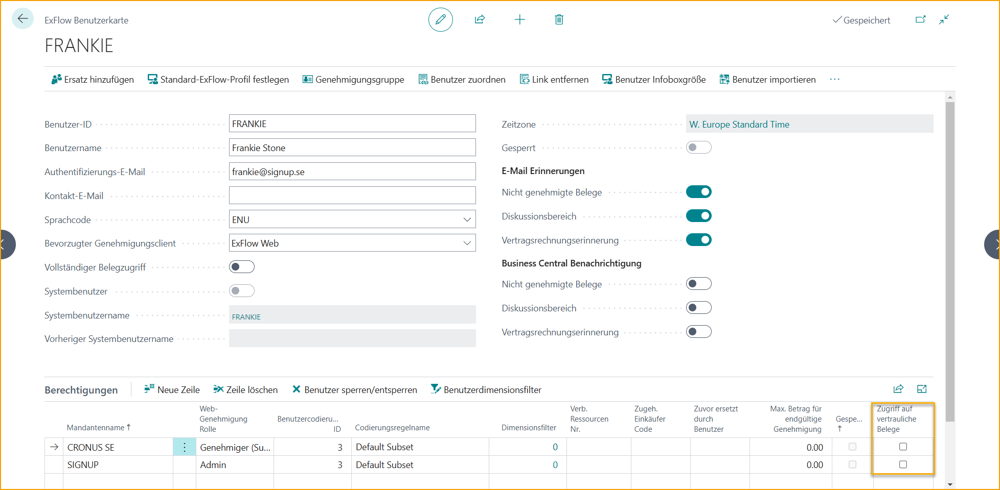
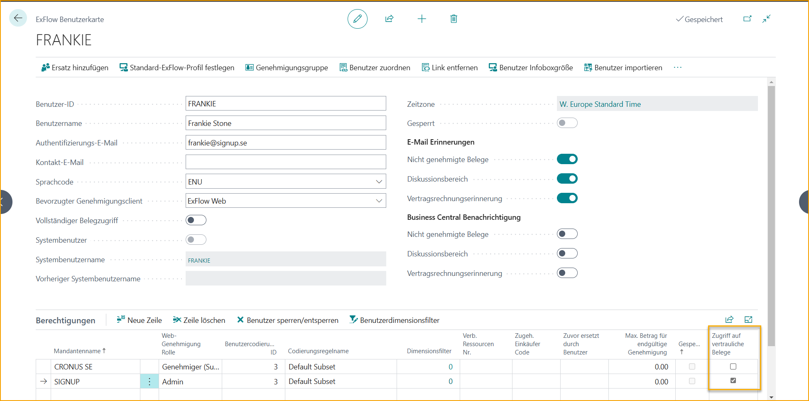

## Vertrauliche Dokumente

Es gibt Situationen, in denen es notwendig ist, vertrauliche Dokumente zur Genehmigung in ExFlow Web nur an bestimmte Benutzer zu senden. Diese Dokumente sollten für andere Benutzer, die nicht Teil des Genehmigungsprozesses sind, nicht zugänglich oder durchsuchbar sein.

Gehe zu: **ExFlow Setup --> Vertrauliche Dokumente**

Um mit der vertraulichen Funktionalität arbeiten zu können, muss eine Vorlagen-PDF hochgeladen werden, um das ursprüngliche vertrauliche Dokumentenbild für nicht vertrauliche Benutzer zu verbergen.

Es wird nicht möglich sein, vertraulich markierte Dokumente zur Genehmigung zu erstellen und zu versenden, ohne eine hochgeladene Vorlagen-PDF zu haben.

Klicke auf die drei Punkte, um die ausgewählte Vorlage anzuhängen.

Wenn nachträglich Änderungen an einer PDF-Vorlage vorgenommen werden müssen, beispielsweise das Herunterladen der aktuellen hochgeladenen Vorlage oder das Ersetzen der aktuellen Vorlage, gehe einfach zurück zu den drei Punkten und nehme die notwendigen Änderungen vor.

| Ersetze Original-PDF durch |    |
|:-|:-|
|**Aktuelles PDF herunterladen**                               | Wähle diese Option, um das aktuell hochgeladene PDF-Bild herunterzuladen.
|**Aktuelles PDF ersetzen**                               | Wähle diese Option, um das aktuell hochgeladene PDF-Bild zu ersetzen.
|**Aktuelles PDF löschen**                               | Wähle diese Option, um das aktuell hochgeladene PDF-Bild zu löschen. Beachte, dass beim Löschen dieser Vorlage alle vertraulichen markierten Dokumenten-PDF-Bilder für alle Benutzer angezeigt werden.

### Vertraulicher Zugriff
Um mit vertraulichen Dokumenten arbeiten und das Dokumentenbild in Business Central sehen zu können, muss der ExFlow-Benutzer über einen zugeordneten Systembenutzer verfügen und vertraulichen Zugriff haben.  

#### Vertraulichen Zugriff bereitstellen

Gehe zur **ExFlow-Benutzerkarte** und aktiviere das Kontrollkästchen **"Zugriff auf vertrauliche Dokumente"**. Wenn dies aktiviert wird, wird automatisch ein Benutzerberechtigungssatz namens EX CONFIDENTIAL auf der zugehörigen Systembenutzerkarte festgelegt.

Der vertrauliche Zugriff kann für alle Unternehmen oder ausgewählte Unternehmen festgelegt werden. Wähle "Ja", um Zugriff auf alle Unternehmen zu gewähren, oder wähle "Nein", um Zugriff auf ein bestimmtes Unternehmen zu gewähren.

Wenn ein Benutzer versehentlich Zugriff auf vertrauliche Dokumente für alle Unternehmen anstelle eines bestimmten Unternehmens erhalten hat, deaktiviere einfach das Kontrollkästchen, um den vertraulichen Zugriff zu entfernen, und wähle das spezifische Unternehmen erneut aus. Der Berechtigungssatz auf dem zugehörigen Systembenutzer wird sofort aktualisiert.

Der unten stehende ExFlow-Benutzer hat jetzt Zugriff, um alle vertraulichen Dokumente nur im SignUp-Unternehmen zu sehen.

#### Vertreter
Das Hinzufügen eines nicht vertraulichen Benutzers als Vertreter für einen vertraulichen Benutzer wird nicht unterstützt, um die vertraulichen Dokumentenbilder zu schützen.

### Vertrauliche Genehmigung

Vertrauliche Dokumente müssen über einen vertraulichen Genehmigungsfluss verfügen. Ein regulärer Genehmigungsfluss kann nicht angewendet werden.

#### Einen vertraulichen Genehmigungsfluss erstellen

Gehe zu einer regulären ExFlow-Genehmigungsregel, um Regeln zu erstellen, die für vertrauliche Dokumente gelten sollen.
Vertrauliche Dokumente erfordern eine mit "Vertrauliche Genehmigung" markierte Genehmigungsregel.

Wenn die vertrauliche Genehmigung in einer Genehmigungsregel aktiviert ist, wird ein Filter auf den Genehmigungsregelzeilen festgelegt, sodass nur Genehmigungsgruppen mit vertraulichem Zugriff in den vertraulichen Genehmigungsfluss aufgenommen werden können.

Die Aktivierung der vertraulichen Genehmigung deaktiviert auch automatisch die Genehmigungsregel. Der Grund dafür ist, dass vertrauliche Genehmigungen manuell ausgewählt werden müssen und nicht dynamisch festgelegt werden können.

Gemäß dieser Regel der Pensionsagentur ist nur Jane berechtigt, bevorstehende Rentendokumente in ExFlow Web zu genehmigen.

### Vertraulicher Workflow
Benutzer mit und ohne vertraulichen Zugriff können mit vertraulichen Dokumenten in Business Central arbeiten. Nur Benutzer mit Zugriff können jedoch das ursprüngliche Dokumenten-PDF-Bild anzeigen.

Es folgt ein Beispiel für Benutzer mit Zugriff auf vertrauliche Dokumente und für nicht vertrauliche Benutzer.

Vertrauliche Felder sind standardmäßig in allen ExFlow-Seiten ausgeblendet. Verwende Personalisierung, um das Feld **"Vertrauliches Dokument"** zum Importjournalheader und anderen relevanten Seiten hinzuzufügen.

Wenn ein Dokument als vertraulich behandelt werden soll, aktiviere einfach das Kontrollkästchen "Vertrauliches Dokument" für das ausgewählte Dokument.

Wenn das Dokument als vertraulich markiert ist, sind reguläre Genehmigungsregeln nicht anwendbar und die Liste der Genehmigungsregeln wird auf Regeln gefiltert, bei denen "Vertrauliche Genehmigung" aktiviert ist.

Für das folgende Beispiel sind nur zwei vertrauliche Regeln anwendbar.

Vertraulich markierte Genehmigungsregeln müssen manuell ausgewählt werden. Diese Regeln sind nicht dynamisch und werden daher nicht automatisch auf Dokumente im Importjournal angewendet.

Es ist nicht erforderlich, eine Genehmigungsregel festzulegen. Es ist immer noch möglich, Genehmiger manuell in einem Genehmigungsvorschlag hinzuzufügen, wenn die Benutzer Zugriff auf vertrauliche Dokumente haben. Nicht vertrauliche Benutzer sind nicht anwendbar und daher nicht auswählbar.

Darüber hinaus ist es nicht möglich, eine Genehmigungsgruppe auszuwählen, die sowohl vertrauliche Benutzer als auch nicht vertrauliche Benutzer enthält.

Lassen Sie uns ein Beispiel veranschaulichen. Wenn ein importiertes Dokument bereits eine Genehmigungsregel mit einem vorgeschlagenen Genehmigungsfluss hat und ein Benutzer das Kontrollkästchen "Vertrauliches Dokument" aktiviert, wird folgende Frage angezeigt:

Benutzer ohne Zugriff auf vertrauliche Dokumente werden aus dem Genehmigungsfluss entfernt. Nur Benutzer mit Zugriff bleiben bestehen, wenn sie manuell zum Fluss hinzugefügt werden.

Da Alicia und Theodora keine Benutzer mit Zugriff sind, werden sie entfernt.

Verwenden Sie eine "Vertrauliche Regel" (vertrauliche Genehmigung) oder fügen Sie autorisierte Benutzer manuell als Genehmiger hinzu und erstellen Sie das Dokument wie gewohnt. Das Dokument wird dann an den ausgewählten Genehmiger gesendet.

Bitte beachten Sie, dass die Funktion "Vertrauliche Dokumente" nicht zusammen mit der Rechnungsumstellung verwendet werden kann.

#### Automatisieren von vertraulichen Dokumenten in der Lieferantenkonfiguration
Wenn alle Dokumente für einen bestimmten Lieferanten vertraulich sein sollen und denselben Genehmigungsfluss und dieselbe Codierung usw. haben sollen, kann dies einfach von der Lieferantenkonfigurationskarte aus arrangiert werden, zusammen mit anderen aktuellen Automatisierungsfunktionen, um den vertraulichen Workflow effizient und vertrauenswürdig zu gestalten.

Wenn der Lieferant jedoch nicht als "Vertrauliche Dokumente" markiert ist, ist es nicht möglich, einen automatisierten vertraulichen Workflow zu nutzen.

### Vertrauliche Dokumente im Genehmigungsstatus
Wie bereits erwähnt, können Benutzer mit Zugriff auf vertrauliche Dokumente diese wie gewohnt in Business Central anzeigen und bearbeiten.

### Workflow als nicht vertraulicher Benutzer
Benutzer ohne Zugriff auf vertrauliche Dokumente können das ursprüngliche PDF-Bild nicht im PDF-Vorschaufenster anzeigen.

Nicht vertrauliche Benutzer können nur das PDF-Vorlagenbild anzeigen, das in ExFlow-Setup hinzugefügt wurde. Dies dient dazu, das ursprüngliche Dokumentenbild zu verbergen und zu schützen.

In diesem Beispiel ist dies ihr Bild zum Anzeigen:

Wenn der Benutzer auf "Dokumentenbild anzeigen" klickt oder die Tastenkombination Strg+I verwendet, wird folgende Meldung angezeigt:

#### Ein Dokument oder Lieferanten von der Markierung als vertraulich abwählen
Nicht vertrauliche Benutzer können "Vertrauliches Dokument" für einen Lieferanten in der Lieferantenkonfiguration aktivieren, aber nicht umgekehrt.

Darüber hinaus kann ein Dokument, das fälschlicherweise von einem nicht vertraulichen Benutzer als "Vertrauliches Dokument" gekennzeichnet wurde, nur von einem Benutzer mit Zugriff rückgängig gemacht werden. Wenn dies geschieht und ein Benutzer das Dokument überprüft, wendet ExFlow automatisch eine reguläre Genehmigungsregel dynamisch an, sofern eine anwendbare Regel vorhanden ist.

### Vertrauliche Dokumente auf ExFlow Web
Im Gegensatz zur Arbeit in Business Central mit vertraulichen Dokumenten ist das Web eingeschränkter.

Wenn ein Dokument zur Genehmigung gesendet wird, kann der Web-Genehmiger anhand einer sichtbaren Markierung neben der Dokumentennummer leicht erkennen, dass es sich um ein vertrauliches Dokument handelt.

Benutzer können keine Codierung ändern, Genehmiger hinzufügen oder das vertrauliche Dokument an einen anderen Benutzer weiterleiten. Ein vertrauliches Dokument kann nur genehmigt, abgelehnt oder in den Wartezustand versetzt werden.

Im folgenden Beispiel versucht der Genehmiger, eine Dimension einzugeben, und erhält diese Fehlermeldung, da Codierungsänderungen nicht zulässig sind.

Es ist auch nicht erlaubt, nach einem anderen vertraulichen Dokument zu suchen, an dem die Benutzer selbst nicht beteiligt sind.

Wenn beispielsweise ein Genehmiger (unabhängig vom vertraulichen Zugriff) versucht, nach einem vertraulichen Dokument zu suchen, an dem er nicht am Fluss beteiligt ist, wird das Suchergebnis leer sein.

