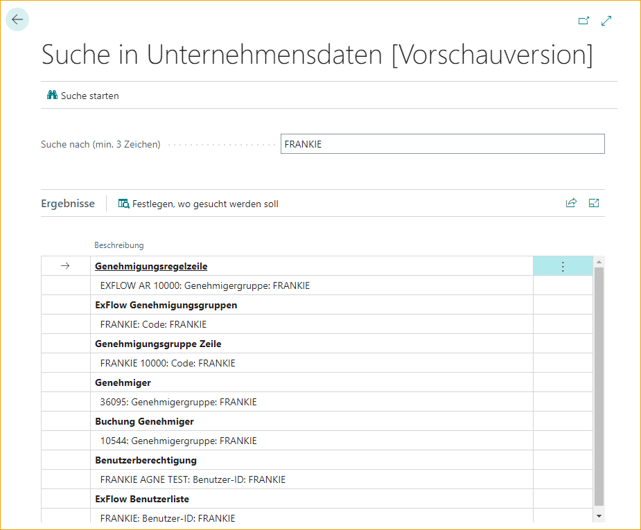
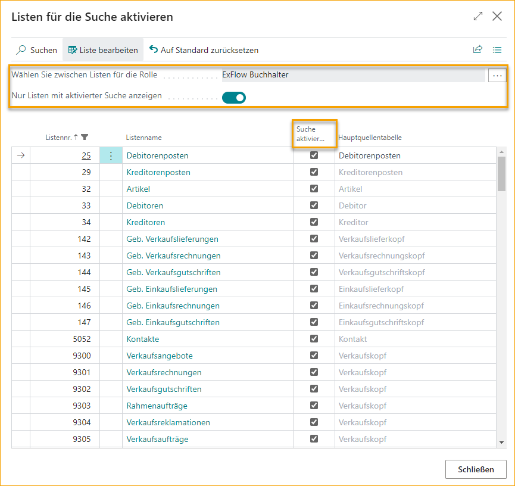

## Datensuche

Es wurde Unterstützung hinzugefügt, um ExFlow-Daten in der Standard-Datensuche anzuzeigen.

Gehen Sie zu **Unternehmensdaten durchsuchen**, um zu suchen.

Im folgenden Beispiel ist eine Suche nach Frankie eingestellt und die Ergebnisliste liefert alle Informationen darüber, wo Daten zu Frankie vorhanden sind, z. B. in einer Genehmigungsregel, Referenz usw.

Darüber hinaus ist es auch möglich, über ein Rollencenter zu wählen und zu suchen. Aktivieren Sie das Kontrollkästchen "Nur suchfähige Liste anzeigen", um ausgewählte Datensätze in "Suche aktivieren" anzuzeigen und ein Ergebnis nach den angegebenen Optionen in der Suchergebnisliste anzuzeigen.

