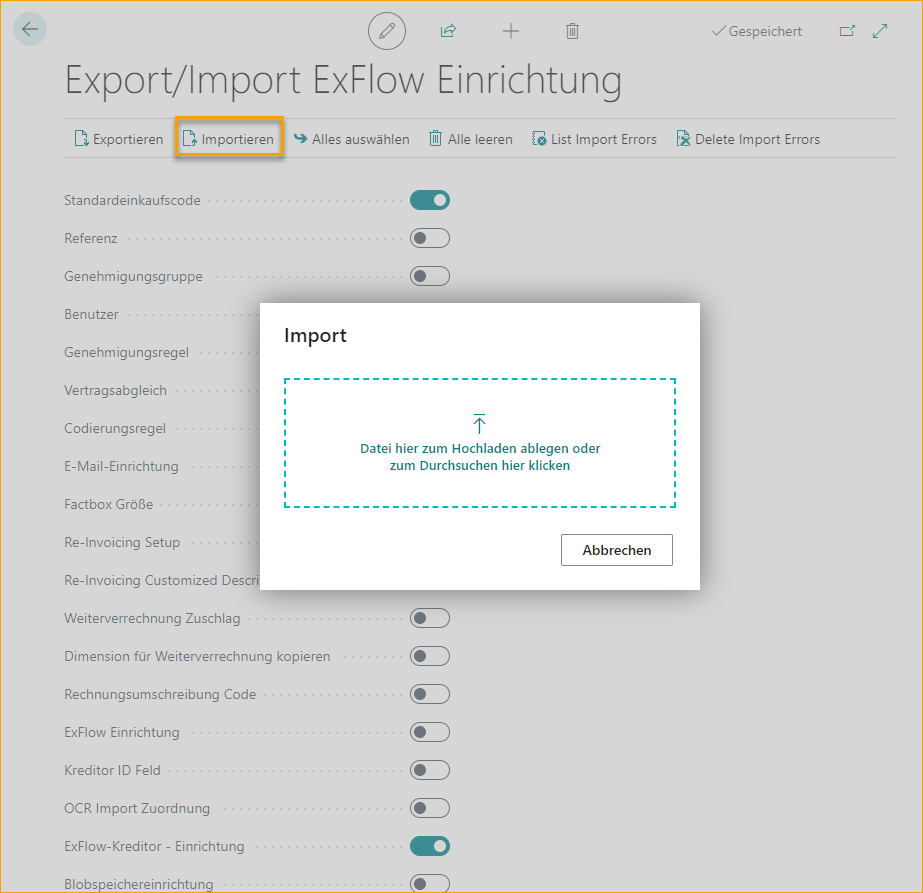

## Export/Import ExFlow-Daten

Gehe zu: **ExFlow Setup --> Aktionen --> Funktionen --> Export/Import Setups** 

|Export/Import ExFlow Setup |    |
|:-|:-|
|**Exportieren**| Exportieren Sie die ausgewählten ExFlow Setup-Tabellendaten
|**Importieren**| Importieren Sie die ausgewählten ExFlow Setup-Tabellendaten
|**Alle auswählen**| Wählen Sie alle Abschnitte zum Exportieren aus
|**Alle abwählen**| Deaktivieren Sie die Auswahl aller Abschnitte
|**Importfehler auflisten**| Anzeigen einer Liste der Fehler aus dem letzten Import
|**Importfehler löschen**| Löschen Sie die aufgelisteten Fehler aus dem letzten Import
 

### Daten exportieren
Es ist möglich, sowohl ExFlow-Daten zu importieren als auch zu exportieren. Dies kann praktisch sein, wenn beispielsweise ExFlow-Standard-Einkaufscodes oder ExFlow-Lieferanteneinstellungen von einer Datenbank in eine andere exportiert werden müssen.

Aktivieren Sie einfach die Einstellungen, die exportiert werden sollen, und ExFlow lädt eine .json-Datei herunter, die in die andere Datenbank importiert werden kann.   

 

### Daten importieren
Importieren Sie die Daten in die andere Umgebung, indem Sie die relevanten Tabellen auswählen und auf ''Importieren'' klicken, um die .json-Datei hochzuladen.   

Wenn während dieses Vorgangs Fehler auftreten, werden alle unter ''Liste der Importfehler'' aufgelistet. Beheben Sie den Fehler und importieren Sie die Datei erneut. Verwenden Sie ''Importfehler löschen'', um die Liste bei Bedarf zu löschen.

