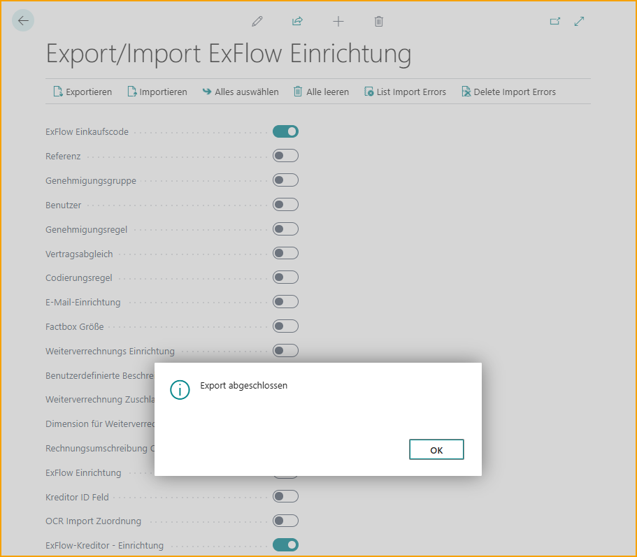

## Export/Import von Setups

Gehe zu: **ExFlow Setup --> Aktionen --> Funktionen --> Export/Import Setups** 

|Export/Import ExFlow Setup |    |
|:-|:-|
|**Export**| Ausgewählte ExFlow Setup Tabellendaten exportieren
|**Import**|  Ausgewählte ExFlow Setup Tabellendaten importieren
|**Alle auswählen**|  Alle Abschnitte zum Exportieren auswählen
|**Alle löschen**|  Alle Abschnitte abwählen
|**Liste der Importfehler anzeigen**|  Eine Liste der Fehler des letzten Imports anzeigen
|**Importfehler löschen**|  Gelistete Fehler des letzten Imports löschen
 

### Daten exportieren
Es ist möglich, ExFlow-Daten sowohl zu importieren als auch zu exportieren. Dies kann praktisch sein, wenn beispielsweise Daten wie ExFlow Standard Purchase Codes oder ExFlow Vendor Setup von einer Datenbank in eine andere exportiert werden müssen.

Aktivieren Sie einfach die Einstellungen, die exportiert werden sollen, und ExFlow lädt eine .json-Datei herunter, die in der anderen Datenbank importiert werden kann.   

 

### Daten importieren
Importieren Sie die Daten in der anderen Umgebung, indem Sie die relevanten Tabellen auswählen und auf ''Importieren'' klicken, um die .json-Datei hochzuladen.   

Wenn während dieses Prozesses Fehler auftreten, werden alle unter ''Liste der Importfehler'' aufgelistet. Bearbeiten Sie den Fehler und importieren Sie die Datei erneut. Verwenden Sie ''Importfehler löschen'', um die Liste bei Bedarf zu löschen. 

