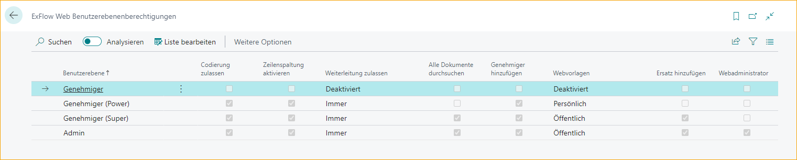
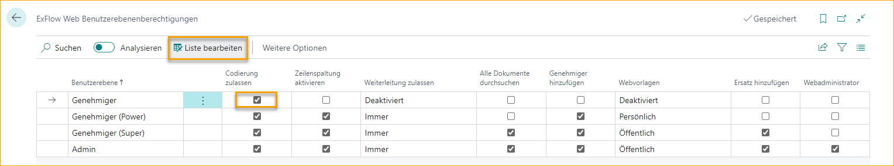

## Web-Benutzerberechtigungen

Gehe zu: **ExFlow Web-Benutzerberechtigungen**

Alle ExFlow-Benutzer müssen eine Web-Berechtigungsrolle auf der ExFlow-Benutzerkarte festlegen, um mit der Genehmigung in ExFlow Web und Business Central arbeiten zu können.  
Gehe zu Web-Benutzerberechtigungen, um einen besseren Überblick über alle Web-Benutzerberechtigungen zu erhalten.

 

|Web-Benutzerberechtigungen |    |
|:-|:-|
|**Liste bearbeiten**| Bearbeiten der Web-Benutzerberechtigungsliste
|**Aktionen --> Funktionen --> Setup initialisieren**| Alle Änderungen an den Web-Benutzerberechtigungen auf die Standardeinstellungen zurücksetzen.

 

Derzeit sind folgende vier Benutzerberechtigungen verfügbar: 

| Web-Benutzerstufe |    |
|:-|:-|
|**Genehmiger**| Der Genehmiger kann Dokumente genehmigen, ablehnen oder auf "Warten" setzen. Der Genehmiger hat nur Zugriff auf Dokumente, bei denen er im Genehmigungsfluss enthalten ist. Änderungen am Dokument sind nicht erlaubt.
|**Genehmiger (Power)**| Gleiche Berechtigung wie Genehmiger. Hinzufügen und Weiterleiten an andere Genehmiger. Hinzufügen oder Ändern in der Kodierung ist erlaubt, z.B. G/L-Konto oder Dimensionen.
|**Genehmiger (Super)**| Gleiche Berechtigung wie Power User. Der Benutzer kann alle genehmigten Dokumente in der ExFlow-Historie sehen.
|**Admin**| Admin-Berechtigung in ExFlow Web. Dieser Benutzer kann Einstellungen vornehmen, die für alle Genehmiger in ExFlow Web gelten.

 

Wenn Änderungen an den Berechtigungen vorgenommen werden müssen, z.B. um die Kodierung für alle Benutzer mit Genehmiger-Berechtigung zu erlauben, ist es möglich, die Liste zu bearbeiten und das Kontrollkästchen "Kodierung erlauben" zu aktivieren.
 

Lesen Sie mehr darüber, wie Sie Web-Berechtigungen verwalten und auf ExFlow-Benutzer anwenden, im Abschnitt [***Unternehmenszugriff und Web-Berechtigungsrolle unter Berechtigungen hinzufügen***](https://docs.exflow.cloud/business-central/docs/user-manual/business-functionality/exflow-user#add-company-access-and-web-permission-role-under-permissions)

