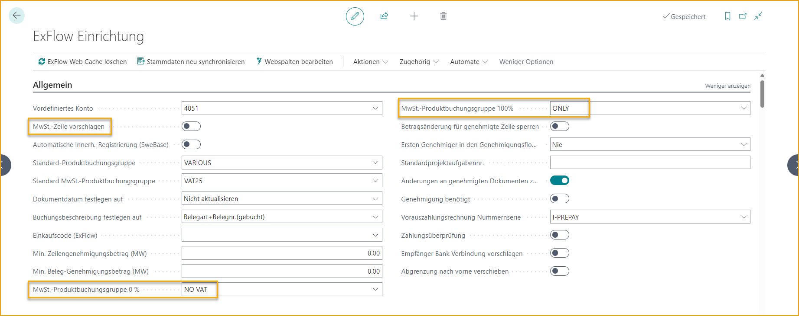
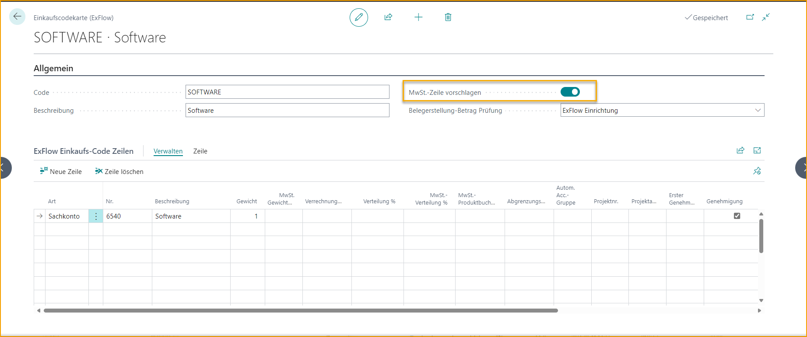
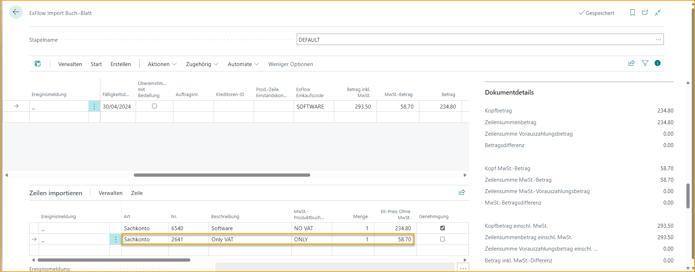

## Vorschlagen von Mehrwertsteuerzeilen

Gehen Sie zu: **ExFlow Setup --> Allgemein --> Vorschlagen von Mehrwertsteuerzeilen** 

Aktivieren Sie die Einstellung ''Vorschlagen von Mehrwertsteuerzeilen'', wenn alle Mehrwertsteuerzeilen automatisch erstellt werden sollen, wenn Rechnungen importiert werden, oder ob die Standard-Mehrwertsteuerbehandlung von Business Central verwendet werden soll.

Wenn diese Einstellung verwendet wird, müssen die Felder Mehrwertsteuer-Produktbuchungsgruppe 0% und Mehrwertsteuer-Produktbuchungsgruppe 100% im ExFlow Setup festgelegt werden.

Mehrwertsteuerzeilen können auch automatisch über einen ExFlow-Einkaufscode vorgeschlagen werden. Aktivieren Sie einfach ''Vorschlagen von Mehrwertsteuerzeilen'' in der ExFlow-Einkaufscodekarte.

ExFlow erstellt dann eine separate Mehrwertsteuerzeile in den Import-Journalzeilen für das Einkaufsdokument zusammen mit der ausgewählten Kodierung.

Die Kostenkontenzeile wird in diesem Beispiel auf "ohne Mehrwertsteuer" (KEINE MWST) gesetzt, da ExFlow eine eigene separate Mehrwertsteuerzeile festlegt.

Standardmäßig sind Mehrwertsteuerzeilen nicht im Genehmigungsworkflow enthalten. Es steht jedoch eine alternative Funktion für diesen Zweck zur Verfügung. Lesen Sie mehr im Abschnitt [***Mehrwertsteuerzeilen genehmigen***](https://docs.exflow.cloud/business-central/docs/user-manual/business-functionality/approve-vat-lines), um mehr zu erfahren.
