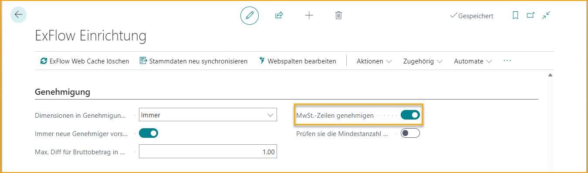
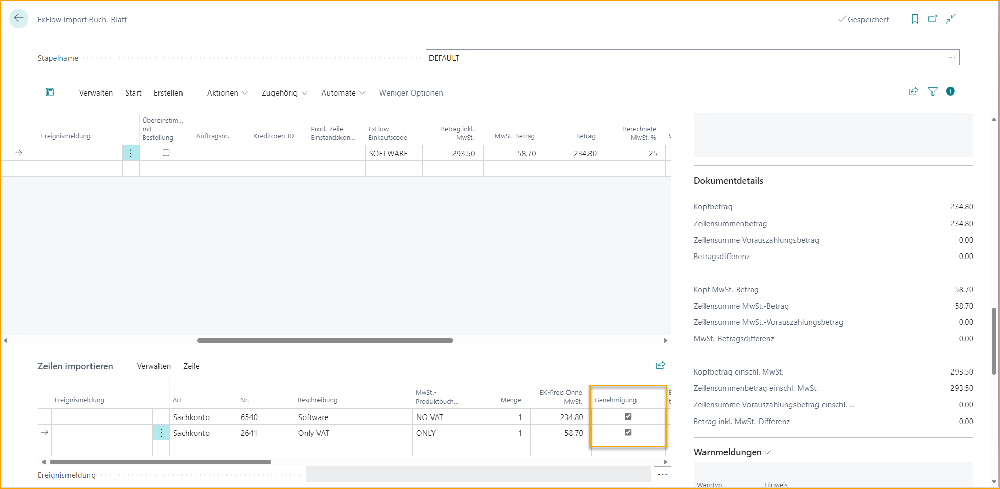
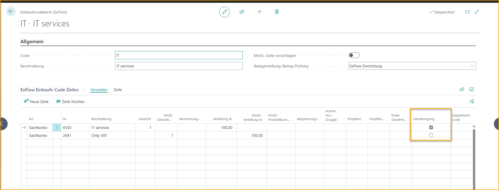

## MwSt.-Linien genehmigen

Gehe zu: **ExFlow Setup --> Genehmigung --> MwSt.-Linien genehmigen** 

Aktivieren Sie die Einstellung ''MwSt.-Linien genehmigen'', wenn alle MwSt.-Linien standardmäßig im Genehmigungsprozess enthalten sein sollen. 

Je nach Einstellungen und Workflow kann die Genehmigung von MwSt.-Linien unterschiedlich eingerichtet werden. Um alle MwSt.-Linien standardmäßig automatisch für die Genehmigung anzukreuzen, können Sie ''MwSt.-Linie vorschlagen'' in der ExFlow Purchase Code Card oder unter Allgemein in der ExFlow-Setup aktivieren. 

ExFlow sendet dann MwSt.-Linien zur Genehmigung an den ausgewählten Genehmiger gemäß dem Genehmigungsfluss. Manuell erstellte MwSt.-Linien im Import Journal werden ebenfalls zur Genehmigung markiert. 

Bei Verwendung des ExFlow Purchase Code im Header wird diese Einstellung ignoriert. Mit dieser Funktion aktiviert können Sie immer noch eine Codierung in einem ExFlow Purchase Code mit MwSt.-Linie hinzufügen, bei dem das Genehmigungsfeld nicht angekreuzt ist. Die unten stehenden MwSt.-Linien werden nicht im Genehmigungsprozess enthalten sein.

