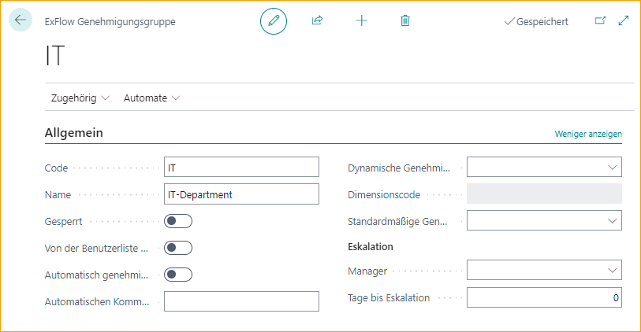
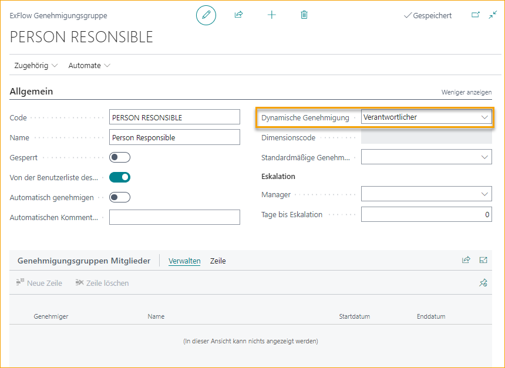
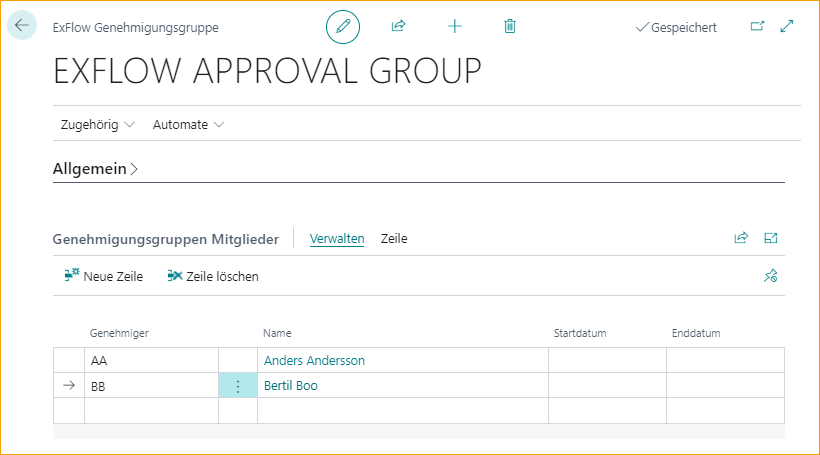
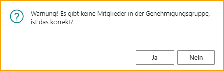

## Genehmigungsgruppen

Gehe zu: ***Setup \--\> ExFlow Manuelle Einrichtung \--\> ExFlow Genehmigungsgruppen***

Wie in "Neuer Benutzer" erwähnt, werden Genehmigungsgruppen automatisch erstellt, wenn ein neuer Benutzer erstellt wird. Persönliche Gruppen sollten nicht geändert werden (außer durch Hinzufügen von Vertretern).

### Erstellen einer neuen Genehmigungsgruppe

Darüber hinaus ist es möglich, logische Gruppen wie Einkaufsabteilung oder IT-Abteilung Genehmigungsgruppen mit einem oder mehreren Benutzern einzurichten.

Nur ein Benutzer in dieser Gruppe kann genehmigen, aber alle Benutzer erhalten das Dokument und können es im Ordner "Aktuell" auf ExFlow Web finden.

| Allgemein   |   |
|:-|:-|
|**Code:**                                  | Fügen Sie einen Code hinzu, der die Genehmigungsgruppe beschreibt. Wenn nicht ausgeschlossen, ist dieser Code auf ExFlow Web sichtbar, wenn er weitergeleitet und Genehmiger hinzugefügt wird.
| **Name:**                                 | Fügen Sie einen Namen hinzu, der den Code beschreibt.
| **Gesperrt:**                              | Wenn die Genehmigungsgruppe nicht mehr verwendet werden soll.
| **Von der Benutzerliste auf der Website ausschließen:**     | Um diese Genehmigungsgruppe in der Benutzerliste auszuschließen, wenn sie auf ExFlow Web weitergeleitet und Genehmiger hinzugefügt wird. Eine Genehmigungsgruppe mit dynamischem Genehmigungstyp kann nicht manuell im Genehmigungsfluss auf ExFlow Web hinzugefügt werden. Der Ausschluss von der Benutzerliste auf der Website wird daher automatisch aktiviert, wenn ein dynamischer Genehmigungstyp ausgewählt wird.
| **Automatische Genehmigung:**                         | Fügen Sie eine automatische Genehmigungsgruppe hinzu, wenn die automatische Genehmigung bei der Auftragsabstimmung oder der Abstimmung gegen einen Vertrag verwendet wird. Wenn Genehmigungsgruppenmitglieder hinzugefügt werden, wird das Dokument im Ordner "Aktuell" auf ExFlow Web als genehmigt angezeigt.
| **Kommentar zur automatischen Genehmigung:**                 | Fügen Sie einen Kommentar hinzu, der in den Kommentar in der Dokumentzeilen-Genehmigung kopiert wird.

### Genehmigungsgruppe mit dynamischem Genehmigungstyp

Es ist möglich, Genehmiger automatisch hinzuzufügen, abhängig von verschiedenen Codes in der Dokumentzeile.

| Dynamischer Genehmigungstyp   |   |
|:-|:-|
| **Dynamischer Genehmigungstyp:**                | Dieses Feld enthält mehrere Optionen, die für verschiedene dynamische Genehmigungsflüsse verwendet werden können. Alle Optionen erfordern eine eindeutige Konfiguration und wenn sie ausgewählt sind, ist es nicht möglich, Genehmigungsgruppenmitglieder hinzuzufügen.     Lesen Sie mehr über die Konfiguration und die Optionen für dynamische Genehmigungsflüsse für Dimensionseigentümer unter Abschnitt [***Genehmigungsregeln --> Dynamischer Genehmigungsfluss für Dimensionseigentümer,***](https://docs.exflow.cloud/business-central/docs/user-manual/business-functionality/approval-rules#dynamic-approval-flow-for-dimension-owners) [***Jobs,***](https://docs.exflow.cloud/business-central/docs/user-manual/business-functionality/approval-rules#dynamic-approval-flow-for-jobs) oder [***Einkäufer***](https://docs.exflow.cloud/business-central/docs/user-manual/business-functionality/approval-rules#dynamic-approval-flows-purchasers)
| **Von der Benutzerliste auf der Website ausschließen:**     | Wird automatisch ausgewählt, da diese Genehmigungsgruppe nicht manuell von ExFlow Web aus hinzugefügt werden kann.
| **Genehmigungsgruppenmitglieder:**               | Es sollten keine ExFlow-Benutzer zu den Genehmigungsgruppenmitgliedern hinzugefügt werden.

### Eskalation

Wenn ein Genehmiger Dokumente nicht rechtzeitig genehmigt, gibt es eine Funktion, um die Dokumente an den Manager eskalieren zu lassen.

Der Manager kann für alle Genehmiger in ExFlow Setup oder pro Genehmigungsgruppe hinzugefügt werden und der Job kann manuell oder automatisch mit der Job-Warteschlange ausgeführt werden.

Lesen Sie mehr über die Konfiguration und wie Sie die Job-Warteschlange einrichten unter Abschnitt [***Genehmigungsworkflow --> Periodische Aktivitäten --> Eskalationsjob***](https://docs.exflow.cloud/business-central/docs/user-manual/approval-workflow/periodic-activities#escalation-job)

| Eskalation   |   |
|:-|:-|
| **Manager:**                  | Fügen Sie den Manager für diese spezifische Genehmigungsgruppe hinzu.
| **Tage vor der Eskalation:**   | Geben Sie die Anzahl der Tage vor der Eskalation an.

### Approval Group Members

Es ist möglich, mehrere Genehmiger in einer Genehmigungsgruppe hinzuzufügen. Nur ein Benutzer in dieser Gruppe kann genehmigen, aber alle Benutzer erhalten das Dokument und können es im Ordner "Aktuell" auf ExFlow Web finden.

| Approval Group Members   |   |
|:-|:-|
| **Start- und Enddatum:**     | wird für den Genehmiger verwendet, der einen anderen Genehmiger vorübergehend ersetzt. Verwenden Sie die Funktion, um Vertreter von ExFlow Web, Assign Replacer oder von ExFlow User Card hinzuzufügen              Lesen Sie mehr unter Abschnitt [***Business Functionality --> ExFlow User --> Hinzufügen eines Vertreters während der Urlaubszeit***](https://docs.exflow.cloud/business-central/docs/user-manual/business-functionality/exflow-user#add-a-replacer-during-vacation-time) und [***Approval Workflow --> Periodic Activities --> Assign Replacers***](https://docs.exflow.cloud/business-central/docs/user-manual/approval-workflow/periodic-activities#assign-replacers)

Eine Genehmigungsgruppe erfordert mindestens einen Benutzer.

