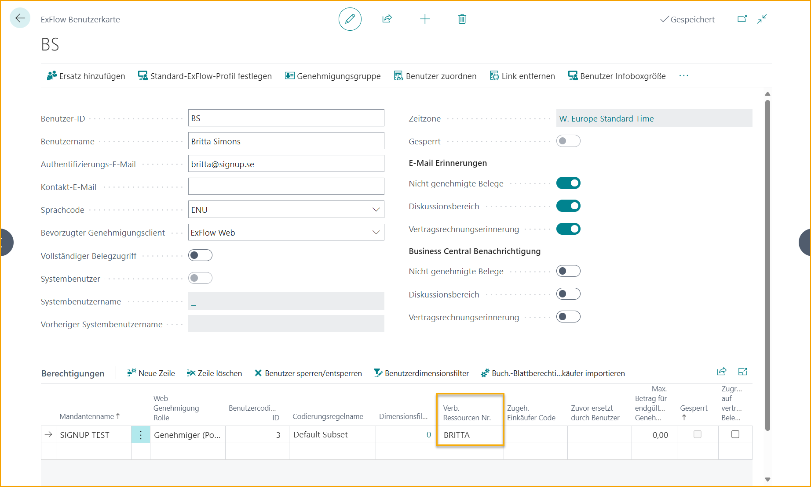
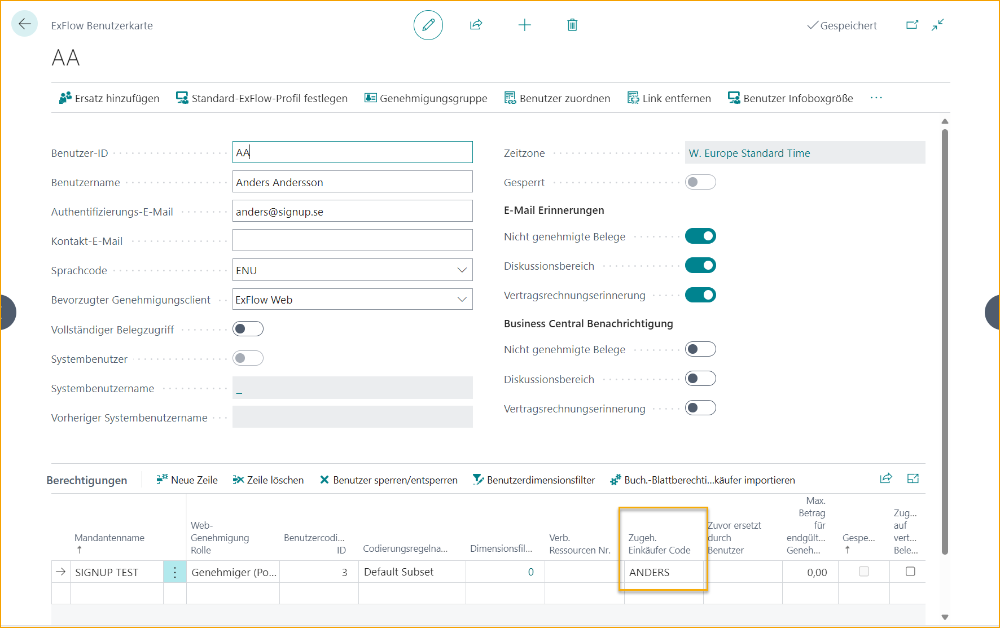
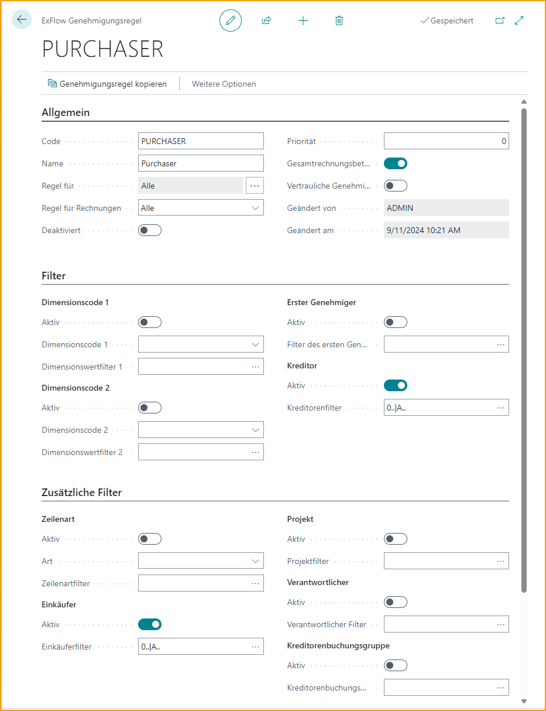

## Genehmigungsregeln

Gehe zu: ***ExFlow-Setup – Übersicht ExFlow Approval Rules***

Um die Auswahl der Genehmigenden zu automatisieren, können die ExFlow-Genehmigungsregeln verwendet werden.

Genehmigungsregeln werden basierend auf den zugewiesenen Filtern verwendet. Je mehr Filter zugewiesen sind, desto höher ist die Priorität der Genehmigungsregel. Alle zugewiesenen Filter müssen mit den Daten des Dokuments übereinstimmen, damit die Genehmigungsregel automatisch angewendet wird.

Die Genehmigungsregel kann Filter haben, sodass sie nur verwendet wird, wenn eine bestimmte Kombination von Dimensionswerten, Projekt, Lieferant, Sachkonto usw. verwendet wird. Die Regel fügt einen Genehmigungsablauf hinzu.

Eine Genehmigungsregel hat eine oder mehrere Genehmigungsgruppen. Genehmigungsgruppen werden in den Genehmigungsregellinien hinzugefügt.

### Eine neue Genehmigungsregel erstellen
Klicken Sie auf "Neu" und erstellen Sie die Regel.

### Genehmigungsregel – Allgemein
| Allgemein      |	|
|:-|:-|
| **Code:**                         | Fügen Sie einen Code hinzu, der die Genehmigungsregel beschreibt
| **Name:**                         | Fügen Sie einen Namen hinzu, der den Code beschreibt
| **Regel für:**                     | Es ist möglich, separate Genehmigungsregeln für alle Dokumenttypen zu erstellen: Rechnung, Gutschrift, Bestellung und Angebot. Öffnen Sie "Regel für", um den Dokumenttyp auszuwählen:    Markieren Sie "Verwenden" für den ausgewählten Dokumenttyp. Es ist möglich, mehr als einen Dokumenttyp innerhalb derselben Genehmigungsregel auszuwählen     Und die neue ExFlow-Genehmigungsregel wird nur für den ausgewählten Dokumenttyp angewendet.   
| **Regel für Rechnungen:**            | Für Rechnungen ist es möglich, eine Regel hinzuzufügen für:   Kostenrechnungen, Abgleich mit Bestellung, Bestellung verbunden mit Differenz oder Bestellung verbunden ohne Differenz   
| **Deaktiviert:**                     | Wenn eine Genehmigungsregel deaktiviert ist, kann sie nur manuell oder über Referenz angewendet werden
| **Priorität:**                     | Wenn es mehrere Genehmigungsregeln mit derselben Anzahl von Treffern gibt, wird die Genehmigungsregel mit der höchsten Prioritätsnummer automatisch hinzugefügt
| **Gesamtbetrag der Rechnung verwenden:**     | Aktivieren Sie diese Option, wenn die Regel Genehmigungsgruppen basierend auf dem Gesamtdokumentbetrag oder dem Betrag der aktuellen Zeile hinzufügen soll
| **Vertrauliche Genehmigung:**     | Aktivieren Sie die vertrauliche Genehmigung, um einen Genehmigungsablauf einzurichten, der auf Benutzer mit vertraulichem Zugriff gefiltert ist
| **Geändert von:**                   | Letzter Benutzer, der die Einstellung für die aktuelle Regel geändert und gespeichert hat
| **Änderungsdatum:**                 | Letztes Datum und Uhrzeit, an dem die aktuelle Regel geändert wurde

### Genehmigungsregel – Filter
Zwei Filter für Dimensionen in Kombination können auf einer Genehmigungsregel ausgewählt werden. Alle zugewiesenen Filter und zusätzliche Filter müssen mit den Daten des Dokuments übereinstimmen, damit die Genehmigungsregel automatisch angewendet wird.

Beim Auswählen eines Wertes wird die Option automatisch aktiviert.

| Filter      |	|
|:-|:-|
|**Dimensionscode 1:**              | Wählen Sie einen Dimensionscode
| **Dimensionswertfilter 1:**     | Filter: Wählen Sie einen Dimensionswert für den ausgewählten Dimensionscode
| **Dimensionscode 2:**             | Wählen Sie einen zweiten Dimensionscode
| **Dimensionswertfilter 2:**     | Filter: Wählen Sie einen Dimensionswert für den zweiten ausgewählten Dimensionscode
| **Erster Genehmigungsfilter:**        | Kann dem Dokument hinzugefügt werden, wenn eine Referenz interpretiert wird.   Lesen Sie mehr im Abschnitt [***Business Functionality --> Reference Codes***](https://docs.signupsoftware.com/business-central/docs/user-manual/business-functionality/reference-codes)
| **Lieferantenfilter:**                | Wählen Sie eine oder mehrere Lieferantennummern

### Genehmigungsregel - Zusätzliche Filter
Alle zugewiesenen Filter und zusätzliche Filter müssen mit den Daten des Dokuments übereinstimmen, damit die Genehmigungsregel automatisch angewendet wird.

Beim Auswählen eines Wertes wird die Option automatisch aktiviert.

| Zusätzliche Filter      |	|
|:-|:-|
|**Zeilentyp:**                     | Wählen Sie den Zeilentyp Sachkonto, Artikel, Ressource, Anlage oder Gebühr (Artikel)
| **Zeilentypfilter:**             | Fügen Sie einen Wert für den ausgewählten Zeilentyp hinzu
| **Einkäuferfilter:**             | Fügen Sie einen Filter für den Einkäufer hinzu
| **Projektfilter:**                | Fügen Sie einen Projektfilter hinzu
| **Filter für verantwortliche Person:**    | Fügen Sie einen Filter für die verantwortliche Person bei Projekten hinzu
| **Lieferantenbuchungsgruppe:**         | Fügen Sie einen Filter für die Lieferantenbuchungsgruppe hinzu

### Genehmigungsregellinien
Fügen Sie so viele Genehmigungsgruppen wie nötig für die Genehmigungsregel hinzu. Mit dem Vier-Augen-Prinzip (zwei Genehmigende) fügen Sie mindestens zwei Gruppen hinzu. Mit dem Sechs-Augen-Prinzip (drei Genehmigende) fügen Sie mindestens drei Gruppen hinzu.

Eine Genehmigungsregel sollte immer mindestens eine Genehmigungsgruppe mit "Über Betrag" und "Nicht über Betrag" auf null gesetzt enthalten. Andernfalls besteht die Gefahr, dass die Rechnung nicht zur Genehmigung geht und nicht gebucht werden kann.

Wenn es erforderlich ist, dass mindestens zwei Benutzer die Dokumentzeile genehmigen, könnte eine Einstellung wie unten verwendet werden:

Wenn eine Genehmigungsgruppe immer genehmigt und die zweite nur Beträge über 10.000 genehmigt, könnte eine Einstellung wie unten verwendet werden:

Mit dem Vier-Augen-Prinzip (zwei Genehmigende) und die zweite Genehmigungsgruppe ist je nach Betrag unterschiedlich.

Wenn der erste Genehmigende die Genehmigungsgruppe 1 ist und immer genehmigt, der zweite Genehmigende je nach Betrag von 10.000, könnte eine Einstellung wie unten verwendet werden. Genehmigungsgruppe 2 wird nur Dokumente mit einem Betrag bis zu 9.999,99 genehmigen und Genehmigungsgruppe 3 ab 10.000 oder mehr:

## Arbeitsablauf

### Immer neue Genehmigende vorschlagen
Gehe zu: ***ExFlow-Einrichtung --> Genehmigung***

Genehmigungsregeln und dynamische Genehmigungsregeln ermöglichen es ExFlow, automatisch Genehmigungsregeln oder dynamische Genehmigungsabläufe für Dokumente zu identifizieren und anzuwenden, die von einem Benutzer in ExFlow Web geändert wurden.

**Beispiel für Genehmigungsregel ohne dynamischen Genehmigungstyp:** 
Genehmigungsregeln werden durch die Dimensionsabteilung gesteuert.

Die Rechnung ist zunächst mit der Abteilung "ADM" kodiert und die Genehmigungsregel mit Filter für ADM wird angewendet.

Während der Genehmigung in ExFlow Web ändert ein Benutzer die Abteilung in "VERKAUF" und genehmigt die Rechnung.

Die Logik "Immer neue Genehmigende vorschlagen" wird nun die vorherige Genehmigungsregel ersetzen, um eine neue anzuwenden, die durch "VERKAUF" gesteuert wird.

Neue Genehmigungsregeln werden angewendet, wenn die Rechnungsbuchung geändert wurde, um eine besser geeignete Genehmigungsregel zu erfüllen, sobald der Benutzer die Rechnung genehmigt. Sie wird nicht angewendet, wenn der Benutzer die Rechnung nicht genehmigt.

**Beispiel für dynamische Genehmigungsregel mit dynamischem Genehmigungstyp:** 
Wenn Genehmigungsregeln durch den Dimensionsinhaber für die Abteilung gesteuert werden.
Für die Einrichtung lesen Sie mehr im Abschnitt [***Business Functionality --> Approval Rules --> Dynamic Approval Flow for Dimension Owners***](https://docs.signupsoftware.com/business-central/docs/user-manual/business-functionality/approval-rules#dynamic-approval-flow-for-dimension-owners) unten.

Die Rechnung ist zunächst mit der Abteilung "ADM" kodiert und die Genehmigungsregel für den Dimensionsinhaber wird angewendet.

Während der Genehmigung in ExFlow Web ändert ein Benutzer die Abteilung in "VERKAUF" und genehmigt die Rechnung.

Die Logik "Immer neue Genehmigende vorschlagen" wird nun die vorherigen Genehmigenden in derselben Genehmigungsregel ersetzen, um Genehmigende anzuwenden, die durch "VERKAUF" gesteuert werden.

Dies wird die Genehmigungsregel nicht ändern, sondern nur die Genehmigenden aus der Dimensionsinhabereinrichtung.

**Hinweis** 
Dynamische Genehmigungsregeln werden nicht angewendet, wenn die Genehmigungsregel der Rechnung durch eine ExFlow-Referenz hinzugefügt oder manuell im Importjournal hinzugefügt wurde. Dies kann für sensible Dokumente nützlich sein.

Alle zusätzlichen Genehmigenden, die manuell zu einem Dokument hinzugefügt wurden, werden nicht ersetzt, wenn ExFlow Web eine neue Genehmigungsregel anwendet. Es werden nur die Benutzer ersetzt, die automatisch hinzugefügt wurden.

Genehmigungsregeln können auch mit Genehmigungsgruppen basierend auf "dynamischem Genehmigungstyp" wie Dimensionsinhabern, verantwortlichen Personen usw. verwendet werden. Für die Einrichtung lesen Sie mehr im Abschnitt [***Approval Rules --> Dynamic Approval flow for Dimension Owners,***](https://docs.signupsoftware.com/business-central/docs/user-manual/business-functionality/approval-rules#dynamic-approval-flow-for-dimension-owners) [***Projects,***](https://docs.signupsoftware.com/business-central/docs/user-manual/business-functionality/approval-rules#dynamic-approval-flow-for-projects) oder [***Purchasers***](https://docs.signupsoftware.com/business-central/docs/user-manual/business-functionality/approval-rules#dynamic-approval-flows-purchasers) unten.

So funktioniert diese Funktionalität: ExFlow Web wird automatisch besser geeignete Genehmigungsregeln anwenden, wenn sie identifiziert werden. Die verbleibenden Genehmigenden aus der vorherigen Genehmigungsregel werden entfernt und neue Genehmigenden aus der neuen Genehmigungsregel hinzugefügt.

### Dynamischer Genehmigungsfluss für Dimensionsverantwortliche
ExFlow Dimensionsverantwortliche ist ein Tool, um die Anzahl der verwendeten Genehmigungsregeln zu begrenzen und stattdessen die richtigen Genehmiger auf dynamische Weise auszuwählen. Es ist möglich, verschiedene Dimensionswerte in derselben Regel zu kombinieren, wobei die Reihenfolge auf der Genehmigungsgruppe basiert.

**Verknüpfung von Genehmigungsgruppen mit Dimensionswerten** 
Gehen Sie zu: ***ExFlow-Setup – Übersicht ExFlow Dimension Owners***

Richten Sie einen Genehmigungsfluss für einen bestimmten Dimensionswert ein. Öffnen Sie eine neue Karte, indem Sie auf "Neu" klicken.

Wählen Sie die Dimension und den Dimensionswert aus.
Geben Sie dann die Genehmiger ein, die für diesen Dimensionswert einbezogen werden sollen.
Mindestens ein Genehmiger muss ausgewählt werden.

**Dimensionsverantwortliche kopieren** 
Wenn eine Dimensionsverantwortlichen-Karte erstellt wurde, kann die Funktion "Dimensionsverantwortliche kopieren" verwendet werden, um automatisch die restlichen Dimensionswerte zu erstellen.

Der ausgewählte Dimension basiert auf dem ausgewählten Dimensionsverantwortlichen. Wählen Sie, ob dies angewendet werden soll auf:

| Generieren für      |	|
|:-|:-|
|**Einen Wert:**             | Erstellen Sie eine Kopie für einen bestimmten Dimensionswert.
| **Alle Werte:**           | Erstellen und kopieren Sie für alle Dimensionswerte.
| **Einen Wert ersetzen:**    | Kopieren und ersetzen Sie für eine bereits erstellte Dimensionsverantwortlichen-Karte.
| **Alle Werte ersetzen:**   | Kopieren und ersetzen Sie für alle Dimensionsverantwortlichen-Karten.

**Dynamische Genehmigungsgruppe – Dimensionsverantwortlicher** 
Gehen Sie zu: ***ExFlow-Setup – Übersicht ExFlow Approval Groups***

Wenn die Dimensionsverantwortlichen erstellt sind, muss eine neue ExFlow-Genehmigungsgruppe erstellt werden. Setzen Sie den "Dynamischen Genehmigungstyp" auf "Dimensionsverantwortlicher" und fügen Sie dann die Dimension im Feld "Dimensionscode" hinzu.

Verwenden Sie die Funktion "Standard-Genehmigungsgruppe", um festzulegen, wo ein Dimensionsverantwortlicher fehlt, anstatt diese Dimension vollständig zu ignorieren.

Bei Verwendung des Dynamischen Genehmigungstyps ist es nicht möglich, Genehmigungsgruppenmitglieder manuell hinzuzufügen.

**Genehmigungsregel – Dimensionsverantwortlicher** 
Gehen Sie zu: ***ExFlow-Setup – Übersicht ExFlow Approval Rules***

Fügen Sie eine Genehmigungsregel hinzu, die für alle Dokumente ohne Filter gilt (aktivieren Sie die Genehmigungsregel) oder für die Dimension mit den gerade erstellten Dimensionsverantwortlichen.

Fügen Sie die dynamische Genehmigungsgruppe mit dem gerade erstellten dynamischen Genehmigungstyp "Dimensionsverantwortlicher" hinzu, und ExFlow fügt dynamisch die richtigen Genehmiger basierend auf dem auf dem Dokument codierten Dimensionswert hinzu.

In diesem Fall genehmigt der Abteilungs-Dimensionsverantwortliche die Rechnung zuerst, dann die IT-Abteilung für alle Beträge.

Wir haben auch den CFO als Genehmiger hinzugefügt, wenn das Dokument über 500.000 liegt, und den CEO für Beträge über 1.000.000.

Wenn es mehrere Genehmiger in der Dimensionsverantwortlichen-Karte gibt, wird diese Reihenfolge zuerst in diesem Genehmigungsfluss verwendet.

**Aktivieren Sie "Immer neue Genehmiger vorschlagen"** 
Gehen Sie zu: ***ExFlow-Setup – Übersicht ExFlow Setup***

Aktivieren Sie "Immer neue Genehmiger vorschlagen" in ExFlow Setup, um einen dynamischen Genehmigungsfluss zu erstellen, wenn die Codierung auf ExFlow Web geändert wird.

Lesen Sie mehr im Abschnitt [***Business Functionality --> Approval Rules --> Always Propose New Approvers***](https://docs.signupsoftware.com/business-central/docs/user-manual/business-functionality/approval-rules#always-propose-new-approvers) oben.

### Workflow für Dimensionsverantwortliche
**Aktuelle Dimensionsverantwortliche anzeigen** 
Gehen Sie zu: ***Import Journal --> Import Lines --> Line --> Show Current Dimension Owners***

Die Funktion "Aktuelle Dimensionsverantwortliche anzeigen" kann im ExFlow Import Journal und ExFlow Genehmigungsstatus verwendet werden.

Gehen Sie zu: ***Approval Status --> Document Lines --> Line --> Show Current Dimension Owners***

Diese Funktion öffnet eine gefilterte Seite und zeigt alle aktuellen Dimensionsverantwortlichen-Karten an, abhängig von den derzeit hinzugefügten Dimensionswerten auf der codierten Zeile.

### Dynamischer Genehmigungsfluss für Projekte
Es ist möglich, entweder mit der verantwortlichen Person oder dem Projektleiter in einem dynamischen Genehmigungsfluss für Projekte zu arbeiten.

Einige Einstellungen sind erforderlich, um den dynamischen Genehmigungsfluss für Projekte zu verwenden.

**Genehmiger mit verantwortlicher Person verknüpfen** 
Um mit der verantwortlichen Person im Genehmigungsfluss zu arbeiten, verbinden Sie die Ressource mit dem ExFlow-Benutzer.

**Connecting Approvers to Project Manager** 
To work with Project Manager added to approval flow, then make sure that the Business Central System User is connected to an ExFlow User.

Read more under section [***Business Functionality --> ExFlow User --> Create a System User***](https://docs.signupsoftware.com/business-central/docs/user-manual/business-functionality/exflow-user#create-a-system-user)

**Dynamische Genehmigungsgruppe – Verantwortliche Person / Projektmanager** 
Erstellen Sie eine ExFlow-Genehmigungsgruppe mit dem dynamischen Genehmigungstyp "Verantwortliche Person" oder "Projektmanager":

In beiden Fällen ist es möglich, die Funktion „Standard-Genehmigungsgruppe“ zu verwenden, um festzulegen, wo entweder die Verantwortliche Person oder der Projektmanager auf der Projektkarte fehlt.

Bei Verwendung des dynamischen Genehmigungstyps ist es nicht möglich, Genehmigungsgruppenmitglieder manuell hinzuzufügen.

**Genehmigungsregel – Verantwortliche Person / Projektmanager** 
Erstellen Sie eine Genehmigungsregel, um automatisch die Verantwortliche Person und/oder den Projektmanager aus Projekten anzuwenden.

In diesem Beispiel wird ein Filter für alle Lieferanten und alle Projekte hinzugefügt.

Bertil Boo sollte immer vor der Verantwortlichen Person im Projekt genehmigen. Dasselbe könnte auch mit dem Projektmanager anstelle/zusammen mit der Verantwortlichen Person gemacht werden.

**Aktivieren Sie „Immer neue Genehmiger vorschlagen“** 
Aktivieren Sie "Immer neue Genehmiger vorschlagen" in den ExFlow-Einstellungen, um einen dynamischen Genehmigungsfluss zu erstellen, wenn die Kodierung auf ExFlow Web geändert wird.

**Standard-Projektaufgabennummer** 
Bei Verwendung von Projekten in Business Central Standard kann eine Standard-Projektaufgabennummer nützlich sein, wenn die meisten Projekte dieselbe Aufgabe haben.

Fügen Sie die Standard-Projektaufgabennummer in den ExFlow-Einstellungen hinzu.

Wenn eine Projektnummer im Importjournal hinzugefügt oder durch Kodierung auf ExFlow Web eingegeben wird, wird die Projektaufgabennummer automatisch aus der Standard-Projektaufgabennummer in den ExFlow-Einstellungen hinzugefügt.

Fügen Sie die Spalten für Projekte und Aufgaben aus den ExFlow-Einstellungen zu ExFlow Web hinzu.

Der Projekttyp muss weiterhin manuell im Importjournal oder ExFlow Web hinzugefügt werden, wird jedoch nicht aktualisiert, wenn die Projektnummer oder die Projektaufgabennummer geändert wird.

### Workflow für Verantwortliche Person / Projektmanager
Projektnummer Project00010 enthält die Verantwortliche Person BRITTA.

Wenn die Projektnummer Project00010 im Importjournal hinzugefügt wird, fügt die Genehmigungsregel PROJECTS durch die Genehmigungsgruppe mit der Verantwortlichen Person automatisch BRITTA als Genehmiger hinzu. Wie bereits erwähnt, könnte dieselbe Funktionalität auch mit dem Projektmanager anstelle oder zusammen mit der Verantwortlichen Person verwendet werden.

Wenn die Projektnummer auf ExFlow Web geändert wird, wird der Genehmiger BRITTA automatisch auf die Verantwortliche Person (oder den Projektmanager) der hinzugefügten Projektnummer aktualisiert. Doppelte Genehmiger werden automatisch entfernt.

### Dynamische Genehmigungsflüsse für Einkäufer
Dynamische Genehmigungsflüsse können basierend auf dem Einkäufercode eingerichtet werden. Wenn ein Einkäufercode im Einkaufsdokument festgelegt ist, kann ExFlow den Einkäufer automatisch zum Genehmigungsfluss hinzufügen.

**Verbinden von Genehmigern mit Einkäufern** 
Um mit dem zum Genehmigungsfluss hinzugefügten Einkäufer zu arbeiten, verbinden Sie den Einkäufercode mit dem ExFlow-Benutzer.

**Dynamische Genehmigungsgruppe – Einkäufer** 
Erstellen Sie eine Genehmigungsgruppe mit dem dynamischen Genehmigungstyp „Einkäufer“.

Es ist möglich, die Funktion „Standard-Genehmigungsgruppe“ zu verwenden, um festzulegen, wann der Einkäufer fehlt.

Bei Verwendung des dynamischen Genehmigungstyps ist es nicht möglich, Genehmigungsgruppenmitglieder manuell hinzuzufügen.

**Genehmigungsregel – Einkäufer** 
Erstellen Sie eine Genehmigungsregel, um den Einkäufer automatisch zum Genehmigungsfluss hinzuzufügen.

In diesem Beispiel wird ein Filter für alle Lieferanten und alle Einkäufer hinzugefügt.

In diesem Fall wird der Einkäufer im Dokument als Genehmiger hinzugefügt.

ExFlow wird nun automatisch einen Genehmiger basierend auf dem Einkäufercode im Kopf des Einkaufsdokuments zuweisen. Wenn Zeilen abgerufen werden, die mit verschiedenen Bestellungen mit mehreren Einkäufercodes übereinstimmen, kann ExFlow auch den richtigen Einkäufercode abrufen, der mit der Dokumentzeile verbunden ist.

Ein Tipp ist auch, die Personalisierungsfunktion zu nutzen, um das Feld Einkäufercode im Importjournal (Zeilen oder Kopf) anzuzeigen, da die Felder standardmäßig ausgeblendet sind.

**Immer neue Genehmiger vorschlagen** 
Bei Verwendung des dynamischen Genehmigungstyps „Einkäufer“ werden die Genehmiger aus dem Importjournal hinzugefügt. Nachdem das Dokument erstellt wurde, gibt es keine Funktion, um den Einkäufer in den Dokumentzeilen zu ändern. Daher wird der Genehmigungsfluss nach der Erstellung des Dokuments während des Genehmigungsflusses nicht geändert.
