## Genehmigungsregeln

Gehe zu: ***Setup --> ExFlow Manuelle Einrichtung --> ExFlow Genehmigungsregeln***

Um die Auswahl der Genehmiger zu automatisieren, können die ExFlow Genehmigungsregeln verwendet werden.

Genehmigungsregeln werden basierend auf den zugewiesenen Filtern verwendet. Je mehr Filter zugewiesen sind, desto höher ist die Priorität der Genehmigungsregel. Alle zugewiesenen Filter müssen mit den Daten des Dokuments übereinstimmen, damit die Genehmigungsregel automatisch angewendet wird.

Die Genehmigungsregel kann Filter haben, sodass sie nur verwendet wird, wenn eine bestimmte Kombination von Dimensionen, Job, Lieferant, G/L-Konto usw. verwendet wird. Die Regel fügt einen Genehmigungsfluss hinzu.

Eine Genehmigungsregel hat eine oder mehrere Genehmigungsgruppen. Genehmigungsgruppen werden den Genehmigungsregelzeilen hinzugefügt.

### Erstellen einer neuen Genehmigungsregel
Klicken Sie auf "Neu" und erstellen Sie die Regel.

### Genehmigungsregel – Allgemein
| Allgemein      |	|
|:-|:-|
| **Code:**                         | Fügen Sie einen Code hinzu, der die Genehmigungsregel beschreibt
| **Name:**                         | Fügen Sie einen Namen hinzu, der den Code beschreibt
| **Regel für:**                     | Es ist möglich, separate Genehmigungsregeln für alle Dokumententypen zu erstellen: Rechnung, Gutschrift, Bestellung und Angebot. Öffnen Sie "Regel für", um den Dokumententyp auszuwählen:    Aktivieren Sie "Verwenden" für den ausgewählten Dokumententyp. Es ist möglich, mehrere Dokumententypen innerhalb derselben Genehmigungsregel auszuwählen     Und die neue ExFlow-Genehmigungsregel wird nur für den ausgewählten Dokumententyp angewendet.   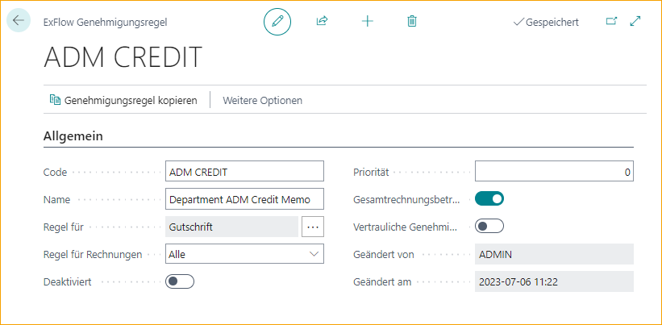
| **Regel für Rechnungen:**            | Für Rechnungen ist es möglich, eine Regel für Folgendes hinzuzufügen:   Kostenstellenrechnungen, Abgeglichen mit Bestellung, PO verbunden mit Differenz oder PO verbunden ohne Differenz
| **Deaktiviert:**                     | Wenn eine Genehmigungsregel deaktiviert ist, kann sie nur manuell oder über Verweis angewendet werden
| **Priorität:**                     | Wenn es mehrere Genehmigungsregeln mit der gleichen Anzahl von Treffern gibt, wird automatisch die Genehmigungsregel mit der höchsten Prioritätsnummer hinzugefügt
| **Gesamtbetrag der Rechnung verwenden:**     | Aktivieren Sie dies, wenn die Regel Genehmigungsgruppen basierend auf dem Gesamtbetrag des Dokuments oder dem Betrag in der aktuellen Zeile hinzufügen soll
| **Vertrauliche Genehmigung:**     | Aktivieren Sie die vertrauliche Genehmigung, um einen Genehmigungsfluss einzurichten, der auf Benutzer mit vertraulichem Zugriff gefiltert ist
| **Geändert von:**                   | Letzter Benutzer, der die Einstellungen für die aktuelle Regel geändert und gespeichert hat
| **Änderungsdatum:**                 | Datum und Uhrzeit der letzten Änderung der aktuellen Regel

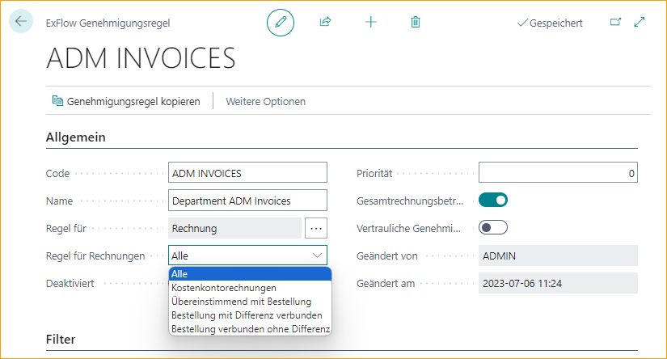

### Genehmigungsregel – Filter
Zwei Filter für Dimensionen in Kombination können in einer Genehmigungsregel ausgewählt werden. Alle zugewiesenen Filter und zusätzlichen Filter müssen mit den Daten des Dokuments übereinstimmen, damit die Genehmigungsregel automatisch angewendet wird.

Bei der Auswahl eines Wertes wird die Option automatisch aktiviert.

| Filter      |	|
|:-|:-|
|**Dimension Code 1:**              | Wählen Sie einen Dimension Code
| **Dimension Value Filter 1:**     | Filter: Wählen Sie einen Dimension Value für den ausgewählten Dimension Code
| **Dimension Code 2:**             | Wählen Sie einen zweiten Dimension Code
| **Dimension Value Filter 2:**     | Filter: Wählen Sie einen Dimension Value für den zweiten ausgewählten Dimension Code
| **Erster Genehmiger Filter:**        | Kann dem Dokument hinzugefügt werden, wenn eine Referenz interpretiert wird.   Lesen Sie mehr im Abschnitt [***Geschäftsfunktionalität --> Referenzcodes***](https://docs.exflow.cloud/business-central/docs/user-manual/business-functionality/reference-codes)
| **Lieferantenfilter:**                | Wählen Sie eine oder mehrere Lieferantennummern

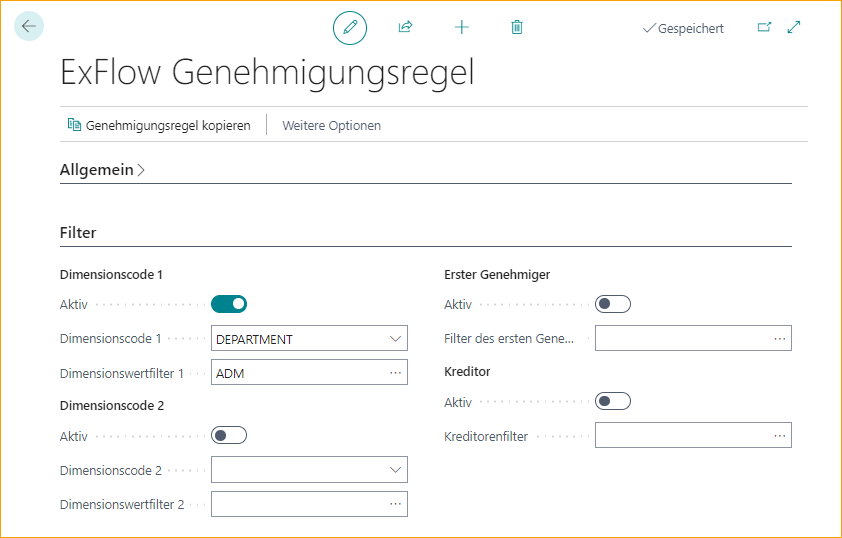

### Genehmigungsregel - Zusätzliche Filter
Alle zugewiesenen Filter und zusätzlichen Filter müssen mit den Daten des Dokuments übereinstimmen, damit die Genehmigungsregel automatisch angewendet wird.

Bei der Auswahl eines Wertes wird die Option automatisch aktiviert.

| Zusätzliche Filter      |	|
|:-|:-|
|**Linientyp:**                     | Wählen Sie den Linientyp G/L Account, Item, Resource, Fixed Asset oder Charge (Item)
| **Linientyp-Filter:**             | Wert für ausgewählten Linientyp hinzufügen
| **Einkäuferfilter:**             | Filter für Einkäufer hinzufügen
| **Jobfilter:**                   | Jobfilter hinzufügen
| **Verantwortliche Person-Filter:**    | Filter für verantwortliche Person in Jobs hinzufügen
| **Lieferantenbuchungsgruppe**:         | Filter für Lieferantenbuchungsgruppe hinzufügen

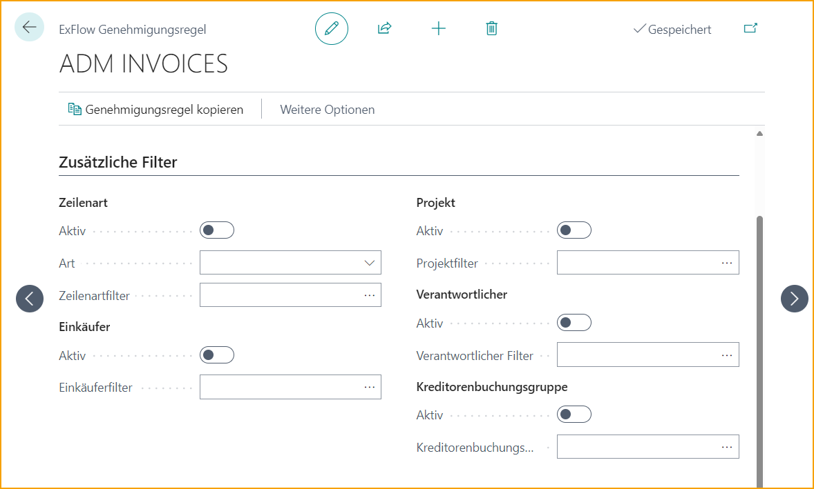

### Genehmigungsregel-Linien
Fügen Sie so viele Genehmigungsgruppen hinzu, wie für die Genehmigungsregel erforderlich sind. Bei Vier-Augen-Prinzip (zwei Genehmiger) mindestens zwei Gruppen hinzufügen. Bei Sechs-Augen-Prinzip (drei Genehmiger) mindestens drei Gruppen hinzufügen.

Eine Genehmigungsregel sollte immer mindestens eine Genehmigungsgruppe enthalten, bei der "Über Betrag" und "Nicht über Betrag" auf Null gesetzt sind. Andernfalls besteht die Gefahr, dass die Rechnung nicht zur Genehmigung weitergeleitet wird und nicht gebucht werden kann.

Wenn erforderlich ist, dass mindestens zwei Benutzer die Dokumentenlinie genehmigen, kann eine Einstellung wie unten verwendet werden:

If one approval group always approves and the second only approves amount over 10 000 then a setting like below could be used:

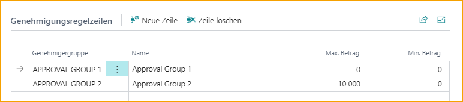

Mit dem Vier-Augen-Prinzip (zwei Genehmiger) und der zweiten Genehmigungsgruppe, die je nach Betrag unterschiedlich ist.

Wenn der erste Genehmiger Genehmigungsgruppe 1 ist und immer zustimmt, kann eine Einstellung wie unten verwendet werden. Genehmigungsgruppe 2 genehmigt nur Dokumente bis zu einem Betrag von 9.999,99 und Genehmigungsgruppe 3 ab 10.000 oder mehr:

### Immer neue Genehmiger vorschlagen
Gehe zu: ***Setup --> ExFlow Setup --> Genehmigung***

Genehmigungsregeln und dynamische Genehmigungsregeln ermöglichen es ExFlow, automatisch Genehmigungsregeln oder dynamische Genehmigungsabläufe für Dokumente zu identifizieren und anzuwenden, die von einem beliebigen Benutzer in ExFlow Web geändert wurden.

**Beispiel für eine Genehmigungsregel ohne dynamischen Genehmigungstyp:** 
Genehmigungsregeln werden durch die Dimension Abteilung gesteuert.

Die Rechnung ist ursprünglich mit der Abteilung "ADM" codiert und es wird eine Genehmigungsregel mit einem Filter für ADM angewendet.

Während der Genehmigung in ExFlow Web ändert ein Benutzer die Abteilung in "SALES" und genehmigt die Rechnung.

Die Logik "Immer neue Genehmiger vorschlagen" ersetzt nun die vorherige Genehmigungsregel, um eine neue anzuwenden, die von "SALES" gesteuert wird.

Neue Genehmigungsregeln werden angewendet, wenn die Rechnungscodierung geändert wurde, um eine besser geeignete Genehmigungsregel zu erfüllen, sobald der Benutzer die Rechnung genehmigt. Sie werden nicht angewendet, wenn der Benutzer die Rechnung nicht genehmigt.

**Beispiel für eine dynamische Genehmigungsregel mit dynamischem Genehmigungstyp:** 
Wenn Genehmigungsregeln durch die Dimension Eigentümer für Abteilung gesteuert werden.
Weitere Informationen zur Einrichtung finden Sie im Abschnitt [***Geschäftsfunktionalität --> Genehmigungsregeln --> Dynamischer Genehmigungsablauf für Dimensionseigentümer***](https://docs.exflow.cloud/business-central/docs/user-manual/business-functionality/approval-rules#dynamic-approval-flow-for-dimension-owners) unten.

Die Rechnung ist ursprünglich mit der Abteilung "ADM" codiert und es wird eine Genehmigungsregel für den Dimensionseigentümer angewendet.

Während der Genehmigung in ExFlow Web ändert ein Benutzer die Abteilung in "SALES" und genehmigt die Rechnung.

Die Logik "Immer neue Genehmiger vorschlagen" ersetzt nun die vorherigen Genehmiger in derselben Genehmigungsregel, um Genehmiger anzuwenden, die von "SALES" gesteuert werden.

Dies ändert nicht die Genehmigungsregel, sondern nur die Genehmiger aus der Dimensionseigentümer-Einrichtung.

**Hinweis** 
Dynamische Genehmigungsregeln werden nicht angewendet, wenn die Genehmigungsregel der Rechnung durch eine ExFlow-Referenz hinzugefügt wurde oder manuell im Importjournal hinzugefügt wurde. Dies kann für sensible Dokumente nützlich sein.

Zusätzlich hinzugefügte Genehmiger zu einem Dokument werden nicht ersetzt, wenn ExFlow Web eine neue Genehmigungsregel anwendet. Es werden nur die Benutzer ersetzt, die automatisch hinzugefügt wurden.

Genehmigungsregeln können auch mit Genehmigungsgruppen basierend auf "Dynamischem Genehmigungstyp" wie Dimensionseigentümer, Verantwortliche Person usw. verwendet werden. Weitere Informationen zur Einrichtung finden Sie im Abschnitt [***Genehmigungsregeln --> Dynamischer Genehmungsablauf für Dimensionseigentümer,***](https://docs.exflow.cloud/business-central/docs/user-manual/business-functionality/approval-rules#dynamic-approval-flow-for-dimension-owners) [***Jobs,***](https://docs.exflow.cloud/business-central/docs/user-manual/business-functionality/approval-rules#dynamic-approval-flow-for-jobs) oder [***Einkäufer***](https://docs.exflow.cloud/business-central/docs/user-manual/business-functionality/approval-rules#dynamic-approval-flows-purchasers) unten.

Die Funktionsweise dieser Funktion besteht darin, dass ExFlow Web automatisch besser geeignete Genehmigungsregeln anwendet, wenn diese identifiziert werden. Die verbleibenden Genehmiger aus der vorherigen Genehmigungsregel werden entfernt und neue Genehmiger aus der neuen Genehmigungsregel werden hinzugefügt.

### Dynamischer Genehmigungsablauf für Dimensionseigentümer
ExFlow Dimension Owners ist ein Tool, um die Anzahl der verwendeten Genehmigungsregeln zu begrenzen und stattdessen die richtigen Genehmiger auf dynamische Weise auszuwählen. Es ist möglich, verschiedene Dimensionen in derselben Regel zu kombinieren und auf der Grundlage der Genehmigungsgruppe eine Reihenfolge festzulegen.

**Verknüpfung von Genehmigungsgruppen mit Dimensionen** 
Gehe zu: ***Setup --> ExFlow Manual Setup --> ExFlow Dimension Owners***

Richte einen Genehmigungsfluss für einen bestimmten Dimensionenwert ein. Öffne eine neue Karte, indem du auf "Neu" klickst.

Wähle die Dimension und den Dimensionenwert aus.
Gib dann die Genehmiger ein, die für diesen Dimensionenwert enthalten sein sollen.
Mindestens ein Genehmiger muss ausgewählt werden.

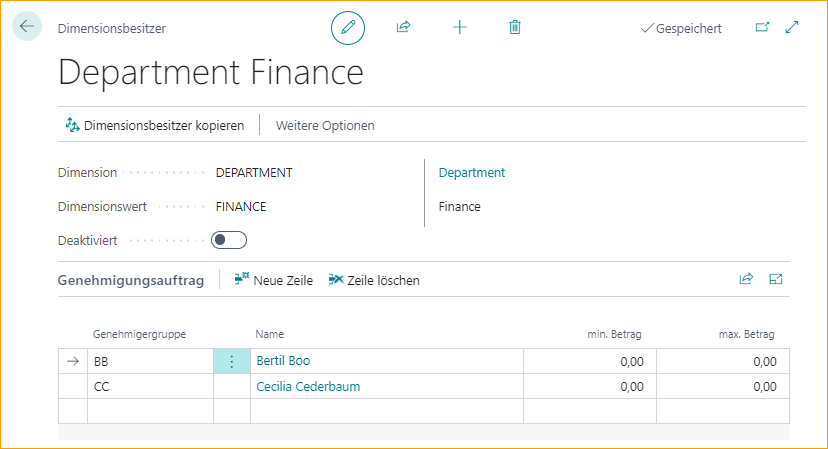

**Dimensionseigentümer kopieren** 
Wenn eine Karte für einen Dimensionseigentümer erstellt wird, kann die Funktion "Dimensionseigentümer kopieren" verwendet werden, um automatisch den Rest der Dimensionenwerte zu erstellen.

Die ausgewählte Dimension basiert auf dem ausgewählten Dimensionseigentümer. Wähle aus, ob dies angewendet werden soll auf:

| Generieren für      |	|
|:-|:-|
|**Einen Wert:**             | Erstelle eine Kopie für einen bestimmten Dimensionenwert.
| **Alle Werte:**           | Erstelle und kopiere für alle Dimensionenwerte.
| **Einen Wert ersetzen:**    | Kopiere und ersetze für eine bereits erstellte Karte des Dimensionseigentümers.
| **Alle Werte ersetzen:**   | Kopiere und ersetze für alle Karten der Dimensionseigentümer.

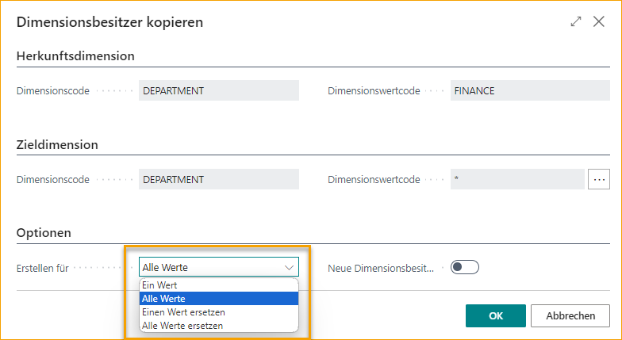

**Dynamische Genehmigungsgruppe - Dimensionseigentümer** 
Gehe zu: ***Setup --> ExFlow Manual Setup --> ExFlow Approval Groups***

Wenn die Dimensionseigentümer erstellt sind, muss eine neue ExFlow-Genehmigungsgruppe erstellt werden. Setze den "Dynamischen Genehmigungstyp" auf "Dimensionseigentümer" und füge dann die Dimension in das Feld "Dimension Code" ein.

Verwende die Funktion "Standard-Genehmigungsgruppe", um festzulegen, wo ein Dimensionseigentümer fehlt, anstatt diese Dimension vollständig zu ignorieren.

Bei Verwendung des dynamischen Genehmigungstyps ist es nicht möglich, Genehmigungsgruppenmitglieder manuell hinzuzufügen.

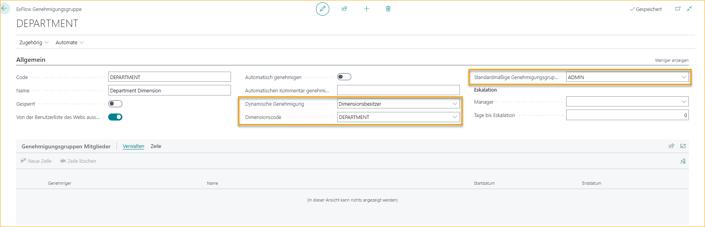

**Genehmigungsregel - Dimensionseigentümer** 
Gehe zu: ***Setup --> ExFlow Manual Setup --> ExFlow Approval Rules***

Füge eine Genehmigungsregel hinzu, die für alle Dokumente ohne Filter gilt (aktiviere die Genehmigungsregel) oder für die Dimension mit den gerade erstellten Dimensionseigentümern.

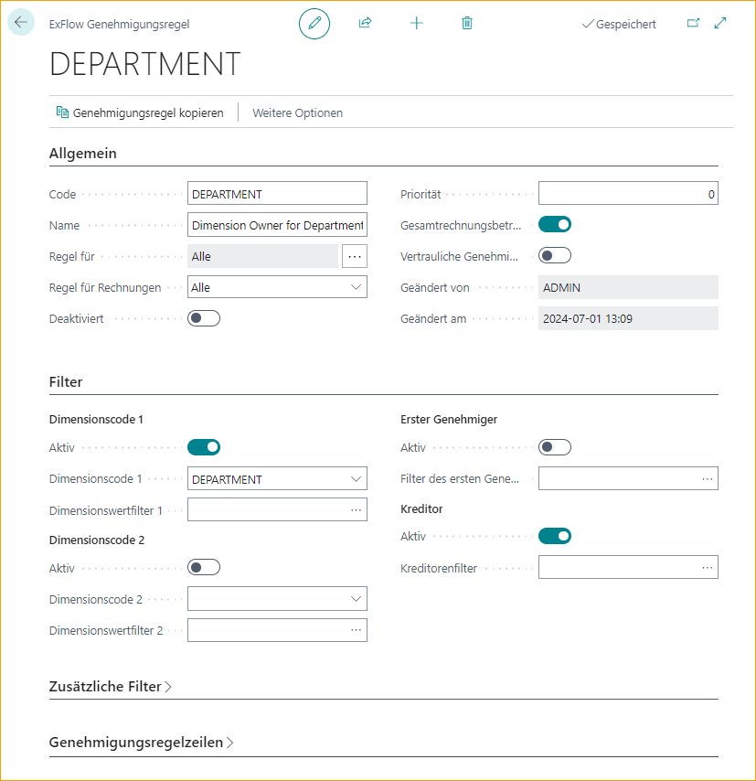

Füge die dynamische Genehmigungsgruppe mit dem dynamischen Genehmigungstyp "Dimensionseigentümer" hinzu, die ExFlow fügt automatisch die richtigen Genehmiger basierend auf der auf dem Dokument codierten Dimension hinzu.

In diesem Fall genehmigt der Dimensionseigentümer der Abteilung die Rechnung zuerst, dann die IT-Abteilung für alle Beträge.

Wir haben auch den CFO als Genehmiger hinzugefügt, wenn das Dokument über 500.000 liegt, und den CEO für Beträge über 1.000.000.

Wenn es mehrere Genehmiger in der Karte des Dimensionseigentümers gibt, wird diese Reihenfolge zuerst in diesem Genehmigungsfluss verwendet.

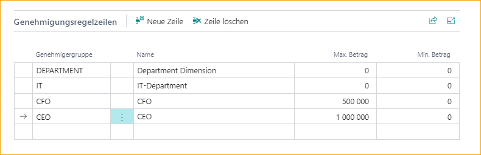ExFlow Dimension Owners is a tool to limit the amount of used Approval Rules and instead select the correct approvers in a dynamic way. It is possible to combine different dimension values in the same rule with an order set based on the Approval Group.

**Verbindung von Genehmigungsgruppen mit Dimensionen** 
Gehe zu: ***Setup --> ExFlow Manuelle Einrichtung --> ExFlow Dimensionseigentümer***

Richte einen Genehmigungsfluss für einen bestimmten Dimensionswert ein. Öffne eine neue Karte, indem du auf "Neu" klickst.

Wähle die Dimension und den Dimensionswert aus.
Gib dann die Genehmiger ein, die für diesen Dimensionswert enthalten sein sollen.
Es muss mindestens ein Genehmiger ausgewählt werden.

**Dimensionseigentümer kopieren** 
Wenn eine Karte für einen Dimensionseigentümer erstellt wird, kann die Funktion "Dimensionseigentümer kopieren" verwendet werden, um automatisch den Rest der Dimensionseigentümer zu erstellen.

Die ausgewählte Dimension basiert auf dem ausgewählten Dimensionseigentümer. Wähle aus, ob dies angewendet werden soll auf:

| Generieren für      |	|
|:-|:-|
|**Einen Wert:**             | Erstelle eine Kopie für einen bestimmten Dimensionswert.
| **Alle Werte:**           | Erstelle und kopiere für alle Dimensionseigentümer.
| **Einen Wert ersetzen:**    | Kopiere und ersetze für eine bereits erstellte Karte des Dimensionseigentümers.
| **Alle Werte ersetzen:**   | Kopiere und ersetze für alle Dimensionseigentümerkarten.

**Dynamische Genehmigungsgruppe – Dimensionsverantwortlicher** 
Gehen Sie zu: ***Setup --> ExFlow manuelle Einrichtung --> ExFlow Genehmigungsgruppen***

Wenn die Dimensionseigentümer erstellt sind, muss eine neue ExFlow Genehmigungsgruppe erstellt werden. Setzen Sie den "Dynamischen Genehmigungstyp" auf "Dimensionseigentümer" und fügen Sie dann die Dimension im Feld "Dimension Code" hinzu.

Verwenden Sie die Funktion "Standard-Genehmigungsgruppe", um festzulegen, wo ein Dimensionseigentümer fehlt, anstatt diese Dimension vollständig zu ignorieren.

Bei Verwendung des dynamischen Genehmigungstyps ist es nicht möglich, Genehmigungsgruppenmitglieder manuell hinzuzufügen.

**Genehmigungsregel - Dimensionseigentümer** 
Gehen Sie zu: ***Setup --> ExFlow manuelle Einrichtung --> ExFlow Genehmigungsregeln***

Fügen Sie eine Genehmigungsregel hinzu, die für alle Dokumente ohne Filter gilt (aktivieren Sie die Genehmigungsregel) oder für die Dimension mit den gerade erstellten Dimensionseigentümern.

Fügen Sie die dynamische Genehmigungsgruppe mit dem dynamischen Genehmigungstyp "Dimensionseigentümer" hinzu, die ExFlow fügt automatisch die richtigen Genehmiger basierend auf der auf dem Dokument codierten Dimension hinzu.

In diesem Fall genehmigt der Abteilungsdimensionseigentümer die Rechnung zuerst, dann die IT-Abteilung für alle Beträge.

Wir haben auch den CFO als Genehmiger hinzugefügt, wenn das Dokument über 500.000 liegt, und den CEO für Beträge über 1.000.000.

Wenn es mehrere Genehmiger in der Dimensionseigentümerkarte gibt, wird diese Reihenfolge zuerst in diesem Genehmigungsfluss verwendet.

**"Immer neue Genehmiger vorschlagen" aktivieren** 
Gehen Sie zu: ***Setup --> ExFlow manuelle Einrichtung --> ExFlow Einrichtung***

Aktivieren Sie "Immer neue Genehmiger vorschlagen" in der ExFlow Einrichtung, um einen dynamischen Genehmigungsfluss zu erstellen, wenn die Codierung in ExFlow Web geändert wird.

Lesen Sie mehr im Abschnitt [***Geschäftsfunktionalität --> Genehmigungsregeln --> Immer neue Genehmiger vorschlagen***](https://docs.exflow.cloud/business-central/docs/user-manual/business-functionality/approval-rules#always-propose-new-approvers) oben.

### Workflow für Dimensionseigentümer
**Aktuelle Dimensionseigentümer anzeigen** 
Gehen Sie zu: ***Import Journal --> Importzeilen --> Zeile --> Aktuelle Dimensionseigentümer anzeigen***

Die Funktion "Aktuelle Dimensionseigentümer anzeigen" kann im ExFlow Import Journal und im ExFlow Genehmigungsstatus verwendet werden.

Gehen Sie zu: ***Genehmigungsstatus --> Dokumentzeilen --> Zeile --> Aktuelle Dimensionseigentümer anzeigen***

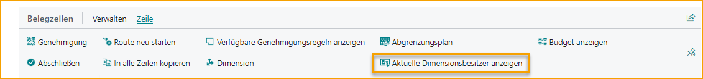

Diese Funktion öffnet eine gefilterte Seite und zeigt alle aktuellen Dimensionseigentümerkarten an, abhängig von den derzeit hinzugefügten Dimensionen auf der codierten Zeile.

### Dynamischer Genehmigungsfluss für Aufträge
Es ist möglich, mit dem Verantwortlichen und dem Projektmanager in einem dynamischen Genehmigungsworkflow für Jobs zu arbeiten.

Es ist eine Einrichtung erforderlich, um den dynamischen Genehmigungsworkflow für Jobs zu verwenden.

**Verbindung von Genehmigern mit dem Verantwortlichen** 
Um mit dem dem Genehmigungsworkflow hinzugefügten Verantwortlichen zu arbeiten, verbinden Sie die Ressource mit dem ExFlow-Benutzer.

**Verbindung von Genehmigern mit dem Projektmanager** 
Um mit dem dem Genehmigungsworkflow hinzugefügten Projektmanager zu arbeiten, stellen Sie sicher, dass der BC-Systembenutzer mit einem ExFlow-Benutzer verbunden ist.

Lesen Sie mehr im Abschnitt [***Geschäftsfunktionalität --> ExFlow-Benutzer --> Erstellen eines Systembenutzers***](https://docs.exflow.cloud/business-central/docs/user-manual/business-functionality/exflow-user#create-a-system-user)

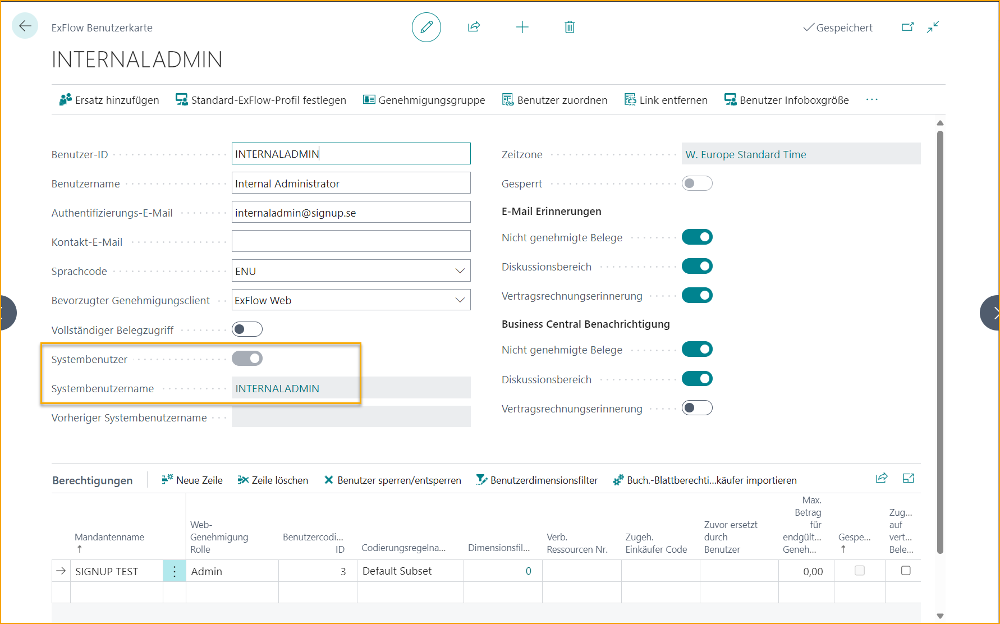

**Dynamische Genehmigungsgruppe - Verantwortlicher / Projektmanager** 
Erstellen Sie eine ExFlow-Genehmigungsgruppe mit dem dynamischen Genehmigungstyp "Verantwortlicher" oder "Projektmanager":

In beiden Fällen ist es möglich, die Funktion "Standard-Genehmigungsgruppe" zu verwenden, um den Verantwortlichen oder Projektmanager auf der Jobkarte zuzuweisen, falls diese fehlen.

Bei Verwendung des dynamischen Genehmigungstyps ist es nicht möglich, Genehmigungsgruppenmitglieder manuell hinzuzufügen.

**Genehmigungsregel - Verantwortliche Person / Projektleiter** 
Erstellen Sie eine Genehmigungsregel, um automatisch die verantwortliche Person und/oder den Projektleiter von Jobs zuzuweisen.

In diesem Beispiel wird ein Filter für alle Lieferanten und alle Jobs hinzugefügt.

Bertil Boo sollte immer vor der verantwortlichen Person im Projekt genehmigen. Das Gleiche könnte auch mit dem Projektleiter anstelle/von gemeinsam mit der verantwortlichen Person erfolgen.

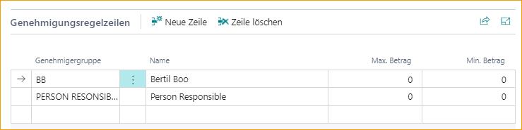

**"Immer neue Genehmiger vorschlagen" aktivieren** 
Aktivieren Sie "Immer neue Genehmiger vorschlagen" in der ExFlow-Konfiguration, um einen dynamischen Genehmigungsfluss zu erstellen, wenn der Code in ExFlow Web geändert wird.

**Standard-Jobtasknummer** 
Bei Verwendung von Jobs in Business Central Standard kann eine Standard-Jobtasknummer nützlich sein, wenn die meisten Jobs dieselbe Aufgabe haben.

Fügen Sie die Standard-Jobtasknummer in der ExFlow-Konfiguration hinzu.

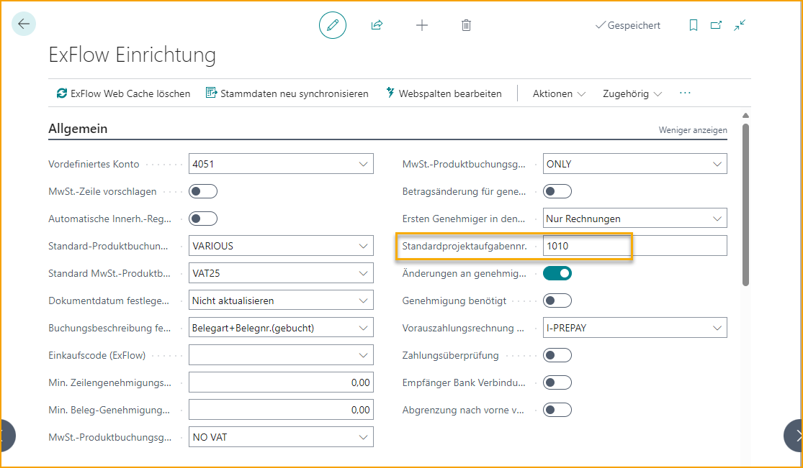

Wenn Sie eine Jobnummer im Importjournal hinzufügen oder den Code in ExFlow Web ändern, wird die Jobtasknummer automatisch aus der Standard-Jobtasknummer in der ExFlow-Konfiguration hinzugefügt.

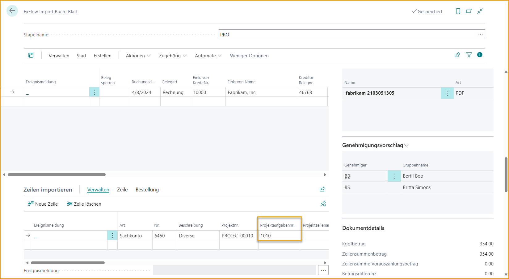

Fügen Sie die Spalten für Jobs und Aufgaben von ExFlow Setup zu ExFlow Web hinzu.

Der Jobzeilentyp muss immer noch manuell im Importjournal oder in ExFlow Web hinzugefügt werden, wird jedoch nicht aktualisiert, wenn sich die Jobnummer oder die Jobtasknummer ändert.

### Workflow für Verantwortliche / Projektmanager
Die Job-Nr. JOB00010 enthält die verantwortliche Person BRITTA.

Wenn die Job-Nr. JOB00010 im Import Journal hinzugefügt wird, wird die Genehmigungsregel JOBS über die Genehmigungsgruppe automatisch BRITTA als Genehmiger hinzufügen. Wie bereits erwähnt, kann dieselbe Funktionalität auch mit dem Projektmanager oder zusammen mit der verantwortlichen Person verwendet werden.

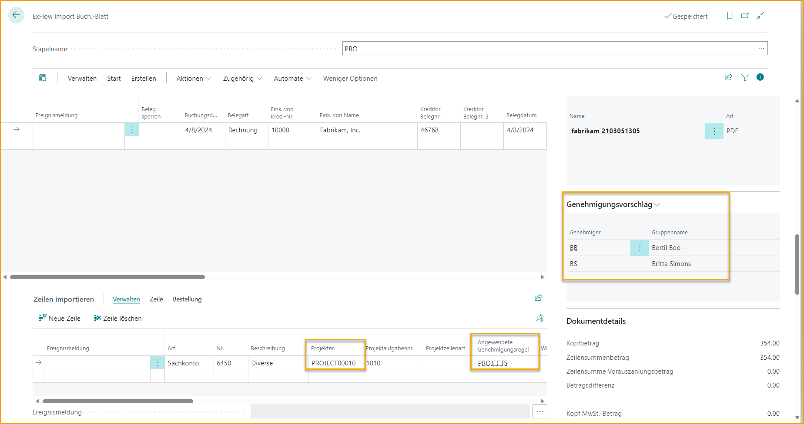

Wenn die Job-Nr. auf ExFlow Web geändert wird, wird der Genehmiger BRITTA automatisch auf die verantwortliche Person (oder den Projektmanager) der hinzugefügten Job-Nr. aktualisiert. Duplizierte Genehmiger werden automatisch entfernt.

### Dynamische Genehmigungsflüsse für Einkäufer
Dynamische Genehmigungsflüsse können basierend auf dem Einkäufercode eingerichtet werden. Wenn ein Einkäufercode im Einkaufsdokument festgelegt ist, fügt ExFlow automatisch den Einkäufer dem Genehmigungsfluss hinzu.

**Verknüpfung von Genehmigern mit Einkäufer** 
Um mit dem dem Genehmigungsfluss hinzugefügten Einkäufer zu arbeiten, verknüpfen Sie den Einkäufercode mit dem ExFlow-Benutzer.

**Dynamische Genehmigungsgruppe - Einkäufer** 
Erstellen Sie eine Genehmigungsgruppe mit dem dynamischen Genehmigungstyp "Einkäufer".

Es ist möglich, die Funktion "Standard-Genehmigungsgruppe" zuzuweisen, wenn der Einkäufer fehlt.

Bei Verwendung des dynamischen Genehmigungstyps ist es nicht möglich, Genehmigungsgruppenmitglieder manuell hinzuzufügen.

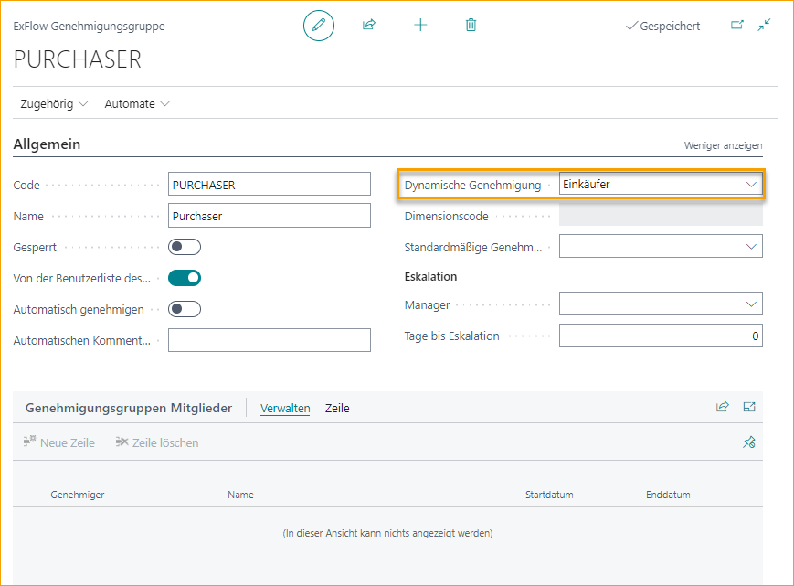

**Genehmigungsregel - Einkäufer** 
Erstellen Sie eine Genehmigungsregel, um den Einkäufer automatisch dem Genehmigungsfluss zuzuweisen.

In diesem Beispiel wird ein Filter für alle Lieferanten und alle Einkäufer hinzugefügt.

In diesem Fall wird der Einkäufer auf dem Dokument als Genehmiger hinzugefügt.

ExFlow weist nun automatisch den Genehmiger basierend auf dem Wert des Einkäufercodes im Kopf des Einkaufsdokuments zu. Wenn Zeilen mit verschiedenen Bestellungen und mehreren Einkäufercodes abgeglichen werden, kann ExFlow auch den richtigen Einkäufercode für die Dokumentzeile abrufen.

Es ist auch ratsam, die Personalisierung zu nutzen, um das Feld für den Einkäufercode im Import Journal (Zeilen oder Kopf) anzuzeigen, da die Felder standardmäßig ausgeblendet sind.

**Immer neue Genehmiger vorschlagen** 
Wenn Sie mit dem dynamischen Genehmigungstyp "Einkäufer" arbeiten, werden die Genehmiger aus dem Import Journal hinzugefügt. Nachdem das Dokument erstellt wurde, gibt es keine Funktion, um den Einkäufer auf den Dokumentzeilen zu ändern. Daher wird der Genehmigungsfluss während des Genehmigungsprozesses nicht geändert.

