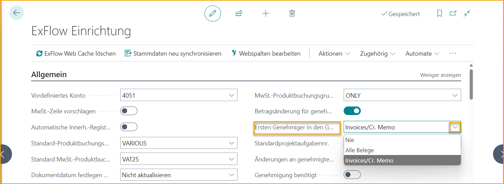

## Ersten Genehmiger in den Genehmigungsfluss kopieren

Gehe zu: **ExFlow Setup --> Allgemein --> Ersten Genehmiger in den Genehmigungsfluss kopieren**

 

| Ersten Genehmiger in den Genehmigungsfluss kopieren | 	|
|:-|:-|
| **Nie:**                         | Wenn ein erster Genehmiger zu einem Dokument hinzugefügt wird, erscheint dieser Genehmiger nicht im Genehmigungsfluss.  Stattdessen kann er als Filter verwendet werden, um eine Genehmigungsregel hinzuzufügen.  Wenn eine Rechnung oder Gutschrift mit Referenz interpretiert wird, kann die Referenz einen ersten Genehmiger anwenden, um eine Genehmigungsregel auszulösen.    **Beispiel:** Cecilia hat einen Computer bestellt und die Rechnung wird mit der Referenz Cecilia interpretiert.   ExFlow-Referenz wird mit dem ersten Genehmiger Cecilia erstellt.  Nun können wir eine Genehmigungsregel mit Filter auf Cecilia erstellen und den Genehmigungsfluss aufbauen, ohne Cecilia als Genehmiger hinzuzufügen.
| **Alle Dokumente**| Der erste Genehmiger wird dem Genehmigungsfluss vor den Genehmigern aus der Genehmigungsregel für alle Dokumente hinzugefügt. Angebot, Bestellung, Rechnung und Gutschrift.  Wenn mit Angebots- und Bestellgenehmigung gearbeitet wird, wird nicht empfohlen, den aktuellen Benutzer als Standard-Erstgenehmiger festzulegen. Da der Einkäufer, der das Angebot/die Bestellung erstellt und freigibt, das Dokument auch in ExFlow Approval genehmigen muss.    **Beispiel:** Eine Rechnung wird mit der Referenz Cecilia interpretiert.  ExFlow-Referenz wird mit dem ersten Genehmiger Cecilia erstellt.  Nun können wir die Rechnung an Cecilia senden und sie die Kodierung hinzufügen lassen, um später im Genehmigungsprozess eine Genehmigungsregel auszulösen.
|**Rechnungen/Cr. Memo**| Der erste Genehmiger wird nur für Rechnungen und Gutschriften zum Genehmigungsablauf hinzugefügt.  Nicht für Bestellungen und Angebote.     **Beispiel:** Wenn Cecilia ein Kaufangebot oder eine Bestellung erstellt, kann ExFlow den aktuellen Benutzer als ersten Genehmiger hinzufügen.  Jetzt können wir eine Genehmigungsregel mit Filter für Cecilia erstellen und den Genehmigungsablauf erstellen, ohne Cecilia als Genehmiger hinzuzufügen.  Wenn Cecilia das Dokument freigibt, muss sie es nicht genehmigen, da sie diejenige ist, die es erstellt und freigibt.

 

### Aktuellen Benutzer als Standard-Erstgenehmiger für Bestellung/Angebot festlegen

Gehe zu: **ExFlow Setup --> Bestell- und Angebotsgenehmigung --> Aktuellen Benutzer als Standard-Erstgenehmiger für Bestellung/Angebot festlegen**

Für Kaufangebote und Bestellungen kann der erste Genehmiger von ExFlow auf Zeilenebene hinzugefügt werden. 

Der ExFlow-Benutzer muss dann einem Systembenutzer zugewiesen werden, damit ExFlow erkennt, welcher Benutzer als erster Genehmiger hinzugefügt werden soll. 

 

### Erster Genehmiger-Filter in einer ExFlow-Genehmigungsregel

Aktivieren Sie die Funktion ''Ersten Genehmiger in den Genehmigungsfluss kopieren'', wenn der "Erster Genehmiger-Filter" aus der Genehmigungsregel als erster Genehmiger zum Genehmigungsvorschlag für eine bestimmte Dokumentzeile hinzugefügt werden soll.  

 

### Erster Genehmiger im Importjournal
Der erste Genehmiger kann im Importjournal über [***ExFlow-Vertrag***](https://docs.signupsoftware.com/business-central/docs/user-manual/business-functionality/contract#contract) und [***ExFlow-Referenz***](https://docs.signupsoftware.com/business-central/docs/user-manual/business-functionality/reference-codes#reference-codes) zum Dokumentkopf hinzugefügt und auf die Dokumentzeilen kopiert werden.

#### Erster Genehmiger im ExFlow-Vertrag
Wenn eine Referenz interpretiert wird, die mit einem ExFlow-Vertrag verbunden ist, kann dies verwendet werden, um den ersten Genehmiger zu Rechnungen im Importjournal hinzuzufügen.   

#### Erster Genehmiger in der ExFlow-Referenz
Wenn eine ExFlow-Referenz interpretiert wird, kann dies verwendet werden, um den ersten Genehmiger zu Rechnungen oder Gutschriften im Importjournal hinzuzufügen.   

 