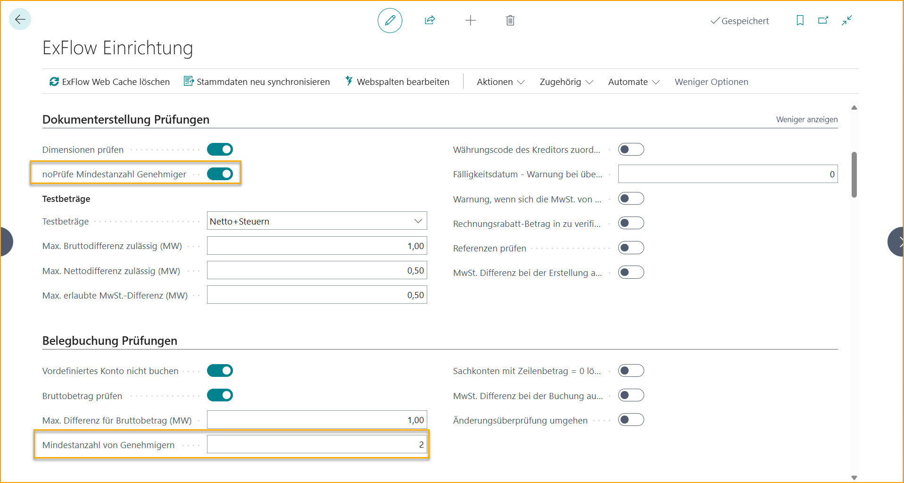

## Mindestanzahl der Genehmiger
Es kann eine Überprüfung auf die Mindestanzahl der Genehmiger in ExFlow Web hinzugefügt und auch für den Import von Journal aktiviert werden.

Beim Import von Journal muss die Mindestanzahl der Genehmiger hinzugefügt werden, bevor das Dokument erstellt werden kann. 
Für ExFlow Web wird die Überprüfung für den letzten Genehmiger durchgeführt.

Der Budgetinhaber wird nicht in die Mindestanzahl der Genehmiger einbezogen, wenn mit der G/L-Budgetkontrolle gearbeitet wird.

### Einrichtung der Mindestanzahl der Genehmiger
Gehe zu: ***ExFlow Setup --> Dokumentenbuchungsprüfungen***

Gib "Mindestanzahl der Genehmiger" ein. Dadurch wird eine Überprüfung für den letzten Genehmiger im Genehmigungsfluss aktiviert. Der Budgetinhaber ist nicht enthalten.

Gehe zu: ***ExFlow Setup --> Dokumenterstellungprüfungen***

Um auch eine Überprüfung auf die Mindestanzahl der Genehmiger im Import von Journal zu aktivieren, aktiviere "Überprüfung der Mindestanzahl der Genehmiger" in den Dokumenterstellungprüfungen und füge die Anzahl der Genehmiger wie oben angegeben hinzu.

### Ablauf für die Mindestanzahl der Genehmiger
Wenn die Überprüfung der Mindestanzahl der Genehmiger für den Import von Journal aktiviert ist, kann das Dokument erstellt werden, wenn die Mindestanzahl der Genehmiger oder mehr dem Genehmigungsfluss hinzugefügt wurde.

Während des Genehmigungsflusses kann sich die Anzahl der Genehmiger ändern. Aus diesem Grund wird eine Überprüfung durchgeführt, wenn der letzte Genehmiger das Dokument genehmigt.

Wenn die Anzahl der Genehmiger einschließlich des aktuellen Genehmigers geringer ist als in der ExFlow-Einrichtung angegeben, wird eine Fehlermeldung angezeigt, die besagt, dass weitere Genehmiger hinzugefügt werden müssen, bevor der aktuelle Genehmiger genehmigen kann.

