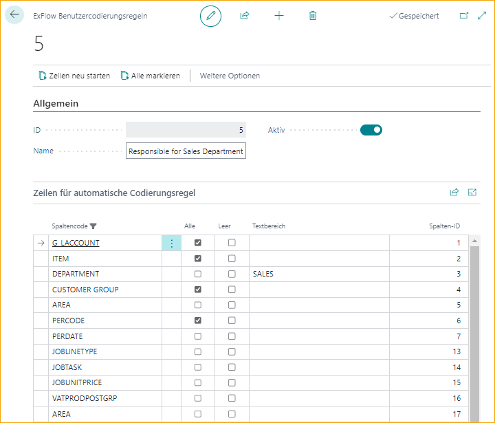

## Benutzer-Codierungsregeln

Gehen Sie zu: ***ExFlow-Setup – Übersicht ExFlow User Coding Rules***

Wenn ein Genehmiger in der Lage sein soll, Codierungsänderungen der Rechnungszeile in ExFlow Web vorzunehmen, können ExFlow Benutzer-Codierungsregeln verwendet werden, um zu entscheiden/einzuschränken, welche Werte er/sie auswählen kann.

Administratoren können Benutzer-Codierungsregeln für einzelne Benutzer oder Benutzergruppen erstellen. Die Codierungsregel muss dem ExFlow-Benutzer zugewiesen werden, indem auf die ID verwiesen wird.

Jede sichtbare Spalte in ExFlow Web kann geändert werden. Wählen Sie, ob der Genehmiger alle "Alle", keine "Leer" oder einen Filter von Werten "Textbereich" auswählen können soll.

Die "Benutzer-Codierungsregel" im untenstehenden Beispiel erlaubt es dem Genehmiger, den Wert der Spalte "Abteilung" in "VERKAUF" zu ändern.

| Allgemein      |	|
|:-|:-|
|**ID:**        | ID-Nummern werden den Codierungsregeln in der Reihenfolge zugewiesen, in der sie erstellt werden. Dies hat keinen Einfluss auf die Priorisierung
| **Name:**     | Beschreibender Name für die Regel
| **Aktiv:**    | Ob die Regel aktiv ist oder nicht

Wenn die Benutzer-Codierungsregel erstellt wurde, gehen Sie zur ExFlow Benutzerkarte und wenden Sie die Codierungsregel-ID auf den ausgewählten Benutzer für das spezifische Unternehmen an. Ein ExFlow-Benutzer kann pro Unternehmen nur eine Benutzer-Codierungsregel haben.
