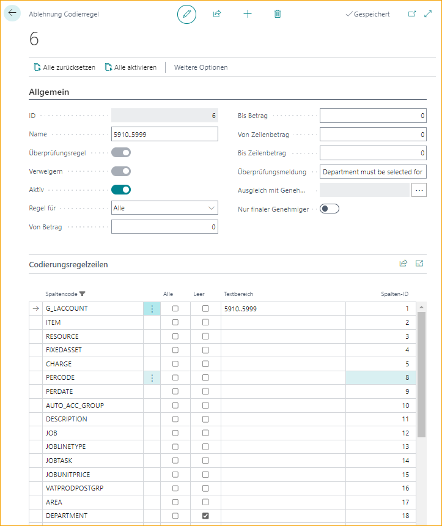

## Ablehnungsregeln für die Kodierung

Gehe zu: ***Setup \--\> ExFlow Manual Setup \--\> ExFlow Denying Coding Rules***

"Ablehnungsregeln für die Kodierung" können verwendet werden, um zu verhindern, dass Genehmiger ungültige Kodierungen in ExFlow Web erstellen.

Ablehnungsregeln für die Kodierung werden verwendet, um zu verhindern, dass der Genehmiger in ExFlow Web Werte auf bestimmte Weise hinzufügt oder genehmigt. Zum Beispiel, um Konten 5910..5999 in Kombination mit einem leeren Abteilungswert zu blockieren.

| Allgemein      |	|
|:-|:-|
|**ID:**                            | ID-Nummern werden den Kodierungsregeln in der Reihenfolge zugewiesen, in der sie erstellt werden. Dies hat keinen Einfluss auf die Priorisierung
| **Name:**                         | Beschreibender Name für die Regel
| **Aktiv:**                        | Ob die Regel aktiv ist oder nicht
| **Regel für:**                    | Fügen Sie "Alle" für alle Dokumenttypen hinzu oder wählen Sie aus der Liste, wenn diese Regel nur für Angebot, Rechnung, Gutschrift oder Bestellung aktiviert werden soll
| **Von Betrag:**                   | Filter auf den Gesamtbetrag des Dokuments
| **Bis Betrag:**                   | Filter auf den Gesamtbetrag des Dokuments
| **Von Zeilenbetrag:**             | Gibt an, ob die Kodierungsregel nur auf Dokumentzeilen in einem bestimmten Zeilenbetragsbereich angewendet werden soll
| **Bis Zeilenbetrag:**             | Gibt an, ob die Kodierungsregel nur auf Dokumentzeilen in einem bestimmten Zeilenbetragsbereich angewendet werden soll
| **Validierungsnachricht:**        | Fügen Sie bei Bedarf eine optionale Beschreibung hinzu
| **Gilt für Genehmigungsgruppen:** | Gibt an, ob die Kodierungsregel nur für bestimmte Genehmigungsgruppen gilt
| **Nur Endgenehmiger:**            | Gibt an, ob die Kodierungsregel nur auf den Endgenehmiger im Genehmigungsfluss angewendet werden soll

