## Benachrichtigungen in Business Central
Wenn der ExFlow-Benutzer ein Systembenutzer ist (mit einem Benutzer in Business Central verknüpft), können Benachrichtigungen in Business Central aktiviert werden. Lesen Sie mehr im Abschnitt [***ExFlow-Benutzer***](https://docs.exflow.cloud/business-central/docs/user-manual/business-functionality/exflow-user#add-a-new-user-manually) zur Einrichtung.

Es gibt vier Arten von Benachrichtigungen: Ungeprüfte Dokumente im aktiven Unternehmen, ungeprüfte Dokumente in anderen Unternehmen, ungelesene Kommentare und fehlende Rechnungen für Vertragszeiträume.
 

### Dokumente zur Genehmigung
Wenn der Benutzer Dokumente zur Genehmigung im aktuellen Unternehmen hat, klicken Sie auf den Link "Dokumente genehmigen":

Dies öffnet eine neue Seite, auf der der Benutzer die Dokumente im aktuellen Unternehmen genehmigen kann.

Wenn der Benutzer Dokumente zur Genehmigung in anderen Unternehmen hat, klicken Sie auf den Link "Dokumente genehmigen":

Dies zeigt dem Benutzer eine Liste, die der folgenden ähnelt:

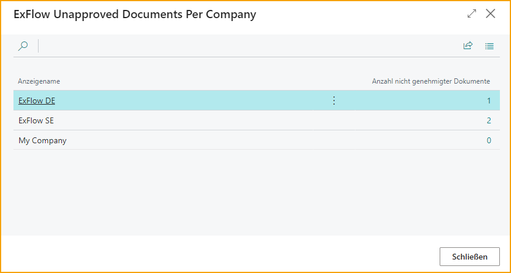

Klicken Sie auf die Zahl rechts, um eine neue Seite zu öffnen, auf der der Benutzer die Dokumente im ausgewählten Unternehmen genehmigen kann.

Lesen Sie mehr darüber im Abschnitt [***Genehmigung in Business Central.***](https://docs.exflow.cloud/business-central/docs/user-manual/approval-workflow/approval-in-business-central#approval-in-business-central)  

### Diskussionspanel / Chat und Zeilenkommentare

Das Diskussionspanel befindet sich im FactBox in "Import Journal", "Genehmigungsstatus", "Genehmigungsstatusverlauf" und "Gelöschte Dokumente" in Business Central.

Auf ExFlow Web wird es **Chat** genannt.

Kommentare, die im Diskussionspanel in Business Central oder im Chat auf ExFlow Web geschrieben werden, erscheinen an beiden Stellen auf dem Dokument.

Verwenden Sie @ und "ExFlow-Benutzercode", um einen Genehmiger zu markieren. Der Genehmiger erhält automatisch Zugriff auf dieses Dokument, auch wenn er nicht im Genehmigungsfluss enthalten ist. Um einen Genehmiger auf einem Dokument markieren zu können, benötigt der Genehmiger Zugriff auf das Unternehmen, für das das Dokument erstellt wurde, in den ExFlow-Benutzerberechtigungen.

Es ist möglich, eine Benachrichtigung und/oder E-Mail an den markierten Genehmiger zu senden, aber dafür ist eine Einrichtung erforderlich.

Für einen ExFlow-Benutzer (verbunden mit einem "Systembenutzer") können Benachrichtigungen in Business Central aktiviert werden. Lesen Sie mehr im Abschnitt [***ExFlow-Benutzer***](https://docs.exflow.cloud/business-central/docs/user-manual/business-functionality/exflow-user#add-a-new-user-manually) zur Einrichtung.

Wenn der Benutzer Kommentare im aktuellen Unternehmen lesen muss, klicken Sie auf den Link "Kommentar lesen":

Wenn der Benutzer Kommentare in anderen Unternehmen lesen muss, klicken Sie auf den Link "Kommentar lesen":

Dieser Link zeigt dem Benutzer eine Liste, die der folgenden ähnelt:

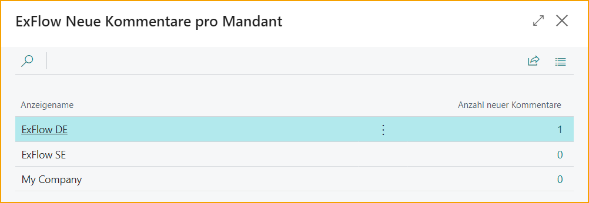

Klicken Sie auf die Zahl in der rechten Spalte, um eine neue Seite zu öffnen, auf der der Benutzer Kommentare im ausgewählten Unternehmen lesen kann.

### Chat-Benachrichtigungsverlauf

Gehen Sie zu: ***ExFlow-Verlauf --> ExFlow-Chat-Benachrichtigungen***

Ein ExFlow-Benutzer kann die ExFlow-Chat-Benachrichtigungen einsehen, in denen er in den letzten 90 Tagen markiert wurde.

Doppelklicken Sie auf die Nachricht oder "Dokument anzeigen", um eine neue Nachricht auf demselben Dokument zu schreiben.

In der "ExFlow-Chat-Benachrichtigungsliste" werden alle neuen ungelesenen Nachrichten in Fettschrift angezeigt. Im Bild unten ist die Chat-Nachricht bereits gelesen.

| Chat-Benachrichtigungsverlaufsliste |  |
|:-|:-|
|**Dokument anzeigen:** |Öffnen Sie das Dokument, um die gesamte Nachricht zu lesen und eine Nachricht zu senden.
|**Ungelesene anzeigen:** |Zeigen Sie nur ungelesene Nachrichten an.
|**Alle anzeigen:** |Zeigen Sie alle Nachrichten der letzten 90 Tage an.
|**Liste neu laden:** |Laden Sie die Liste neu, um neue Nachrichten anzuzeigen.
|**In Excel öffnen:**| Öffnen Sie die Liste in Excel.

| Chat-Benachrichtigungsverlauf |  |
|:-|:-|
|**Unternehmen:**| Das Unternehmen, in dem das Dokument erstellt wurde und in dem der Benutzer erwähnt wird.
|**Dokument-Nr.:** |Gibt die Dokumentnummer an.
|**Journaltyp**| Gibt den Bereich an, auf den sich die Nachricht bezieht.
|**Lieferantennummer:** |Zahlungsempfänger-Nummer für das Dokument.
|**Kommentar von**| Gibt den Benutzer an, der den Kommentar geschrieben hat.
|**Nachrichtenvorschau**| Zeigt eine Vorschau der Nachricht an.
|**Letztes Benachrichtigungsdatum:** (verstecktes Feld) |Datum, an dem der Benutzer zuletzt auf dem Dokument erwähnt wurde.

Alle Nachrichten aus dem Chat werden im Diskussionsbereich der FactBox angezeigt.

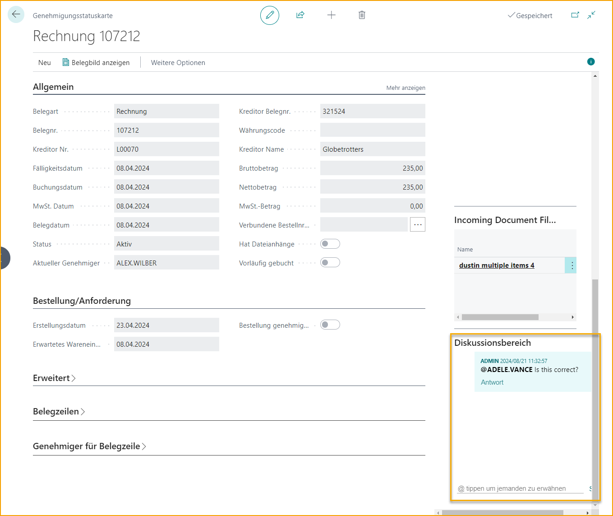

Auf ExFlow Web wird in der Inbox-Dokumentzeile @ hervorgehoben, wenn der Genehmiger im Dokument erwähnt wird. Klicken Sie auf das Dokument, um es zu öffnen, zu lesen und Kommentare zu schreiben.

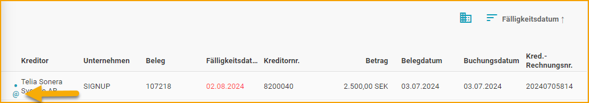

Alle Nachrichten werden auch in der Inbox angezeigt, selbst wenn der Genehmiger nicht im Genehmigungsfluss enthalten ist.

Klicken Sie auf den Link, um das Dokument zu öffnen, zu lesen und Kommentare zu schreiben.

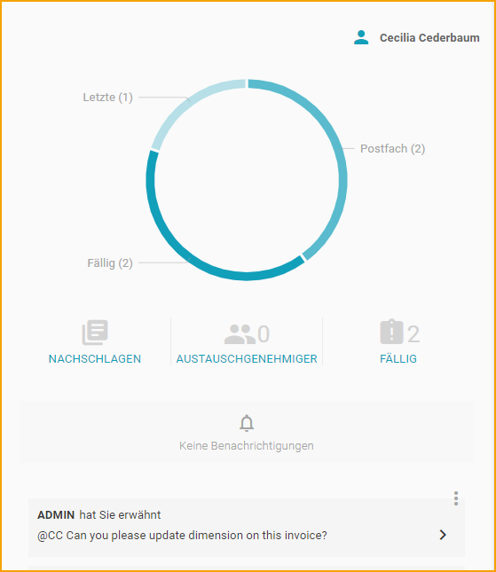

Im Dokument ist die Blase rot, wenn es ungelesene Nachrichten gibt.

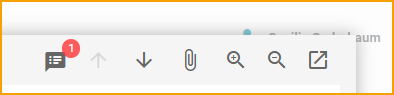

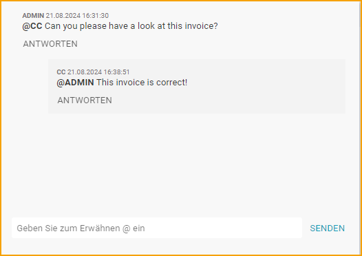

### Import Journal - Diskussionsbereich (Nachricht wird gesendet, wenn das Dokument erstellt wird)

Wenn Sie einen Kommentar im Diskussionsbereich zu einem Dokument im Import Journal hinzufügen und auf "SENDEN" klicken, kann der Kommentar in der FactBox rechts mit der ID des erstellenden Benutzers, Datum und Uhrzeit angezeigt werden.

Wenn ein Benutzer mit @ erwähnt wird, kann eine Nachricht, E-Mail oder Benachrichtigung in Business Central an ExFlow-Benutzer gesendet werden, die einem Business Central-Benutzer zugeordnet sind.

Für ExFlow-Benutzer, die keinem Business Central-Benutzer zugeordnet sind, wird die E-Mail gesendet, wenn das Dokument erstellt wird. Dies liegt daran, dass ExFlow-Webbenutzer diese Dokumente oder Kommentare im Import Journal nicht sehen können.

Lesen Sie mehr im Abschnitt [***ExFlow Users.***](https://docs.exflow.cloud/business-central/docs/user-manual/business-functionality/exflow-user#add-a-new-user-manually)

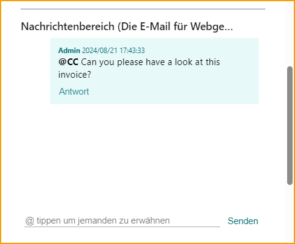

### Genehmigungsstatus - Diskussionsbereich

Wenn Sie einen Kommentar im Diskussionsbereich aus dem Genehmigungsstatus hinzufügen und auf "SENDEN" klicken, kann der Kommentar in der FactBox rechts mit der ID des erstellenden Benutzers, Datum und Uhrzeit angezeigt werden. Auf ExFlow Web wird es im Chat auf dem Dokument angezeigt.

Wenn ein Benutzer mit @ erwähnt wird, kann der Benutzer dieses Dokument und den Kommentar auf ExFlow Web sehen, auch wenn der Benutzer **nicht** im Genehmigungsfluss ist. Eine Nachricht kann auch per E-Mail gesendet werden.

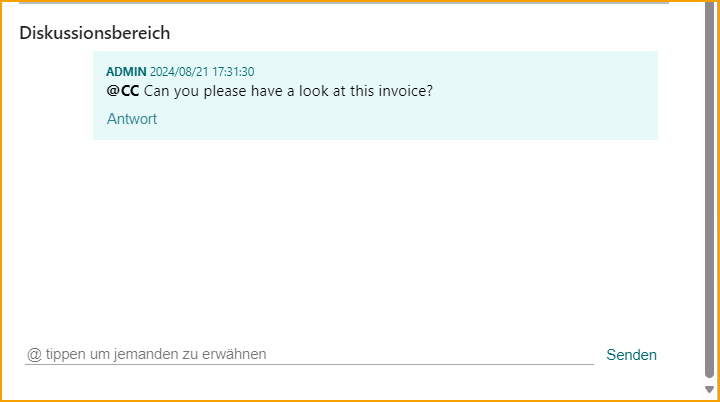

Um E-Mail-Nachrichten aus dem Diskussionsbereich zu senden, sind einige Einstellungen in ExFlow Email Setup und Job Queue Entries erforderlich.

### Gelöschte Dokumente - Diskussionsbereich

Nachrichten, die vor dem Löschen des Dokuments erstellt wurden, werden im Dokument in ExFlow Gelöschte Dokumente gespeichert.

Es ist nicht möglich, Nachrichten aus Gelöschten Dokumenten hinzuzufügen, da Gelöschte Dokumente auf ExFlow Web nicht angezeigt werden können.

### Einstellungen auf ExFlow-Benutzer

Auf der ExFlow-Benutzerkarte gibt es einige Einstellungen, die sowohl für ExFlow-Erinnerungen als auch für ExFlow-Kommentare verwendet werden.

**E-Mail:** E-Mail-Adresse eingeben

**Sprachcode:** In welcher Sprache die E-Mail gesendet wird.

**Bevorzugter Genehmigungsklient:** Wählen Sie die Umgebung für Einstellungen in Links, die in E-Mails für Nachrichten und Erinnerungen gesendet werden.

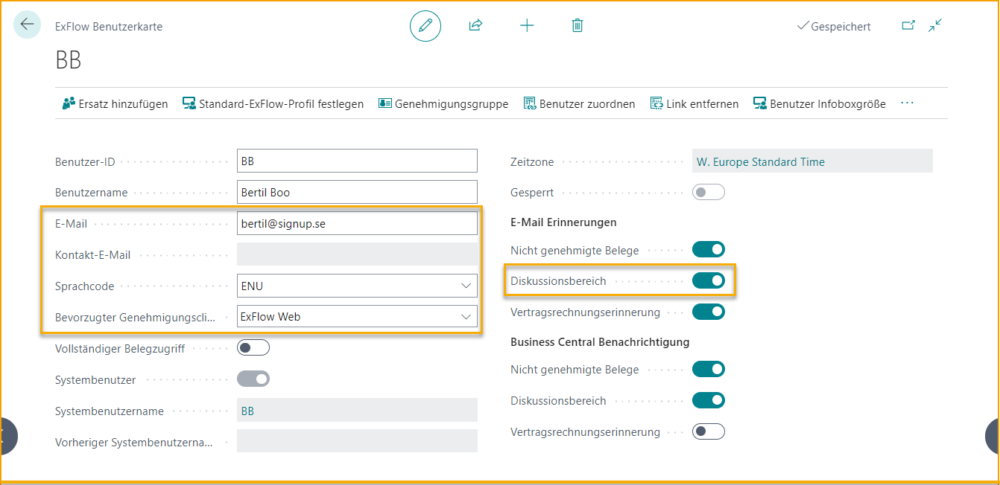

### Kommentar auf Zeilenebene

Ein Kommentar kann auf Zeilenebene auf ExFlow Web abgegeben werden, jedoch wird der Kommentar nicht im Diskussionsbereich in Business Central oder im Chat auf ExFlow Web angezeigt. Nur auf der Zeile, auf der der Kommentar hinzugefügt wurde.

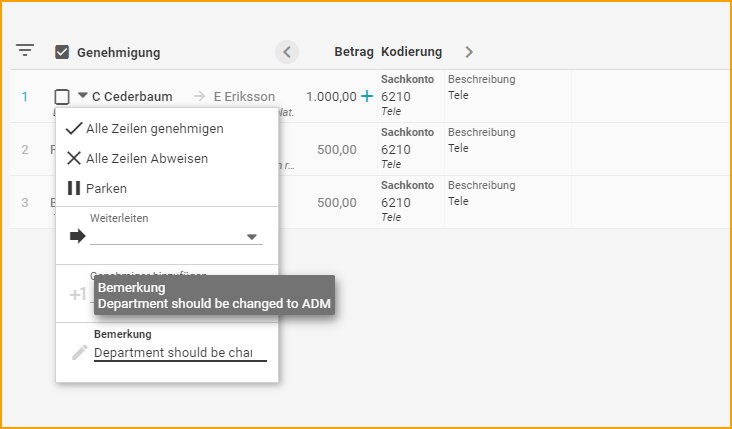

Der Kommentar wird auf Doc. Line Approvers in Business Central gefunden.

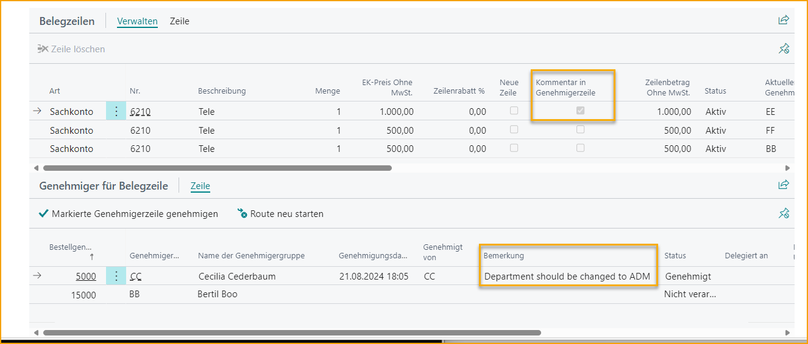
