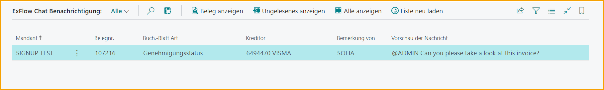

## Benachrichtigungen in Business Central
Wenn der ExFlow-Benutzer ein Systembenutzer ist (mit einem Benutzer in Business Central verknüpft), können Benachrichtigungen in Business Central aktiviert werden.  
Lesen Sie mehr im Abschnitt [***ExFlow-Benutzer***](https://docs.exflow.cloud/business-central/docs/user-manual/business-functionality/exflow-user#add-a-new-user-manually) für die Einrichtung.

Es gibt vier Arten von Benachrichtigungsnachrichten: Nicht genehmigte Dokumente im aktiven Unternehmen, nicht genehmigte Dokumente in anderen Unternehmen, ungelesene Kommentare und fehlende Rechnungen für Vertragszeiträume.
 

### Dokumente zur Genehmigung
Wenn der Benutzer Dokumente im aktuellen Unternehmen zur Genehmigung hat, klicken Sie auf den Link "Dokumente genehmigen":

Dadurch wird eine neue Seite geöffnet, auf der der Benutzer die Dokumente im aktuellen Unternehmen genehmigen kann.

Wenn der Benutzer Dokumente in anderen Unternehmen zur Genehmigung hat, klicken Sie auf den Link "Dokumente genehmigen":

Dadurch wird dem Benutzer eine Liste ähnlich der folgenden angezeigt:

Klicken Sie auf die Zahl rechts, um eine neue Seite zu öffnen, auf der der Benutzer die Dokumente im ausgewählten Unternehmen genehmigen kann.

Lesen Sie mehr dazu im Abschnitt [***Genehmigung in Business Central***](https://docs.exflow.cloud/business-central/docs/user-manual/approval-workflow/approval-in-business-central#approval-in-business-central)  

### Diskussionsbereich / Chat und Zeilenkommentare

Der Diskussionsbereich befindet sich in der FactBox in "Import Journal", "Genehmigungsstatus", "Genehmigungsverlauf" und "Gelöschte Dokumente" in Business Central.

Auf ExFlow Web wird dies als **Chat** bezeichnet.

Kommentare, die im Diskussionsbereich in Business Central oder im Chat auf ExFlow Web geschrieben werden, werden an beiden Stellen im Dokument angezeigt.

Verwenden Sie @ und "ExFlow-Benutzercode", um einen Genehmiger zu markieren. Der Genehmiger erhält automatisch Zugriff auf dieses Dokument, auch wenn der Genehmiger nicht im Genehmigungsworkflow enthalten ist. Um einen Genehmiger auf einem Dokument zu markieren, benötigt der Genehmiger Zugriff auf das Unternehmen, für das das Dokument erstellt wurde, in den ExFlow-Benutzerberechtigungen.

Es ist möglich, Benachrichtigungen und/oder E-Mails an den markierten Genehmiger zu senden, aber dafür ist eine Einrichtung erforderlich.

Für einen ExFlow-Benutzer (der mit einem "Systembenutzer" verbunden ist) können Benachrichtigungen in Business Central aktiviert werden. Lesen Sie mehr im Abschnitt [***ExFlow-Benutzer***](https://docs.exflow.cloud/business-central/docs/user-manual/business-functionality/exflow-user#add-a-new-user-manually) für die Einrichtung.

Wenn der Benutzer Kommentare im aktuellen Unternehmen lesen muss, klicken Sie auf den Link "Kommentar lesen"

Wenn der Benutzer Kommentare in anderen Unternehmen lesen muss, klicken Sie auf den Link "Kommentar lesen":

Dieser Link zeigt dem Benutzer eine Liste ähnlich der folgenden an:

Durch Klicken auf die Zahl in der rechten Spalte wird eine neue Seite geöffnet, auf der der Benutzer die Kommentare im ausgewählten Unternehmen lesen kann.

### Chat-Benachrichtigungsverlauf

Gehe zu: ***ExFlow \--\> Verlauf \--\> ExFlow Chat-Benachrichtigungsverlauf***

Ein ExFlow-Benutzer kann ExFlow Chat-Benachrichtigungen anzeigen, in denen der Benutzer in den letzten 90 Tagen markiert wurde.

Doppelklicken Sie auf die Nachricht oder "Dokument anzeigen", um eine neue Nachricht auf demselben Dokument zu verfassen.

In der "Chat-Benachrichtigungsliste" werden alle neuen ungelesenen Nachrichten fett angezeigt.

**Unternehmen:** Das Unternehmen, in dem das Dokument erstellt wurde, in dem der Benutzer erwähnt wird.

**Beschreibung:** Art des Dokuments und Dokumentennummer.

**Kommentar von:** Wer den Kommentar geschrieben hat.

**Lieferantennummer:** Zahlungsempfänger-Lieferantennummer für das Dokument.

**Hinweis:** Vorschau. Öffnen Sie das Dokument, um die gesamte Nachricht zu lesen.

**Letztes Benachrichtigungsdatum:** Datum, an dem der Benutzer zuletzt in Bezug auf das Dokument erwähnt wurde.

*Screenshot -- ExFlow Chat-Benachrichtigungsliste*

**Dokument anzeigen:** Dokument öffnen, um die gesamte Nachricht zu lesen und eine Nachricht zu senden.

**Ungelesene anzeigen:** Nur ungelesene Nachrichten anzeigen.

**Alle anzeigen:** Alle Nachrichten der letzten 60 Tage anzeigen.

**Liste aktualisieren:** Aktualisieren, um neue Nachrichten anzuzeigen.

**In Excel öffnen:** Liste an Excel senden.

Alle Nachrichten im Chat werden im Diskussionsfenster FactBox angezeigt.

Auf ExFlow Web wird in der Eingangsliste die Dokumentenzeile @ für ungelesene Nachrichten hervorgehoben, wenn der Genehmiger im Dokument erwähnt wird. Klicken Sie auf das Dokument, um es zu öffnen, zu lesen und Kommentare zu schreiben.

Alle Nachrichten werden auch im Posteingang angezeigt, selbst wenn der Genehmiger nicht im Genehmigungsworkflow enthalten ist.

Klicken Sie auf den Link, um das Dokument zu öffnen, zu lesen und Kommentare zu schreiben.

Auf dem Dokument ist die Sprechblase rot, wenn ungelesene Nachrichten vorhanden sind.

### Import Journal - Diskussionsfenster (Nachricht wird gesendet, wenn das Dokument erstellt wird)

Wenn Sie einen Kommentar im Diskussionsfenster zu einem Dokument im Import Journal hinzufügen und auf "SENDEN" klicken, wird der Kommentar in der FactBox rechts markiert mit der Benutzer-ID, dem Datum und der Uhrzeit des Erstellens angezeigt.

Wenn ein Benutzer mit @ erwähnt wird, kann eine Nachricht, E-Mail oder Benachrichtigung in Business Central an ExFlow-Benutzer gesendet werden, die mit einem Business Central-Benutzer verknüpft sind. 
Lesen Sie mehr im Abschnitt [***ExFlow-Benutzer***](https://docs.exflow.cloud/business-central/docs/user-manual/business-functionality/exflow-user#add-a-new-user-manually)

Für ExFlow-Benutzer, die nicht mit einem Business Central-Benutzer verknüpft sind, wird die E-Mail gesendet, wenn das Dokument erstellt wird. Dies liegt daran, dass ExFlow Web-Benutzer diese Dokumente oder Kommentare im Import Journal nicht sehen können.

### Genehmigungsstatus - Diskussionsfenster

Wenn Sie einen Kommentar im Diskussionsfenster vom Genehmigungsstatus hinzufügen und auf "SENDEN" klicken, wird der Kommentar in der FactBox rechts markiert mit der Benutzer-ID, dem Datum und der Uhrzeit des Erstellens angezeigt. Auf ExFlow Web wird er im Chat auf dem Dokument angezeigt.

Wenn ein Benutzer mit @ erwähnt wird, kann der Benutzer dieses Dokument und den Kommentar auf ExFlow Web sehen, auch wenn der Benutzer nicht im Genehmigungsworkflow enthalten ist. Eine Nachricht kann auch per E-Mail gesendet werden.

Um E-Mail-Nachrichten aus dem Diskussionsfenster zu senden, sind einige Konfigurationen in ExFlow E-Mail-Setup und Job Queue Entries erforderlich.

### Gelöschte Dokumente - Diskussionsfenster

Vor dem Löschen des Dokuments erstellte Nachrichten werden im ExFlow Deleted Documents auf dem Dokument gespeichert.

Es besteht keine Möglichkeit, eine Nachricht aus den gelöschten Dokumenten hinzuzufügen, da die gelöschten Dokumente auf ExFlow Web nicht sichtbar sind.

### Einstellungen für ExFlow-Benutzer

Auf der ExFlow-Benutzerkarte gibt es einige Einstellungen, die sowohl für ExFlow-Erinnerungen als auch für ExFlow-Kommentare verwendet werden.

**E-Mail:** E-Mail-Adresse eingeben

**Sprachcode:** In welcher Sprache die E-Mail gesendet wird.

**Bevorzugter Genehmigungsclient:** Umgebung für Einstellungen in Links auswählen, die in E-Mails für Nachrichten und Erinnerungen gesendet werden.

### Kommentar auf Zeilenebene

Ein Kommentar kann auf ExFlow Web auf Zeilenebene abgegeben werden, jedoch wird der Kommentar weder im Diskussionsfenster in Business Central noch im Chat auf ExFlow Web angezeigt. Nur auf der Zeile, auf der der Kommentar hinzugefügt wurde.

Der Kommentar wird in den Dokumentzeilen-Genehmigern in Business Central gefunden.

