## Genehmigung in Business Central
Gehe zu: **ExFlow Genehmigungsdokumente**  

Business Central-Systembenutzer können ExFlow-Dokumente auch in *ExFlow Genehmigungsdokumente* genehmigen.   
Abhängig von den Einstellungen der ExFlow-Benutzer werden Benachrichtigungen auf der Rollencenter-Seite angezeigt, wenn ein Benutzer Dokumente zur Genehmigung hat. Wenn ein Benutzer dann auf *Genehmigen Sie die Dokumente* klickt, wird der Benutzer zur Seite ExFlow Genehmigungsdokumente weitergeleitet.

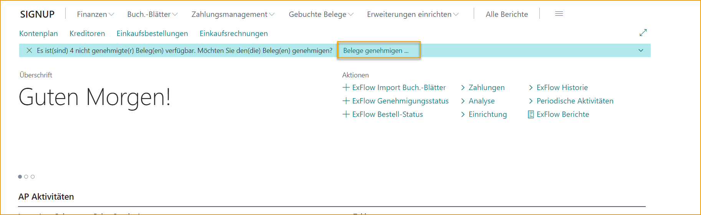

Auf dieser Seite wird die Liste standardmäßig unter „Zu genehmigen“ gefiltert, sodass der Benutzer leicht alle eigenen aktuellen Dokumente zur Genehmigung anzeigen kann.

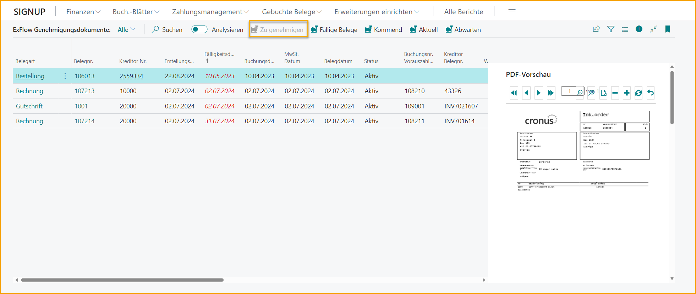

Der Benutzer kann auch alle fälligen Dokumente / bevorstehenden Dokumente / aktuellen Dokumente und alle aktuellen Dokumente des Benutzers in der Warteschleife anzeigen.

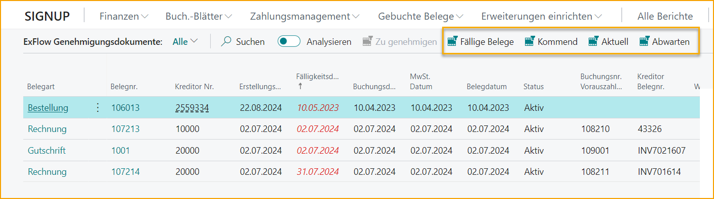

Klicken Sie auf den „Dokumenttyp“ oder die „Dokumentnummer“, um die Dokumentgenehmigungskarte zu öffnen.

Der Benutzer kann die Dokumentzeilen validieren. Wenn keine Fehler auftreten und das Dokument korrekt ist, kann der Benutzer das Dokument genehmigen. Wenn das Dokument falsch ist, kann der Benutzer „Ablehnen“ wählen.

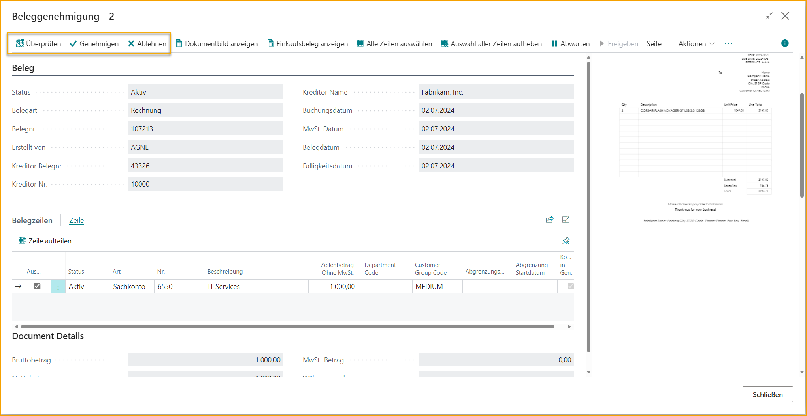

#### Kodierung ändern

Gehen Sie unter *Dokumentzeilen*, um alle notwendigen Änderungen vorzunehmen, falls vorhanden. Dies kann das Ändern des Kontos, das Hinzufügen von Dimensionen usw. umfassen.

Im folgenden Beispiel müssen wir die Kodierung ändern, indem wir die Zeile aufteilen.

Gehen Sie unter *Dokumentzeilen --> Zeile --> Zeile aufteilen*, um einen Betrag einzugeben, wählen Sie Typ: Sachkonto und das entsprechende Sachkonto aus.

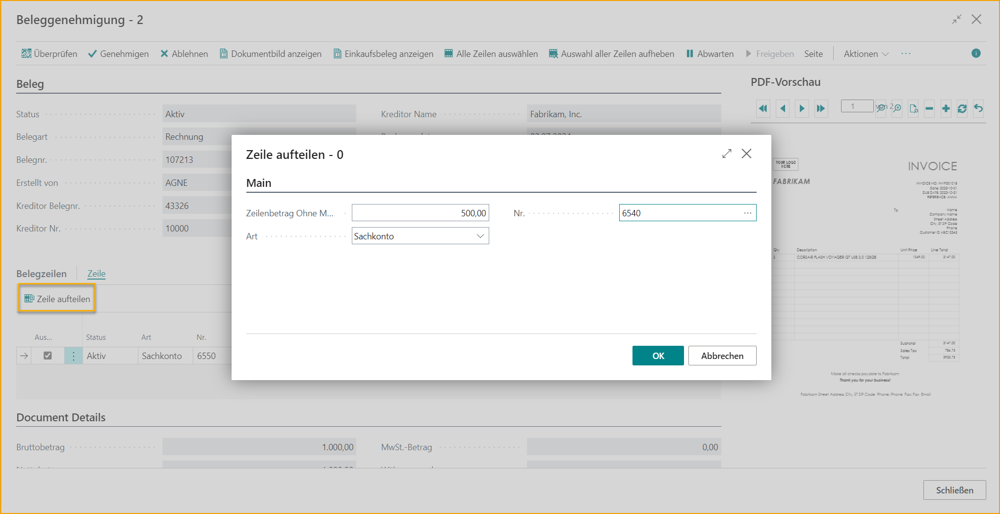

Klicken Sie auf OK, wenn die Änderungen abgeschlossen sind, und genehmigen Sie das Dokument.

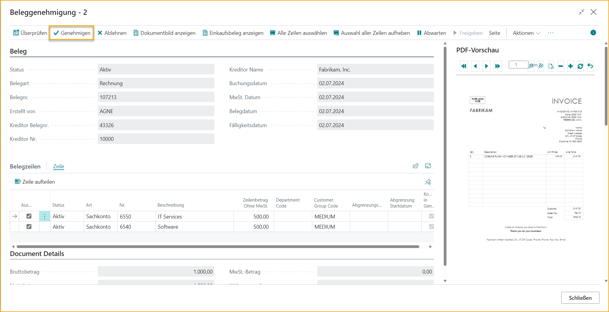

Eine Bestätigungsmeldung wird für das genehmigte Dokument angezeigt.

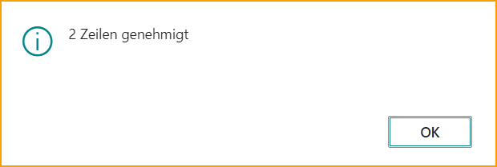

Das genehmigte Dokument kann nun unter „Aktuell“ gefunden werden.

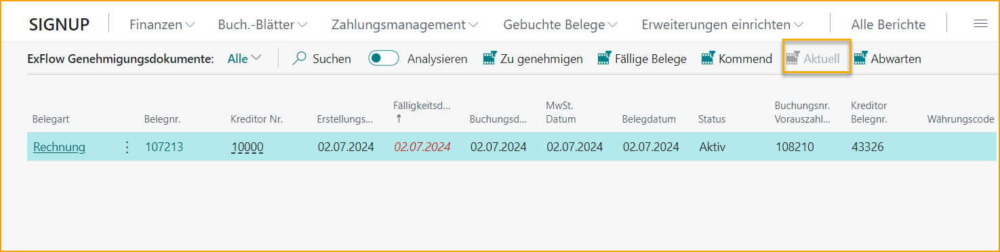

Ähnlich wie im Web ist es möglich, das Dokument an einen anderen Genehmiger weiterzuleiten oder einen Genehmiger in den Ablauf einzufügen.

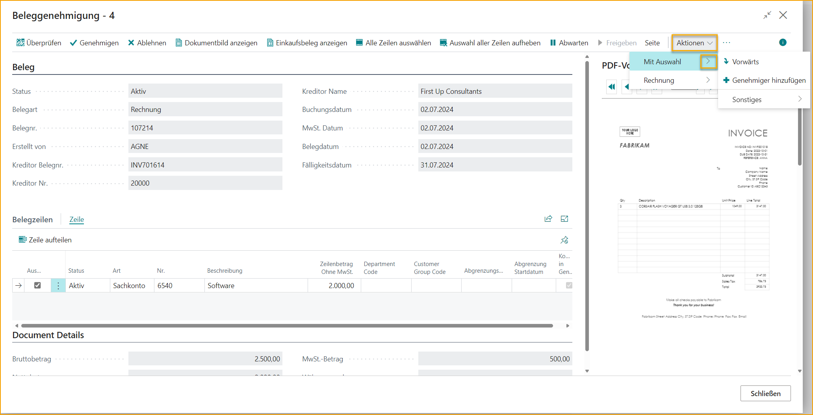

Der gleiche Prozess gilt, wenn es darum geht, ein Dokument abzulehnen oder in die Warteschleife zu stellen. Unabhängig von der Aktion muss der Benutzer einen Kommentar hinzufügen, um fortzufahren.

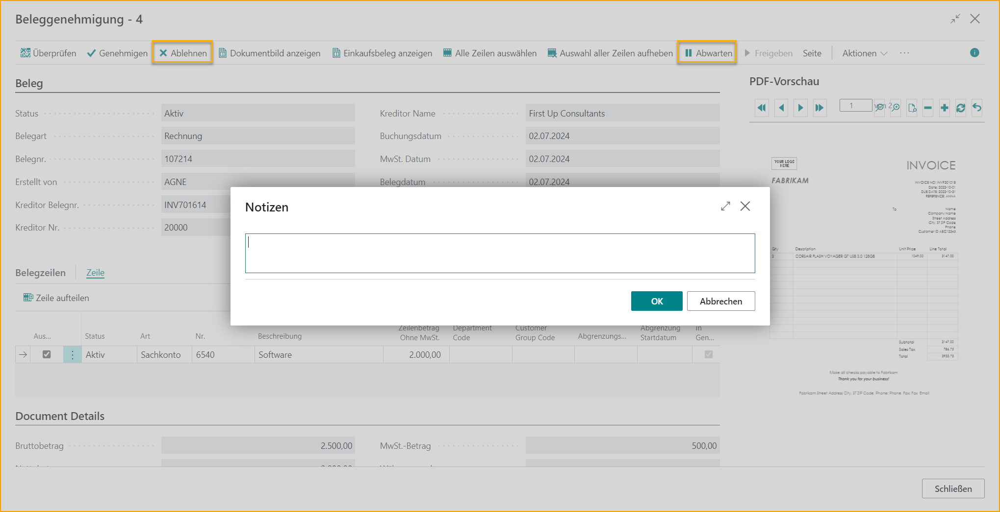

#### Bestellinformationen anzeigen
Erweitern Sie das FactBox, um den Einkäufer oder andere Informationen zum Dokument aus der Dokumentgenehmigungskarte zu finden.

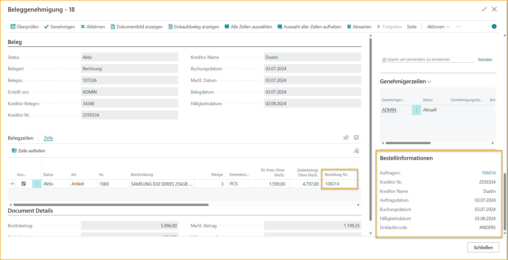

Unter dem FactBox ist es auch möglich, das Diskussionsfeld zu nutzen, um wie gewohnt mit anderen Genehmigern zu kommunizieren.

