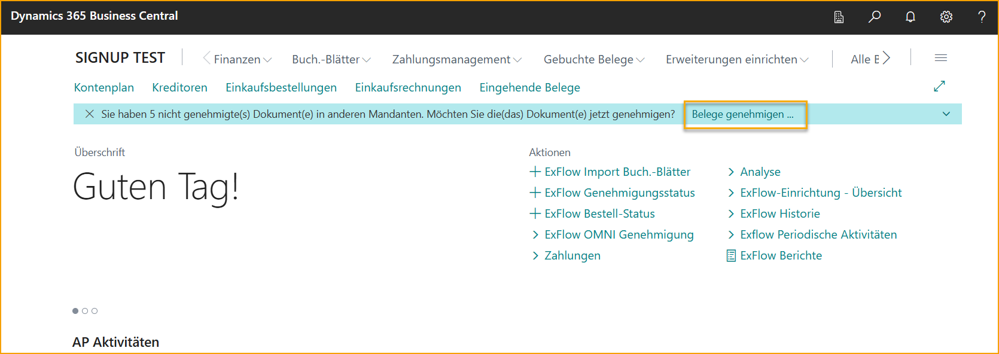

## Genehmigung in Business Central
Gehe zu: **ExFlow Genehmigungsdokumente**  

Auch Benutzer des Business Central-Systems können ExFlow-Dokumente in den *ExFlow Genehmigungsdokumenten* genehmigen.   
Abhängig von den Einstellungen der ExFlow-Benutzer werden Benachrichtigungen auf der Rollencenter-Seite angezeigt, wenn ein Benutzer Dokumente zur Genehmigung hat. Wenn ein Benutzer dann auf *Dokumente genehmigen* klickt, wird er zur Seite ExFlow Genehmigungsdokumente weitergeleitet.
 
 

Auf dieser Seite wird die Liste standardmäßig nach "Zur Genehmigung" gefiltert, sodass der Benutzer alle seine eigenen aktuellen Dokumente zur Genehmigung anzeigen kann. 
 
 

Der Benutzer kann auch alle fälligen Dokumente, zukünftigen Dokumente, kürzlich bearbeiteten Dokumente und alle aktuellen Dokumente des Benutzers anzeigen, die sich in Wartestellung befinden.  
 
 

Klicken Sie auf den "Dokumenttyp" oder die "Dokumentennummer" des Dokuments, um die Dokumentgenehmigungskarte zu öffnen. 

Der Benutzer kann die Dokumentzeilen überprüfen. Wenn kein Fehler angezeigt wird und das Dokument korrekt ist, kann der Benutzer das Dokument genehmigen. Wenn das Dokument nicht korrekt ist, kann der Benutzer es ablehnen.
 
 

#### Ändern der Codierung 

Gehen Sie zu den *Dokumentzeilen*, um alle erforderlichen Änderungen vorzunehmen, falls erforderlich. Dies kann das Ändern des Kontos, das Hinzufügen von Dimensionen usw. umfassen. 

Im folgenden Beispiel müssen wir die Codierung durch Aufteilen der Zeile ändern. 

Gehen Sie zu *Dokumentzeilen --> Zeile --> Zeile aufteilen*, um einen Betrag einzugeben, wählen Sie den Typ: G/L-Konto und das entsprechende G/L-Konto aus. 
 
 

Klicken Sie auf OK, wenn die Änderungen abgeschlossen sind, und genehmigen Sie das Dokument.
 
 

Es wird eine Bestätigungsnachricht für das genehmigte Dokument angezeigt.
 
 

Das genehmigte Dokument kann jetzt unter "Kürzlich" gefunden werden.
 
 

Ähnlich wie im Web ist es möglich, das Dokument an einen anderen Genehmiger weiterzuleiten oder einen Genehmiger in den Workflow aufzunehmen.
 
 

Der gleiche Prozess gilt für Ablehnung oder das Zurückstellen eines Dokuments. Unabhängig von der Aktion muss der Benutzer einen Kommentar hinzufügen, um fortzufahren. 
 
 

#### Bestellinformationen anzeigen 
Erweitern Sie die FactBox, um den Käufer oder andere Informationen zum Dokument aus der Dokumentgenehmigungskarte zu finden.
 
 

Unter der FactBox ist es auch möglich, das Diskussionsfeld zu nutzen, um wie gewohnt mit anderen Genehmigern zu kommunizieren.
