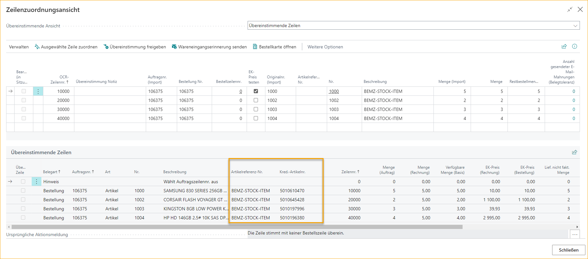

## ExFlow Journale importieren

Gehe zu: ***ExFlow Journale importieren***

Ein "ExFlow Import Journal" wird verwendet, um Dokumente zu importieren, Codierung anzuwenden, Aktionen zu verarbeiten und Rechnungen/Gutschriften zur Genehmigung zu erstellen. Nach dem Scannen und Interpretieren der gescannten Dokumente werden Dateien erstellt und bereit zum Importieren.

Von der Liste der ExFlow Journale importieren aus können Sie suchen, ein neues Journal erstellen, aktuelle Journalzeilen bearbeiten und Journale löschen. Benutzer können auch Dokumente stapelweise importieren, Rechnungen und Gutschriften stapelweise erstellen, die OCR-Importwarteschlange bearbeiten/anzeigen, E-Mail-Empfangserinnerungen senden und Journale stapelweise überprüfen.

### Dokumente stapelweise aus Interpretation importieren
Gehe zu: ***Startseite --> Dokumente stapelweise importieren*** 
Dokumentenbilder und die interpretierten Daten werden importiert.

Abhängig von den Journaleinstellungen werden die Dokumente in verschiedene Journale aufgeteilt.

Ein Journal mit der Einstellung "Nur Bestellungsübereinstimmende Dokumente" markiert, erhält bestellungsübereinstimmende Dokumente und Dokumente mit Bestellnummer-Informationen. Es gibt andere Möglichkeiten, die Dokumente zu trennen, aber eine Trennung in Ausgaben-/Einkaufsrechnungen ist sehr üblich.

Die gleiche Einstellung kann für "Zeilen mit automatischem Vorschlag erstellen" vorgenommen werden. Markieren Sie das Kästchen "Zeilen mit automatischem Vorschlag erstellen", wenn der ExFlow Automatische Codierungsvorschlag für ein bestimmtes Journal angewendet werden soll.

Lesen Sie mehr dazu im Abschnitt **"ExFlow Auto Codierungsvorschlag".**

In den Journalen gibt es für jedes importierte OCR-Dokument einen Dokumentkopfdatensatz. "Importzeilen" im unteren Bereich sind Zeilendetails für jedes Dokument.

Darüber hinaus ist es möglich, ein spezielles Journal für die automatische Erstellung von Dokumenten einzurichten. Verwenden Sie Personalisieren und fügen Sie die Spalte "Automatisch Dokumente erstellen" zur Liste der ExFlow Journale importieren hinzu.

Aktivieren Sie dieses Kästchen, wenn interpretierte Dokumente automatisch aus dem ExFlow Import Journal erstellt werden sollen. Mit dieser Funktion werden alle interpretierten importierten Dokumente (ohne Fehler- oder Warnmeldungen) automatisch erstellt und zur Genehmigung gesendet.

Importieren und eine Meldung zeigt an, wie viele empfangene/importierte Dokumente und die Anzahl der automatisch erstellten Dokumente.

Diese Einstellung kann auch nur auf bestimmte Lieferanten angewendet werden. Lesen Sie mehr dazu im Abschnitt **Lieferanteneinrichtung**.

### ExFlow Data Capture
Gehe zu: ***Aktionen --> Importieren --> ExFlow Data Capture***

Klicken Sie auf "ExFlow Data Capture", um zur Website zu gelangen. Dies funktioniert nur, wenn das Unternehmen mit einem ExFlow Data Capture-Konto verbunden ist.

### Importiertes Dokument löschen
Gehe zu: ***Verwalten --> Löschen*** 
Wenn das Dokument in das ExFlow Import Journal importiert wurde, kann es gelöscht werden. Dann wird kein Einkaufsdokument erstellt.

### Anzeigen der ExFlow Import Dokumentenkarte
Gehe zu: ***Verwalten --> Karte*** 
Öffnen Sie die ExFlow Import Dokumentenkarte für das ausgewählte Dokument.

### Dokumentstatistiken
Gehe zu: ***Verwalten --> Statistiken (F7)*** 
Statistische Informationen über das ausgewählte Dokument anzeigen.

### Dokumente importieren
Gehe zu: ***Startseite --> Dokumente importieren*** 
Um Dokumente in ein ausgewähltes Journal zu importieren, öffnen Sie das Journal und importieren Sie die Dokumente.

### Dokument überprüfen
Gehe zu: ***Startseite --> Dokument überprüfen (Strg+R)*** 
Ein (oder mehrere) Dokument(e) zur Überprüfung über "Dokument überprüfen" auswählen. Diese Funktion überprüft, ob das Dokument bereit zur Erstellung ist.

### Stapelweise Dokumente überprüfen
Gehe zu: ***Startseite --> Stapelweise Dokumente überprüfen*** 
Nachdem ein Fehler korrigiert wurde, wird diese Funktion eine Aktion löschen oder erstellen, wenn ein Dokument immer noch einen Fehler aufweist.

### Automatischer Codierungsvorschlag - Manuelle Auswahl
Gehe zu: ***Startseite --> Automatischer Codierungsvorschlag - Manuelle Auswahl*** 
Öffnet die Liste der automatischen Codierungsvorschläge für das ausgewählte Dokument.

Die manuelle Auswahl bietet die Möglichkeit, durch verschiedene Codierungssatz-IDs zu navigieren und manuell einen Codierungsvorschlag auszuwählen.

#### ExFlow Codierungsvorschlag für Import Journal - Manuelle Auswahl
Auf dieser Seite wird die beste Übereinstimmung für die Codierung der zuvor ausgewählten Rechnung angezeigt, bevor der Button zum manuellen Auswahl des Codierungsvorschlags gedrückt wurde. In der rechten oberen Ecke ist die Codierung aus den ausgewählten Codierungsvorschlagszeilen für diese spezifische Setup-ID sichtbar.

**Codierungssatz-ID anwenden:** Damit wird die in der rechten oberen Ecke angezeigte Codierung auf die Rechnung angewendet.

**Dokumentzeilen anzeigen**: Öffnet die Seite "ExFlow Codierungsvorschlag Dokument". Lesen Sie mehr dazu im Abschnitt **Codierungsvorschlag Dokument**.

**Alle anzeigen:** Zeigt alle Setup-IDs an, um manuell eine vorgeschlagene Codierung für z.B. einen anderen Lieferanten auszuwählen.

**Ersten Vorschlag anzeigen:** Geht zurück zum ersten Vorschlag, der beim ersten Öffnen der Seite angezeigt wurde.

#### ExFlow Codierungsvorschlag Dokument

Auf dieser Seite wird die Codierung detaillierter angezeigt. Es ist auch möglich, die vorgeschlagenen Zeilen mit den aktuellen Zeilen auf der Rechnung zu vergleichen.

**Vorgeschlagene Codierung anwenden:** Damit wird die vorgeschlagene Codierung auf die Rechnung angewendet.

**Neueste Codierung vorschlagen**: Damit wird die Codierung des zuletzt gebuchten Dokuments von diesem Lieferanten vorgeschlagen.

**Vorausgewählte Codierung vorschlagen**: Damit wird die Codierung vorgeschlagen, die als Auswahl im vorherigen Fenster festgelegt wurde.

**Automatische Codierung vorschlagen:** Damit wird die automatische Codierung basierend auf der automatischen Vorschlagseinrichtung vorgeschlagen.

### Automatischer Codierungsvorschlag - Automatisch
Gehe zu: ***Startseite --> Automatischer Codierungsvorschlag - Automatisch*** 
Wendet die vom Vorschlagsalgorithmus gewählte Zeilencodierung an.

Damit wird eine Codierung basierend auf den Informationen auf der Rechnung eingegeben. Die Codierung wird anhand der automatischen Codierungseinrichtung ausgewählt.

### VAT-Produktbuchungsgruppe aktualisieren
Gehe zu: ***Startseite --> VAT-Produktbuchungsgruppe aktualisieren*** 
Diese Funktion kann nur zusammen mit Kunden verwendet werden, die SweBase installiert haben.

Aufgrund der schwedischen Steuervorschriften für IT-Mehrwertsteuer ist es möglich, alle VAT-Produktbuchungsgruppen in Rechnungszeilen zu aktualisieren.

Lesen Sie mehr dazu im Abschnitt **SweBase** und **VAT-Produktbuchungsgruppe aktualisieren**.

### PDF-Viewer in neuem Tab öffnen
Gehe zu: ***Startseite --> PDF-Viewer in neuem Tab öffnen*** 
Öffnet das PDF in einem neuen Tab.

### Lieferantenkarte öffnen
Gehe zu: ***Startseite --> Lieferantenkarte*** 
Öffnet die Lieferantenkarte für das spezifische Dokument.

### Bild importieren oder ersetzen
Gehe zu: ***Startseite --> Bild importieren oder ersetzen*** 
Importiert oder ersetzt das aktuelle Dokumentenbild.

### Rechnungen/Gutschriften im Batch erstellen
Gehe zu: ***Erstellen --> Rechnungen/Gutschriften im Batch erstellen*** 
Dies führt sowohl die Stapelprüfung der Dokumente als auch die Erstellung von Einkaufsrechnungen und Gutschriften für alle Dokumente in diesem Journal durch, die keine Aktionsnachricht haben.

Um das Buchungsdatum auf allen Dokumenten zu aktualisieren, fügen Sie ein neues Datum im Feld Buchungsdatum hinzu und aktivieren Sie "Buchungsdatum ersetzen".

Wenn die Verwendung des Umsatzsteuerdatums aktiviert ist und das Standard-Umsatzsteuerdatum das Buchungsdatum in der Allgemeinen Buchhaltung ist, wird "Umsatzsteuerdatum ersetzen" automatisch als Vorschlag aktiviert.

Wenn ein oder mehrere Dokumente einen Abgrenzungsposten haben, wenn das Buchungsdatum ersetzt wird, wird die folgende Frage angezeigt.

Wählen Sie **Ja**, um das Abgrenzungsstartdatum gemäß den Einstellungen des Abgrenzungspostens für alle Dokumentzeilen zu aktualisieren. 
Wählen Sie **Nein**, um das Abgrenzungsstartdatum beizubehalten, wie es bei allen Dokumentzeilen erstellt wurde.

### Rechnung/Gutschrift erstellen
Gehe zu: ***Erstellen --> Rechnung/Gutschrift erstellen (F9)*** 
Stehen Sie auf der ausgewählten Dokumentzeile und klicken Sie auf "Rechnung/Gutschrift erstellen", um ein Dokument zu erstellen oder verwenden Sie die Tastenkombination F9.

Es besteht auch die Möglichkeit, mehrere Dokumente auszuwählen, die erstellt werden sollen. Verwenden Sie "Mehr auswählen", um die Dokumente auszuwählen.

Und klicken Sie einfach auf "Rechnung/Gutschrift erstellen", um die ausgewählten Dokumente zu erstellen.

### Zeilen aus Excel importieren
Gehe zu: ***Aktionen --> Importieren --> Importvorlage für Zeilen herunterladen / Zeilen aus Excel importieren*** 
Manchmal ist es einfacher, in Excel zu arbeiten, wenn die Rechnung mehrere Zeilen enthält.

Beginnen Sie mit dem "Herunterladen der Importvorlage für Zeilen".

Ändern, hinzufügen und/oder löschen Sie Zeilen in Excel, speichern Sie sie und verwenden Sie die Funktion "Zeilen aus Excel importieren".

#### Kopieren/Einfügen von Zeilen
Es ist möglich, eine Zeile aus einem anderen Dokument oder aus Excel zu kopieren und in das Importjournal einzufügen. Diese Funktion funktioniert genauso wie in Business Central Standard.

### Aktuellste Codierung vom Lieferanten abrufen
Gehe zu: ***Aktionen --> Importieren --> Aktuellste Codierung vom Lieferanten abrufen*** 
Diese Funktion findet die zuletzt gebuchte Rechnung und kopiert Zeilen mit dem Sachkonto.

### ExFlow Data Capture
Gehe zu: ***Aktionen --> Importieren --> ExFlow Data Capture*** 
Diese Funktion öffnet die Webseite "ExFlow Data Capture" (wenn das Unternehmen mit ExFlow Data Capture verbunden ist).

### Codierung beim Lieferanten speichern
Gehe zu: ***Aktion --> Funktionen --> Codierung beim Lieferanten speichern*** 
Verwenden Sie diese Funktion, um die aktuelle Codierung der Rechnungszeilen in einen ExFlow Purchase Code zu speichern, der in der Lieferantenkarte gespeichert wird.

### Ausgewählte Dokumente in ein anderes Unternehmen übertragen
Gehe zu: ***Aktion --> Funktionen --> Ausgewählte Dokumente in ein anderes Unternehmen übertragen*** 
Wenn die Business Central-Datenbank mehr als ein Unternehmen enthält, kann ein Dokument vor der Erstellung in ein anderes Unternehmen verschoben werden.

### Ausgewählte Dokumente in einen anderen Stapel übertragen
Gehe zu: ***Aktion --> Funktionen --> Ausgewählte Dokumente in einen anderen Stapel übertragen*** 
Wenn das Business Central-Unternehmen mehr als ein ExFlow Import Journal hat, kann ein Dokument vor der Erstellung in ein anderes Journal verschoben werden.

### Stapelaktualisierung des Buchungsdatums
Gehe zu: ***Aktion --> Funktionen --> Stapelaktualisierung des Buchungsdatums*** 
Mit dieser Funktion ist es möglich, das Buchungsdatum für Dokumente in einem ausgewählten Journal innerhalb des Filters zu aktualisieren.

### OCR-Importwarteschlange bearbeiten/anzeigen
Gehe zu: ***Aktion --> Funktionen --> OCR-Importwarteschlange bearbeiten/anzeigen*** 
Verwenden Sie diese Funktion, um die OCR-Importwarteschlange anzuzeigen oder zu bearbeiten. Korrigieren Sie Dokumente, die falsche Informationen enthalten, die eine Importierung verhindern.

### Bestellung - OCR-Zeilen abgleichen
Gehe zu: ***Aktionen --> Bestellung --> OCR-Zeilen abgleichen*** 
Gleichen Sie Dokumentzeilen mit Bestell(en) ab.

Bei Verwendung dieser Funktion sammelt ExFlow Informationen aus Bestellung und Wareneingang usw.

Um das manuelle Abgleichen von Zeilen zu erleichtern, ist es möglich, die Seite "Line Matching View" zu personalisieren und Felder wie "Artikelreferenznummer" und "Lieferantenartikelnummer" hinzuzufügen.

### Bestellung - Wareneingang/Rücksendung/Bestellzeilen abrufen
Gehe zu: ***Aktionen --> Bestellung --> Wareneingang/Rücksendung/Bestellzeilen abrufen*** 
Mit dieser Schaltfläche werden Bestell-/Wareneingangszeilen abgerufen und dem ausgewählten Dokument hinzugefügt.

Lesen Sie mehr im Abschnitt **Bestellabgleich auf Header-Ebene**.

### Stapelweise Senden von Zahlungserinnerungen
Gehe zu: ***Aktionen --> E-Mail --> Stapelweise Senden von Zahlungserinnerungen*** 
Mit dieser Funktion werden E-Mails an Benutzer gesendet, die Zahlungserinnerungen für neue Dokumente erhalten sollen. Wenn der Wert des Käufercodes im Importjournal leer ist, wird eine Erinnerung an den Einkaufskoordinator gesendet. Wenn ein Käufercode vorhanden ist, wird die Erinnerung an den verbundenen ExFlow-Benutzer gesendet.

### Stapelweise Senden aller Zahlungserinnerungen
Gehe zu: ***Aktionen --> E-Mail --> Stapelweise Senden aller Zahlungserinnerungen*** 
Mit diesem Button werden E-Mails bezüglich Zahlungserinnerungen ohne Einschränkungen von Zeitstempeln früher gesendeter Erinnerungen gesendet.

### Senden von Zahlungserinnerungen für ausgewählte Dokumente
Gehe zu: ***Aktionen --> E-Mail --> Senden von Zahlungserinnerungen für ausgewählte Dokumente*** 
Mit diesem Button werden Zahlungserinnerungen nur für ausgewählte Dokumente gesendet. Erinnerungen werden jederzeit gesendet, unabhängig davon, wann die letzte Erinnerung für das/die Dokument(e) gesendet wurde.

### E-Mail-Protokoll anzeigen
Gehe zu: ***Aktionen --> E-Mail --> E-Mail-Protokoll anzeigen*** 
Dieser Button zeigt ein E-Mail-Protokoll der gesendeten Zahlungserinnerungen an.

#### Einträge älter als 30 Tage löschen
Gehe zu: ***ExFlow Email Logs --> Aktion --> Einträge älter als 30 Tage löschen*** 
Mit diesem Button können alle Protokolleinträge älter als 30 Tage gelöscht werden.

#### Alle Einträge löschen
Gehe zu: ***ExFlow Email Logs --> Aktion --> Alle Einträge löschen*** 
Mit diesem Button können alle Protokolleinträge von gesendeten Quittungen gelöscht werden.

#### Fehlermeldung anzeigen
Gehe zu: ***ExFlow Email Logs --> Aktion --> Fehlermeldung anzeigen*** 
Dieser Button zeigt an, ob Fehlermeldungen in Bezug auf den Versand von Zahlungserinnerungen vorliegen.

#### Alle anzeigen
Gehe zu: ***ExFlow Email Logs --> Aktion --> Alle anzeigen*** 
Mit diesem Button werden alle Aufzeichnungen des E-Mail-Protokolls angezeigt. Die Aufzeichnungen bestehen aus einem E-Mail-Typ, Dokumentennummer, Empfängeradresse, Absender, Erstellungsdatum und Fehlermeldung.

### Vorschau auf vorläufige Buchung
Gehe zu: ***Aktionen --> Vorläufige Buchung --> Vorschau auf Buchung*** 
Dies kann nur verwendet werden, wenn die vorläufige Buchung aktiviert ist.  
Lesen Sie mehr im Abschnitt [***Vorläufige Buchung***](https://docs.exflow.cloud/business-central/docs/user-manual/business-functionality/preliminary-posting)

### Vertrag erstellen
Gehe zu: ***Aktionen --> Vertrag --> Vertrag erstellen*** 
Wenn eine Rechnung interpretiert wird und eine Codierung im Header für wiederkehrende Rechnungen hinzugefügt wird, verwenden Sie diese Funktion, um einen Vertrag zu erstellen.
Felder im Rechnungskopf, die in den neu erstellten Vertrag kopiert werden:
* Lieferantennummer
* Verweis auf externe Vertragsnummer
* ExFlow-Einkaufscode
* Erster Genehmiger
* Genehmigungsregel
* Käufercode

Um die Einrichtung des Vertrags abzuschließen, lesen Sie mehr im Abschnitt [***Vertrag***](https://docs.exflow.cloud/business-central/docs/user-manual/business-functionality/contract)

### Bestellkarte
Gehe zu: ***Verwandt --> Dokument --> Bestellkarte*** 
Dieser Button öffnet die verbundene Bestellkarte für das ausgewählte Dokument.

### Vertrag anzeigen
Gehe zu: ***Verwandt --> Dokument --> Vertrag anzeigen*** 
Öffnet den verbundenen ExFlow-Vertrag für das ausgewählte Dokument.

### Dimensionen
Gehe zu: ***Verwandt --> Dokument --> Dimensionen*** 
Zeigt die auf dem ausgewählten Dokument festgelegten Dimensionen an.

### Lieferanten-Bankkonto anzeigen
Gehe zu: ***Verwandt --> Dokument --> Lieferanten-Bankkonto*** 
Dieser Button zeigt das bevorzugte Bankkonto des Lieferanten an. Wenn es nicht vorhanden ist, wird die Liste der Lieferanten-Bankkonten für den spezifischen Lieferanten angezeigt.

### Importdetails anzeigen (OCR)
Gehe zu: ***Verwandt --> Dateien --> Importdetails anzeigen (OCR)*** 
Um die interpretierten Daten anzeigen zu können, markieren Sie die richtige Dokumentenzeile und gehen Sie zu "Importdetails anzeigen (OCR)". Die Daten können nicht geändert werden.

### Dokumentbild anzeigen
Gehe zu: ***Verwandt --> Dateien --> Dokumentbild anzeigen*** 
Um das PDF für ein ausgewähltes Dokument im Vollbildmodus zu öffnen oder die Tastenkombination (Strg+I) zu verwenden.

### ExFlow Importdokument-Karte anzeigen
Gehe zu: ***Verwalten --> Karte*** 
Öffnet die ExFlow Importdokument-Karte für das ausgewählte Dokument.

### Lieferantenkarte anzeigen
Gehe zu: ***Weitere Optionen anzeigen --> Lieferantenkarte*** 
Dieser Button zeigt die Lieferantenkarte für das ausgewählte Dokument an.
Kann auch unter ***Verwandt --> Dokument --> Andere --> Importieren oder Bild ersetzen*** gefunden werden.

### Importieren oder Bild ersetzen
Gehe zu: ***Weitere Optionen anzeigen --> Importieren oder Bild ersetzen*** 
Importieren Sie eine Datei oder ersetzen Sie ein Bild im Kontextmenü des Rechnungskopfs über die Funktion \'\'Importieren oder Bild ersetzen\" im Importjournal. 
Kann auch unter ***Verwandt --> Dateien --> Andere --> Importieren oder Bild ersetzen*** gefunden werden.

### Dimensionen
Gehe zu: ***Weitere Optionen anzeigen --> Dokument --> Dimensionen*** 
Zeigt die auf dem ausgewählten Dokument festgelegten Dimensionen an.

### Importdetails anzeigen (OCR)
Gehe zu: ***Weitere Optionen anzeigen --> Importdetails anzeigen (OCR)*** 
Um die interpretierten Daten anzeigen zu können, markieren Sie die richtige Dokumentenzeile und gehen Sie zu "Importdetails anzeigen (OCR)". Die Daten können nicht geändert werden.
Lesen Sie mehr über die Anzeige von Importdetails oben.

### Dokumentenbild anzeigen
Gehe zu: ***Mehr Optionen anzeigen --> Dokumentenbild anzeigen*** 
Um ein PDF im Vollbildmodus für ein ausgewähltes Dokument zu öffnen oder die Tastenkombination (Strg+I) zu verwenden.

### ExFlow Import Journal - Importieren von Zeilen
#### Neue Zeile
Gehe zu: ***Zeilen importieren --> Verwalten --> Neue Zeile*** 
Füge eine neue Zeile hinzu, um einen neuen Eintrag zu erstellen.

#### Zeile löschen
Gehe zu: ***Zeilen importieren --> Verwalten --> Zeile löschen*** 
Lösche die ausgewählte Zeile.

#### Bestellkarten
Wenn die Dokumentzeile mit einer Bestellung übereinstimmt, klicke auf Bestellkarte, um die entsprechende Bestellkarte zu öffnen. 
Gehe zu: ***Zeilen importieren --> Zeile --> Bestellkarte***

#### Dimensionen
Gehe zu: ***Zeilen importieren --> Zeile --> Dimensionen*** 
Zeige alle Dimensionen für die aktuelle Zeile an.

#### Genehmigungsvorschlag anzeigen
Zeigt den aktuellen Genehmigungsvorschlag für die ausgewählte Dokumentzeile an. 
Gehe zu: ***Zeilen importieren --> Zeile --> Genehmigungsvorschlag anzeigen***

#### Verfügbare Genehmigungsregeln anzeigen
Gehe zu: ***Zeilen importieren --> Zeile --> Verfügbare Genehmigungsregeln anzeigen*** 
Hier werden alle verfügbaren Genehmigungsregeln mit höchster Priorität oben angezeigt.

#### Zuordnung von Artikelkosten
Bei Verwendung von Kosten (Artikel) kann die Zuordnung auf drei Arten erfolgen. Automatisch oder manuell von der Rechnungskarte aus.

Manuell vom Importjournal aus.  
Gehe zu: ***Zeilen importieren --> Zeile --> Artikelkostenzuordnung*** 

Lassen Sie ExFlow die Artikelkosten automatisch zuordnen. Fügen Sie eine Option hinzu, wie die Zuordnung "Gleichmäßig, Nach Betrag, Nach Gewicht oder Nach Volumen" im Feld "Automatische Artikelkostenzuordnung" unter PO Matching in ExFlow
Setup berechnet werden soll.

Wenn die automatische Artikelkostenzuordnung verwendet wird, werden die Kosten (Artikel) zugewiesen, wenn "Änderungen in der Genehmigungsstatus überprüfen" ausgeführt wird, und es ist nicht mehr möglich, manuell vom Importjournal aus zuzuweisen.

Die automatische Artikelkostenzuordnung kann auch pro Lieferant festgelegt werden. Gehen Sie zur ExFlow-Lieferanteneinrichtung, um eine bestimmte Artikelkostenoption für einen bestimmten Lieferanten zuzuweisen oder einen bestimmten Lieferanten auszuschließen (sofern diese Funktion in der ExFlow-Einrichtung aktiviert ist), indem Sie die Option "Keine" wählen.

#### Aufschubplan
Gehe zu: ***Zeilen importieren --> Zeile --> Aufschubplan*** 
Wenn ein Aufschubvorlagencode angegeben ist, klicken Sie auf Aufschubplan, um den Aufschubplan für die ausgewählte Dokumentzeile anzuzeigen/bearbeiten. In ExFlow wird der Aufschubplan für die ExFlow-Genehmigungsdokumente und nicht für die Eingangsrechnung verwendet.

#### Interpretierte Zeilen abrufen
Gehe zu: ***Zeilen importieren --> Zeile --> Interpretierte Zeilen abrufen*** 
Verwenden Sie diese Funktion, um verlorene oder gelöschte interpretierte Zeilen abzurufen. ExFlow füllt die Rechnung mit interpretierten Zeilen aus den OCR-Importdetails.

Wenn ein Benutzer versehentlich alle Zeilen löscht, ist es möglich, "Interpretierte Zeilen abrufen" zu verwenden, um alle nach dem Import vorgenommenen Änderungen zurückzusetzen.

#### Verfügbare Genehmigungsregeln anzeigen
Gehe zu: ***Zeilen importieren --> Zeile --> Verfügbare Genehmigungsregeln anzeigen*** 
Diese Funktion zeigt alle verfügbaren Genehmigungsregeln für die ausgewählte Dokumentzeile an.

#### Aktuelle Dimensionseigentümer anzeigen
Gehe zu: ***Zeilen importieren --> Zeile --> Aktuelle Dimensionseigentümer anzeigen*** 
Zeigen Sie die ExFlow-Dimensionseigentümer für die aktuelle Liste der vorgeschlagenen Genehmiger an.

#### Budget anzeigen
Wenn die G/L-Budgetkontrolle aktiviert ist, können Sie die berechneten Werte anzeigen.
Lesen Sie mehr im Abschnitt [***G/L Budgetkontrolle***](https://docs.exflow.cloud/business-central/docs/user-manual/business-functionality/gl-budget-control)

### FactBoxes im Importjournal
Auf der rechten Seite des Importjournals befinden sich nützliche FactBoxes.

#### PDF-Vorschau
Ändern Sie die Größe der PDF-Vorschau mit - / +, um die Größe des PDF zu verringern oder zu vergrößern.

Größe der FactBox zurücksetzen Klicken Sie auf "Wiederherstellen".

"Verkleinern", "Vergrößern" und Zoom zurücksetzen

Ändern Sie die PDF-Seitennummer mit den "Aufnahmeschaltflächen".

Öffnen Sie die PDF-Datei in voller Größe.

Gehen Sie zu: ***Verwandt --> Dateien --> Dokumentenbild anzeigen (Strg+I)***

#### Diskussionsbereich (Die Nachricht wird gesendet, wenn das Dokument erstellt wird)
Wenn ein Kommentar im Diskussionsbereich von einem Dokument im Import Journal hinzugefügt und gesendet wurde, kann er nur in der FactBox rechts mit der Ersteller-Benutzer-ID, Datum und Uhrzeit angezeigt werden.

Wenn ein ExFlow-Benutzer, der ein Systembenutzer ist, mit @ erwähnt wird, wird eine Benachrichtigung in Business Central angezeigt, wenn Sie sich anmelden. Es kann auch eine E-Mail-Nachricht gesendet werden, jedoch erst, wenn das Dokument erstellt wurde, da ExFlow Web-Benutzer keine Dokumente oder Kommentare im Import Journal sehen können.

Auf ExFlow Web wird die Nachricht im Chat auf dem Dokument angezeigt, nachdem es erstellt wurde.

Lesen Sie mehr über Einstellungen und die Verwendung des Diskussionsbereichs im Abschnitt [***Diskussionsbereich / Chat und Zeilenkommentare***](https://docs.exflow.cloud/business-central/docs/user-manual/approval-workflow/notifications-in-business-central#discussion-panel--chat-and-line-comments)

#### Eingehende Dokumente
Gehen Sie zu: ***FactBox --> Eingehende Dokumente --> Datei anhängen*** 
Datei anhängen

Klicken Sie auf "Auswählen", suchen Sie die Datei, die Sie anhängen möchten, und klicken Sie auf "Öffnen".

#### Genehmigungsvorschlag
Zeigen Sie die Genehmiger für die aktuelle Dokumentenposition an.
Von: ***Genehmigungsvorschlag --> Genehmigungsvorschlag anzeigen*** 
Genehmiger können manuell hinzugefügt werden. Dies sollte nur in besonderen Fällen verwendet werden.

#### Dokumentdetails
Wenn der Betrag im Dokumentenkopf und der Gesamtbetrag in den Dokumentenpositionen nicht den gleichen Wert haben, können die Dokumentdetails helfen, den Differenzbetrag zu sehen und ob er auf den direkten Einheitskosten ohne MwSt., den direkten Einheitskosten inkl. MwSt., dem MwSt.-Betrag oder der Vorauszahlung beruht.

#### Dokumentenbild anzeigen (Strg + I) / PDF exportieren

Wenn ein Dokument zur Genehmigung erstellt wird, kann das Dokumentenbild (PDF) an folgenden Stellen mit der Tastenkombination (Strg+I) angezeigt werden:

- Eingangsrechnung 
- Gutschrift für Eingangsrechnung 
- Gebuchte Eingangsrechnung 
- Gebuchte Gutschrift für Eingangsrechnung 
- Lieferantenbuchungssätze 
- Gebuchte G/L-Buchungen 
- Gebuchte MwSt.-Buchungen 
- ExFlow Import Journal 
- ExFlow Genehmigungsstatus 
- ExFlow Genehmigungsverlauf

An den letzten drei Stellen ist es möglich, mehrere Dokumente auszuwählen, bevor die Tastenkombination Strg+I verwendet wird:

Wenn mehrere Dateien ausgewählt sind, besteht die Möglichkeit, eine komprimierte Datei mit PDF-Dateien für alle ausgewählten Dokumente an einem bestimmten Speicherort zu speichern. Dies ist eine großartige Möglichkeit, viele PDFs zu exportieren, wenn dies erforderlich ist.

"Show Document Image" kann auch über das Menü unter Verwandt erreicht werden.

### Warnmeldungen
Wenn die Aktion "Es gibt noch nicht akzeptierte Warnmeldungen!" angezeigt wird, wird die Nachricht in der FactBox "Warnmeldungen" angezeigt. Nehmen Sie entsprechende Änderungen vor oder "Akzeptieren Sie alle Warnungen" wie im folgenden Bild.

### Währung des Lieferanten abgleichen
Wenn ExFlow überprüfen soll, ob der Währungscode auf jeder importierten Rechnung mit dem Standardwährungscode des Lieferanten übereinstimmt, sollte die Einstellung "Währung des Lieferanten abgleichen" aktiviert sein. Finden Sie die Einstellung unter "Dok. Erstellungskontrollen" in der ExFlow-Konfiguration.

Wenn diese Einstellung aktiv ist, gibt ExFlow für jedes Dokument im Import Journal eine Warnung aus, bei dem die Dokumentenwährung von der Standardwährung des Lieferanten abweicht.

ExFlow vergleicht den Inhalt des Währungsfelds auf dem Dokument im Import Journal mit der Standardwährung des Lieferanten (d. h. dem Inhalt des Währungsfelds auf der Lieferantenkarte). 
Wenn der Lieferant eine leere (leere) Währung hat, führt ExFlow keine Validierung durch.

### G/L-Kontenpositionen mit Betrag = Null löschen
Gehen Sie zu: ***ExFlow-Konfiguration --> Buchungskontrollen --> G/L-Kontenpositionen mit Betrag = Null löschen*** 
Wenn Kontenpositionen mit einem Betrag von 0 (Null) zu einem Dokument hinzugefügt werden müssen, bevor es erstellt, aber nicht beibehalten werden soll, wenn das Dokument gebucht wird, ist es sinnvoll, "G/L-Kontenpositionen mit Betrag = Null löschen" in der ExFlow-Konfiguration zu aktivieren.

Wenn diese Einstellung aktiviert ist, werden alle Dokumentenpositionen mit einem Betrag von Null vor dem Buchen des Dokuments gelöscht.

### Anwendbar auf Dokument
Es besteht die Möglichkeit, Zahlungen auf ein Dokument anzuwenden. Zum Beispiel, um eine Rechnung auf einen Gutschriftsbeleg in den Lieferantenbuchungen anzuwenden, wenn der Gutschriftsbeleg gebucht wird. 
Um diese Felder zu verwenden, müssen sie zuerst über "Personalisieren" hinzugefügt werden.

**Anwendbar auf Dokumenttyp** gibt den Typ des gebuchten Dokuments an, auf das dieses Dokument oder diese Buchungszeile angewendet wird, z.B. zur Registrierung einer Zahlung.

**Anwendbar auf Dokumentnr.** gibt die Nummer des gebuchten Dokuments an, auf das dieses Dokument oder diese Buchungszeile angewendet wird, z.B. zur Registrierung einer Zahlung.

### Mehrwertsteuerdifferenz zulassen
Wenn die Option "Mehrwertsteuerdifferenz zulassen" in den Einkaufs- und Verbindlichkeiten-Einrichtungen aktiviert ist, kann die Mehrwertsteuerrundung in der Statistik im Importjournal vor der Erstellung des Dokuments hinzugefügt werden. 
Die maximale Mehrwertsteuerdifferenz wird durch die Einstellungen in der Einrichtung des Hauptbuchs oder anhand des aktuellen Währungscodes behandelt.

Über die Einstellungen kann ExFlow die Mehrwertsteuerdifferenz automatisch zuweisen. Die Mehrwertsteuerdifferenz wird dann proportional auf alle Zeilen verteilt.

Aktivieren Sie **"Autom. Zuweisung der MwSt.-Differenz für die Erstellung"** in der ExFlow-Einrichtung im Abschnitt "Dok.-Erstellungsprüfung für Importjournal".

Aktivieren Sie **"Autom. Zuweisung der MwSt.-Differenz für die Buchung"** in der ExFlow-Einrichtung im Abschnitt "Dok.-Buchungsprüfungen für Genehmigungsstatus unter Dok.-Buchungsprüfungen".

**Es wird empfohlen, beides zu verwenden.**
ExFlow fügt dann automatisch die Mehrwertsteuerdifferenz hinzu, wenn die Mehrwertsteuerdifferenz den Einstellungen in der Einrichtung des Hauptbuchs oder anhand des aktuellen Währungscodes entspricht.

Wenn der Betrag während des Genehmigungsprozesses geändert wird, löscht Business Central die Mehrwertsteuerdifferenz in der aktualisierten Zeile. ExFlow kann die Mehrwertsteuerdifferenz automatisch neu zuweisen, wenn "Änderungen überprüfen" im Genehmigungsstatus ausgeführt wird.

Wenn der Mehrwertsteuerbetrag auf den Zeilen nach der Erstellung des Dokuments manuell auf der Karte geändert wird, fragt ExFlow Folgendes:

*"Möchten Sie den Mehrwertsteuerbetrag im ExFlow-Genehmigungsstatus mit dem Mehrwertsteuerbetrag der Zeilen aktualisieren?"* 
Antworten Sie mit Ja, um den Gesamtbetrag der Mehrwertsteuer im Genehmigungsstatus zu aktualisieren.

**Empfohlene Einstellungen:**
Wenn Sie mit der automatischen Zuweisung der Mehrwertsteuerdifferenz und Rundung bei Rechnungen/Gutschriftsbelegen während der Buchung arbeiten, fügen Sie KEINE MEHRWERTSTEUER auf dem für die Rundung verwendeten G/L-Konto hinzu.

Eine Mehrwertsteuerdifferenz ist nicht zulässig für Dokumente, die nur Zeilen mit NUR MEHRWERTSTEUER enthalten. Nur wenn die Mehrwertsteuer auf den Zeilen berechnet wird.

Die automatische Zuweisung überschreibt den manuell hinzugefügten Mehrwertsteuerbetrag in der Statistik.

### Deferral nach vorne verschieben
Die Verschiebung von Deferrals innerhalb geschlossener Deferral-Perioden nach vorne wird automatisch durchgeführt, wenn für Eingangsrechnungen und Gutschriftsbelege für Einkäufe gebucht wird, unabhängig davon, ob das Dokument für die ExFlow-Genehmigung aktiv ist oder nicht.

Zum Beispiel:
Erlaube Deferral-Buchung ab dem 15.01.2023.

Erstellen Sie eine Rechnung mit Deferral-Zeitplan für drei Monate und Startdatum am Buchungsdatum.

2023-01-15 // 5.000,00 
2023-02-01 // 10.000,00 
2023-03-01 // 10.000,00 
2023-04-15 // 5.000,00

Nach dem monatlichen Abschluss aktualisieren Sie den Deferral-Zeitplan auf den 01.02.2023.

Beim Buchen fragt Business Central, ob Sie das Deferral-Startdatum aktualisieren und das Buchungsdatum auf den 01.02.2023 aktualisieren möchten.

Wenn Sie Ja antworten, verschiebt Business Central alle Perioden nach vorne.

2023-02-01 // 10.000,00 
2023-03-01 // 10.000,00 
2023-04-01 // 10.000,00

Wenn Sie jedoch Nein antworten und ExFlow die Deferral nach vorne verschieben lassen, wird Januar zu Februar hinzugefügt, da dies der erste zulässige Buchungszeitraum für Deferrals ist.

2023-02-01 // 15.000,00 
2023-03-01 // 10.000,00 
2023-04-15 // 5.000,00

### Verwenden des Felds "Beschreibung 2"

Es ist möglich, "Personalisieren" zu verwenden und das Feld "Beschreibung 2" zu den Importjournalzeilen hinzuzufügen.

Bei Rechnungen mit Bestellabgleich wird der Wert im Feld "Beschreibung 2" der Einkaufspositionsbeschreibung von der Bestell-/Wareneingangszeile zur entsprechenden Importjournalrechnungszeile übertragen.

Gleiches gilt für Kosten-/Aufwandsrechnungen. Das Feld "Beschreibung 2" steht im Importjournal zur Verfügung, damit Benutzer Text manuell eingeben können.

Jeder in das Feld "Beschreibung 2" eingegebene Text wird in ExFlow Web angezeigt.

Um die Spalte "Beschreibung 2" in ExFlow Web hinzuzufügen, gehen Sie zu **ExFlow Setup --> Web-Spalten bearbeiten** und klicken Sie dann auf "Spalte hinzufügen".

Lesen Sie mehr über Web-Spalten im Abschnitt [***ExFlow Web***](https://docs.exflow.cloud/business-central/docs/user-manual/technical/exflow-web#exflow-web).

