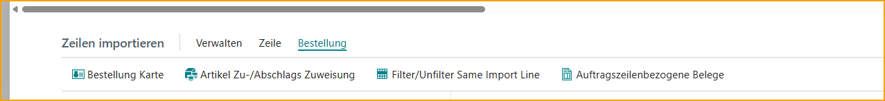

## ExFlow Import-Journale

Gehen Sie zu: ***ExFlow Import-Journale***

Ein "ExFlow Import-Journal" wird zum Importieren von Dokumenten, Anwenden von Kontierungen, Bearbeiten von Aktionsmeldungen und Erstellen von Rechnungen/Gutschriften zur Genehmigung verwendet. Nach dem Scannen und Interpretieren der gescannten Dokumente werden Dateien erstellt und sind bereit für den Import.

In der ExFlow Import-Journale-Liste ist es möglich, zu suchen, ein neues Journal zu erstellen, aktuelle Journalzeilen zu bearbeiten und Journale zu löschen. Benutzer können auch Stapel-Dokumente importieren, Rechnungen und Gutschriften stapelweise erstellen, die OCR-Import-Warteschlange bearbeiten/anzeigen, E-Mail-Wareneingangserinnerungen senden und Journale stapelweise verarbeiten/überprüfen.

| Import-Journale Menü |  |
|:-|:-|
| **Neu**         | Ein neues Import-Journal hinzufügen
| **Liste bearbeiten**         | Die Import-Journal-Liste bearbeiten
| **Löschen**         | Ein Import-Journal löschen
| **Start**         | **Journal bearbeiten:** Öffnet das markierte Import-Journal zur Bearbeitung    **Stapeldokumente importieren:** Importiert Dokumente für alle Stapel   **ExFlow Data Capture:** Öffnet die [**ExFlow Data Capture**](https://signup.readsoftonline.com) Anmeldung  
| **Erstellen**         | **Rechnung/Gutschriften erstellen:** Dokumente aus dem Import-Journal erstellen    **Rechnungen/Gutschriften stapelweise erstellen...:** Dokumente stapelweise aus dem Import-Journal erstellen
| **Aktionen**         | **OCR-Import-Warteschlange bearbeiten/anzeigen:** Öffnet die ExFlow OCR-Import-Warteschlange für noch nicht importierte Dokumente    **E-Mail-Wareneingangserinnerungen:** Sendet Auftrags-/Wareneingangserinnerungen   
| **Aktionen --> Funktionen**         | **Journale stapelweise überprüfen:** Überprüft alle Dokumente für alle Import-Journale    **Journale überprüfen:** Überprüft Dokumente im ausgewählten Import-Journal    **Über ExFlow:** Öffnet ein Popup-Fenster mit Informationen zur aktuellen ExFlow- und Business Central-Version. Bietet auch Links zur ExFlow-Dokumentationsplattform und den neuesten Versionshinweisen.   
| **Aktionen --> Andere**         | **Journal bearbeiten:** Öffnet das ausgewählte Import-Journal zur Bearbeitung    **Stapeldokumente importieren:** Importiert Dokumente stapelweise in die Journale    **ExFlow Data Capture:** Öffnet die [**ExFlow Data Capture**](https://signup.readsoftonline.com) Anmeldung  

  

| Import-Journale Liste |  |
|:-|:-|
| **Name**         | Name des Journals
| **Beschreibung**         | Beschreibung des Journals
| **Quelltyp**         | Quelltyp des Journals. Aktuelle Quelltypen sind: ExFlow Data Capture, Web Service, Manuell und Importdateien
| **Importdateicode**         | Gibt das zu verwendende ExFlow-Dateiimport-Setup an. Eine Konfiguration ist vor der Verwendung erforderlich.
| **Nur auftragsabgeglichene Dokumente**         | Aktivieren Sie dieses Kontrollkästchen für ein bestimmtes Journal, um ein dediziertes Journal nur für auftragsabgeglichene Dokumente zu haben
| **Dokumente beim Import überprüfen**         | Wählen Sie, ob die Überprüfung der Dokumente beim Import für alle Dokumente im Journal oder nur für die neu importierten Dokumente durchgeführt werden soll.
| **Anzahl der Dokumente**         | Geben Sie die Anzahl der Dokumente im Journal an
| **Zeilen mit automatischem Kontierungsvorschlag erstellen**         | Aktivieren Sie dieses Kontrollkästchen für ein bestimmtes Journal, um ein dediziertes Journal für automatische Kontierungsvorschläge zu haben
| **Zahlungsvalidierungswarnung ignorieren**         | Aktivieren Sie dieses Kontrollkästchen für ein bestimmtes Journal, bei dem Dokumente den Zahlungsvalidierungsprozess überspringen
| **Zahlungsvorschlagswarnung ignorieren** (verstecktes Feld)        | Aktivieren Sie dieses Kontrollkästchen für ein bestimmtes Journal, bei dem Dokumente den Zahlungsvorschlagsprozess überspringen. Dieses Feld kann über die Seitenpersonalisierung hinzugefügt werden
| **Dokumente automatisch erstellen**  (verstecktes Feld)        | Aktivieren Sie dieses Kontrollkästchen, um ein dediziertes Journal zu erhalten, das Dokumente automatisch erstellt. Dieses Feld kann über die Seitenpersonalisierung hinzugefügt werden
| **Gutschriftnummern** (verstecktes Feld)        | Fügen Sie dem Journal eine spezifische Nummernserie für Gutschriften hinzu. Dieses Feld kann über die Seitenpersonalisierung hinzugefügt werden
| **Standarddokumenttyp**  (verstecktes Feld)       | Fügen Sie für ein bestimmtes Journal einen Standarddokumenttyp wie Rechnung, Gutschrift oder Vorauszahlungsrechnung hinzu. Dieses Feld kann über die Seitenpersonalisierung hinzugefügt werden
| **Diff.Line Purch. Code**   (verstecktes Feld)      | Fügen Sie für ein bestimmtes Journal einen spezifischen Diff.Line Purch. Code hinzu. Dieses Feld kann über die Seitenpersonalisierung hinzugefügt werden
| **ExFlow Purchase Code**   (verstecktes Feld)      | Fügen Sie für ein bestimmtes Journal einen spezifischen ExFlow Purchase Code hinzu. Dieses Feld kann über die Seitenpersonalisierung hinzugefügt werden
| **Rechnungsnummern**     (verstecktes Feld)    | Fügen Sie dem Journal eine spezifische Nummernserie für Rechnungen hinzu. Dieses Feld kann über die Seitenpersonalisierung hinzugefügt werden
| **Gebuchte Gutschriftnummern**     (verstecktes Feld)    | Fügen Sie dem Journal eine spezifische Nummernserie für gebuchte Gutschriften hinzu. Dieses Feld kann über die Seitenpersonalisierung hinzugefügt werden
| **Gebuchte Rechnungsnummern**   (verstecktes Feld)      | Fügen Sie dem Journal eine spezifische Nummernserie für gebuchte Rechnungen hinzu. Dieses Feld kann über die Seitenpersonalisierung hinzugefügt werden
| **Vordefiniertes Konto**     (verstecktes Feld)    | Fügen Sie dem Journal ein vordefiniertes Konto hinzu. Dieses Feld kann über die Seitenpersonalisierung hinzugefügt werden
| **Selbstabrechnungsrechnungen**  (verstecktes Feld)       | Aktivieren Sie ''Selbstabrechnungsrechnungen'', um anzugeben, ob Selbstabrechnungsrechnungen in diesem Journalstapel erstellt werden sollen. Dieses Feld kann über die Seitenpersonalisierung hinzugefügt werden
| **Benutzer-ID-Filter (OCR)**   (verstecktes Feld)      | Fügen Sie ein dediziertes Journal zu einer bestimmten OCR-Benutzer-ID hinzu. Dieses Feld kann über die Seitenpersonalisierung hinzugefügt werden

   

### Stapeldokumente aus der Interpretation importieren
Gehen Sie zu: ***Start --> Stapeldokumente importieren*** 
Dokumentbilder und die interpretierten Daten werden importiert.

Je nach Journaleinstellungen werden die Dokumente in die verschiedenen Journale aufgeteilt.

Ein Journal mit aktiviertem Kontrollkästchen "Nur auftragsabgeglichene Dokumente" erhält auftragsabgeglichene Dokumente und Dokumente mit Bestellnummerninformationen. Es gibt andere Möglichkeiten, die Dokumente zu trennen, aber eine Trennung in Kosten-/Einkaufsrechnungen ist sehr verbreitet.

Gleiche Einstellung kann für "Zeilen mit automatischem Vorschlag erstellen" vorgenommen werden. Aktivieren Sie das Kontrollkästchen "Zeilen mit automatischem Vorschlag erstellen", wenn der automatische Kontierungsvorschlag von ExFlow für ein bestimmtes Journal angewendet werden soll.

Lesen Sie mehr darüber im Abschnitt **"ExFlow Auto Coding Suggestion".**

In den Journalen gibt es einen Dokumentkopfdatensatz für jedes importierte OCR-Dokument. "Importzeilen" im unteren Abschnitt sind Zeilendetails für jedes Dokument.

Darüber hinaus ist es möglich, ein spezifisches Journal für das automatische Erstellen von Dokumenten einzurichten. Verwenden Sie die Personalisierung und fügen Sie die Spalte "Dokumente automatisch erstellen" zur ExFlow Import-Journale-Liste hinzu.

Aktivieren Sie dieses Kontrollkästchen, wenn interpretierte Dokumente automatisch aus dem ExFlow Import-Journal erstellt werden sollen. Mit dieser Funktion werden alle interpretierten importierten Dokumente (ohne Fehler oder Warnmeldungen) automatisch erstellt und zur Genehmigung versendet.

Importieren und eine Nachricht zeigt, wie viele empfangene/importierte Dokumente und die Menge der automatisch erstellten Dokumente.

Diese Einstellung kann auch nur für bestimmte Lieferanten angewendet werden. Lesen Sie mehr darüber im Abschnitt **Lieferanteneinrichtung**.

### ExFlow Data Capture
Gehen Sie zu: ***Aktionen --> Import --> ExFlow Data Capture***

Klicken Sie auf "ExFlow Data Capture", um zur Website zu gelangen. Dies funktioniert nur, wenn das Unternehmen mit einem ExFlow Data Capture-Konto verbunden ist.

   

## Import-Journal - Kopf

| Import-Journal --> Verwalten|| 
|:-|:-| 
| Löschen             | Wenn das Dokument in das ExFlow Import-Journal importiert wurde, kann es gelöscht werden. Dann wird kein Einkaufsdokument erstellt.
| Karte             | Öffnen Sie die ExFlow Import-Dokumentkarte für das ausgewählte Dokument.
| Statistik          | Statistische Informationen über das ausgewählte Dokument anzeigen (F7)

| Import-Journal --> Start|| 
|:-|:-| 
| Dokumente importieren             | Um Dokumente in ein ausgewähltes Journal zu importieren, öffnen Sie das Journal und importieren Sie Dokumente.
| Dokument überprüfen            | Wählen Sie ein (oder mehrere) Dokument(e) aus, um es/sie über "Dokument überprüfen" zu überprüfen. Diese Funktion überprüft, ob das Dokument bereit ist, erstellt zu werden. (Strg+R)
| Alle Dokumente überprüfen          | Nach der Korrektur eines Fehlers wird diese Funktion die Aktionsmeldung löschen oder eine neue erstellen, wenn ein Dokument noch einen Fehler aufweist.
|Auto Coding Suggestion - Manuelle Auswahl| [Auto Coding Suggestion - Manuelle Auswahl](https://docs.signupsoftware.com/business-central/docs/user-manual/approval-workflow/exflow-import-journals#auto-coding-suggestion---manual-choice)
|Auto Coding Suggestion - Automatisch| [Auto Coding Suggestion - Automatisch](https://docs.signupsoftware.com/business-central/docs/user-manual/approval-workflow/exflow-import-journals#auto-coding-suggestion---automatic)
|Update VAT Product Posting Group|Aufgrund der schwedischen Steuervorschriften bezüglich IT-VAT ist es möglich, alle VAT Product Posting Groups auf Rechnungszeilen zu aktualisieren. Diese Funktion kann nur zusammen mit Kunden verwendet werden, die SweBase installiert haben.   Lesen Sie mehr im Abschnitt [**SweBase --> Update VAT Product Posting Group**](https://docs.signupsoftware.com/business-central/docs/user-manual/localizations-and-isv-extensions/swebase#update-vat-product-posting-group)
|Lieferantenkarte|Öffnet die Lieferantenkarte für das spezifische Dokument.
|Bild importieren oder ersetzen|Importieren oder ersetzen Sie das aktuelle Dokumentbild.
|ExFlow Lieferanteneinrichtung|Diese Schaltfläche zeigt/bearbeitet die ExFlow Lieferanteneinrichtung für den aktuellen Lieferanten.

  

### Auto Coding Suggestion

#### Auto Coding Suggestion - Manuelle Auswahl
Gehen Sie zu: ***Start --> Auto Coding Suggestion - Manuelle Auswahl*** 
Öffnet die Auto Coding Suggestion-Liste, die mit dem ausgewählten Dokument verknüpft ist.

Manuelle Auswahl gibt die Möglichkeit, durch verschiedene Coding Set ID zu navigieren und manuell einen Kontierungsvorschlag auszuwählen.

Diese Seite zeigt den besten Kontierungsvorschlag für die Rechnung, die vor dem Drücken der Schaltfläche zur manuellen Auswahl des Kontierungsvorschlags ausgewählt wurde. In der rechten oberen Ecke ist es möglich, die Kontierung aus den ausgewählten Kontierungsvorschlagszeilen für diese spezifische Setup-ID zu sehen.

**Kontierungssatz-ID anwenden:** Dies wird die im rechten oberen Eck angezeigte Kontierung auf die Rechnung anwenden.

**Dokumentzeilen anzeigen:** Öffnet die ExFlow Coding Suggestion-Dokumentseite. Lesen Sie mehr im Abschnitt **Coding Suggestion Document**.

**Alle anzeigen:** Dies zeigt alle Setup-IDs an, um die Möglichkeit zu haben, manuell eine vorgeschlagene Kontierung für z.B. einen anderen Lieferanten auszuwählen.

**Anfänglichen Vorschlag anzeigen:** Dies wird zum anfänglichen Vorschlag zurückkehren, der angezeigt wurde, als die Seite zum ersten Mal geöffnet wurde.

##### ExFlow Coding Suggestion Document

Auf dieser Seite wird die Kontierung detaillierter angezeigt. Es ist auch möglich, die vorgeschlagenen Zeilen mit den aktuellen Zeilen auf der Rechnung zu vergleichen.

**Vorgeschlagene Kontierung anwenden:** Dies wendet die vorgeschlagene Kontierung auf die Rechnung an.

**Neueste Kontierung vorschlagen:** Dies wendet die Kontierung aus dem zuletzt gebuchten Dokument dieses Lieferanten an.

**Vorausgewählte Kontierung vorschlagen:** Dies schlägt die Kontierung vor, die ursprünglich als Auswahl im vorherigen Fenster angezeigt wurde.

**Automatische Kontierung vorschlagen:** Dies wird die automatische Kontierung basierend auf dem automatischen Vorschlags-Setup vorschlagen.

#### Auto Coding Suggestion - Automatisch
Gehen Sie zu: ***Start --> Auto Coding Suggestion - Automatisch*** 
Wendet die Zeilenkontierung an, die vom Vorschlagsalgorithmus ausgewählt wurde.

Dies wird eine Kontierung basierend auf den Informationen auf der Rechnung eingeben. Es wird die Kontierung basierend auf dem automatischen Kontierungsvorschlags-Setup auswählen.

Lesen Sie mehr im Abschnitt [***Auto Coding Suggestion Setup***](https://docs.signupsoftware.com/business-central/docs/user-manual/business-functionality/auto-coding-suggestion-setup#auto-coding-suggestion-setup)

  

### Rechnungen/Gutschriften stapelweise erstellen
Gehen Sie zu: ***Erstellen --> Rechnungen/Gutschriften stapelweise erstellen*** 

Dies wird sowohl die Stapelüberprüfung der Dokumente als auch die Erstellung von Einkaufsrechnungen und Gutschriften für alle Dokumente in diesem Journal durchführen, die keine Aktionsmeldung haben.

Um das Buchungsdatum für alle Dokumente zu aktualisieren, fügen Sie ein neues Datum im Feld Buchungsdatum hinzu und aktivieren Sie Buchungsdatum ersetzen.

Wenn die Verwendung des Mehrwertsteuerdatums aktiviert ist und das Standard-Mehrwertsteuerdatum im Hauptbuch-Setup das Buchungsdatum ist, wird das Mehrwertsteuerdatum automatisch als Vorschlag aktiviert.

Wenn ein oder mehrere Dokumente einen Abgrenzungscode haben, wenn das Buchungsdatum ersetzt wird, wird die folgende Frage gestellt.

Wählen Sie **Ja**, um das Startdatum der Abgrenzung gemäß den Einstellungen im Abgrenzungscode für alle Dokumentzeilen zu aktualisieren. 
Wählen Sie **Nein**, um das Startdatum der Abgrenzung wie auf allen Dokumentzeilen erstellt beizubehalten.

### Rechnung/Gutschrift erstellen
Gehen Sie zu: ***Erstellen --> Rechnung/Gutschrift erstellen (F9)*** 
Stehen Sie auf der ausgewählten Dokumentzeile und klicken Sie auf Rechnung/Gutschrift erstellen, um ein Dokument zu erstellen, oder verwenden Sie die Verknüpfung F9.

Es gibt auch eine Option, mehrere Dokumente zur Erstellung auszuwählen. Verwenden Sie "Mehr auswählen", um die Dokumente auszuwählen.

Und klicken Sie einfach auf Rechnung/Gutschrift erstellen, um die ausgewählten Dokumente zu erstellen.

### Import-Journal --> Aktionen --> Import

### Importzeilen aus Excel
Gehen Sie zu: ***Aktionen --> Import --> Importzeilen Excel-Vorlage herunterladen / Importzeilen aus Excel importieren*** 
Manchmal ist es einfacher, in Excel zu arbeiten, wenn die Rechnung mehrere Zeilen enthält.

Beginnen Sie mit "Importzeilen Excel-Vorlage herunterladen".

Ändern, hinzufügen und/oder löschen Sie Zeilen in Excel, speichern Sie und verwenden Sie die Funktion "Importzeilen aus Excel importieren".

#### Zeilen kopieren/einfügen
Es ist möglich, Zeilen aus einem anderen Dokument oder aus Excel zu kopieren und in das Import-Journal einzufügen. Diese Funktion funktioniert genauso wie im Business Central-Standard.

### Neueste Kontierung vom Lieferanten abrufen
Gehen Sie zu: ***Aktionen --> Import --> Neueste Kontierung vom Lieferanten abrufen*** 
Diese Funktion findet die zuletzt gebuchte Rechnung und kopiert die Zeilen mit dem Sachkonto.

### ExFlow Data Capture
Gehen Sie zu: ***Aktionen --> Import --> ExFlow Data Capture*** 
Diese Funktion öffnet die "ExFlow Data Capture"-Webseite (wenn das Unternehmen mit ExFlow Data Capture verbunden ist).

### Import-Journal --> Aktionen --> Funktionen

### Kontierung zum Lieferanten speichern
Gehen Sie zu: ***Aktion --> Funktionen --> Kontierung zum Lieferanten speichern*** 
Verwenden Sie diese Funktion, um die aktuelle Kontierung der Rechnungszeilen in einem ExFlow Purchase Code zu speichern, der auf der Lieferantenkarte gespeichert wird.

### Ausgewählte Dokumente in ein anderes Unternehmen übertragen
Gehen Sie zu: ***Aktion --> Funktionen --> Ausgewählte Dokumente in ein anderes Unternehmen übertragen*** 
Wenn die Business Central-Datenbank mehr als ein Unternehmen enthält, kann ein Dokument in ein anderes Unternehmen verschoben werden, bevor das Dokument erstellt wird.

### Ausgewählte Dokumente in einen anderen Stapel übertragen
Gehen Sie zu: ***Aktion --> Funktionen --> Ausgewählte Dokumente in einen anderen Stapel übertragen*** 
Wenn das Business Central-Unternehmen mehr als ein ExFlow Import-Journal hat, kann ein Dokument in ein anderes Journal verschoben werden, bevor das Dokument erstellt wird.

### Buchungsdatum stapelweise aktualisieren
Gehen Sie zu: ***Aktion --> Funktionen --> Buchungsdatum stapelweise aktualisieren*** 
Mit dieser Funktion ist es möglich, das Buchungsdatum für Dokumente im ausgewählten Journal innerhalb des Filters zu aktualisieren.

### OCR-Import-Warteschlange bearbeiten/anzeigen
Gehen Sie zu: ***Aktion --> Funktionen --> OCR-Import-Warteschlange bearbeiten/anzeigen*** 
Verwenden Sie diese Funktion, um die OCR-Import-Warteschlange anzuzeigen oder zu bearbeiten. Korrigieren Sie Dokumente, die falsche Informationen enthalten, die verhindern, dass sie importiert werden.

### Import-Journal --> Aktionen --> Bestellung

### Bestellung - OCR-Zeilen abgleichen
Gehen Sie zu: ***Aktionen --> Bestellung --> OCR-Zeilen abgleichen*** 
Dokumentzeilen mit Bestellungen abgleichen.

Bei Verwendung dieser Funktion sammelt ExFlow Informationen aus Bestellungen und Wareneingängen usw.

Um das manuelle Zeilenabgleichen zu erleichtern, ist es möglich, die Seite "Zeilenabgleichsansicht" zu personalisieren und Felder wie "Artikelreferenznummer" und "Lieferantenartikelnummer" hinzuzufügen.

### Bestellung --> Wareneingangs-/Rücksendungs-/Bestellzeilen abrufen
Gehen Sie zu: ***Aktionen --> Bestellung --> Wareneingangs-/Rücksendungs-/Bestellzeilen abrufen*** 
Mit dieser Schaltfläche werden Bestell-/Wareneingangszeilen abgerufen und dem ausgewählten Dokument hinzugefügt.

Lesen Sie mehr im Abschnitt **Bestellabgleich auf Kopfebene**.

### Import-Journal --> Aktionen --> E-Mail

### Wareneingangserinnerungen stapelweise senden
Gehen Sie zu: ***Aktionen --> E-Mail --> Wareneingangserinnerungen stapelweise senden*** 
Mit dieser Funktion werden E-Mails an Benutzer bezüglich Wareneingangserinnerungen für neue Dokumente gesendet. Wenn der Wert des Einkäufercodes im Import-Journal leer ist, wird eine Erinnerung an den Einkaufskoordinator gesendet.
Wenn ein Einkäufercode vorhanden ist, wird die Erinnerung an den verbundenen ExFlow-Benutzer gesendet.

### Alle Wareneingangserinnerungen stapelweise senden
Gehen Sie zu: ***Aktionen --> E-Mail --> Alle Wareneingangserinnerungen stapelweise senden*** 
Diese Schaltfläche sendet E-Mails bezüglich Wareneingangserinnerungen ohne Einschränkungen durch Zeitstempel von früher gesendeten Erinnerungen.

### Wareneingangserinnerungen für ausgewählte Dokumente senden
Gehen Sie zu: ***Aktionen --> E-Mail --> Wareneingangserinnerungen für ausgewählte Dokumente senden*** 
Diese Schaltfläche sendet Wareneingangserinnerungen nur für ausgewählte Dokumente. Erinnerungen werden jederzeit gesendet, unabhängig davon, wann die letzte Erinnerung für das/die Dokument(e) gesendet wurde.

### E-Mail-Protokoll anzeigen
Gehen Sie zu: ***Aktionen --> E-Mail --> E-Mail-Protokoll anzeigen*** 
Diese Schaltfläche zeigt ein E-Mail-Protokoll der gesendeten Wareneingangserinnerungen an.

#### Einträge löschen, die älter als 30 Tage sind
Gehen Sie zu: ***ExFlow E-Mail-Protokolle --> Aktion --> Einträge löschen, die älter als 30 Tage sind*** 
Diese Schaltfläche löscht die Liste der Protokolleinträge, die älter als 30 Tage sind.

#### Alle Einträge löschen
Gehen Sie zu: ***ExFlow E-Mail-Protokolle --> Aktion --> Alle Einträge löschen*** 
Mit dieser Schaltfläche können alle Protokolleinträge der gesendeten Belege gelöscht werden.

#### Fehlermeldung anzeigen
Gehen Sie zu: ***ExFlow E-Mail-Protokolle --> Aktion --> Fehlermeldung anzeigen*** 
Diese Schaltfläche zeigt an, ob es Fehlermeldungen im Zusammenhang mit dem Senden von Wareneingangserinnerungen gibt.

#### Alle anzeigen
Gehen Sie zu: ***ExFlow E-Mail-Protokolle --> Aktion --> Alle anzeigen*** 
Mit dieser Schaltfläche werden alle Einträge des E-Mail-Protokolls angezeigt. Die Einträge bestehen aus einem E-Mail-Typ, Dokumentnummer, gesendet an Adresse, gesendet von, erstellt am und Fehlermeldung.

### Import-Journal --> Aktionen --> Vorläufige Buchung

### Vorläufige Buchungsvorschau
Gehen Sie zu: ***Aktionen --> Vorläufige Buchung --> Buchungsvorschau*** 
Dies kann nur verwendet werden, wenn die vorläufige Buchung aktiviert ist.  
Lesen Sie mehr im Abschnitt [***Vorläufige Buchung***](https://docs.signupsoftware.com/business-central/docs/user-manual/business-functionality/preliminary-posting)

### Import-Journal --> Aktionen --> Vertrag

### Vertrag erstellen
Gehen Sie zu: ***Aktionen --> Vertrag --> Vertrag erstellen*** 
Wenn die Rechnung interpretiert und die Kontierung im Kopf für wiederkehrende Rechnungen hinzugefügt wurde. Verwenden Sie diese Funktion, um einen Vertrag zu erstellen.
Felder im Rechnungskopf, die in den neu erstellten Vertrag kopiert werden:
* Lieferantennummer
* Referenz zur externen Vertragsnummer
* ExFlow Purchase Code
* Erster Genehmiger
* Genehmigungsregel
* Einkäufercode

Um die Einrichtung des Vertrags abzuschließen, lesen Sie mehr im Abschnitt [***Vertrag***](https://docs.signupsoftware.com/business-central/docs/user-manual/business-functionality/contract)

### Import-Journal --> Verwandt --> Dokument

### Bestellkarte
Gehen Sie zu: ***Verwandt --> Dokument --> Bestellkarte*** 
Diese Schaltfläche öffnet die verbundene Bestellkarte für das ausgewählte Dokument.

### Vertrag anzeigen
Gehen Sie zu: ***Verwandt --> Dokument --> Vertrag anzeigen*** 
Öffnen Sie den verbundenen ExFlow-Vertrag für das ausgewählte Dokument.

### Dimensionen
Gehen Sie zu: ***Verwandt --> Dokument --> Dimensionen*** 
Anzeigen der auf das ausgewählte Dokument gesetzten Dimensionen.

### Lieferantenbankkonto anzeigen
Gehen Sie zu: ***Verwandt --> Dokument --> Lieferantenbankkonto*** 
Diese Schaltfläche zeigt das bevorzugte Bankkonto des Lieferanten an. Wenn es nicht existiert, wird die Liste der Lieferantenbankkonten für den spezifischen Lieferanten angezeigt.

### Import-Journal --> Dokument --> Dateien

### Importdetails anzeigen (OCR)
Gehen Sie zu: ***Verwandt --> Dateien --> Importdetails anzeigen (OCR)*** 
Um die interpretierten Daten anzuzeigen, markieren Sie die richtige Dokumentzeile, gehen Sie zu "Importdetails anzeigen (OCR)". Die Daten können nicht geändert werden.

### Dokumentbild anzeigen (Strg + I) / PDF exportieren

Wenn ein Dokument zur Genehmigung erstellt wird, kann das Dokumentbild (PDF) mit dem Kurzkommando (Strg+I) an folgenden Stellen angezeigt werden:

- Einkaufsrechnung 
- Einkaufsgutschrift 
- Gebuchte Einkaufsrechnung 
- Gebuchte Einkaufsgutschrift 
- Lieferantenposten 
- Gebuchte Sachposten 
- Gebuchte Mehrwertsteuerposten 
- ExFlow Import-Journal 
- ExFlow Genehmigungsstatus 
- ExFlow Genehmigungsstatus --> Änderungen überprüfen  
- ExFlow Genehmigungsstatusverlauf 

Im Import-Journal, Genehmigungsstatus und Genehmigungsstatusverlauf ist es möglich, mehrere Dokumente auszuwählen, bevor die Verknüpfung Strg+I verwendet wird:

Wenn mehrere Dateien ausgewählt sind, gibt es die Möglichkeit, eine komprimierte Datei mit PDF-Dateien für alle ausgewählten Dokumente an einem bestimmten Ort zu speichern. Dies ist eine großartige Möglichkeit, viele PDFs bei Bedarf zu exportieren.

"Dokumentbild anzeigen" kann auch über das Menü unter Verwandt erreicht werden.

### PDF-Viewer in neuem Tab öffnen
Es ist möglich, die PDF in einem neuen separaten Tab zu öffnen, um eine bessere Ansicht des Dokumentenbildes zu erhalten.

Diese Funktion wurde vom Menü "Importjournal" in die [PDF-Infobox](https://docs.signupsoftware.com/business-central/docs/user-manual/approval-workflow/exflow-import-journals#pdf-preview) auf der rechten Seite verschoben.

Klicke auf diesen Button, um die PDF in einem neuen separaten Tab zu öffnen:

## Dokumentkopf - Weitere Optionen anzeigen 

Klicken Sie auf die ''drei vertikalen Punkte'' im Dokumentkopf, um Schnellzugriffsoptionen zu finden.

### ExFlow Import-Dokumentkarte öffnen
Gehen Sie zu: ***Verwalten --> Karte*** 
Öffnen Sie die ExFlow Import-Dokumentkarte für das ausgewählte Dokument.

### Lieferantenkarte anzeigen
Gehen Sie zu: ***Prozess--> Lieferantenkarte*** 
Diese Schaltfläche zeigt die Lieferantenkarte für das ausgewählte Dokument an.
Kann auch unter ***Verwandt --> Dokument --> Andere --> Bild importieren oder ersetzen*** gefunden werden

### Bild importieren oder ersetzen
Gehen Sie zu: ***Prozess --> Bild importieren oder ersetzen*** 
Importieren Sie eine Datei oder ersetzen Sie ein Bild im Kontextmenü im Rechnungskopf über die Funktion "Bild importieren oder ersetzen" im Import-Journal. 
Kann auch unter ***Verwandt --> Dateien --> Andere --> Bild importieren oder ersetzen*** gefunden werden

### ExFlow Lieferanteneinrichtung
Gehen Sie zu: ***Prozess --> ExFlow Lieferanteneinrichtung*** 
Diese Schaltfläche zeigt/bearbeitet die ExFlow Lieferanteneinrichtung für den aktuellen Lieferanten.

### Dimensionen
Gehen Sie zu: ***Prozess --> Dimensionen*** 
Anzeigen der auf das ausgewählte Dokument gesetzten Dimensionen.

### Importdetails anzeigen (OCR)
Gehen Sie zu: ***Prozess --> Importdetails anzeigen (OCR)*** 
Um die interpretierten Daten anzuzeigen, markieren Sie die richtige Dokumentzeile, gehen Sie zu "Importdetails anzeigen (OCR)". Die Daten können nicht geändert werden.
Lesen Sie mehr über das Anzeigen von Importdetails oben

### Dokumentbild anzeigen (Strg + I)

Gehen Sie zu: ***Verwandt --> Dateien --> Dokumentbild anzeigen*** 
Um das PDF im Vollbildmodus für ein ausgewähltes Dokument zu öffnen oder die Verknüpfung (Strg+I) zu verwenden.

"Dokumentbild anzeigen" kann auch über das Menü unter Verwandt erreicht werden.

## Kopfzeilenfelder
Hier werden einige ''gut zu wissen'' Felder vorgestellt. 

### Dokument blockieren
Im Import-Journal-Kopf kann die Buchhaltung ein Dokument von der Erstellung oder Buchung blockieren.

#### Blockieren für Erstellung
Blockieren Sie das Dokument, damit es im Import-Journal erstellt und zur Genehmigung gesendet wird.

#### Blockieren für Buchung
Blockieren Sie das Dokument, damit es im Genehmigungsstatus gebucht wird.

### Gilt für Dokument
Es besteht die Möglichkeit, Zahlungen auf ein Dokument anzuwenden. Z.B. um eine Rechnung auf eine Gutschrift in den Lieferantenposten anzuwenden, wenn die Gutschrift gebucht wird. 
Um diese Felder zu verwenden, müssen sie zuerst durch Personalisierung hinzugefügt werden.

**Gilt für Dok.-Typ** gibt den Typ des gebuchten Dokuments an, auf das dieses Dokument oder diese Journalzeile beim Buchen angewendet wird, z.B. um eine Zahlung zu registrieren.

**Gilt für Dok.-Nr.** gibt die Nummer des gebuchten Dokuments an, auf das dieses Dokument oder diese Journalzeile beim Buchen angewendet wird, z.B. um eine Zahlung zu registrieren.

## Import-Journal - Importzeilen

### Importzeilen - Verwalten

#### Neue Zeile / Zeile löschen
Gehen Sie zu: **Importzeilen --> Verwalten --> Neue Zeile / Zeile löschen**  

**Neue Zeile:** Fügen Sie eine neue Zeile hinzu, um einen neuen Eintrag zu erstellen.  

**Zeile löschen:** Löschen Sie die ausgewählte Zeile.  

### Importzeilen - Funktionen
Gehen Sie zu: **Importzeilen --> Zeile**

### Dimensionen
Gehen Sie zu: ***Importzeilen --> Zeile --> Dimensionen*** 
Zeigt alle Dimensionen für die aktuelle Zeile an.

### Genehmigungsvorschlag anzeigen
Zeigt den aktuellen Genehmigungsvorschlag für die ausgewählte Dokumentzeile an. 
Gehen Sie zu: ***Importzeilen --> Zeile --> Genehmigungsvorschlag anzeigen***

### Verfügbare Genehmigungsregeln anzeigen
Gehen Sie zu: ***Importzeilen --> Zeile --> Verfügbare Genehmigungsregeln anzeigen*** 
Dies zeigt alle verfügbaren Genehmigungsregeln mit der höchsten Priorität oben an.

### Abgrenzungsplan
Gehen Sie zu: ***Importzeilen --> Zeile --> Abgrenzungsplan*** 

Wenn ein Abgrenzungsvorlagen-Code angegeben ist, klicken Sie auf Abgrenzungsplan, um den Abgrenzungsplan für die ausgewählte Dokumentzeile anzuzeigen/zu bearbeiten. In ExFlow wird der Abgrenzungsplan für das ExFlow-Genehmigungsdokument und nicht
die Einkaufsrechnung verwendet.

#### Abgrenzung vorwärts verschieben
Gehen Sie zu: **ExFlow Setup --> Allgemein --> Abgrenzung vorwärts verschieben**

Abgrenzung vorwärts verschieben wird automatisch Abgrenzungen innerhalb geschlossener Abgrenzungszeiträume in den nächsten offenen verschieben, wenn für Einkaufsrechnungen und Einkaufsgutschriften gebucht wird, unabhängig davon, ob das Dokument für die ExFlow-Genehmigung aktiv ist oder nicht.

Z.B.
Abgrenzungsbuchung ab 2023-01-15 zulassen.

Erstellen Sie eine Rechnung mit Abgrenzungsplan für drei Monate und Startdatum am Buchungsdatum.

2023-01-15 // 5 000,00 
2023-02-01 // 10 000,00 
2023-03-01 // 10 000,00 
2023-04-15 // 5 000,00

Nach dem monatlichen Abschluss aktualisieren Sie das Abgrenzungsbuchungsdatum auf 2023-02-01

Beim Buchen wird Business Central fragen, ob Sie das Abgrenzungsstartdatum aktualisieren und das Buchungsdatum auf 2023-02-01 aktualisieren möchten.

Wenn ja, wird Business Central alle Perioden vorwärts verschieben.

2023-02-01 // 10 000,00 
2023-03-01 // 10 000,00 
2023-04-01 // 10 000,00

Wenn stattdessen mit Nein geantwortet wird und ExFlow die Abgrenzung vorwärts verschieben lässt, wird der Januar zu Februar hinzugefügt, da dies der erste zulässige Buchungszeitraum für Abgrenzungen ist.

2023-02-01 // 15 000,00 
2023-03-01 // 10 000,00 
2023-04-15 // 5 000,00

### Interpretierte Zeilen abrufen
Gehen Sie zu: ***Importzeilen --> Zeile --> Interpretierte Zeilen abrufen*** 

Verwenden Sie diese Funktion, um verlorene oder gelöschte interpretierte Zeilen abzurufen. ExFlow wird die Rechnung mit interpretierten Zeilen aus den OCR-Importdetails füllen.

Wenn ein Benutzer versehentlich alle Zeilen löscht, ist es möglich, "Interpretierte Zeilen abrufen" zu verwenden, um alle nach dem Import vorgenommenen Änderungen zurückzusetzen.

### Verfügbare Genehmigungsregeln anzeigen
Gehen Sie zu: ***Importzeilen --> Zeile --> Verfügbare Genehmigungsregeln anzeigen*** 
Diese Funktion zeigt alle verfügbaren Genehmigungsregeln für die ausgewählte Dokumentzeile an.

### Aktuelle Dimensionseigentümer anzeigen
Gehen Sie zu: ***Importzeilen --> Zeile --> Aktuelle Dimensionseigentümer anzeigen*** 
Zeigen Sie die ExFlow-Dimensionseigentümer für die aktuelle Liste der vorgeschlagenen Genehmiger an.

### Budget anzeigen
Wenn die G/L-Budgetkontrolle aktiviert ist, ist es möglich, berechnete Werte anzuzeigen.
Lesen Sie mehr im Abschnitt [***G/L-Budgetkontrolle***](https://docs.signupsoftware.com/business-central/docs/user-manual/business-functionality/gl-budget-control)

### Importzeilen - Bestellung

Gehen Sie zu: **Importzeilen --> Bestellung**

### Bestellkarte
Gehen Sie zu: ***Importzeilen --> Bestellung --> Bestellkarte***

Wenn die Dokumentzeile mit einer Bestellung abgeglichen ist, klicken Sie auf Bestellkarte, um die entsprechende Einkaufs-/Rücksendebestellung zu öffnen. 

### Artikelkostenverteilung
Gehen Sie zu: ***Importzeilen --> Bestellung --> Artikelkostenverteilung*** 

Bei Verwendung von Charge (Artikel) kann die Zuweisung auf drei Arten erfolgen. Vom Import-Journal, automatisch oder manuell von der Rechnungskarte.

Manuell vom Import-Journal (Bestellung --> Artikel Zu-/Abschlags Zuweisung):  

Lassen Sie ExFlow die Artikelkosten automatisch zuweisen. Fügen Sie eine Option hinzu, wie die Zuweisung "Gleichmäßig, nach Betrag, nach Gewicht oder nach Volumen" im Feld "Automatische Artikelkostenverteilung" unter Bestellabgleich im ExFlow-Setup berechnet werden soll.

Wenn die automatische Artikelkostenverteilung verwendet wird, wird Charge (Artikel) zugewiesen, wenn Änderungen im Genehmigungsstatus überprüft werden, und es ist nicht mehr möglich, manuell vom Import-Journal aus zuzuweisen.

Die automatische Artikelkostenverteilung kann auch pro Lieferant festgelegt werden. Gehen Sie zur ExFlow-Lieferanteneinrichtung, um eine spezifische Artikelkostenoption für einen bestimmten Lieferanten zuzuweisen oder einen bestimmten Lieferanten auszuschließen (wenn diese Funktion im ExFlow-Setup aktiviert ist), indem Sie die Option "Keine" wählen.

### Gleiche Importzeile filtern/entfiltern
Gehen Sie zu: ***Importzeilen --> Bestellung -->Gleiche Importzeile filtern/entfiltern***

Filtern/entfiltern, um andere Dokumente oder Zeilen mit derselben Bestellnummer und Bestellzeilennummer anzuzeigen.

### Bestellzeile verwandte Dokumente
Gehen Sie zu: ***Importzeilen --> Bestellung -->Bestellzeile verwandte Dokumente***

Zeigt an, wo die ausgewählte Bestellzeile auf dem gewählten Einkaufsdokument verwendet wird.

## Dokumenterstellungskontrollen

### Währung des Lieferanten abgleichen
Gehen Sie zu: **ExFlow Setup --> Dokumenterstellungskontrollen --> Währungscode des Lieferanten abgleichen**

Wenn ExFlow überprüfen muss, ob der Währungscode auf jeder importierten Rechnung mit der Standardwährung des Lieferanten übereinstimmt, sollte die Einstellung "Währung des Lieferanten abgleichen" aktiviert werden. Finden Sie die Einstellung unter Dokumenterstellungskontrollen im ExFlow-Setup.

Wenn diese Einstellung aktiv ist, wird ExFlow eine Warnung für jedes Dokument im Import-Journal ausgeben, bei dem die Dokumentwährung von der Standardwährung des Lieferanten abweicht.

ExFlow vergleicht den Inhalt des Währungsfelds auf dem Dokument im Import-Journal mit der Standardwährung des Lieferanten (d.h. dem Inhalt des Währungsfelds auf der Lieferantenkarte). 
Wenn der Lieferant eine leere (leere) Währung hat, führt ExFlow keine Validierung durch.

### Mehrwertsteuerdifferenz zulassen
Gehen Sie zu: **ExFlow Setup --> Dokumenterstellungskontrollen --> Automatische Zuweisung der Mehrwertsteuerdifferenz für die Erstellung** 

Wenn die Mehrwertsteuerdifferenz im Einkaufs- und Zahlungseingangs-Setup aktiviert ist, kann die Mehrwertsteuerdifferenz in der Statistik im Import-Journal hinzugefügt werden, bevor das Dokument erstellt wird. 
Die maximale Mehrwertsteuerdifferenz wird durch die Einstellungen im Hauptbuch-Setup oder aus dem aktuellen Währungscode behandelt.

Über die Einstellungen kann ExFlow die Mehrwertsteuerdifferenz automatisch zuweisen. Dann wird die Mehrwertsteuerdifferenz proportional auf alle Zeilen verteilt.

Aktivieren Sie **"Automatische Zuweisung der Mehrwertsteuerdifferenz für die Erstellung"** im ExFlow-Setup unter dem Abschnitt Dokumenterstellungskontrolle für das Import-Journal.

Aktivieren Sie **"Automatische Zuweisung der Mehrwertsteuerdifferenz für die Buchung** im ExFlow-Setup unter dem Abschnitt Dokumentbuchungskontrollen für den Genehmigungsstatus unter Dokumentbuchungskontrollen.

**Empfohlen, beide zu verwenden.** 
ExFlow wird dann die Mehrwertsteuerdifferenz automatisch hinzufügen, wenn die Mehrwertsteuerdifferenz innerhalb der Einstellungen im Hauptbuch-Setup oder aus dem aktuellen Währungscode liegt.

Wenn der Betrag während des Genehmigungsflusses geändert wird, wird Business Central die Mehrwertsteuerdifferenz auf der aktualisierten Zeile löschen. Dann kann ExFlow automatisch neu zuweisen, wenn Änderungen im Genehmigungsstatus überprüft werden.

Wenn der Mehrwertsteuerbetrag auf den Zeilen manuell auf der Karte nach der Dokumenterstellung geändert wird, wird ExFlow fragen:

*"Möchten Sie den Mehrwertsteuerbetrag im ExFlow-Genehmigungsstatus aus dem Mehrwertsteuerbetrag der Zeilen aktualisieren?"* 
Antworten Sie mit Ja, um den gesamten Mehrwertsteuerbetrag im Genehmigungsstatus zu aktualisieren.

**Empfohlene Einstellungen:** 
Wenn Sie mit der automatischen Zuweisung der Mehrwertsteuerdifferenz und der Rundung auf Rechnungen/Gutschriften bei der Buchung arbeiten. Fügen Sie KEINE Mehrwertsteuer auf das Sachkonto hinzu, das für die Rundung verwendet wird.

Die Mehrwertsteuerdifferenz ist auf Dokumenten, die nur Zeilen mit NUR Mehrwertsteuer enthalten, nicht zulässig. Nur wenn die Mehrwertsteuer auf den Zeilen berechnet wird.

Die automatische Zuweisung überschreibt manuell hinzugefügte Mehrwertsteuerbeträge in der Statistik.

## FactBoxes im Import-Journal
Rechts im Import-Journal gibt es nützliche FactBoxes.

### PDF-Vorschau
Öffnen Sie die PDF in einem neuen separaten Tab, um eine bessere Ansicht des Dokumentbildes zu erhalten:  

 

"Verkleinern", "Vergrößern" und Zoom zurücksetzen:

Größe der PDF-Vorschau ändern: Klicken Sie auf ''- / +'', um die Größe der PDF zu verringern oder zu erhöhen.

Die Aktualisierungsschaltfläche befindet sich links. Klicken Sie auf "Wiederherstellen", um die Größe der FactBox zurückzusetzen. 

Ändern Sie die PDF-Seitennummer hier:

### Diskussionspanel (Nachricht wird gesendet, wenn das Dokument erstellt wird)
Wenn ein Kommentar im Diskussionspanel von einem Dokument im Import-Journal hinzugefügt und gesendet wurde, kann er nur im FactBox rechts angezeigt werden, markiert mit der Benutzer-ID, dem Datum und der Uhrzeit des Erstellers.

Wenn ein ExFlow-Benutzer, der ein Systembenutzer ist, durch die Verwendung von @ erwähnt wird, wird die Benachrichtigung in Business Central beim Einloggen angezeigt. Eine E-Mail-Nachricht kann auch gesendet werden, jedoch erst, wenn das Dokument erstellt wurde, da ExFlow-Webbenutzer keine Dokumente oder Kommentare im Import-Journal sehen können.

Auf ExFlow-Web wird die Nachricht im Chat auf dem Dokument angezeigt, nachdem es erstellt wurde.

Lesen Sie mehr über die Einstellungen und die Verwendung des Diskussionspanels im Abschnitt [***Diskussionspanel / Chat und Zeilenkommentare***](https://docs.signupsoftware.com/business-central/docs/user-manual/approval-workflow/notifications-in-business-central#discussion-panel--chat-and-line-comments)

### Eingehende Dokumentdateien
Gehen Sie zu: ***FactBox --> Eingehende Dokumentdateien --> Datei anhängen*** 
Datei anhängen.

Klicken Sie auf "Auswählen", suchen Sie die Datei, die angehängt werden soll, und klicken Sie auf "Öffnen".

### Genehmigungsvorschlag
Genehmiger für die aktuelle Dokumentzeile anzeigen.
Von: ***Genehmigungsvorschlag --> Genehmigungsvorschlag anzeigen*** 
Genehmiger können manuell hinzugefügt werden. Dies sollte nur in besonderen Fällen verwendet werden.

### Dokumentdetails
Wenn der Betrag im Dokumentkopf und der Gesamtbetrag auf den Dokumentzeilen nicht denselben Wert haben, können Dokumentdetails helfen, den Differenzbetrag zu sehen und ob er auf den direkten Einstandspreis ohne Mehrwertsteuer, den direkten Einstandspreis mit Mehrwertsteuer, den Mehrwertsteuerbetrag oder die Vorauszahlung zurückzuführen ist.

### Warnmeldungen
Wenn die Aktionsmeldung "Es gibt noch nicht akzeptierte Warnmeldungen!" anzeigt, wird die Meldung im FactBox "Warnmeldungen" angezeigt. Nehmen Sie die entsprechenden Änderungen vor oder "Akzeptieren Sie alle Warnungen" wie im Bild unten.

### Lieferantenstatistik und Lieferantenhistorie
Finden Sie Lieferanteninformationen in den FactBoxes Lieferantenstatistik und Lieferantenhistorie.

## Web-Spalten

### Beschreibung 2

Es ist möglich, die Spalte Beschreibung 2 durch Personalisierung zu den Import-Journalzeilen hinzuzufügen. 

Für auftragsabgeglichene Rechnungen wird der Wert im Feld Beschreibung 2 der Bestellzeile von der Bestell-/Wareneingangszeile auf die entsprechende Import-Journal-Rechnungszeile übertragen. 

Gleiches gilt für Kosten-/Aufwandsrechnungen, das Feld Beschreibung 2 wird im Import-Journal verfügbar sein, damit Benutzer manuell Text eingeben können. 

Jeder im Feld Beschreibung 2 eingegebene Text wird in ExFlow Web sichtbar sein. 

Um die Web-Spalte Beschreibung 2 hinzuzufügen, gehen Sie zu **ExFlow Setup --> Web-Spalten bearbeiten** und klicken Sie dann auf ''Spalte hinzufügen''.

Lesen Sie mehr über Web-Spalten im Abschnitt [***ExFlow Web.***](https://docs.signupsoftware.com/business-central/docs/user-manual/technical/exflow-web#exflow-web)