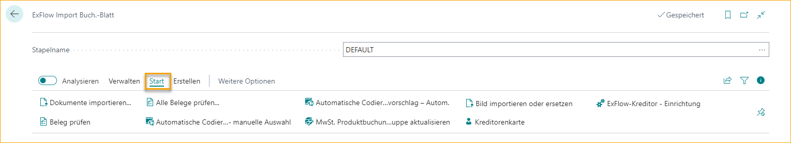
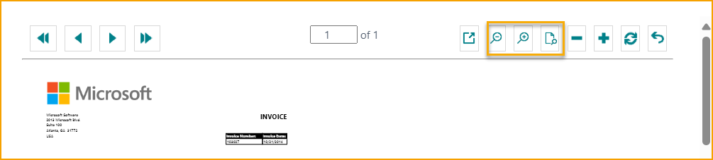

## ExFlow Import Journale

Gehe zu: ***ExFlow Import Journale***

Ein "ExFlow Import Journal" wird verwendet, um Dokumente zu importieren, Kodierungen anzuwenden, Aktionsnachrichten zu bearbeiten und Rechnungen/Gutschriften zur Genehmigung zu erstellen. Nach dem Scannen und Interpretieren der gescannten Dokumente werden Dateien erstellt und sind bereit zum Importieren.

In der ExFlow Import Journale Liste ist es möglich, zu suchen, ein neues Journal zu erstellen, aktuelle Journalzeilen zu bearbeiten und Journale zu löschen. Benutzer können auch Dokumente im Batch importieren, Rechnungen und Gutschriften im Batch erstellen, die OCR Import Warteschlange bearbeiten/anzeigen, E-Mail Empfangsbestätigungen senden und Journale im Batch/überprüfen.

| Import Journale Menü |  |
|:-|:-|
| **Neu**         | Ein neues Import Journal hinzufügen
| **Liste bearbeiten**         | Die Import Journal Liste bearbeiten
| **Löschen**         | Ein Import Journal löschen
| **Startseite**         | **Journal bearbeiten:** Öffnet das markierte Import Journal zur Bearbeitung     **Dokumente im Batch importieren:** Importiert Dokumente für alle Batches    **ExFlow Datenerfassung:** Öffnet die [**ExFlow Datenerfassung**](https://signup.readsoftonline.com) Anmeldung  
| **Erstellen**         | **Rechnungen/Gutschriften erstellen:** Dokumente aus dem Import Journal erstellen     **Rechnungen/Gutschriften im Batch erstellen...:** Dokumente im Batch aus dem Import Journal erstellen
| **Aktionen**         | **OCR Import Warteschlange bearbeiten/anzeigen:** Öffnet die ExFlow OCR Import Warteschlange für noch nicht importierte Dokumente zur Warteschlange    **E-Mail Empfangsbestätigungen:** Sendet Bestell-/Empfangsbestätigungen   
| **Aktionen --> Funktionen**         | **Journale im Batch überprüfen:** Überprüft alle Dokumente für alle Import Journale    **Journale überprüfen:** Überprüft Dokumente im ausgewählten Import Journal    **Über ExFlow:** Öffnet ein Popup-Fenster mit Informationen über die aktuelle ExFlow und Business Central Version. Bietet auch Links zur ExFlow Dokumentationsplattform und den neuesten Versionshinweisen.   
| **Aktionen --> Sonstiges**         | **Journal bearbeiten:** Öffnet das ausgewählte Import Journal zur Bearbeitung    **Dokumente im Batch importieren:** Dokumente im Batch in die Journale importieren    **ExFlow Datenerfassung:** Öffnet die [**ExFlow Datenerfassung**](https://signup.readsoftonline.com) Anmeldung  

  

| Import Journale Liste |  |
|:-|:-|
| **Name**         | Name des Journals
| **Beschreibung**         | Beschreibung des Journals
| **Quelltyp**         | Quelltyp des Journals. Aktuelle Quelltypen sind: ExFlow Datenerfassung, Webdienst, Manuell und Dateien importieren
| **Importdatei-Code**         | Gibt das ExFlow Dateiimport-Setup an, das verwendet werden soll. Eine Konfiguration ist vor der Nutzung erforderlich.
| **Nur Bestellabgleich-Dokumente**         | Aktivieren Sie dieses Kontrollkästchen für ein bestimmtes Journal, um ein dediziertes Journal nur für Bestellabgleich-Dokumente zu haben
| **Dokumente bei Import überprüfen**         | Wählen Sie, ob die Überprüfung der Dokumente beim Import für alle Dokumente im Journal oder nur für die neu importierten Dokumente durchgeführt werden soll. 
| **Anzahl der Dokumente**         | Geben Sie die Anzahl der Dokumente im Journal an
| **Zeilen mit automatischem Kodierungsvorschlag erstellen**         | Aktivieren Sie dieses Kontrollkästchen für ein bestimmtes Journal, um ein dediziertes Journal für automatische Kodierungsvorschläge zu haben
| **Zahlungsvalidierung ignorieren**         | Aktivieren Sie dieses Kontrollkästchen für ein bestimmtes Journal, bei dem Dokumente den Zahlungsvalidierungsprozess überspringen
| **Zahlungsvorschlag ignorieren** (verstecktes Feld)        | Aktivieren Sie dieses Kontrollkästchen für ein bestimmtes Journal, bei dem Dokumente den Zahlungsvorschlagsprozess überspringen. Dieses Feld kann über die Seitenpersonalisierung hinzugefügt werden
| **Dokumente automatisch erstellen**  (verstecktes Feld)        | Aktivieren Sie dieses Kontrollkästchen, um ein dediziertes Journal zu erhalten, das Dokumente automatisch erstellt. Dieses Feld kann über die Seitenpersonalisierung hinzugefügt werden
| **Gutschrift-Nr.** (verstecktes Feld)        | Fügen Sie dem Journal eine spezifische Nummernserie für Gutschriften hinzu. Dieses Feld kann über die Seitenpersonalisierung hinzugefügt werden
| **Standard-Dokumenttyp**  (verstecktes Feld)       | Fügen Sie einen Standard-Dokumenttyp wie Rechnung, Gutschrift oder Vorauszahlungsrechnung für ein bestimmtes Journal hinzu. Dieses Feld kann über die Seitenpersonalisierung hinzugefügt werden
| **Diff.Line Purch. Code**   (verstecktes Feld)      | Fügen Sie einen spezifischen Diff.Line Purch. Code für ein bestimmtes Journal hinzu. Dieses Feld kann über die Seitenpersonalisierung hinzugefügt werden
| **ExFlow Kaufcode**   (verstecktes Feld)      | Fügen Sie einen spezifischen ExFlow Kaufcode für ein bestimmtes Journal hinzu. Dieses Feld kann über die Seitenpersonalisierung hinzugefügt werden
| **Rechnungs-Nr.**     (verstecktes Feld)    | Fügen Sie dem Journal eine spezifische Nummernserie für Rechnungen hinzu. Dieses Feld kann über die Seitenpersonalisierung hinzugefügt werden
| **Gebuchte Gutschrift-Nr.**     (verstecktes Feld)    | Fügen Sie dem Journal eine spezifische Nummernserie für gebuchte Gutschriften hinzu. Dieses Feld kann über die Seitenpersonalisierung hinzugefügt werden
| **Gebuchte Rechnungs-Nr.**   (verstecktes Feld)      | Fügen Sie dem Journal eine spezifische Nummernserie für gebuchte Rechnungen hinzu. Dieses Feld kann über die Seitenpersonalisierung hinzugefügt werden
| **Vordefiniertes Konto**     (verstecktes Feld)    | Fügen Sie dem Journal ein vordefiniertes Konto hinzu. Dieses Feld kann über die Seitenpersonalisierung hinzugefügt werden
| **Selbstabrechnungsrechnungen**  (verstecktes Feld)       | Aktivieren Sie ''Selbstabrechnungsrechnungen'', um anzugeben, ob Selbstabrechnungsrechnungen in diesem Journalbatch erstellt werden sollen. Dieses Feld kann über die Seitenpersonalisierung hinzugefügt werden
| **Benutzer-ID-Filter (OCR)**   (verstecktes Feld)      | Fügen Sie ein dediziertes Journal zu einer spezifischen OCR-Benutzer-ID hinzu. Dieses Feld kann über die Seitenpersonalisierung hinzugefügt werden

   

### Dokumente im Batch aus der Interpretation importieren
Gehe zu: ***Startseite --> Dokumente im Batch importieren*** 
Dokumentbilder und die interpretierten Daten werden importiert.

Je nach Journal-Einstellungen werden die Dokumente in die verschiedenen Journale aufgeteilt.

Ein Journal mit dem aktivierten Kontrollkästchen "Nur Bestellabgleich-Dokumente" erhält bestellabgeglichene Dokumente und Dokumente mit Bestellnummer-Informationen. Es gibt andere Möglichkeiten, die Dokumente zu trennen, aber eine Trennung in Kosten-/Bestellrechnungen ist sehr verbreitet.

Die gleiche Einstellung kann für "Zeilen mit automatischem Vorschlag erstellen" vorgenommen werden. Aktivieren Sie das Kontrollkästchen "Zeilen mit automatischem Vorschlag erstellen", wenn der ExFlow automatische Kodierungsvorschlag für ein bestimmtes Journal angewendet werden soll.

Lesen Sie mehr darüber im Abschnitt **"ExFlow Auto Kodierungsvorschlag".**

In den Journalen gibt es einen Dokumentenkopfdatensatz für jedes importierte OCR-Dokument. "Importzeilen" im unteren Abschnitt sind Zeilendetails für jedes Dokument.

Darüber hinaus ist es möglich, ein spezifisches Journal einzurichten, das für die automatische Erstellung von Dokumenten vorgesehen ist. Verwenden Sie die Personalisierung und fügen Sie die Spalte "Dokumente automatisch erstellen" zur ExFlow Import Journale Liste hinzu.

Aktivieren Sie dieses Kontrollkästchen, wenn interpretierte Dokumente automatisch aus dem ExFlow Import Journal erstellt werden sollen. Mit dieser Funktion werden alle interpretierten importierten Dokumente (ohne Fehler oder Warnmeldungen) automatisch erstellt und zur Genehmigung versendet.

Importieren und eine Nachricht zeigt, wie viele empfangene/importierte Dokumente und die Menge der automatisch erstellten Dokumente.

Diese Einstellung kann auch nur für bestimmte Lieferanten angewendet werden. Lesen Sie mehr darüber im Abschnitt **Lieferanteneinrichtung**.

### ExFlow Datenerfassung
Gehe zu: ***Aktionen --> Importieren --> ExFlow Datenerfassung***

Klicken Sie auf "ExFlow Datenerfassung", um zur Website zu gelangen. Dies funktioniert nur, wenn das Unternehmen mit einem ExFlow Datenerfassungskonto verbunden ist.

   

## Import Journal - Menü

### Importiertes Dokument löschen
Gehe zu: ***Verwalten --> Löschen*** 
Wenn das Dokument in das ExFlow Import Journal importiert wurde, kann es gelöscht werden. Dann wird kein Einkaufsdokument erstellt.

### ExFlow Import Dokumentenkarte anzeigen
Gehe zu: ***Verwalten --> Karte*** 
Öffnen Sie die ExFlow Import Dokumentenkarte für das ausgewählte Dokument.

### Dokumentstatistiken
Gehe zu: ***Verwalten --> Statistiken (F7)*** 
Zeigen Sie statistische Informationen über das ausgewählte Dokument an.

### Dokumente importieren
Gehe zu: ***Startseite --> Dokumente importieren*** 
Um Dokumente in ein ausgewähltes Journal zu importieren, öffnen Sie das Journal und importieren Sie die Dokumente.

### Dokument überprüfen
Gehe zu: ***Startseite --> Dokument überprüfen (Strg+R)*** 
Wählen Sie ein (oder mehrere) Dokument(e) zur Überprüfung über Dokument überprüfen. Diese Funktion überprüft, ob das Dokument zur Erstellung bereit ist.

### Alle Dokumente überprüfen
Gehe zu: ***Startseite --> Alle Dokumente überprüfen*** 
Nach der Korrektur eines Fehlers wird diese Funktion die Aktion löschen oder eine neue Aktionsnachricht erstellen, wenn ein Dokument noch einen Fehler hat.

### Auto Kodierungsvorschlag -- Manuelle Auswahl
Gehe zu: ***Startseite --> Auto Kodierungsvorschlag - Manuelle Auswahl*** 
Öffnet die Auto Kodierungsvorschlagsliste für das ausgewählte Dokument.

Manuelle Auswahl bietet die Möglichkeit, durch verschiedene Kodierungssatz-IDs zu navigieren und manuell einen Kodierungsvorschlag auszuwählen.

#### ExFlow Kodierungsvorschlag für Import Journal -- Manuelle Auswahl
Diese Seite zeigt den besten Kodierungsvorschlag für die Rechnung, die vor dem Drücken der Schaltfläche zur manuellen Auswahl des Kodierungsvorschlags ausgewählt wurde. In der rechten oberen Ecke ist es möglich, die Kodierung aus den ausgewählten Kodierungsvorschlagszeilen für diese spezifische Setup-ID zu sehen.

**Kodierungssatz-ID anwenden:** Dies wird die Kodierung anwenden, die in der rechten oberen Ecke zu sehen ist, um die Rechnung zu kodieren.

**Dokumentzeilen anzeigen:** Öffnet die ExFlow Kodierungsvorschlagsdokumentseite. Lesen Sie mehr im Abschnitt **Kodierungsvorschlagsdokument**.

**Alle anzeigen:** Dies zeigt alle Setup-IDs an, um die Möglichkeit zu haben, manuell eine vorgeschlagene Kodierung für z.B. einen anderen Lieferanten auszuwählen.

**Anfänglichen Vorschlag anzeigen:** Dies wird zum anfänglichen Vorschlag zurückkehren, der angezeigt wurde, als die Seite zuerst geöffnet wurde.

#### ExFlow Kodierungsvorschlagsdokument

Auf dieser Seite wird die Kodierung detaillierter angezeigt. Es ist auch möglich, die vorgeschlagenen Zeilen mit den aktuellen Zeilen auf der Rechnung zu vergleichen.

**Vorgeschlagene Kodierung anwenden:** Dies wendet die vorgeschlagene Kodierung auf die Rechnung an.

**Neueste Kodierung vorschlagen:** Dies wendet die Kodierung aus dem zuletzt gebuchten Dokument dieses Lieferanten an.

**Vorausgewählte Kodierung vorschlagen:** Dies schlägt die Kodierung vor, die ursprünglich als Auswahl im vorherigen Fenster angezeigt wurde.

**Automatische Kodierung vorschlagen:** Dies wird die automatische Kodierung basierend auf dem automatischen Vorschlags-Setup vorschlagen.

### Auto Kodierungsvorschlag -- Automatisch
Gehe zu: ***Startseite --> Auto Kodierungsvorschlag - Automatisch*** 
Wendet die Zeilenkodierung an, die vom Vorschlagsalgorithmus ausgewählt wurde.

Dies wird eine Kodierung basierend auf den Informationen auf der Rechnung eingeben. Es wird die Kodierung basierend auf dem automatischen Kodierungs-Setup auswählen.

### MwSt.-Produktbuchungsgruppe aktualisieren
Gehe zu: ***Startseite --> MwSt.-Produktbuchungsgruppe aktualisieren*** 
Diese Funktion kann nur zusammen mit Kunden verwendet werden, die SweBase installiert haben.

Aufgrund der schwedischen Steuervorschriften bezüglich IT-MwSt. ist es möglich, alle MwSt.-Produktbuchungsgruppen auf Rechnungszeilen zu aktualisieren.

Lesen Sie mehr im Abschnitt **SweBase** und **MwSt.-Produktbuchungsgruppe aktualisieren**.

### PDF-Viewer in neuem Tab öffnen
Gehe zu: ***Startseite --> PDF-Viewer in neuem Tab öffnen*** 
Öffnet PDF in einem neuen Tab.

### Lieferantenkarte öffnen
Gehe zu: ***Startseite --> Lieferantenkarte*** 
Öffnet die Lieferantenkarte für das spezifische Dokument.

### Bild importieren oder ersetzen
Gehe zu: ***Startseite --> Bild importieren oder ersetzen*** 
Importieren oder ersetzen Sie das aktuelle Dokumentbild.

### Rechnungen/Gutschriften im Batch erstellen
Gehe zu: ***Erstellen --> Rechnungen/Gutschriften im Batch erstellen*** 
Dies wird sowohl Dokumente im Batch überprüfen als auch Einkaufsrechnungen und Gutschriften für alle Dokumente in diesem Journal erstellen, die keine Aktionsnachricht haben.

Um das Buchungsdatum für alle Dokumente zu aktualisieren, fügen Sie ein neues Datum im Feld Buchungsdatum hinzu und aktivieren Sie Buchungsdatum ersetzen.

Wenn die Nutzung des MwSt.-Datums aktiviert ist und das Standard-MwSt.-Datum das Buchungsdatum im Hauptbuch-Setup ist, wird MwSt.-Datum ersetzen automatisch als Vorschlag aktiviert.
 

Wenn ein oder mehrere Dokumente einen Abgrenzungscode haben, wenn das Buchungsdatum ersetzt wird, erscheint die folgende Frage.

Wählen Sie **Ja**, um das Startdatum der Abgrenzung gemäß den Einstellungen im Abgrenzungscode für alle Dokumentzeilen zu aktualisieren. 
Wählen Sie **Nein**, um das Startdatum der Abgrenzung wie erstellt auf allen Dokumentzeilen beizubehalten.

### Rechnung/Gutschrift erstellen
Gehe zu: ***Erstellen --> Rechnung/Gutschrift erstellen (F9)*** 
Stehen Sie auf der ausgewählten Dokumentzeile und klicken Sie auf "Rechnung/Gutschrift erstellen", um ein Dokument zu erstellen, oder verwenden Sie die Abkürzung F9.

Es gibt auch die Möglichkeit, mehrere Dokumente zur Erstellung auszuwählen. Verwenden Sie "Mehr auswählen", um die Dokumente auszuwählen.

Und klicken Sie einfach auf "Rechnung/Gutschrift erstellen", um die ausgewählten Dokumente zu erstellen.

### Zeilen aus Excel importieren
Gehe zu: ***Aktionen --> Importieren --> Importzeilen Excel-Vorlage herunterladen / Zeilen aus Excel importieren*** 
Manchmal ist es einfacher, in Excel zu arbeiten, wenn die Rechnung mehrere Zeilen enthält.

Beginnen Sie mit "Importzeilen Excel-Vorlage herunterladen".

Ändern, hinzufügen und/oder löschen Sie Zeilen in Excel, speichern Sie und verwenden Sie die Funktion "Zeilen aus Excel importieren".

#### Kopieren / Einfügen von Zeilen
Es ist möglich, Zeilen aus einem anderen Dokument oder aus Excel zu kopieren und im Import Journal einzufügen. Diese Funktion funktioniert genauso wie im Business Central Standard.

### Neueste Kodierung vom Lieferanten abrufen
Gehe zu: ***Aktionen --> Importieren --> Neueste Kodierung vom Lieferanten abrufen*** 
Diese Funktion findet die zuletzt gebuchte Rechnung und kopiert die Zeilen mit dem Sachkonto.

### ExFlow Datenerfassung
Gehe zu: ***Aktionen --> Importieren --> ExFlow Datenerfassung*** 
Diese Funktion öffnet die "ExFlow Datenerfassung"-Webseite (wenn das Unternehmen mit ExFlow Datenerfassung verbunden ist).

### Kodierung zum Lieferanten speichern
Gehe zu: ***Aktionen --> Funktionen --> Kodierung zum Lieferanten speichern*** 
Verwenden Sie diese Funktion, um die aktuelle Kodierung der Rechnungszeilen in einen ExFlow Kaufcode zu speichern, der auf der Lieferantenkarte gespeichert wird.

### Ausgewählte Dokumente in ein anderes Unternehmen übertragen
Gehe zu: ***Aktionen --> Funktionen --> Ausgewählte Dokumente in ein anderes Unternehmen übertragen*** 
Wenn die Business Central-Datenbank mehr als ein Unternehmen enthält, kann ein Dokument in ein anderes Unternehmen verschoben werden, bevor das Dokument erstellt wird.

### Ausgewählte Dokumente in ein anderes Batch übertragen
Gehe zu: ***Aktionen --> Funktionen --> Ausgewählte Dokumente in ein anderes Batch übertragen*** 
Wenn das Business Central-Unternehmen mehr als ein ExFlow Import Journal hat, kann ein Dokument in ein anderes Journal verschoben werden, bevor das Dokument erstellt wird.

### Buchungsdatum im Batch aktualisieren
Gehe zu: ***Aktionen --> Funktionen --> Buchungsdatum im Batch aktualisieren*** 
Mit dieser Funktion ist es möglich, das Buchungsdatum für Dokumente im ausgewählten Journal innerhalb des Filters zu aktualisieren.

### OCR Import Warteschlange bearbeiten/anzeigen
Gehe zu: ***Aktionen --> Funktionen --> OCR Import Warteschlange bearbeiten/anzeigen*** 
Verwenden Sie diese Funktion, um die OCR Import Warteschlange anzuzeigen oder zu bearbeiten. Korrigieren Sie Dokumente, die falsche Informationen enthalten, die verhindern, dass sie importiert werden.

### Bestellung -- OCR-Zeilen abgleichen
Gehe zu: ***Aktionen --> Bestellung --> OCR-Zeilen abgleichen*** 
Dokumentzeilen mit Bestellzeilen abgleichen.

Bei Verwendung dieser Funktion sammelt ExFlow Informationen aus Bestellung und Wareneingängen usw.

Um das manuelle Zeilenabgleichen zu erleichtern, ist es möglich, die Seite "Zeilenabgleichsansicht" zu personalisieren und Felder wie "Artikelreferenznummer" und "Lieferantenartikelnummer" hinzuzufügen.

### Bestellung -- Wareneingangs-/Retouren-/Bestellzeilen abrufen
Gehe zu: ***Aktionen --> Bestellung --> Wareneingangs-/Retouren-/Bestellzeilen abrufen*** 
Mit dieser Schaltfläche werden Bestell-/Wareneingangszeilen abgerufen und dem ausgewählten Dokument hinzugefügt.

Lesen Sie mehr im Abschnitt **Bestellabgleich auf Kopfebene**.

### Empfangserinnerungen im Batch senden
Gehe zu: ***Aktionen --> E-Mail --> Empfangserinnerungen im Batch senden*** 
Mit dieser Funktion werden E-Mails an Benutzer bezüglich Empfangserinnerungen für neue Dokumente gesendet. Wenn der Wert des Einkäufercodes im Import Journal leer ist, wird eine Erinnerung an den Einkaufskoordinator gesendet.
Wenn ein Einkäufercode vorhanden ist, wird die Erinnerung an den verbundenen ExFlow-Benutzer gesendet.

### Alle Empfangserinnerungen im Batch senden
Gehe zu: ***Aktionen --> E-Mail --> Alle Empfangserinnerungen im Batch senden*** 
Diese Schaltfläche sendet E-Mails bezüglich Empfangserinnerungen ohne Einschränkungen durch Zeitstempel von früher gesendeten Erinnerungen.

### Empfangserinnerungen für ausgewählte Dokumente senden
Gehe zu: ***Aktionen --> E-Mail --> Empfangserinnerungen für ausgewählte Dokumente senden*** 
Diese Schaltfläche sendet Empfangserinnerungen nur für ausgewählte Dokumente. Erinnerungen werden jederzeit gesendet, unabhängig davon, wann die letzte Erinnerung für das/die Dokument(e) gesendet wurde.

### E-Mail-Protokoll anzeigen
Gehe zu: ***Aktionen --> E-Mail --> E-Mail-Protokoll anzeigen*** 
Diese Schaltfläche zeigt ein E-Mail-Protokoll der gesendeten Empfangserinnerungen an.

#### Einträge löschen, die älter als 30 Tage sind
Gehe zu: ***ExFlow E-Mail-Protokolle --> Aktion --> Einträge löschen, die älter als 30 Tage sind*** 
Diese Schaltfläche löscht die Liste der Protokolleinträge, die älter als 30 Tage sind.

#### Alle Einträge löschen
Gehe zu: ***ExFlow E-Mail-Protokolle --> Aktion --> Alle Einträge löschen*** 
Mit dieser Schaltfläche können alle Protokolleinträge der gesendeten Empfangsbestätigungen gelöscht werden.

#### Fehlermeldung anzeigen
Gehe zu: ***ExFlow E-Mail-Protokolle --> Aktion --> Fehlermeldung anzeigen*** 
Diese Schaltfläche zeigt an, ob es Fehlermeldungen im Zusammenhang mit dem Senden von Empfangserinnerungen gibt.

#### Alle anzeigen
Gehe zu: ***ExFlow E-Mail-Protokolle --> Aktion --> Alle anzeigen*** 
Mit dieser Schaltfläche werden alle Datensätze des E-Mail-Protokolls angezeigt. Die Datensätze bestehen aus einem E-Mail-Typ, Dokumentnummer, gesendet an Adresse, gesendet von, erstellt am und Fehlermeldung.

### Vorläufige Buchungsvorschau
Gehe zu: ***Aktionen --> Vorläufige Buchung --> Buchungsvorschau*** 
Dies kann nur verwendet werden, wenn die Vorläufige Buchung aktiviert ist.  
Lesen Sie mehr im Abschnitt [***Vorläufige Buchung***](https://docs.exflow.cloud/business-central/docs/user-manual/business-functionality/preliminary-posting)

### Vertrag erstellen
Gehe zu: ***Aktionen --> Vertrag --> Vertrag erstellen*** 
Wenn die Rechnung interpretiert und die Kodierung im Kopf für wiederkehrende Rechnungen hinzugefügt wurde. Verwenden Sie diese Funktion, um einen Vertrag zu erstellen.
Felder im Rechnungskopf, die in den neu erstellten Vertrag kopiert werden:
* Lieferantennummer
* Referenz zur externen Vertragsnummer
* ExFlow Kaufcode
* Erster Genehmiger
* Genehmigungsregel
* Einkäufercode

Um die Einrichtung des Vertrags abzuschließen, lesen Sie mehr im Abschnitt [***Vertrag***](https://docs.exflow.cloud/business-central/docs/user-manual/business-functionality/contract)

### Bestellkarte
Gehe zu: ***Verwandt --> Dokument --> Bestellkarte*** 
Diese Schaltfläche öffnet die verbundene Bestellkarte für das ausgewählte Dokument.

### Vertrag anzeigen
Gehe zu: ***Verwandt --> Dokument --> Vertrag anzeigen*** 
Öffnen Sie den verbundenen ExFlow-Vertrag für das ausgewählte Dokument.

### Dimensionen
Gehe zu: ***Verwandt --> Dokument --> Dimensionen*** 
Anzeigen der Dimensionen, die für das ausgewählte Dokument festgelegt sind.

### Lieferantenbankkonto anzeigen
Gehe zu: ***Verwandt --> Dokument --> Lieferantenbankkonto*** 
Diese Schaltfläche zeigt das bevorzugte Bankkonto des Lieferanten an. Wenn es nicht existiert, wird die Liste der Lieferantenbankkonten für den spezifischen Lieferanten angezeigt.

### Importdetails anzeigen (OCR)
Gehe zu: ***Verwandt --> Dateien --> Importdetails anzeigen (OCR)*** 
Um die interpretierten Daten anzuzeigen, markieren Sie die richtige Dokumentzeile und gehen Sie zu "Importdetails anzeigen (OCR)". Die Daten können nicht geändert werden.

### Dokumentenbild anzeigen
Gehe zu: ***Verwandt --> Dateien --> Dokumentenbild anzeigen*** 
Öffnen Sie das PDF im Vollbildmodus für ein ausgewähltes Dokument oder verwenden Sie die Abkürzung (Strg+I).

### ExFlow Import Dokumentenkarte anzeigen
Gehe zu: ***Verwalten --> Karte*** 
Öffnen Sie die ExFlow Import Dokumentenkarte für das ausgewählte Dokument.

### Lieferantenkarte anzeigen
Gehe zu: ***Weitere Optionen anzeigen --> Lieferantenkarte*** 
Diese Schaltfläche zeigt die Lieferantenkarte für das ausgewählte Dokument an.
Kann auch unter ***Verwandt --> Dokument --> Sonstiges --> Bild importieren oder ersetzen*** gefunden werden.

### Bild importieren oder ersetzen
Gehe zu: ***Weitere Optionen anzeigen --> Bild importieren oder ersetzen*** 
Importieren Sie eine Datei oder ersetzen Sie ein Bild im Kontextmenü im Rechnungskopf durch die Funktion "Bild importieren oder ersetzen" im Import Journal. 
Kann auch unter ***Verwandt --> Dateien --> Sonstiges --> Bild importieren oder ersetzen*** gefunden werden.

### Dimensionen
Gehe zu: ***Weitere Optionen anzeigen --> Dokument --> Dimensionen*** 
Zeigen Sie die Dimensionen an, die für das ausgewählte Dokument festgelegt sind.

### Importdetails anzeigen (OCR)
Gehe zu: ***Weitere Optionen anzeigen --> Importdetails anzeigen (OCR)*** 
Um die interpretierten Daten anzuzeigen, markieren Sie die richtige Dokumentzeile und gehen Sie zu "Importdetails anzeigen (OCR)". Die Daten können nicht geändert werden.
Lesen Sie mehr über die Anzeige von Importdetails oben.

### Dokumentenbild anzeigen
Gehe zu: ***Weitere Optionen anzeigen --> Dokumentenbild anzeigen*** 
Öffnen Sie das PDF im Vollbildmodus für ein ausgewähltes Dokument oder verwenden Sie die Abkürzung (Strg+I).

## Import Journal - Importzeilen

#### Neue Zeile
Gehe zu: ***Importzeilen --> Verwalten --> Neue Zeile*** 
Fügen Sie eine neue Zeile hinzu, um einen neuen Eintrag zu erstellen.

#### Zeile löschen
Gehe zu: ***Importzeilen --> Verwalten --> Zeile löschen*** 
Löschen Sie die ausgewählte Zeile.

### Zeile - Funktionen

#### Bestellkarte
Wenn die Dokumentzeile mit einer Bestellung abgeglichen ist, klicken Sie auf Bestellkarte, um die entsprechende Bestellkarte zu öffnen. 
Gehe zu: ***Importzeilen --> Zeile --> Bestellkarte***

#### Dimensionen
Gehe zu: ***Importzeilen --> Zeile --> Dimensionen*** 
Zeigen Sie alle Dimensionen für die aktuelle Zeile an.

#### Genehmigungsvorschlag anzeigen
Zeigt den aktuellen Genehmigungsvorschlag für die ausgewählte Dokumentzeile an. 
Gehe zu: ***Importzeilen --> Zeile --> Genehmigungsvorschlag anzeigen***

#### Verfügbare Genehmigungsregeln anzeigen
Gehe zu: ***Importzeilen --> Zeile --> Verfügbare Genehmigungsregeln anzeigen*** 
Dies zeigt alle verfügbaren Genehmigungsregeln mit der höchsten Priorität oben an.

#### Artikelzuschlagszuweisung
Bei Verwendung von Charge (Artikel) kann die Zuweisung auf drei Arten erfolgen: Vom Import Journal, automatisch oder manuell von der Rechnungskarte.

Manuell vom Import Journal. 
Gehe zu: ***Importzeilen --> Zeile --> Artikelzuschlagszuweisung*** 

Lassen Sie ExFlow den Artikelzuschlag automatisch zuweisen. Fügen Sie eine Option hinzu, wie die Zuweisung berechnet werden soll: "Gleichmäßig, nach Betrag, nach Gewicht oder nach Volumen" im Feld "Automatische Artikelzuschlagszuweisung" unter PO Matching in ExFlow Setup.

Wenn die automatische Artikelzuschlagszuweisung verwendet wird, wird Charge (Artikel) zugewiesen, wenn Änderungen im Genehmigungsstatus überprüft werden, und es ist nicht mehr möglich, manuell vom Import Journal aus zuzuweisen.

Die automatische Artikelzuschlagszuweisung kann auch pro Lieferant festgelegt werden. Gehen Sie zur ExFlow Lieferanteneinrichtung, um eine spezifische Artikelzuschlagsoption für einen bestimmten Lieferanten zuzuweisen oder einen bestimmten Lieferanten auszuschließen (wenn diese Funktion in ExFlow Setup aktiviert ist), indem Sie die Option "Keine" wählen.

#### Abgrenzungsplan
Gehe zu: ***Importzeilen --> Zeile --> Abgrenzungsplan*** 
Wenn ein Abgrenzungsvorlagen-Code angegeben ist, klicken Sie auf Abgrenzungsplan, um den Abgrenzungsplan für die ausgewählte Dokumentzeile anzuzeigen/bearbeiten. In ExFlow wird der Abgrenzungsplan für das ExFlow Genehmigungsdokument und nicht für die Einkaufsrechnung verwendet.

#### Interpretierte Zeilen abrufen
Gehe zu: ***Importzeilen --> Zeile --> Interpretierte Zeilen abrufen*** 
Verwenden Sie diese Funktion, um verlorene oder gelöschte interpretierte Zeilen abzurufen. ExFlow wird die Rechnung mit interpretierten Zeilen aus den OCR-Importdetails füllen.

Wenn ein Benutzer versehentlich alle Zeilen löscht, ist es möglich, "Interpretierte Zeilen abrufen" zu verwenden, um alle Änderungen nach dem Import zurückzusetzen.

#### Verfügbare Genehmigungsregeln anzeigen
Gehe zu: ***Importzeilen --> Zeile --> Verfügbare Genehmigungsregeln anzeigen*** 
Diese Funktion zeigt alle verfügbaren Genehmigungsregeln für die ausgewählte Dokumentzeile an.

#### Aktuelle Dimensionseigentümer anzeigen
Gehe zu: ***Importzeilen --> Zeile --> Aktuelle Dimensionseigentümer anzeigen*** 
Zeigen Sie die ExFlow Dimensionseigentümer für die aktuelle Liste der vorgeschlagenen Genehmiger an.

#### Budget anzeigen
Wenn die G/L Budgetkontrolle aktiviert ist, ist es möglich, berechnete Werte anzuzeigen.
Lesen Sie mehr im Abschnitt [***G/L Budgetkontrolle***](https://docs.exflow.cloud/business-central/docs/user-manual/business-functionality/gl-budget-control)

### FactBoxes im Import Journal
Rechts im Import Journal gibt es nützliche FactBoxes.

#### PDF-Vorschau
Ändern Sie die Größe der PDF-Vorschau. Drücken Sie - / +, um die Größe des PDFs zu verringern oder zu erhöhen.

Größe der FactBox zurücksetzen. Klicken Sie auf "Wiederherstellen".

"Verkleinern", "Vergrößern" und Zoom zurücksetzen

Ändern Sie die PDF-Seitennummer. Verwenden Sie die "Aufzeichnungstasten".

Öffnen Sie die PDF-Datei in voller Größe.

Gehe zu: ***Verwandt --> Dateien --> Dokumentenbild anzeigen (Strg+I)***

#### Diskussionspanel (Nachricht wird gesendet, wenn das Dokument erstellt wird)
Wenn ein Kommentar im Diskussionspanel von einem Dokument im Import Journal hinzugefügt und gesendet wurde, kann er nur im FactBox rechts angezeigt werden, markiert mit der Benutzer-ID, dem Datum und der Uhrzeit des Erstellers.

Wenn ein ExFlow-Benutzer, der ein Systembenutzer ist, mit @ erwähnt wird, wird die Benachrichtigung in Business Central beim Einloggen angezeigt. Eine E-Mail-Nachricht kann ebenfalls gesendet werden, jedoch erst, wenn das Dokument erstellt wurde, da ExFlow-Webbenutzer keine Dokumente oder Kommentare im Import Journal sehen können.

Auf ExFlow Web wird die Nachricht im Chat auf dem Dokument angezeigt, nachdem es erstellt wurde.

Lesen Sie mehr über Einstellungen und die Verwendung des Diskussionspanels im Abschnitt [***Diskussionspanel / Chat und Zeilenkommentare***](https://docs.exflow.cloud/business-central/docs/user-manual/approval-workflow/notifications-in-business-central#discussion-panel--chat-and-line-comments)

#### Eingehende Dokumentdateien
Gehe zu: ***FactBox --> Eingehende Dokumentdateien --> Datei anhängen*** 
Datei anhängen

Klicken Sie auf "Auswählen", suchen Sie die Datei, die angehängt werden soll, und klicken Sie auf "Öffnen".

#### Genehmigungsvorschlag
Zeigen Sie Genehmiger für die aktuelle Dokumentzeile an.
Von: ***Genehmigungsvorschlag --> Genehmigungsvorschlag anzeigen*** 
Genehmiger können manuell hinzugefügt werden. Dies sollte nur in besonderen Fällen verwendet werden.

#### Dokumentdetails
Wenn der Betrag im Dokumentkopf und der Gesamtbetrag auf den Dokumentzeilen nicht den gleichen Wert haben, können die Dokumentdetails helfen, den Differenzbetrag zu sehen und ob dies auf den direkten Einstandspreis ohne MwSt., den direkten Einstandspreis inkl. MwSt., den MwSt.-Betrag oder die Vorauszahlung zurückzuführen ist.

#### Dokumentenbild anzeigen (Strg + I) / PDF exportieren

Wenn ein Dokument zur Genehmigung erstellt wird, kann das Dokumentenbild (PDF) durch die Verwendung des Kurzbefehls (Strg+I) an folgenden Stellen angezeigt werden:

- Einkaufsrechnung 
- Einkaufsgutschrift 
- Gebuchte Einkaufsrechnung 
- Gebuchte Einkaufsgutschrift 
- Kreditorenposten 
- Gebuchte Sachposten 
- Gebuchte MwSt.-Posten 
- ExFlow Import Journal 
- ExFlow Genehmigungsstatus 
- ExFlow Genehmigungsstatus --> Änderungen überprüfen 
- ExFlow Genehmigungsstatus Historie

Im Import Journal, Genehmigungsstatus und Genehmigungsstatus Historie ist es möglich, mehrere Dokumente auszuwählen, bevor der Kurzbefehlt Strg+I verwendet wird:

Wenn mehrere Dateien ausgewählt sind, gibt es eine Option, eine komprimierte Datei mit PDF-Dateien für alle ausgewählten Dokumente an einem bestimmten Ort zu speichern. Dies ist eine großartige Möglichkeit, viele PDFs bei Bedarf zu exportieren.

"Dokumentenbild anzeigen" kann auch über das Menü unter Verwandt erreicht werden.

### Warnmeldungen
Wenn die Aktionsnachricht "Es gibt noch nicht akzeptierte Warnmeldungen!" anzeigt, wird die Nachricht im FactBox "Warnmeldungen" angezeigt. Nehmen Sie entsprechende Änderungen vor oder "Akzeptieren Sie alle Warnungen" wie im Bild unten.

### Währung des Lieferanten abgleichen
Wenn ExFlow überprüfen muss, ob der Währungscode auf jeder importierten Rechnung mit dem Standardwährungscode des Lieferanten übereinstimmt, sollte die Einstellung "Währung des Lieferanten abgleichen" aktiviert werden. Finden Sie die Einstellung unter Dokumenterstellungskontrollen in ExFlow Setup.

Wenn diese Einstellung aktiv ist, gibt ExFlow eine Warnung für jedes Dokument im Import Journal aus, bei dem die Währung des Dokuments von der Standardwährung des Lieferanten abweicht.

ExFlow vergleicht den Inhalt des Währungsfeldes auf dem Dokument im Import Journal mit der Standardwährung auf dem Lieferanten (d.h. den Inhalt des Währungsfeldes auf der Lieferantenkarte). 
Wenn der Lieferant eine leere (leere) Währung hat, führt ExFlow keine Validierung durch.

### G/L-Kontenzeilen mit Zeilenbetrag = Null löschen
Gehe zu: ***ExFlow Setup --> Dokumentbuchungskontrollen --> G/L-Kontenzeilen mit Zeilenbetrag = Null löschen*** 
Wenn Kontenzeilen mit einem Zeilenbetrag von 0 (null) zu einem Dokument hinzugefügt werden müssen, bevor es erstellt wird, aber nicht beim Buchen beibehalten werden sollen, ist es ratsam, "G/L-Kontenzeilen mit Zeilenbetrag = Null löschen" in ExFlow Setup zu aktivieren.

Wenn diese Einstellung aktiviert ist, werden alle Dokumentzeilen mit null Betrag vor dem Buchen des Dokuments gelöscht.

### Anzuwendendes Dokument
Es besteht die Möglichkeit, Zahlungen auf ein Dokument anzuwenden. Zum Beispiel, um eine Rechnung auf eine Gutschrift in Kreditorenposten anzuwenden, wenn die Gutschrift gebucht wird. 
Um diese Felder zu verwenden, müssen sie zuerst durch Personalisierung hinzugefügt werden.

**Anzuwendender Dokumenttyp** gibt den Typ des gebuchten Dokuments an, auf das dieses Dokument oder diese Journalzeile beim Buchen angewendet wird, z.B. um eine Zahlung zu registrieren.

**Anzuwendende Dokumentnummer** gibt die Nummer des gebuchten Dokuments an, auf das dieses Dokument oder diese Journalzeile beim Buchen angewendet wird, z.B. um eine Zahlung zu registrieren.

### MwSt.-Differenz zulassen
Wenn MwSt.-Differenz in den Einkaufs- und Verbindlichkeits-Einstellungen aktiviert ist, kann die MwSt.-Rundung in den Statistiken im Import Journal hinzugefügt werden, bevor das Dokument erstellt wird. 
Die maximale MwSt.-Differenz wird durch Einstellungen im Hauptbuch-Setup oder durch den aktuellen Währungscode gehandhabt.

Über Einstellungen kann ExFlow die MwSt.-Differenz automatisch zuweisen. Dann wird die MwSt.-Differenz proportional auf alle Zeilen verteilt.

Aktivieren Sie **"Automatische Zuweisung der MwSt.-Differenz für Erstellung"** in ExFlow Setup unter Abschnitt Dokumenterstellungskontrolle für Import Journal.

Aktivieren Sie **"Automatische Zuweisung der MwSt.-Differenz für Buchung"** in ExFlow Setup unter Abschnitt Dokumentbuchungskontrollen für Genehmigungsstatus unter Dokumentbuchungskontrollen.

**Empfohlen, beide zu verwenden.**
ExFlow wird dann die MwSt.-Differenz automatisch hinzufügen, wenn die MwSt.-Differenz innerhalb der Einstellungen im Hauptbuch-Setup oder durch den aktuellen Währungscode liegt.

Wenn der Betrag während des Genehmigungsflusses geändert wird, löscht Business Central die MwSt.-Differenz auf der aktualisierten Zeile. Dann kann ExFlow automatisch neu zuweisen, wenn Änderungen im Genehmigungsstatus überprüft werden.

Wenn der MwSt.-Betrag auf den Zeilen nach der Dokumenterstellung manuell auf der Karte geändert wird, fragt ExFlow:

*"Möchten Sie den MwSt.-Betrag im ExFlow Genehmigungsstatus aus dem MwSt.-Betrag der Zeilen aktualisieren?"* 
Antworten Sie mit Ja, um den gesamten MwSt.-Betrag im Genehmigungsstatus zu aktualisieren.

**Empfohlene Einstellungen:**
Wenn Sie mit der automatischen Zuweisung der MwSt.-Differenz und Rundung auf Rechnungen/Gutschriften beim Buchen arbeiten. Fügen Sie KEINE MwSt. auf das G/L-Konto hinzu, das für die Rundung verwendet wird.

MwSt.-Differenz ist auf Dokumenten, die nur Zeilen mit MwSt. enthalten, nicht erlaubt. Nur wenn die MwSt. auf Zeilen berechnet wird.

Automatische Zuweisung überschreibt manuell hinzugefügte MwSt.-Beträge in den Statistiken.

### Abgrenzung vorwärts verschieben
Abgrenzung vorwärts verschieben wird automatisch Abgrenzungen innerhalb geschlossener Abgrenzungszeiträume auf den nächsten offenen Zeitraum verschieben, wenn für Einkaufsrechnungen und Einkaufsgutschriften gebucht wird, unabhängig davon, ob das Dokument für die ExFlow-Genehmigung aktiv ist oder nicht.

Beispiel:
Abgrenzungsbuchung ab 2023-01-15 zulassen.

Erstellen Sie eine Rechnung mit Abgrenzungsplan für drei Monate und Startdatum am Buchungsdatum.

2023-01-15 // 5.000,00 
2023-02-01 // 10.000,00 
2023-03-01 // 10.000,00 
2023-04-15 // 5.000,00

Nach dem monatlichen Abschluss aktualisieren Sie die Abgrenzungsbuchung auf 2023-02-01.

Beim Buchen fragt Business Central, ob Sie das Abgrenzungsstartdatum aktualisieren und das Buchungsdatum auf 2023-02-01 aktualisieren möchten.

Wenn ja, wird Business Central alle Perioden vorwärts verschieben.

2023-02-01 // 10.000,00 
2023-03-01 // 10.000,00 
2023-04-01 // 10.000,00

Wenn Sie jedoch stattdessen Nein antworten und ExFlow die Abgrenzung vorwärts verschieben lassen, wird der Januar zu Februar hinzugefügt, da dies der erste zulässige Buchungszeitraum für Abgrenzungen ist.

2023-02-01 // 15.000,00 
2023-03-01 // 10.000,00 
2023-04-15 // 5.000,00

### Nutzung des Feldes Beschreibung 2

Es ist möglich, das Feld Beschreibung 2 durch Personalisierung zu den Import Journal-Zeilen hinzuzufügen.

Für mit PO abgeglichene Rechnungen wird der Wert im Feld Beschreibung 2 der Einkaufszeile von der PO/Empfangszeile zur entsprechenden Import Journal-Rechnungszeile übertragen.

Dasselbe gilt für Kosten-/Aufwandsrechnungen, das Feld Beschreibung 2 wird im Import Journal verfügbar sein, damit Benutzer manuell Text eingeben können.

Jeder Text, der im Feld Beschreibung 2 eingegeben wird, ist in ExFlow Web sichtbar.

Um die Beschreibung 2 Web-Spalte hinzuzufügen, gehen Sie zu **ExFlow Setup --> Web-Spalten bearbeiten** und klicken Sie dann auf ''Spalte hinzufügen''.

Lesen Sie mehr über Web-Spalten im Abschnitt [***ExFlow Web.***](https://docs.exflow.cloud/business-central/docs/user-manual/technical/exflow-web#exflow-web)
