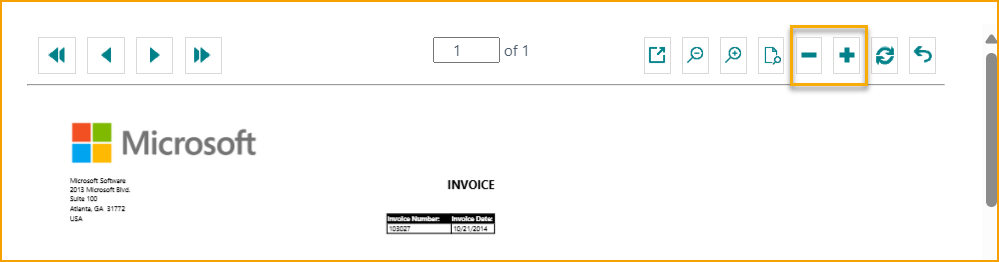
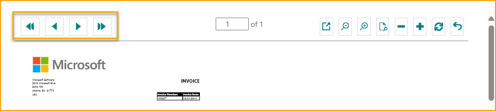

## ExFlow Import Journals

Gehe zu: ***ExFlow Import Journals***

Ein "ExFlow Import Journal" wird verwendet, um Dokumente zu importieren, Kodierungen anzuwenden, Aktionsnachrichten zu bearbeiten und Rechnungen/Gutschriften zur Genehmigung zu erstellen. Nach dem Scannen und Interpretieren der gescannten Dokumente werden Dateien erstellt und sind bereit zum Importieren.

Aus der ExFlow Import Journals-Liste ist es möglich, nach Journals zu suchen, ein neues Journal zu erstellen, aktuelle Journalzeilen zu bearbeiten und Journals zu löschen. Benutzer können auch Dokumente im Batch importieren, Rechnungen und Gutschriften im Batch erstellen, die OCR-Importwarteschlange bearbeiten/anzeigen, E-Mail-Empfangserinnerungen senden und Journals im Batch/Verifizieren.

### Dokumente aus der Interpretation im Batch importieren
Gehe zu: ***Home --> Batch Import Documents*** 
Dokumentbilder und die interpretierten Daten werden importiert.

Je nach Journal-Einstellungen werden die Dokumente in die verschiedenen Journals aufgeteilt.

Ein Journal mit dem aktivierten Kontrollkästchen "Nur Bestellabgleich-Dokumente" erhält bestellabgeglichene Dokumente und Dokumente mit Bestellnummer-Informationen. Es gibt andere Möglichkeiten, die Dokumente zu trennen, aber eine Trennung in Kosten-/Bestellrechnungen ist sehr üblich.

Die gleiche Einstellung kann für "Zeilen mit automatischem Vorschlag erstellen" vorgenommen werden. Aktivieren Sie das Kontrollkästchen "Zeilen mit automatischem Vorschlag erstellen", wenn der automatische Kodierungsvorschlag von ExFlow für ein bestimmtes Journal angewendet werden soll.

Lesen Sie mehr darüber im Abschnitt **"ExFlow Auto Coding Suggestion".**

In den Journals gibt es einen Dokumentenkopfdatensatz für jedes importierte OCR-Dokument. "Importzeilen" im unteren Abschnitt sind Zeilendetails für jedes Dokument.

Darüber hinaus ist es möglich, ein spezifisches Journal einzurichten, das für das automatische Erstellen von Dokumenten vorgesehen ist. Verwenden Sie "Personalisieren" und fügen Sie die Spalte "Dokumente automatisch erstellen" zur ExFlow Import Journals-Liste hinzu.

Aktivieren Sie dieses Kontrollkästchen, wenn interpretierte Dokumente automatisch aus dem ExFlow Import Journal erstellt werden sollen. Mit dieser Funktion werden alle interpretierten importierten Dokumente (ohne Fehler oder Warnmeldungen) automatisch erstellt und zur Genehmigung versendet.

Importieren und eine Nachricht zeigt, wie viele empfangene/importierte Dokumente und die Menge der automatisch erstellten Dokumente.

Diese Einstellung kann auch nur für bestimmte Lieferanten angewendet werden. Lesen Sie mehr darüber im Abschnitt **Lieferanteneinrichtung**.

### ExFlow Datenerfassung
Gehe zu: ***Actions --> Import --> ExFlow Data Capture***

Klicken Sie auf "ExFlow Data Capture", um zur entsprechenden Website zu gelangen. Dies funktioniert nur, wenn das Unternehmen mit einem ExFlow Data Capture-Konto verbunden ist.

### Importiertes Dokument löschen
Gehe zu: ***Manage --> Delete*** 
Wenn das Dokument in das ExFlow Import Journal importiert wurde, kann es gelöscht werden. Dann wird kein Einkaufsdokument erstellt.

### ExFlow Import Dokumentenkarte anzeigen
Gehe zu: ***Manage --> Card*** 
Öffnen Sie die ExFlow Import Dokumentenkarte für das ausgewählte Dokument.

### Dokumentstatistiken
Gehe zu: ***Manage --> Statistics (F7)*** 
Zeigen Sie statistische Informationen über das ausgewählte Dokument an.

### Dokumente importieren
Gehe zu: ***Home --> Import Documents*** 
Um Dokumente in ein ausgewähltes Journal zu importieren, öffnen Sie das Journal und importieren Sie die Dokumente.

### Dokument verifizieren
Gehe zu: ***Home --> Verify Document (Ctrl+R)*** 
Wählen Sie ein (oder mehrere) Dokument(e) zur Verifizierung über "Dokument verifizieren". Diese Funktion überprüft, ob das Dokument bereit zur Erstellung ist.

### Alle Dokumente verifizieren
Gehe zu: ***Home--> Verify All Documents*** 
Nach der Korrektur eines Fehlers wird dies eine neue Aktionsnachricht löschen oder erstellen, wenn ein Dokument noch einen Fehler hat.

### Auto Coding Suggestion -- Manuelle Auswahl
Gehe zu: ***Home --> Auto Coding Suggestion - Manual Choice*** 
Öffnet die Liste der automatischen Kodierungsvorschläge für das ausgewählte Dokument.

Die manuelle Auswahl bietet die Möglichkeit, durch verschiedene Kodierungssatz-IDs zu navigieren und manuell einen Kodierungsvorschlag auszuwählen.

#### ExFlow Kodierungsvorschlag für Import Journal -- Manuelle Auswahl
Diese Seite zeigt den besten Kodierungsvorschlag für die Rechnung, die vor dem Drücken der Schaltfläche zur manuellen Auswahl des Kodierungsvorschlags ausgewählt wurde. In der rechten oberen Ecke ist es möglich, die Kodierung aus den ausgewählten Kodierungsvorschlagszeilen für diese spezifische Setup-ID zu sehen.

**Kodierungssatz-ID anwenden:** Dies wendet die in der rechten oberen Ecke angezeigte Kodierung auf die Rechnung an.

**Dokumentzeilen anzeigen:** Öffnet die ExFlow Kodierungsvorschlag-Dokumentseite. Lesen Sie mehr im Abschnitt **Kodierungsvorschlag-Dokument**.

**Alle anzeigen:** Dies zeigt alle Setup-IDs an, um die Möglichkeit zu haben, manuell eine vorgeschlagene Kodierung für z.B. einen anderen Lieferanten auszuwählen.

**Initialen Vorschlag anzeigen:** Dies geht zurück zum initialen Vorschlag, der beim ersten Öffnen der Seite angezeigt wurde.

#### ExFlow Kodierungsvorschlag-Dokument

Auf dieser Seite wird die Kodierung detaillierter angezeigt. Es ist auch möglich, die vorgeschlagenen Zeilen mit den aktuellen Zeilen auf der Rechnung zu vergleichen.

**Vorgeschlagene Kodierung anwenden:** Dies wendet die vorgeschlagene Kodierung auf die Rechnung an.

**Neueste Kodierung vorschlagen:** Dies wendet die Kodierung aus dem zuletzt gebuchten Dokument dieses Lieferanten an.

**Vorausgewählte Kodierung vorschlagen:** Dies schlägt die Kodierung vor, die aus der Auswahl im vorherigen Fenster stammt.

**Automatische Kodierung vorschlagen:** Dies schlägt die automatische Kodierung basierend auf der automatischen Vorschlagseinstellung vor.

### Auto Coding Suggestion -- Automatisch
Gehe zu: ***Home --> Auto Coding Suggestion - Automatic*** 
Wendet die Zeilenkodierung an, die vom Vorschlagsalgorithmus ausgewählt wurde.

Dies wird eine Kodierung basierend auf den Informationen auf der Rechnung eingeben. Es wird die Kodierung basierend auf der automatischen Kodierungseinstellung auswählen.

### Aktualisieren der MwSt.-Produktbuchungsgruppe
Gehe zu: ***Startseite --> MwSt.-Produktbuchungsgruppe aktualisieren*** 
Diese Funktion kann nur zusammen mit Kunden verwendet werden, die SweBase installiert haben.

Aufgrund der schwedischen Steuervorschriften bezüglich IT-MwSt. ist es möglich, alle MwSt.-Produktbuchungsgruppen auf Rechnungszeilen zu aktualisieren.

Lesen Sie mehr im Abschnitt **SweBase** und **MwSt.-Produktbuchungsgruppe aktualisieren**.

### PDF-Viewer in neuem Tab öffnen
Gehe zu: ***Startseite --> PDF-Viewer in neuem Tab öffnen*** 
Öffnet PDF in einem neuen Tab.

### Lieferantenkarte öffnen
Gehe zu: ***Startseite --> Lieferantenkarte*** 
Öffnet die Lieferantenkarte für das spezifische Dokument.

### Bild importieren oder ersetzen
Gehe zu: ***Startseite --> Bild importieren oder ersetzen*** 
Importieren oder ersetzen Sie das aktuelle Dokumentbild.

### Stapelweise Rechnungen/Gutschriften erstellen
Gehe zu: ***Erstellen --> Stapelweise Rechnungen/Gutschriften erstellen*** 
Dies führt sowohl die Stapelüberprüfung der Dokumente durch als auch die Erstellung von Einkaufsrechnungen und Gutschriften für alle Dokumente in diesem Journal, die keine Aktionsnachricht haben.

Um das Buchungsdatum für alle Dokumente zu aktualisieren, fügen Sie ein neues Datum im Feld Buchungsdatum hinzu und aktivieren Sie Buchungsdatum ersetzen.

Wenn die Verwendung des MwSt.-Datums aktiviert ist und das Standard-MwSt.-Datum im Hauptbuchsetup das Buchungsdatum ist, wird MwSt.-Datum ersetzen automatisch als Vorschlag aktiviert.

Wenn ein oder mehrere Dokumente einen Abgrenzungscode haben, wenn das Buchungsdatum ersetzt wird, erscheint die folgende Frage.

Wählen Sie **Ja**, um das Startdatum der Abgrenzung gemäß den Einstellungen im Abgrenzungscode für alle Dokumentzeilen zu aktualisieren. 
Wählen Sie **Nein**, um das Startdatum der Abgrenzung wie erstellt auf allen Dokumentzeilen beizubehalten.

### Rechnung/Gutschrift erstellen
Gehe zu: ***Erstellen --> Rechnung/Gutschrift erstellen (F9)*** 
Stehen Sie auf der ausgewählten Dokumentzeile und klicken Sie auf Rechnung/Gutschrift erstellen, um ein Dokument zu erstellen, oder verwenden Sie die Tastenkombination F9.

Es gibt auch eine Option, mehrere Dokumente auszuwählen, die erstellt werden sollen. Verwenden Sie "Mehr auswählen", um die Dokumente auszuwählen.

Und klicken Sie einfach auf Rechnung/Gutschrift erstellen, um die ausgewählten Dokumente zu erstellen.

### Zeilen aus Excel importieren
Gehe zu: ***Aktionen --> Importieren --> Importzeilen-Excel-Vorlage herunterladen / Zeilen aus Excel importieren*** 
Manchmal ist es einfacher, in Excel zu arbeiten, wenn die Rechnung mehrere Zeilen enthält.

Beginnen Sie mit "Importzeilen-Excel-Vorlage herunterladen".

Ändern, hinzufügen und/oder löschen Sie Zeilen in Excel, speichern Sie und verwenden Sie die Funktion "Zeilen aus Excel importieren".

#### Kopieren / Einfügen von Zeilen
Es ist möglich, Zeilen aus einem anderen Dokument oder aus Excel zu kopieren und im Importjournal einzufügen. Diese Funktion funktioniert genauso wie im Business Central Standard.

### Neueste Kodierung vom Lieferanten abrufen
Gehe zu: ***Aktionen --> Importieren --> Neueste Kodierung vom Lieferanten abrufen*** 
Diese Funktion findet die letzte gebuchte Rechnung und kopiert die Zeilen mit dem Sachkonto.

### ExFlow-Datenerfassung
Gehe zu: ***Aktionen --> Importieren --> ExFlow-Datenerfassung*** 
Diese Funktion öffnet die Webseite "ExFlow-Datenerfassung" (wenn das Unternehmen mit der ExFlow-Datenerfassung verbunden ist).

### Kodierung beim Lieferanten speichern
Gehe zu: ***Aktion --> Funktionen --> Kodierung beim Lieferanten speichern*** 
Verwenden Sie diese Funktion, um die aktuelle Kodierung der Rechnungszeilen in einem ExFlow-Einkaufscode zu speichern, der auf der Lieferantenkarte gespeichert wird.

### Ausgewählte Dokumente in ein anderes Unternehmen übertragen
Gehe zu: ***Aktion --> Funktionen --> Ausgewählte Dokumente in ein anderes Unternehmen übertragen*** 
Wenn die Business Central-Datenbank mehr als ein Unternehmen enthält, kann ein Dokument in ein anderes Unternehmen verschoben werden, bevor das Dokument erstellt wird.

### Ausgewählte Dokumente in ein anderes Journal übertragen
Gehe zu: ***Aktion --> Funktionen --> Ausgewählte Dokumente in ein anderes Journal übertragen*** 
Wenn das Business Central-Unternehmen mehr als ein ExFlow-Importjournal hat, kann ein Dokument in ein anderes Journal verschoben werden, bevor das Dokument erstellt wird.

### Stapelweise Buchungsdatum aktualisieren
Gehe zu: ***Aktion --> Funktionen --> Stapelweise Buchungsdatum aktualisieren*** 
Mit dieser Funktion ist es möglich, das Buchungsdatum für Dokumente im ausgewählten Journal innerhalb des Filters zu aktualisieren.

### OCR-Importwarteschlange bearbeiten/anzeigen
Gehe zu: ***Aktion --> Funktionen --> Stapelweise Buchungsdatum aktualisieren*** 
Verwenden Sie diese Funktion, um die OCR-Importwarteschlange anzuzeigen oder zu bearbeiten. Korrigieren Sie Dokumente, die falsche Informationen enthalten, die verhindern, dass sie importiert werden.

### Bestellung -- OCR-Zeilen abgleichen
Gehe zu: ***Aktionen --> Bestellung --> OCR-Zeilen abgleichen*** 
Gleichen Sie Dokumentzeilen mit Bestellungen ab.

Bei Verwendung dieser Funktion sammelt ExFlow Informationen aus Bestellungen und Belegen usw.

Um das manuelle Zeilenabgleichen zu erleichtern, ist es möglich, die Seite "Zeilenabgleichsansicht" zu personalisieren und Felder wie "Artikelreferenznummer" und "Lieferantenartikelnummer" hinzuzufügen.

### Bestellung -- Empfangs-/Rücksendungs-/Bestellzeilen abrufen
Gehe zu: ***Aktionen --> Bestellung --> Empfangs-/Rücksendungs-/Bestellzeilen abrufen*** 
Mit dieser Schaltfläche werden Bestell-/Empfangszeilen abgerufen und dem ausgewählten Dokument hinzugefügt.

Lesen Sie mehr im Abschnitt **Bestellabgleich auf Kopfebene**.

### Stapelweise Senden von Empfangserinnerungen
Gehe zu: ***Aktionen --> E-Mail --> Stapelweise Senden von Empfangserinnerungen*** 
Mit dieser Funktion werden E-Mails an Benutzer bezüglich Empfangserinnerungen für neue Dokumente gesendet. Wenn der Wert des Einkäufercodes im Importjournal leer ist, wird eine Erinnerung an den Einkaufskoordinator gesendet.
Wenn ein Einkäufercode vorhanden ist, wird die Erinnerung an den verbundenen ExFlow-Benutzer gesendet.

### Stapelweise Senden aller Empfangserinnerungen
Gehe zu: ***Aktionen --> E-Mail --> Stapelweise Senden aller Empfangserinnerungen*** 
Diese Schaltfläche sendet E-Mails bezüglich Empfangserinnerungen ohne Einschränkungen durch Zeitstempel von früher gesendeten Erinnerungen.

### Senden von Empfangserinnerungen für ausgewählte Dokumente
Gehe zu: ***Aktionen --> E-Mail --> Senden von Empfangserinnerungen für ausgewählte Dokumente*** 
Diese Schaltfläche sendet Empfangserinnerungen nur für ausgewählte Dokumente. Erinnerungen werden jederzeit gesendet, unabhängig davon, wann die letzte Erinnerung für das/die Dokument(e) gesendet wurde.

### E-Mail-Protokoll anzeigen
Gehe zu: ***Aktionen --> E-Mail --> E-Mail-Protokoll anzeigen*** 
Diese Schaltfläche zeigt ein E-Mail-Protokoll der gesendeten Empfangserinnerungen an.

#### Einträge löschen, die älter als 30 Tage sind
Gehe zu: ***ExFlow E-Mail-Protokolle --> Aktion --> Einträge löschen, die älter als 30 Tage sind*** 
Diese Schaltfläche löscht die Liste der Protokolleinträge, die älter als 30 Tage sind.

#### Alle Einträge löschen
Gehe zu: ***ExFlow E-Mail-Protokolle --> Aktion --> Alle Einträge löschen*** 
Mit dieser Schaltfläche können alle Protokolleinträge der gesendeten Empfangsbestätigungen gelöscht werden.

#### Fehlermeldung anzeigen
Gehe zu: ***ExFlow E-Mail-Protokolle --> Aktion --> Fehlermeldung anzeigen*** 
Diese Schaltfläche zeigt an, ob Fehlermeldungen im Zusammenhang mit dem Senden von Empfangserinnerungen vorliegen.

#### Alle anzeigen
Gehe zu: ***ExFlow E-Mail-Protokolle --> Aktion --> Alle anzeigen*** 
Mit dieser Schaltfläche werden alle Einträge des E-Mail-Protokolls angezeigt. Die Einträge bestehen aus einem E-Mail-Typ, Dokumentnummer, gesendet an Adresse, gesendet von, erstellt am und Fehlermeldung.

### Vorläufige Buchungsvorschau
Gehe zu: ***Aktionen --> Vorläufige Buchung --> Buchungsvorschau*** 
Dies kann nur verwendet werden, wenn die vorläufige Buchung aktiviert ist.  
Lesen Sie mehr im Abschnitt [***Vorläufige Buchung***](https://docs.exflow.cloud/business-central/docs/user-manual/business-functionality/preliminary-posting)

### Vertrag erstellen
Gehe zu: ***Aktionen --> Vertrag --> Vertrag erstellen*** 
Wenn die Rechnung interpretiert und die Kodierung im Kopf für wiederkehrende Rechnungen hinzugefügt wird. Verwenden Sie diese Funktion, um einen Vertrag zu erstellen.
Felder im Rechnungskopf, die in den neu erstellten Vertrag kopiert werden:
* Lieferantennummer
* Referenz zur externen Vertragsnummer
* ExFlow-Einkaufscode
* Erster Genehmiger
* Genehmigungsregel
* Einkäufercode

Um die Einrichtung des Vertrags abzuschließen, lesen Sie mehr im Abschnitt [***Vertrag***](https://docs.exflow.cloud/business-central/docs/user-manual/business-functionality/contract)

### Bestellkarte
Gehe zu: ***Verwandt --> Dokument --> Bestellkarte*** 
Diese Schaltfläche öffnet die verbundene Bestellkarte für das ausgewählte Dokument.

### Vertrag anzeigen
Gehe zu: ***Verwandt --> Dokument --> Vertrag anzeigen*** 
Öffnen Sie den verbundenen ExFlow-Vertrag für das ausgewählte Dokument.

### Dimensionen
Gehe zu: ***Verwandt --> Dokument --> Dimensionen*** 
Anzeigen der Dimensionen, die für das ausgewählte Dokument festgelegt sind.

### Lieferanten-Bankkonto anzeigen
Gehe zu: ***Verwandt --> Dokument --> Lieferanten-Bankkonto*** 
Diese Schaltfläche zeigt das bevorzugte Bankkonto des Lieferanten an. Wenn es nicht existiert, wird die Liste der Lieferanten-Bankkonten für den spezifischen Lieferanten angezeigt.

### Importdetails anzeigen (OCR)
Gehe zu: ***Verwandt --> Dateien --> Importdetails anzeigen (OCR)*** 
Um die interpretierten Daten anzuzeigen, markieren Sie die richtige Dokumentzeile und gehen Sie zu "Importdetails anzeigen (OCR)". Die Daten können nicht geändert werden.

### Dokumentenbild anzeigen
Gehe zu: ***Verwandt --> Dateien --> Dokumentenbild anzeigen*** 
Um das PDF im Vollbildmodus für ein ausgewähltes Dokument zu öffnen oder verwenden Sie die Verknüpfung (Strg+I).

### ExFlow-Importdokumentkarte anzeigen
Gehe zu: ***Verwalten --> Karte*** 
Öffnen Sie die ExFlow-Importdokumentkarte für das ausgewählte Dokument.

### Lieferantenkarte anzeigen
Gehe zu: ***Weitere Optionen anzeigen --> Lieferantenkarte*** 
Diese Schaltfläche zeigt die Lieferantenkarte für das ausgewählte Dokument an.
Kann auch gefunden werden unter ***Verwandt --> Dokument --> Sonstiges --> Bild importieren oder ersetzen***

### Bild importieren oder ersetzen
Gehe zu: ***Weitere Optionen anzeigen --> Bild importieren oder ersetzen*** 
Importieren Sie eine Datei oder ersetzen Sie ein Bild im Kontextmenü im Rechnungskopf über die Funktion \'\'Bild importieren oder ersetzen\" im Importjournal. 
Kann auch gefunden werden unter ***Verwandt --> Dateien --> Sonstiges --> Bild importieren oder ersetzen***

### Dimensionen
Gehe zu: ***Mehr Optionen anzeigen --> Dokument --> Dimensionen*** 
Zeige die Dimensionen des ausgewählten Dokuments an.

### Importdetails anzeigen (OCR)
Gehe zu: ***Mehr Optionen anzeigen --> Importdetails anzeigen (OCR)*** 
Um die interpretierten Daten zu sehen, markieren Sie die richtige Dokumentzeile und gehen Sie zu "Importdetails anzeigen (OCR)". Die Daten können nicht geändert werden.
Lesen Sie mehr über Importdetails anzeigen oben

### Dokumentbild anzeigen
Gehe zu: ***Mehr Optionen anzeigen --> Dokumentbild anzeigen*** 
Öffnen Sie das PDF im Vollbildmodus für ein ausgewähltes Dokument oder verwenden Sie die Verknüpfung (Strg+I).

### ExFlow Importjournal -- Importzeilen
#### Neue Zeile
Gehe zu: ***Importzeilen --> Verwalten --> Neue Zeile*** 
Fügen Sie eine neue Zeile hinzu, um einen neuen Eintrag zu erstellen.

#### Zeile löschen
Gehe zu: ***Importzeilen --> Verwalten --> Zeile löschen*** 
Löschen Sie die ausgewählte Zeile.

#### Bestellkarte
Wenn die Dokumentzeile mit einer Bestellung abgeglichen ist, klicken Sie auf Bestellkarte, um die entsprechende Bestellkarte zu öffnen. 
Gehe zu: ***Importzeilen --> Zeile --> Bestellkarte***

#### Dimensionen
Gehe zu: ***Importzeilen --> Zeile --> Dimensionen*** 
Zeigen Sie alle Dimensionen für die aktuelle Zeile an.

#### Genehmigungsvorschlag anzeigen
Zeigt den aktuellen Genehmigungsvorschlag für die ausgewählte Dokumentzeile an. 
Gehe zu: ***Importzeilen --> Zeile --> Genehmigungsvorschlag anzeigen***

#### Verfügbare Genehmigungsregeln anzeigen
Gehe zu: ***Importzeilen --> Zeile --> Verfügbare Genehmigungsregeln anzeigen*** 
Dies zeigt alle verfügbaren Genehmigungsregeln mit der höchsten Priorität oben an.

#### Artikelkostenverteilung
Bei Verwendung von Charge (Artikel) kann die Zuordnung auf drei Arten erfolgen: Vom Importjournal, automatisch oder manuell von der Rechnungskarte.

Manuell vom Importjournal. 
Gehe zu: ***Importzeilen --> Zeile --> Artikelkostenverteilung*** 

Lassen Sie ExFlow die Artikelkosten automatisch zuweisen. Fügen Sie eine Option hinzu, wie die Zuordnung berechnet werden soll "Gleichmäßig, Nach Betrag, Nach Gewicht oder Nach Volumen" im Feld "Automatische Artikelkostenverteilung" unter PO Matching in ExFlow
Setup.

Wenn die automatische Artikelkostenverteilung verwendet wird, wird Charge (Artikel) zugewiesen, wenn Änderungen im Genehmigungsstatus überprüft werden, und es ist nicht mehr möglich, manuell vom Importjournal zuzuweisen.

Die automatische Artikelkostenverteilung kann auch pro Lieferant festgelegt werden. Gehen Sie zu ExFlow Lieferanteneinstellungen, um eine spezifische Artikelkostenoption für einen bestimmten Lieferanten zuzuweisen oder einen bestimmten Lieferanten auszuschließen (wenn diese Funktion in ExFlow Setup aktiviert ist), indem Sie die Option "Keine" wählen.

#### Abgrenzungsplan
Gehe zu: ***Importzeilen --> Zeile --> Abgrenzungsplan*** 
Wenn ein Abgrenzungsvorlagen-Code angegeben ist, klicken Sie auf Abgrenzungsplan, um den Abgrenzungsplan für die ausgewählte Dokumentzeile anzuzeigen/zu bearbeiten. In ExFlow wird der Abgrenzungsplan für das ExFlow-Genehmigungsdokument und nicht
die Einkaufsrechnung verwendet.

#### Interpretierte Zeilen abrufen
Gehe zu: ***Importzeilen --> Zeile --> Interpretierte Zeilen abrufen*** 
Verwenden Sie diese Funktion, um verlorene oder gelöschte interpretierte Zeilen abzurufen. ExFlow füllt die Rechnung mit interpretierten Zeilen aus den OCR-Importdetails.

Wenn ein Benutzer versehentlich alle Zeilen löscht, ist es möglich, "Interpretierte Zeilen abrufen" zu verwenden, um alle nach dem Import vorgenommenen Änderungen zurückzusetzen.

#### Verfügbare Genehmigungsregeln anzeigen
Gehe zu: ***Importzeilen --> Zeile --> Verfügbare Genehmigungsregeln anzeigen*** 
Diese Funktion zeigt alle verfügbaren Genehmigungsregeln für die ausgewählte Dokumentzeile an.

#### Aktuelle Dimensionseigentümer anzeigen
Gehe zu: ***Importzeilen --> Zeile --> Aktuelle Dimensionseigentümer anzeigen*** 
Zeigen Sie die ExFlow-Dimensionseigentümer für die aktuelle Liste der vorgeschlagenen Genehmiger an.

#### Budget anzeigen
Wenn die G/L-Budgetkontrolle aktiviert ist, ist es möglich, berechnete Werte anzuzeigen.
Lesen Sie mehr im Abschnitt [***G/L Budget Control***](https://docs.exflow.cloud/business-central/docs/user-manual/business-functionality/gl-budget-control)

### FactBoxes im Import Journal
Rechts im Import Journal befinden sich nützliche FactBoxes.

#### PDF-Vorschau
Ändern Sie die Größe der PDF-Vorschau. Drücken Sie - / +, um die Größe des PDFs zu verringern oder zu vergrößern.

Setzen Sie die Größe des FactBox zurück. Klicken Sie auf "Wiederherstellen".

"Verkleinern", "Vergrößern" und Zoom zurücksetzen

Ändern Sie die PDF-Seitennummer mit den "Aufnahmetasten".

Öffnen Sie die PDF-Datei in voller Größe.

Gehen Sie zu: ***Related --> Files --> Show Document Image (Ctrl+I)***

#### Diskussionspanel (Nachricht wird gesendet, wenn das Dokument erstellt wird)
Wenn ein Kommentar im Diskussionspanel von einem Dokument im Import Journal hinzugefügt und gesendet wurde, kann er nur im FactBox rechts mit der Kennung des erstellenden Benutzers, Datum und Uhrzeit angezeigt werden.

Wenn ein ExFlow-Benutzer, der ein Systembenutzer ist, mit @ erwähnt wird, wird die Benachrichtigung beim Einloggen in Business Central angezeigt. Eine E-Mail-Nachricht kann ebenfalls gesendet werden, jedoch erst, wenn das Dokument erstellt wurde, da ExFlow-Webbenutzer keine Dokumente oder Kommentare im Import Journal sehen können.

Auf ExFlow Web wird die Nachricht im Chat auf dem Dokument angezeigt, nachdem es erstellt wurde.

Lesen Sie mehr über Einstellungen und die Verwendung des Diskussionspanels im Abschnitt [***Discussion Panel / Chat and Line Comments***](https://docs.exflow.cloud/business-central/docs/user-manual/approval-workflow/notifications-in-business-central#discussion-panel--chat-and-line-comments)

#### Eingehende Dokumentdateien
Gehen Sie zu: ***FactBox --> Incoming Document Files --> Attach File*** 
Datei anhängen

Klicken Sie auf "Auswählen", suchen Sie die anzuhängende Datei und klicken Sie auf "Öffnen".

#### Genehmigungsvorschlag
Genehmiger für die aktuelle Dokumentzeile anzeigen.
Von: ***Approval Proposal --> Show Approval Proposal*** 
Genehmiger können manuell hinzugefügt werden. Dies sollte nur in besonderen Fällen verwendet werden.

#### Dokumentdetails
Wenn der Betrag im Dokumentkopf und der Gesamtbetrag auf den Dokumentzeilen nicht denselben Wert haben, können die Dokumentdetails helfen, den Differenzbetrag zu sehen und ob dies auf den direkten Stückkosten ohne MwSt., den direkten Stückkosten mit MwSt., den MwSt.-Betrag oder die Vorauszahlung zurückzuführen ist.

#### Dokumentbild anzeigen (Ctrl + I) / PDF exportieren

Wenn ein Dokument zur Genehmigung erstellt wurde, kann das Dokumentbild (PDF) mit dem Kurzbefehl (Ctrl+I) an folgenden Stellen angezeigt werden:

- Einkaufsrechnung 
- Einkaufsgutschrift 
- Gebuchte Einkaufsrechnung 
- Gebuchte Einkaufsgutschrift 
- Kreditorenposten 
- Gebuchte G/L-Einträge 
- Gebuchte MwSt.-Einträge 
- ExFlow Import Journal 
- ExFlow Genehmigungsstatus 
- ExFlow Genehmigungsstatus --> Änderungen überprüfen  
- ExFlow Genehmigungsstatusverlauf

Im Import Journal, Genehmigungsstatus und Genehmigungsstatusverlauf ist es möglich, mehrere Dokumente auszuwählen, bevor der Kurzbefehl Ctrl+I verwendet wird:

Wenn mehrere Dateien ausgewählt sind, gibt es eine Option, eine komprimierte Datei zu speichern, die PDF-Dateien für alle ausgewählten Dokumente an einem bestimmten Ort enthält. Dies ist eine großartige Möglichkeit, viele PDFs bei Bedarf zu exportieren.

"Dokumentbild anzeigen" kann auch über das Menü unter Related erreicht werden.

### Warnmeldungen
Wenn die Aktionsmeldung "Es gibt noch nicht akzeptierte Warnmeldungen!" anzeigt, wird die Meldung im FactBox "Warnmeldungen" angezeigt. Nehmen Sie die entsprechenden Änderungen vor oder "Akzeptieren Sie alle Warnungen" wie im Bild unten.

### Übereinstimmung mit der Währung des Lieferanten
Wenn ExFlow überprüfen soll, ob der Währungscode auf jeder importierten Rechnung mit der Standardwährung des Lieferanten übereinstimmt, muss die Einstellung "Übereinstimmung mit der Währung des Lieferanten" aktiviert werden. Finden Sie die Einstellung unter Dokumenterstellungskontrollen in den ExFlow-Einstellungen.

Wenn diese Einstellung aktiv ist, gibt ExFlow eine Warnung für jedes Dokument im Importjournal aus, bei dem die Währung des Dokuments von der Standardwährung des Lieferanten abweicht.

ExFlow vergleicht den Inhalt des Währungsfeldes auf dem Dokument im Importjournal mit der Standardwährung des Lieferanten (d.h. den Inhalt des Währungsfeldes auf der Lieferantenkarte). 
Wenn der Lieferant eine leere (leere) Währung hat, führt ExFlow keine Validierung durch.

### Löschen von G/L-Kontenzeilen mit Zeilenbetrag = Null
Gehen Sie zu: ***ExFlow Setup --> Dokumentbuchungskontrollen --> Löschen von G/L-Kontenzeilen mit Zeilenbetrag = Null*** 
Wenn Kontenzeilen mit einem Zeilenbetrag von 0 (null) zu einem Dokument hinzugefügt werden müssen, bevor es erstellt wird, aber nicht beim Buchen beibehalten werden sollen, ist es ratsam, "Löschen von G/L-Kontenzeilen mit Zeilenbetrag = Null" in den ExFlow-Einstellungen zu aktivieren.

Wenn diese Einstellung aktiviert ist, werden alle Dokumentzeilen mit einem Betrag von null vor dem Buchen des Dokuments gelöscht.

### Dokument zuweisen
Es besteht die Möglichkeit, Zahlungen einem Dokument zuzuweisen. Zum Beispiel, um eine Rechnung einem Gutschriftvermerk in den Lieferantenbuchungsposten zuzuweisen, wenn der Gutschriftvermerk gebucht wird. 
Um diese Felder zu verwenden, müssen sie zuerst durch Personalisierung hinzugefügt werden.

**Dokumenttyp zuweisen** gibt den Typ des gebuchten Dokuments an, dem dieses Dokument oder die Journalzeile beim Buchen zugewiesen wird, zum Beispiel zur Registrierung einer Zahlung.

**Dokumentnummer zuweisen** gibt die Nummer des gebuchten Dokuments an, dem dieses Dokument oder die Journalzeile beim Buchen zugewiesen wird, zum Beispiel zur Registrierung einer Zahlung.

### Mehrwertsteuerdifferenz zulassen
Wenn die Mehrwertsteuerdifferenz in den Einkaufs- und Verbindlichkeits-Einstellungen aktiviert ist, kann die Mehrwertsteuer-Rundung in den Statistiken im Importjournal hinzugefügt werden, bevor das Dokument erstellt wird. 
Die maximale Mehrwertsteuerdifferenz wird durch Einstellungen im Hauptbuch oder durch den aktuellen Währungscode gehandhabt.

Über Einstellungen kann ExFlow die Mehrwertsteuerdifferenz automatisch zuweisen. Dann wird die Mehrwertsteuerdifferenz proportional auf alle Zeilen verteilt.

Aktivieren Sie **"Automatische Zuweisung der Mehrwertsteuerdifferenz für die Erstellung"** in den ExFlow-Einstellungen unter dem Abschnitt Dokumenterstellungskontrolle für das Importjournal.

Aktivieren Sie **"Automatische Zuweisung der Mehrwertsteuerdifferenz für die Buchung"** in den ExFlow-Einstellungen unter dem Abschnitt Dokumentbuchungskontrollen für den Genehmigungsstatus unter Dokumentbuchungskontrollen.

**Empfohlen, beide zu verwenden.**
ExFlow wird dann die Mehrwertsteuerdifferenz automatisch hinzufügen, wenn die Mehrwertsteuerdifferenz innerhalb der Einstellungen im Hauptbuch oder durch den aktuellen Währungscode liegt.

Wenn der Betrag während des Genehmigungsprozesses geändert wird, löscht Business Central die Mehrwertsteuerdifferenz auf der aktualisierten Zeile. Dann kann ExFlow automatisch neu zuweisen, wenn Änderungen im Genehmigungsstatus überprüft werden.

Wenn der Mehrwertsteuerbetrag auf den Zeilen nach der Dokumenterstellung manuell auf der Karte geändert wird, fragt ExFlow:

*"Möchten Sie den Mehrwertsteuerbetrag im ExFlow-Genehmigungsstatus aus dem Mehrwertsteuerbetrag der Zeilen aktualisieren?"* 
Antworten Sie mit Ja, um den gesamten Mehrwertsteuerbetrag im Genehmigungsstatus zu aktualisieren.

**Empfohlene Einstellungen:**
Wenn Sie mit der automatischen Zuweisung der Mehrwertsteuerdifferenz und Rundung auf Rechnungen/Gutschriften beim Buchen arbeiten. Fügen Sie KEINE Mehrwertsteuer auf das Hauptbuchkonto hinzu, das für die Rundung verwendet wird.

Eine Mehrwertsteuerdifferenz ist auf einem Dokument, das nur Zeilen mit Mehrwertsteuer enthält, nicht zulässig. Nur wenn die Mehrwertsteuer auf den Zeilen berechnet wird.

Die automatische Zuweisung überschreibt manuell hinzugefügte Mehrwertsteuerbeträge in den Statistiken.

### Verschiebung der Abgrenzung nach vorne
Die Verschiebung der Abgrenzung nach vorne verschiebt automatisch Abgrenzungen innerhalb geschlossener Abgrenzungszeiträume auf den nächsten offenen Zeitraum beim Buchen von Einkaufsrechnungen und Einkaufsgutschriften, unabhängig davon, ob das Dokument für die ExFlow-Genehmigung aktiv ist oder nicht.

Zum Beispiel:
Erlauben Sie die Abgrenzungsbuchung ab dem 15.01.2023.

Erstellen Sie eine Rechnung mit einem Abgrenzungsplan für drei Monate und einem Startdatum am Buchungsdatum.

15.01.2023 // 5.000,00 
01.02.2023 // 10.000,00 
01.03.2023 // 10.000,00 
15.04.2023 // 5.000,00

Nach dem monatlichen Abschluss aktualisieren Sie die Erlaubnis für den Abgrenzungsplan auf den 01.02.2023.

Beim Buchen fragt Business Central, ob Sie das Startdatum der Abgrenzung und das Buchungsdatum auf den 01.02.2023 aktualisieren möchten.

Wenn ja, verschiebt Business Central alle Perioden nach vorne.

01.02.2023 // 10.000,00 
01.03.2023 // 10.000,00 
01.04.2023 // 10.000,00

Wenn Sie jedoch stattdessen mit Nein antworten und ExFlow die Abgrenzung nach vorne verschieben lassen, wird der Januar dem Februar hinzugefügt, da dies der erste erlaubte Buchungszeitraum für Abgrenzungen ist.

01.02.2023 // 15.000,00 
01.03.2023 // 10.000,00 
15.04.2023 // 5.000,00

### Nutzung des Feldes Beschreibung 2

Es ist möglich, das Feld Beschreibung 2 durch Personalisierung zu den Importjournalzeilen hinzuzufügen.

Für PO-abgestimmte Rechnungen wird der Wert im Feld Beschreibung 2 der Einkaufszeile von der PO/Empfangszeile zur entsprechenden Importjournal-Rechnungszeile übertragen.

Dasselbe gilt für Kosten-/Ausgabenrechnungen, das Feld Beschreibung 2 steht im Importjournal zur Verfügung, damit Benutzer manuell Text eingeben können.

Jeder im Feld Beschreibung 2 eingegebene Text wird in ExFlow Web sichtbar sein.

Um die Webspalte Beschreibung 2 hinzuzufügen, gehen Sie zu **ExFlow Setup --> Webspalten bearbeiten** und klicken Sie dann auf ''Spalte hinzufügen''.

Lesen Sie mehr über Webspalten im Abschnitt [***ExFlow Web.***](https://docs.exflow.cloud/business-central/docs/user-manual/technical/exflow-web#exflow-web)
