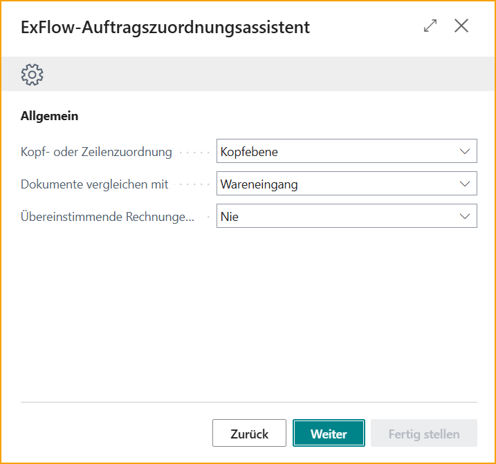
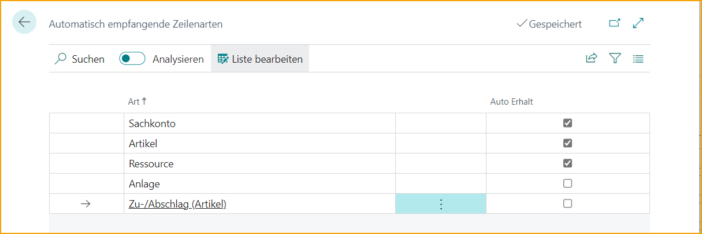

## Neue Auftragsabgleich-Erfahrung

Um die neue Auftragsabgleich-Erfahrung mit der Auftragsabgleich-Engine und all ihren Verbesserungen zu nutzen, muss die neue Funktion für den Einkaufsauftragsabgleich in der ExFlow Funktionsverwaltung aktiviert werden.

### ExFlow Funktionsverwaltung

Gehen Sie zu: **ExFlow Funktionsverwaltung**, um die neue Auftragsabgleich-Funktion zu aktivieren.

 
Lesen Sie mehr darüber im Abschnitt [**Erste Schritte**](https://docs.signupsoftware.com/business-central/docs/user-manual/welcome-to-exflow/get-started)

## Ausführen des neuen Auftragsabgleich-Assistenten

Dieses Benutzerhandbuch ist Ihr Leitfaden für die Einrichtung Ihres Auftragsabgleichsprozesses, um Dokumente mühelos mit Aufträgen abzugleichen. Mit Blick auf Einfachheit konzipiert, macht der neue Auftragsabgleich-Assistent den Prozess unkompliziert und benutzerfreundlich.

Suchen Sie nach ExFlow Auftragsabgleich-Assistent.

### Allgemein

### Kopf- oder Zeilenabgleich
Der erste Schritt bei der Einrichtung des Auftragsabgleich-Assistenten besteht darin, festzulegen, ob der Abgleich von Dokumenten mit Einkaufsaufträgen/Rücksendeaufträgen auf Kopfebene oder Zeilenebene durchgeführt werden soll.

**Kopfebene-Abgleich:**
Wenn Sie den Kopfebene-Abgleich wählen, vergleicht der Auftragsabgleich den Gesamtrechnungsbetrag mit dem verfügbaren Gesamtwert des Einkaufsauftrags.

Diese Methode eignet sich, wenn die Details einzelner Artikel oder Dienstleistungen auf der Rechnung nicht mit bestimmten Artikeln auf dem Einkaufsauftrag abgeglichen werden müssen, oder wenn die Rechnungszeilenangaben für einen genauen Abgleich zu dürftig sind.

**Zeilenebene-Abgleich:**
Wenn Sie den Zeilenebene-Abgleich wählen, vergleicht der Auftragsabgleich jede interpretierte Rechnungszeile mit den entsprechenden Zeilenpositionen auf dem Einkaufsauftrag.

Dieser Ansatz stellt sicher, dass jeder einzelne Artikel oder jede Dienstleistung auf der Rechnung genau mit dem entsprechenden Artikel auf dem Einkaufsauftrag abgeglichen wird.

Der Zeilenabgleich verwendet interpretierte Informationen wie Rechnungsmenge, Einzelpreis, Zeilensumme und mehr, um eine genaue Übereinstimmung mit der entsprechenden Einkaufsauftragszeile zu erzielen und mögliche Diskrepanzen identifizieren zu können.

### Dokumente abgleichen mit
Der nächste Schritt besteht darin, festzulegen, wie Rechnungen mit Einkaufsaufträgen in Bezug auf Wareneingänge abgeglichen werden sollen.
Es gibt drei Optionen zu berücksichtigen:

#### **Wareneingang:**
Wählen Sie diese Option, wenn Rechnungen nur mit Einkaufsaufträgen abgeglichen werden sollen, die zugehörige Wareneingänge haben.

Dies stellt sicher, dass die Artikel im Lager eingegangen und erfasst sind und mit der Rechnung übereinstimmen, bevor die Rechnung abgeglichen und zur Genehmigung und endgültigen Buchung gesendet wird. 

#### **Auftrag und Wareneingang:**
Wenn Sie eine Kombination aus Wareneingang und Auftrag bevorzugen, wählen Sie diese Option.

In diesem Fall können Rechnungen mit Einkaufsaufträgen mit oder ohne zugehörige Wareneingänge abgeglichen werden, was maximale Flexibilität in Abgleichsszenarien bietet.

Möglichkeit, Rechnungszeilen mit Einkaufsaufträgen mit und ohne empfangene Artikelzeilen abzugleichen. Außerdem ist es möglich, Rechnungszeilen mit teilweise empfangenen Artikelzeilen auf dem Auftrag abzugleichen und sie zur Genehmigung und Buchung zu senden.

### Automatische Genehmigung abgeglichener Rechnungen

#### **Nie:**
Wählen Sie diese Option, wenn alle abgeglichenen Rechnungen manuell genehmigt werden sollen. In diesem Fall werden keine Rechnungen automatisch genehmigt, unabhängig von Unterschieden oder Schwellenwerten.

(Wenn Nie ausgewählt ist --> Nächster Schritt im Assistenten wäre: Andere und automatische Differenz)

#### **Wenn die Differenz innerhalb der Toleranz liegt:**
Wählen Sie diese Option, wenn abgeglichene Rechnungen nur dann automatisch genehmigt werden sollen, wenn die Differenz zwischen der Rechnung und dem Einkaufsauftrag innerhalb des festgelegten zulässigen Schwellenwerts oder der Toleranz für die automatische Genehmigung liegt.

Diese Option ermöglicht eine effiziente Verarbeitung von Rechnungen mit geringfügigen Abweichungen und stellt sicher, dass nur wesentliche Unterschiede eine manuelle Genehmigung erfordern.

(Wenn diese Option ausgewählt ist --> Nächster Schritt im Assistenten wäre: Automatische Genehmigung und Toleranz für die automatische Genehmigung)

#### **Wenn der abgeglichene Auftrag genehmigt ist:**
Diese Option fügt eine zusätzliche Genehmigungsebene hinzu, indem sie erfordert, dass der abgeglichene Auftrag durch ExFlow überprüft und genehmigt wurde, um sicherzustellen, dass Rechnungen nur dann automatisch genehmigt werden, wenn die erforderliche Autorisierung vorliegt.

(Wenn diese Option ausgewählt ist --> Nächster Schritt im Assistenten wäre: Automatische Genehmigung und Toleranz für die automatische Genehmigung)

### Maximaler Betrag für die automatische Genehmigung
Wenn Sie die automatische Genehmigung abgeglichener Rechnungen zugelassen haben, können Sie hier den maximalen Betrag für die automatische Genehmigung festlegen. Dieser Parameter definiert die Schwelle, über die Rechnungen unabhängig von den Abgleichsergebnissen eine manuelle Genehmigung erfordern.

### Warnung bei Toleranzverletzung
Aktivieren Sie diese Einstellung, wenn Sie möchten, dass die Buchhalter während des Imports von abgeglichenen Einkaufsrechnungen eine Warnung erhalten, wenn es Abweichungen über Ihrer zulässigen Toleranz für die automatische Genehmigung gibt. 
Unabhängig davon, ob diese Einstellung aktiviert ist oder nicht, erfordern Abweichungen, die höher als Ihre zulässige Toleranz sind, immer eine manuelle Genehmigung der Rechnungszeile.

### Abweichung direkter Einstandspreis (%) und Abweichung direkter Einstandspreis (Betrag LCY)
Definieren Sie die Abweichungsschwellenwerte für den direkten Einstandspreis von Rechnungszeilen im Vergleich zu den abgeglichenen Auftragszeilen. Diese Schwellenwerte bestimmen die zulässigen Unterschiede zwischen der Rechnung und dem Einkaufsauftrag für die automatische Genehmigung.

### Wareneingänge und -lieferungen automatisch buchen
Die Funktion "Wareneingänge und -lieferungen automatisch buchen" ermöglicht die automatische Buchung von Wareneingängen im Abgleichsprozess. Bitte beachten Sie jedoch, dass diese Funktion nur genutzt werden kann, wenn Dokumente mit *„Auftrag und Wareneingang“* abgeglichen werden.

Das Abgleichen von Dokumenten mit der Logik *„Auftrag und Wareneingang“* ermöglicht es ExFlow, eine Rechnung/Gutschrift vollständig abzugleichen und zur Genehmigung und Buchung zu senden. Business Central erfordert jedoch immer, dass Wareneingänge/-lieferungen gebucht werden, bevor die abgeglichene Rechnung/Gutschrift gebucht werden kann und der Einkaufsauftrag/Rücksendeauftrag fakturiert/gutgeschrieben werden kann.

Diese Einstellung ermöglicht es ExFlow, die genehmigte Menge der abgeglichenen Dokumentzeilen automatisch zu buchen und zu fakturieren. Sie wird ausgeführt, sobald das Dokument den Status „Bereit zur Buchung“ im Genehmigungsstatus hat. Wenn diese Einstellung deaktiviert ist, müssen Sie die Wareneingänge/-lieferungen manuell buchen.

### Automatische Differenzbehandlung
Die Funktion zur automatischen Differenzbehandlung ermöglicht es ExFlow, automatisch eine Differenzzeile vorzuschlagen, wenn während des Auftragsabgleichs zusätzliche oder unerwartete Kosten wie Fracht oder andere Gebühren identifiziert werden. 
Sie können wählen, ob ExFlow eine Rechnungszeile des Typs Artikelgebühr oder Sachkonto vorschlagen soll.
Geben Sie dann an, welches Sachkonto oder welche Artikelgebühr für die vorgeschlagene Zeile verwendet werden soll.

### Max. Betrag (LCY) und Max. Betrag (%)
Hier können Sie eine zulässige Toleranz für die automatisch vorgeschlagene Differenzzeile für die automatische Genehmigung festlegen.

### Assistent abschließen
Klicken Sie auf "Fertig stellen", um den Assistenten zu schließen und die Einstellungen anzuwenden.

## Auftragsabgleich-Einrichtung

Gehen Sie zu: **ExFlow Auftragsabgleich-Einrichtung**

Für die *Neue Auftragsabgleich-Erfahrung* wurden alle Auftragsabgleich-Einstellungen aus der ExFlow-Einrichtung herausgehoben und sind nun auf einer eigenen gesammelten Seite verfügbar.

Ein Link zu dieser neuen ''Auftragsabgleich-Einrichtung'' wird jedoch in der ExFlow-Einrichtung --> Auftragsabgleich-Abschnitt bereitgestellt.

| Auftragsabgleich-Einrichtung - Verwandt |   | 
|:-|:-|
|Kopfwerte in Rechnung/Gutschrift kopieren| Lesen Sie mehr darüber [***hier***](https://docs.signupsoftware.com/business-central/docs/user-manual/approval-workflow/new-order-matching#copy-header-values-to-invoicecredit-memo-setup)
|Automatische Empfangszeilentypen| Lesen Sie mehr darüber [***hier***](https://docs.signupsoftware.com//business-central/docs/user-manual/approval-workflow/new-order-matching#auto-receiving-line-types)
|Artikel-Nr. Abgleich-Priorität| Lesen Sie mehr darüber [***hier***](https://docs.signupsoftware.com/business-central/docs/user-manual/approval-workflow/new-order-matching#item-no-matching-priority)
|Auftragsabgleich-Priorität| Legen Sie eine Auftragsabgleich-Priorität für Ihr Unternehmen fest. Dies ist eine Einstellung nur für die neue Auftragsabgleich-Funktion. Lesen Sie mehr darüber [***hier***](https://docs.signupsoftware.com/business-central/docs/user-manual/approval-workflow/new-order-matching#order-matching-priority)

Obige Funktionen können auch auf Lieferantenebene in der "ExFlow Lieferanteneinrichtung" verwendet werden.

### Auftragsabgleich-Einrichtungsabschnitte

### Allgemein
| Allgemein|   | 
|:-|:-|
|Aktiviert| Gibt an, ob der Auftragsabgleich für das Unternehmen aktiviert ist. Diese Einstellung wird verwendet, um die Auftragsabgleich-Funktionalität für das Unternehmen zu aktivieren oder zu deaktivieren, nachdem die Funktion aktiviert wurde.
|Dokumente abgleichen mit| Gibt an, ob ExFlow Zeilen aus gebuchten Wareneingängen/-lieferungen oder aus sowohl Aufträgen als auch Wareneingängen/-lieferungen abgleichen und abrufen soll.
|Wareneingänge und -lieferungen automatisch buchen|Gibt an, ob Einkaufsauftragszeilen jedes Zeilentyps automatisch empfangen werden sollen, wenn die abgeglichene Rechnung auf "Bereit zur Buchung" gesetzt ist. Diese Option ist nur anwendbar, wenn die Einstellung "Dokumente abgleichen mit" als "Auftrag und Wareneingang" konfiguriert ist.   Beim Ausführen von Änderungen im Genehmigungsstatus wird der Wareneingang der abgeglichenen Einkaufsauftragszeilen am Rechnungsbelegdatum gebucht.   Das MwSt.-Datum im Einkaufsauftrag-Kopf und die Abgrenzungsbuchungsdaten in den Einkaufsauftragszeilen werden automatisch aktualisiert, wenn das Buchungsdatum des Einkaufsauftrags vom Buchungsdatum der Rechnung abweicht.   Wenn sowohl der Einkaufsauftrag als auch die Rechnung dasselbe Buchungsdatum haben, wenn Änderungen überprüft werden, gibt es keine Aktualisierungen am Einkaufsauftrag.  Das Buchungsdatum des Einkaufsauftrags wird auch aktualisiert, wenn es leer ist. (Einkaufs- und Verbindlichkeits-Einrichtung - Standardbuchungsdatum = Kein Datum)
|Zeilen automatisch abrufen|Rufen Sie automatisch alle verfügbaren Zeilen aus dem Einkaufsauftrag oder dem gebuchten Wareneingang ab, wenn Sie auf Kopfebene abgleichen.
|Kopfwerte in Rechnung/Gutschrift kopieren|Aktivieren Sie Felder, um Werte vom Einkaufsauftrag zur Rechnung (oder vom Rücksendekaufauftrag zur Gutschrift) im Importjournal zu übertragen, wenn Sie auf Kopfebene abgleichen. Ausgewählte Werte können unter Verwandt --> Erweitert --> PO-Kopfwerte in Rechnung-Einrichtung gefunden und aktualisiert werden.

### Automatische Genehmigung
| Automatische Genehmigung|   | 
|:-|:-|
|Dokumente automatisch genehmigen| Gibt an, ob die Rechnung automatisch genehmigt werden soll, wenn der zugehörige Auftrag genehmigt ist
|Benutzer für automatische Genehmigung|Gibt den ExFlow-Benutzer an, der für automatisch genehmigte Rechnungen verwendet werden soll. Wenn diese Einstellung leer ist, wird die ID des angemeldeten BC-Benutzers verwendet
|Max. Betrag für automatische Genehmigung (LCY) |Gibt den maximalen Rechnungsbetrag an, der für automatische Genehmigungen zulässig ist. 0 = deaktiviert
|Max. Sonstige Kosten (LCY) | Toleranz für das Feld "Rechnungen automatisch genehmigen". Der Gesamtbetrag der Rechnungszeilen, die nicht mit PO-Zeilen abgeglichen sind. (Zum Beispiel Fracht). Wenn eine Rechnung erstellt wird, werden Zeilen nicht automatisch genehmigt, wenn Sie den maximalen sonstigen Betrag überschritten haben.
|Maximale Abweichung|
|Direkter Einstandspreis (LCY) |Gibt die maximal zulässige Preisabweichung zwischen dem Rechnungseinstandspreis und dem Einstandspreis des Einkaufsauftrags (in LCY) an. 
|Direkter Einstandspreis %|Gibt die maximal zulässige Preisabweichung zwischen dem Rechnungseinstandspreis und dem Einstandspreis des Einkaufsauftrags (in %) an
|Erinnerung an nicht empfangene Aufträge für genehmigte Aufträge senden|Eine Erinnerung an nicht empfangene Aufträge wird gesendet, wenn das Dokument genehmigt ist und nicht alle Auftragszeilen vollständig empfangen wurden. Damit dies funktioniert, sollte "Dokumente abgleichen mit" auf "Wareneingang" gesetzt sein.    Lesen Sie mehr darüber im Abschnitt [***Nicht empfangener Auftrag - Genehmigt***](https://docs.signupsoftware.com/business-central/docs/user-manual/approval-workflow/email-reminders#unreceived-order---approved)

### Zeilenabgleich-Logik
| Zeilenabgleich-Logik|   | 
|:-|:-|
|Abgleichtoleranz|
|Einstandspreis %|Gibt die Abgleichtoleranz (in %) an, wenn eine Rechnung mit einem Einkaufsauftrag unter Verwendung des Zeileneinstandspreises abgeglichen wird. 0 = deaktiviert, d.h. eine genaue Übereinstimmung ist erforderlich
|Menge %|Gibt die Abgleichtoleranz (in %) an, wenn eine Rechnung mit einem Einkaufsauftrag unter Verwendung der Zeilenmenge abgeglichen wird. 0 = deaktiviert, d.h. eine genaue Übereinstimmung ist erforderlich
|Geteilte Rechnungszeilen überprüfen|Wenn "Mehrfachzeilenabgleich" wahr ist, gibt ExFlow Aktionsmeldungen für jede Zeile aus, die geteilt wurde, was dem Benutzer die Möglichkeit gibt, den vorgeschlagenen Abgleich manuell zu bestätigen, bevor das Dokument erstellt wird. Wenn diese Einstellung auf falsch gesetzt ist, werden keine Aktionsmeldungen für abgeglichene geteilte Zeilen angezeigt.
|Direkten Einstandspreis überprüfen|Gibt an, dass ExFlow den Einstandspreis auf der Rechnungszeile überprüfen soll, wenn Rechnungen mit Einkaufsaufträgen abgeglichen werden. Die importierte Rechnung muss für diese Funktion zeileninterpretiert sein
|Zeilenrabatt % überprüfen|Gibt an, dass ExFlow den Zeilenrabatt % auf der Rechnungszeile überprüfen soll, wenn Rechnungen mit Einkaufsaufträgen abgeglichen werden. Die importierte Rechnung muss für diese Funktion zeileninterpretiert sein

### Diskrepanzbehandlung und Anpassungen
| Diskrepanzbehandlung und Anpassungen |   | 
|:-|:-|
|*Automatische Differenzzeile*|
|Aktivieren| Gibt an, dass ExFlow eine neue Zeile mit dem Differenzbetrag erstellt, wenn es eine Preisabweichung zwischen dem Gesamteinkaufsauftrag und der Gesamtrechnung gibt
|ExFlow Einkaufscode|Gibt an, welchen Einkaufscode ExFlow verwenden soll, wenn die Differenzzeile erstellt wird
|Max. Betrag (LCY) |Gibt den maximalen Betrag an, wenn die Differenzzeile erstellt wird. Wenn der Differenzbetrag diesen Wert überschreitet, wird keine Differenzzeile erstellt. 0 = deaktiviert
|Max. Betrag (%)|Gibt den maximalen Differenzprozentsatz an, wenn die Differenzzeile erstellt wird. Wenn der Differenzprozentsatz diesen Wert überschreitet, wird keine Differenzzeile erstellt. 0 = deaktiviert
|Automatische Artikelgebührenzuweisung|Gibt an, welche Art der Artikelgebührenzuweisung beim Buchen von Rechnungen verwendet werden soll. Dies kann automatisch nach Menge, Gewicht oder Volumen erfolgen. Keine = keine automatische Zuweisung.    Lesen Sie mehr darüber im Abschnitt [***Artikelgebührenzuweisung***](https://docs.signupsoftware.com/business-central/docs/user-manual/approval-workflow/exflow-import-journals#item-charge-assignment)

### Zusätzliche Kontrollen und Einstellungen
|Zusätzliche Kontrollen und Einstellungen |   | 
|:-|:-|
|Abgleichsverzögerung Belegdatum (Tage) |Gibt an, dass ExFlow den Abgleich mit Einkaufsaufträgen bis xx Tage nach dem Rechnungsimportdatum verzögern soll
|Abgleichsverzögerung Fälligkeitsdatum (Tage) |Gibt an, dass ExFlow den Abgleich mit Einkaufsaufträgen bis xx Tage vor dem Rechnungsfälligkeitsdatum verzögern soll.    Lesen Sie mehr darüber im Abschnitt [***PO Abgleichsverzögerung Belegdatum und Fälligkeitsdatum***](https://docs.signupsoftware.com/business-central/docs/user-manual/approval-workflow/purchase-order-matching-process#po-matching-delay-doc-date-and-due-date)
|Abgeglichene Zeilen in OCR-Zuordnung speichern|Diese Option kann verwendet werden, um manuell abgeglichene Rechnungszeilen aus der "Abgleichsansicht" basierend auf Lieferant, interpretiertem Artikel-Nr. automatisch in der ExFlow OCR-Importzuordnungstabelle zu speichern und für zukünftige PO-Rechnungen mit denselben Kriterien vorzuschlagen
|Lieferantennummer aus abgeglichenem Einkaufsauftrag verwenden|Gibt an, dass die Lieferantennummer auf dem abgeglichenen Einkaufsauftrag anstelle der importierten Rechnungsinformationen des Lieferanten verwendet werden soll
|Währungsfilter in Empfangszeilen abrufen deaktivieren|Dies kann zur Leistungsverbesserung verwendet werden, wenn Empfangszeilen im Importjournal abgerufen werden. Es wird dann kein Filter auf den Währungscode gesetzt, wenn die Auswahlseite geöffnet wird (Eine Überprüfung, ob die richtige Währung ausgewählt ist, erfolgt stattdessen beim Einfügen der Rechnungszeile)
|Warnmeldungen aktivieren|Wenn deaktiviert, werden im Importjournal keine Warnmeldungen zum Auftragsabgleich angezeigt.

### Auftragsabgleich-Einrichtung - Verwandt

### Kopfwerte in Rechnung/Gutschrift kopieren
Gehe zu: **ExFlow Bestellabgleich Einrichtung --> Verwandt --> Header-Werte in Rechnung/Gutschrift-Setup kopieren**

Für Kunden, die auf der Header-Ebene abgleichen und bestellen, können einige Werte aus der Bestellung jetzt vom Bestellheader in den Dokumentenheader kopiert werden. 

Aktivieren Sie zunächst „Kopfwerte in Rechnung/Gutschrift kopieren“ und wählen Sie anschließend die zu kopierenden Felder aus. 

 

Für die Lokalisierung in den USA und CA können die Steuerpflicht und der Steuerbereich auch aus der Bestellung/Rücklieferung in die Einkaufsrechnung/Gutschrift kopiert werden. 

 

Diese Funktion kann auf Lieferantenebene über ExFlow Kreditor einrichten verwendet werden.

Gehen Sie zu: ***ExFlow-Kreditoreneinrichtung --> ExFlow-Kreditoreneinrichtungskarte*** --> Drücken Sie “Show more” auf dem Order Matching-Schnelltab.

Die zu kopierenden Felder verwenden immer die Einstellungen aus dem ExFlow Setup.

### Automatische Empfangszeilentypen

Gehen Sie zu: **ExFlow Auftragsabgleich-Einrichtung --> Verwandt --> Automatische Empfangszeilentypen**

Durch Aktivieren von „Automatische Empfangszeilentypen“ wird ExFlow alle Zeilen empfangen, die mit einem Einkaufsauftrag oder einem Rücksendeauftrag abgeglichen sind. Was ExFlow empfängt, basiert auf den zulässigen Zeilentypen aus der "Einrichtung der automatischen Empfangszeilentypen" (Einrichtung wird automatisch geöffnet, nachdem "Automatische Empfangszeilentypen" auf TRUE gesetzt wurde).

Klicken Sie auf ''Artikel'', um zusätzliche Einstellungen vorzunehmen, wenn Sie auch Serviceartikel oder Nicht-Lagerartikel automatisch empfangen möchten. 

### Artikel-Nr. Abgleich-Priorität
Gehen Sie zu: **ExFlow Auftragsabgleich-Einrichtung --> Verwandt --> Artikel-Nr. Abgleich-Priorität** 

Diese Funktion hilft dabei, die Reihenfolge zu bestimmen, in der das System versucht, importierte Rechnungen mit Artikeln und Auftragszeilen abzugleichen. 

Dies kann nützlich sein, wenn beispielsweise dieselbe Artikelnummer sowohl in der Standardartikelliste als auch in der Lieferantenartikelnummer vorhanden ist. Oder wenn Rechnungszeilen importiert werden, bei denen die meisten Lieferantenartikelreferenzen sind, sollten Sie in Betracht ziehen, der "Artikelreferenz" eine höhere Priorität zu geben. Deaktivieren Sie Abgleichstypen, die falsche Übereinstimmungen liefern oder nicht verwendet werden, indem Sie sie deaktivieren.

| Artikel-Nr. Abgleich-Priorität |  |
|:-|:-|
| **OCR-Zuordnung**         |Artikel-Nr. nach dem abgleichen, was in *OCR-Importzuordnung* angegeben ist
| **Standard-Sachkonto/Dummy-Artikel**  |Artikel-Nr. nach dem *Vordefinierten Konto* (ExFlow-Einrichtung --> Allgemein) oder *Dummy-Artikel für OCR-Zeilenabgleich* (ExFlow-Einrichtung --> OCR-Import) abgleichen. Dies wird nur durchgeführt, wenn die importierte Artikel-Nr. leer ist.    Wenn keine importierte Nummer und keine Auftragsnummer (importiert) vorhanden ist, wird automatisch das Dummy-Sachkonto verwendet. Wenn eine Auftragsnummer (importiert) vorhanden ist, wird der Dummy-Artikel verwendet.
| **Artikel**         |Artikel-Nr. nach der tatsächlichen *Artikel-Nr.* in Business Central abgleichen
| **Artikel mit Lieferantennummer**   |Artikel-Nr. nach dem abgleichen, was unter Nachschub --> Einkauf hinzugefügt ist. Wenn auf der Artikelkarte eine *Lieferantennummer* zusammen mit einer spezifischen *Lieferantenartikelnummer* angegeben ist, wird dies priorisiert.
| **Artikel Lieferant**         | Artikel-Nr. nach der *Lieferantenartikelnummer* auf der Artikelkarte in Business Central abgleichen
| **Artikelreferenz**         |Artikel-Nr. nach der *Lieferantenreferenz* auf der Artikelkarte in Business Central abgleichen
| **Einkaufsauftrag**         |Artikel-Nr. nach den Einkaufsauftragszeilen abgleichen, bei denen die Lieferantenartikelnummer der Einkaufszeile mit der importierten Nummer übereinstimmt.
| **Erster Lauf Original-Nr.**  |ExFlow entfernt Junk-Zeichen auf der interpretierten Artikel-Nr. (alle Zeichen, die nicht A...Z und 0..9 sind) und versucht es erneut.
| **Sachkonto**         |Erster Check ist zu sehen, ob die interpretierte Auftragsnummer einen Wert hat. Wenn sie leer ist, sucht ExFlow nach einem Sachkonto mit der importierten Nummer. Wenn dies gefunden wird, wird dieses Sachkonto verwendet, andernfalls wird das vordefinierte Sachkonto verwendet (wenn Konto unter ExFlow-Einrichtung --> Allgemein vorhanden ist). Wenn die importierte Auftragsnummer nicht leer ist, wird die Dummy-Artikelnummer bereitgestellt (wenn vorhanden in ExFlow-Einrichtung --> OCR-Import)   Der Unterschied bei dieser Option (im Vergleich zur obigen Option ''Standard-Sachkonto/Dummy-Artikel'') besteht darin, dass ExFlow überprüft, ob ein Sachkonto vorhanden ist, bevor das vordefinierte Sachkonto bereitgestellt wird.

Richten Sie eine Artikel-Nr. Abgleich-Priorität ein, um die Reihenfolge des Abgleichs festzulegen. Diese Einstellungen ermöglichen es ExFlow, fortschrittlichere Abgleiche von Artikeln und Auftragszeilen basierend auf Priorität und Abgleichstyp durchzuführen.

Verwenden Sie die Schaltflächen "Nach oben" und "Nach unten", um Abgleichstypen in der Liste nach oben oder unten zu verschieben.
Je höher ein Abgleichstyp platziert ist, desto höher ist seine Priorität im Abgleichsprozess.

### Auftragsabgleich-Priorität 

Gehen Sie zu: **ExFlow Auftragsabgleich-Einrichtung --> Verwandt --> Auftragsabgleich-Priorität**

Legen Sie die Auftragsabgleich-Prioritäten fest, um eine bessere Übereinstimmung mit den gültigen Daten in Business zu erzielen, abhängig von den Auftragsabgleichsprozessen des Unternehmens. 

Legen Sie eine Reihenfolge für die relevanten Auftragsabgleichsmethoden fest. Deaktivieren Sie das Kontrollkästchen für irrelevante Abgleichsmethoden.

Die Auftragsabgleich-Priorität wird angewendet, wenn das eingehende Dokument eine zugehörige Auftragsnummer hat und ExFlow einen zugehörigen Einkaufsauftrag gefunden und abgeglichen hat. 

Die Abgleichsprioritäten bestimmen die Reihenfolge, in der die Abgleichsmethoden auf Einkaufszeilen angewendet werden.

|Menü Auftragsabgleich-Priorität | |
|:-|:-|
| Nach oben verschieben|Verwenden Sie die Option "Nach oben verschieben", um die Priorität der Abgleichsmethoden festzulegen. Wenn die höchste Priorität keine Übereinstimmung erzielt, versucht die nächste Methode, basierend auf ihren Bedingungen abzugleichen.
| Nach unten verschieben|Verwenden Sie die Option "Nach unten verschieben", um die Priorität der Abgleichsmethoden festzulegen. Wenn die höchste Priorität keine Übereinstimmung erzielt, versucht die nächste Methode, basierend auf ihren Bedingungen abzugleichen.
|  Mehrfachfeld-Einrichtung |Aktivieren Sie "Erweiterte Einrichtung anzeigen", um auf Mehrfachfeld-Abgleichsmethoden zuzugreifen. Lesen Sie mehr unter ''Mehrfachfeld-Abgleich''.

| Abgleichsmethoden||
|:-|:-|
| Artikel |Grundlegender Artikel-Nr. Abgleich.
| Artikel mit Menge und Einstandspreis |Abgleiche nach Artikel-Nr. in Kombination mit Menge und Einstandspreis.
|  Menge und Einstandspreis |Kein Artikel-Nr. Abgleich, nur Abgleich nach Menge und Einstandspreis.
|  Menge: | Abgleiche nur nach Menge.
|  Zeilenbetrag: |Abgleiche nach Gesamtzeilenbetrag.

| Felder||
|:-|:-| 
|Verwenden| Gibt an, ob die Abgleichsmethode verwendet werden soll oder nicht. 
|  Toleranzen überspringen| Gibt an, ob die Methode Toleranzen für Einstandspreis und Mengen überspringen soll.
|  Indexschlüssel |Optional, um einen geeigneten Indexschlüssel auszuwählen, um die Abgleichsleistung zu erhöhen. Beispiel: Beim Hinzufügen von Indexschlüssel 8 schnellere Abfragen zu Artikel-Nr. & Varianten-Suchen. 

##### Mehrfachfeld-Abgleich 
Gehen Sie zu: **ExFlow-Einrichtung --> Verwandt --> Auftragsabgleich-Priorität-Einrichtung --> Erweiterte Einrichtung anzeigen**

Mit dem Mehrfachfeld-Abgleich kann ExFlow zusätzliche Abgleichsmethoden konfigurieren, die in der ExFlow Auftragsabgleich-Einrichtung nicht aufgeführt sind. Diese Einstellungen sind auch auf Lieferantenspezifischer Ebene verfügbar.

Die Mehrfachfeld-Abgleichsfunktion kann auf ein oder mehrere angegebene Felder aus einer eingehenden Einkaufsrechnung/Gutschriftzeile gegen die Auftrags-/Gutschriftdokumente in Business Central abgleichen. 

Diese Abgleichsmethode ermöglicht es dem Benutzer auch, eingehende Dokumente gegen 3rd-Party-ISV- oder benutzerdefinierte Felder in der Tabelle Einkaufszeile (39) abzugleichen.

Der Mehrfachfeld-Abgleich sollte nicht in Verbindung mit anderen Abgleichsmethoden verwendet werden. Wenn Sie mehrere Datensätze für den Mehrfachfeld-Abgleich erstellen, sollten Sie diese Methoden eher auf Lieferantenebene als auf allgemeiner Ebene konfigurieren.

##### Beispiele für die Einrichtung von Mehrfachfeld-Abgleichsfeldern

1. Der Mehrfachfeld-Abgleich sollte nicht in Kombination mit anderen Abgleichsmethoden verwendet werden, und wenn Sie mehrere Datensätze für den Mehrfachfeld-Abgleich erstellen, sollten Sie die Methoden eher auf Lieferantenebene als auf allgemeiner Ebene einrichten.
2. Aktivieren Sie „Mehrfachfeld-Abgleich“, indem Sie den Schalter „Erweiterte Einrichtung anzeigen“ aktivieren 
3. Wählen Sie die Abgleichsmethode „Mehrfachfeld“ und klicken Sie auf „Mehrfachfeld-Einrichtung“
4. Erstellen Sie einen neuen Code, geben Sie ihm eine Beschreibung und wählen Sie erneut „Mehrfachfeld-Einrichtung“
5. Wählen Sie aus, welches ExFlow-Feld Sie mit dem „Einkaufsauftragsfeld“ abgleichen möchten

Abgleich der Import-Rechnungszeilenbeschreibung (ExFlow-Feld-Nr: 12013662) mit der Beschreibung der Einkaufs-/Rücksendungsauftragszeile (BC Einkaufszeilenfeld-Nr: 11, Verwandte Tabelle 39):

Abgleich des Import-Rechnungsartikel-Nr. Felds (ExFlow-Feld-Nr: 6) und des Varianten-Codes-Felds (ExFlow-Feld-Nr: 12068803) mit der Einkaufszeilenartikel-Nr: (6) und dem Varianten-Code: (5402):

Hier wurde die (5401 Artikelvariante) als verwandte Tabelle hinzugefügt, da das Variantenfeld der Einkaufszeile aus dieser Tabelle abgerufen wird. 

Die Artikelvariantentabelle (5401) ist intrinsisch mit der Einkaufszeilentabelle (39) verknüpft. Um eine umfassende Datenintegration und optimierte Abläufe sicherzustellen, ist es wichtig, die Artikelvariantentabelle als verwandte Tabelle zu etablieren. Diese Beziehung erleichtert die genaue Verfolgung und Verwaltung von Artikelvarianten innerhalb von Einkaufsaufträgen und verbessert die Gesamteffizienz und Datenkonsistenz.

## Auftragsabgleich-Workflow

Wir freuen uns, die Einführung einer völlig neuen Auftragsabgleich-Engine bekannt zu geben, die eine erhebliche Verbesserung der Kreditorenbuchhaltungsprozesse durch verbesserte Genauigkeit, Konfigurierbarkeit und Prozesseffizienz bietet.

Dieses Update führt eine neu gestaltete Auftragsabgleich-Einrichtung, einen intuitiven Konfigurationsassistenten und eine verbesserte manuelle Auftragsabgleich-Oberfläche ein, die alle entwickelt wurden, um eine benutzerfreundlichere und effizientere Erfahrung zu bieten.

Zu den wichtigsten Verbesserungen gehört die Implementierung von prioritätsbasierten Auftragsabgleich-Einstellungen, die es Organisationen ermöglichen, die Abgleichslogik basierend auf ihren spezifischen Geschäftsprioritäten zu definieren und zu verwalten. Die Engine unterstützt auch den Mehrfachfeld-Abgleich, der es Kunden ermöglicht, hochgradig angepasste Abgleichskonfigurationen zu erstellen, die auf ihre betrieblichen Bedürfnisse zugeschnitten sind.

Darüber hinaus unterstützt die neue Engine die Umrechnung der Basiseinheit, um häufige Herausforderungen zu bewältigen, die sich aus Einheitendiskrepanzen zwischen Einkaufsaufträgen und Rechnungen ergeben, und sorgt für eine genauere und konsistentere Abstimmung.

Zusammen stellen diese Verbesserungen einen bedeutenden Fortschritt in der Automatisierung und Flexibilität des Auftragsabgleichsprozesses dar und ermöglichen es Finanzteams, sowohl routinemäßige als auch komplexe Szenarien mit größerem Vertrauen und Kontrolle zu verwalten.

### Importjournal
Wenn die Kreditorenbuchhaltung alle Dokumente in das Importjournal importiert hat, gibt es oft einige auftragsbezogene Fehler. 

Mit der neuen Auftragsabgleich-Funktion kann die Kreditorenbuchhaltung viel Unterstützung erhalten, um ihre Arbeitsbelastung von den verantwortlichen Einkäufern zu erleichtern, um ihre Aufträge zu verwalten und zu korrigieren oder andere Hinweise zu geben, wie mit dem Dokument weiter verfahren werden soll. 

Lesen Sie mehr darüber unter [**Einkäuferansicht**](https://docs.signupsoftware.com/business-central/docs/user-manual/approval-workflow/purchaser-view).

#### Filteroptionen 
Mit der neuen Auftragsabgleich-Funktion hat sich die Benutzeroberfläche des Importjournals in Form neuer Filteroptionen geändert. 

Im Importjournal-Kopf kann die Kreditorenbuchhaltung filtern nach: 
* Dokumenten mit Ausnahmecodes, die vom Einkäufer über ''Dokumente mit Auftragsausnahme filtern'' hinzugefügt wurden. Lesen Sie mehr darüber unter [**Einkäuferansicht**](https://docs.signupsoftware.com/business-central/docs/user-manual/approval-workflow/purchaser-view)
* Auftragsbezogenen Fehlertypen über ''Fehlerfilter''
* Dokumentstatus über ''Dokumentenfilter''

  

##### Dokumente mit Auftragsausnahme filtern 

Die Kreditorenbuchhaltung kann ''Dokumente mit Auftragsausnahme filtern'' aktivieren, um das Journal nach den vom Einkäufer hinzugefügten Ausnahmecodes zu filtern, um die hinzugefügte Arbeit des Einkäufers zu verfolgen und mit der Bearbeitung des Dokuments fortzufahren. 

Lesen Sie mehr darüber unter [**Dokument als Kreditorenbuchhaltung im Importjournal korrigieren**](https://docs.signupsoftware.com/business-central/docs/user-manual/approval-workflow/purchaser-view#correcting-the-document-as-ap-in-import-journal)

##### Fehler-/Dokumentenfilter
Die Kreditorenbuchhaltung kann auch den Fehler-/Dokumentenfilter verwenden, um einen besseren Überblick über importierte Dokumente mit Fehlermeldungen zu erhalten und nach einem Dokumentenfilter zu filtern, um eine bessere Sortierung der Dokumentstatus zu erreichen.

Filtern Sie nur nach Fehlertyp oder in Kombination mit dem Dokumentenfilter. 

Die Dokumentenfilteroption ''Alle Dokumente bereit zur Erstellung'' kann nicht zusammen mit einem Fehlertyp gefiltert werden, da das Dokument abgeschlossen und bereit zur Genehmigung ist.

 

|Fehlertyp-Filter|   |
|:-|:-|
|Zeile nicht mit Auftrag abgeglichen|Gibt den Fehler /Aktionsmeldung an
|Auftragsnummer fehlt|Gibt den Fehler /Aktionsmeldung an
|Zeile kann aufgrund der Fälligkeitsdatumseinstellung nicht abgeglichen werden|Gibt den Fehler /Aktionsmeldung an
|Zeile kann nicht mit Wareneingang/Rücksendung abgeglichen werden|Gibt den Fehler /Aktionsmeldung an
|Differenzzeile überschreitet maximale Toleranz|Gibt den Fehler /Aktionsmeldung an
|Einstandspreisdifferenz zwischen Dokument und Auftrag|Gibt den Fehler /Aktionsmeldung an
|Zeilenrabatt % Unterschied zwischen Dokument und Auftrag|Gibt den Fehler /Aktionsmeldung an
|Geteilte Zeile überprüfen|Gibt den Fehler /Aktionsmeldung an
|Zeilentyp stimmt nicht überein|Gibt den Fehler /Aktionsmeldung an
|Zeilennummer stimmt nicht überein|Gibt den Fehler /Aktionsmeldung an
|Menge auf der Zeile ist größer als empfangen/versendet|Gibt den Fehler /Aktionsmeldung an
|Gebuchtes Dokument existiert für die Zeile|Gibt den Fehler /Aktionsmeldung an
|Gleiche Zeile ist auf einem anderen Dokument abgeglichen|Gibt den Fehler /Aktionsmeldung an
|Menge kann nicht höher als abgeglichen sein|Gibt den Fehler /Aktionsmeldung an
|Mehrfachabgleich mit derselben Nummer und Menge ist nicht erlaubt|Gibt den Fehler /Aktionsmeldung an
|Importierte Maßeinheit existiert nicht|Gibt den Fehler /Aktionsmeldung an
|Verfügbare Menge ist auf der Auftragszeile nicht ausreichend|Gibt den Fehler /Aktionsmeldung an
|Auftrag ist nicht freigegeben|Gibt den Fehler /Aktionsmeldung an
|Währungscode stimmt nicht überein|Gibt den Fehler /Aktionsmeldung an
|Zeile nicht abgeglichen aufgrund fehlender Nummer|Gibt den Fehler /Aktionsmeldung an

| Dokumentenfilter|   | 
|:-|:-|
|Alle Dokumente|	Zeigt alle Dokumente an.
|Alle Dokumente bereit zur Erstellung	|Zeigt alle Dokumente ohne Fehler an, die bereit zur Erstellung sind.
|Alle Dokumente mit Fehler	|Zeigt alle Dokumente an, die Fehler haben. Bei auftragsbezogenen Dokumenten werden alle Fehler einbezogen.
|Alle auftragsbezogenen Dokumente mit Fehler ohne Ausnahme	|Zeigt alle auftragsbezogenen Dokumente an, die Fehler haben, ohne Ausnahme. Keine behandelten Fehler sind enthalten.
|Alle auftragsbezogenen Dokumente mit Fehler mit Ausnahme	|Zeigt alle auftragsbezogenen Dokumente an, die Fehler haben, mit Ausnahme. Keine behandelten Fehler sind enthalten.
|Alle auftragsbezogenen Dokumente mit behandelten Fehlern|	Zeigt alle auftragsbezogenen Dokumente an, die behandelte Fehler haben.

### Importjournal - Importzeilen

### Mehrfachfehlerliste
Wenn importierte auftragsbezogene Dokumentzeilen mit Fehlern in das Importjournal importiert werden, kann die Kreditorenbuchhaltung alle Probleme in einer gesammelten Fehlerliste, der sogenannten Mehrfachfehlerliste, anzeigen, anstatt einen Fehler nach dem anderen zu bearbeiten und das Dokument zu überprüfen, um den nächsten Fehler zu erhalten.

 

Die Kreditorenbuchhaltung kann auf die Fehler klicken, um sie zu überprüfen. Diese Zeile hat nur einen Fehler zu bearbeiten:

 

### Manueller Auftragsabgleich 
Gehen Sie zu: **ExFlow Importjournal -–> Aktionen -–> Auftrag -–> Manueller Auftragsabgleich (Alt+M)**

Die Seite Manueller Auftragsabgleich bietet einen einfachen Prozess, um Auftragszeilen auf Dokumentebene mit importierten Rechnungs-/Gutschriftzeilen abzugleichen. 

Die Seite zeigt die Dokumentzeilen auf der linken Seite und die Auftragszeilen auf der rechten Seite an. Mit leicht lesbaren Spalten, die die abgeglichene Menge und die verbleibende Menge zum Abgleich anzeigen.

Abgeglichene Auftragszeilen werden zur Klarheit fett dargestellt, sodass die Kreditorenbuchhaltung leicht erkennen kann, welche Importzeile mit welcher Auftragszeile verbunden ist und die richtigen Anpassungen vornehmen kann.

 

| Manueller Auftragsabgleich |   | 
|:-|:-|
|Zeile abgleichen|Verwenden Sie diese Funktion, um die ausgewählte Zeile abzugleichen.
|Zeile nicht abgleichen|Verwenden Sie diese Funktion, um den Abgleich der ausgewählten Zeile aufzuheben, um sie erneut mit einer anderen Auftragszeile abzugleichen. Geteilte Zeilen werden zurückgesetzt.
|Auftragsnummer entfernen|Verwenden Sie diese Funktion, um die Auftragsnummer aus der ausgewählten Zeile zu entfernen.
|Überprüfen |Verwenden Sie diese Funktion, um das Dokument für die ausgewählte Zeile zu überprüfen.
|Alle überprüfen|Überprüfen Sie alle Dokumentzeilen.
|Wareneingang/-lieferung automatisch zuweisen|Verwenden Sie diese Funktion, um den Wareneingang/-lieferung automatisch den Zeilen zuzuweisen. 
|Auftragskarte|Anzeigen oder Bearbeiten detaillierter Informationen zum Auftrag oder Rücksendeauftrag in der Einkaufsdokumentzeile.
|Dokumentkarte|Anzeigen der Dokumentkarte für das ausgewählte Dokument. 
|*Aktion*|
|Auftragszeilenbezogene Dokumente|Zeigt an, wo die ausgewählte Auftragszeile im ausgewählten Einkaufsdokument verwendet wird.
|Gleiche Importzeile filtern/entfiltern|Filtern/entfiltern, um andere Dokumente oder Zeilen mit derselben Auftragsnummer und Auftragszeilennummer anzuzeigen.
|*Aktion – E-Mail*|
|Wareneingangserinnerungen senden|Verwenden Sie diese Funktion, um Wareneingangserinnerungen für ausgewählte Zeilen zu senden. (Nur anwendbar, wenn Dokumente abgleichen = Wareneingänge eingestellt sind)
|E-Mail-Protokoll anzeigen|Verwenden Sie diese Funktion, um Wareneingangserinnerungen für ausgewählte Zeilen zu senden.
|E-Mail an Lieferanten senden|Verwenden Sie diese Funktion, um eine E-Mail an den Lieferanten oder andere zu senden.
|Gesendete E-Mails|Anzeigen einer Liste der E-Mails, die bezüglich dieses Dokuments gesendet wurden.
|*Verwandt*|
|Über ExFlow|Aktuelle Versionen und praktische Links erhalten
|*Verwandt - Dateien*|
|Dokumentbild anzeigen (Strg+I)| Verwenden Sie diese Funktion, um das Dokumentbild für das aktuell ausgewählte Dokument anzuzeigen.
|Importdetails anzeigen (OCR)|Verwenden Sie diese Funktion, um die OCR-Importdaten für das aktuell ausgewählte Dokument anzuzeigen.

|Verwandte Auftragsfunktionen| |
|:-|:-| 
| Mögliche Verwendung nach Wörtern suchen: |Anzeigen der Anzahl der Vorkommen von Wörtern in Dokumenten und Transaktionen.
| Häufige Verwendung nach Beschreibung suchen: | Anzeigen der Anzahl der Vorkommen der Beschreibung in Dokumenten und Transaktionen.
| Häufige Verwendung nach Artikel-Nr. suchen: | Anzeigen der Anzahl der Vorkommen der Artikel-Nr. in Dokumenten und Transaktionen.

#### Ausnahmecode 
Der Ausnahmecode wird von Einkäufern verwendet, um dem Kreditorenbuchhaltungsteam Anweisungen zur Bearbeitung von auftragsbezogenen Zeilen mit Fehlern zu geben, damit sie ihre Arbeit effizient fortsetzen und den Genehmigungs-zu-Buchungs-Prozess beschleunigen können.

|Ausnahmen |   | 
|:-|:-|
|Aktionsmeldung| Die Fehlermeldung für die Dokumentzeile
|Ausnahmecode| Fehlercode, den der Einkäufer hinzufügen kann, um dem Kreditorenbuchhaltungsteam ein Signal zu geben, wie die Zeile mit Fehler zu lösen/zu bearbeiten ist. Dies ist die ''Mehrfachfehlerliste'', bearbeiten Sie die Liste, um Änderungen vorzunehmen. 
|Ausnahmebeschreibung| Beschreibung des Ausnahmecodes
|Ausnahme erstellt von| Zeigt den Benutzer an, der den Ausnahmecode hinzugefügt hat
|Bearbeitungszeit/-datum| Zeigt den Benutzer an, der den Fehler behoben hat  

##### Ausnahmecodes zwischen Umgebungen übertragen

Ausnahmecodes sind für den Datentransfer in den Funktionen [Einrichtung kopieren](https://docs.signupsoftware.com/business-central/docs/user-manual/welcome-to-exflow/get-started#copy-setup-from-another-company) und [Import/Export](https://docs.signupsoftware.com/business-central/docs/user-manual/business-functionality/export-import-setup) verfügbar.

### FactBoxes
#### PDF-Vorschau
Dokumentbild anzeigen.

#### Diskussionspanel
Verwenden Sie das Diskussionspanel, um wie gewohnt mit Kollegen und Web-Genehmigern zu kommunizieren.

#### Eingehende Dokumentdateien
Eingehendes Dokument herunterladen oder andere Dateien anhängen. 

### Umrechnung der Basiseinheit

ExFlow unterstützt den Abgleich mit verschiedenen Maßeinheiten, vorausgesetzt, dass auf der Artikelkarte --> Artikelmaßeinheit und Basiseinheit die richtigen Beziehungen festgelegt sind.

Benutzer können Dokumente mit einer Maßeinheit interpretieren und sie gegen eine andere Auftragszeilenmaßeinheit abgleichen. ExFlow verwendet und bucht Dokumente schließlich mit der Auftragsmaßeinheit.

Um eine präzise Bestands- und Auftragsverwaltung beim manuellen Auftragsabgleich zu erleichtern, aktivieren Sie den Schalter 'Basismenge verwenden'. Diese Funktionalität ermöglicht es, alle Mengen in ihrer Basiseinheit anzuzeigen, um Konsistenz und Klarheit über Dokument- und Auftragszeilen hinweg sicherzustellen.

Gehen Sie zu: **Importjournal --> Aktionen --> Auftrag --> Manueller Auftragsabgleich (Alt +M) --> Basismenge verwenden**

Durch Aktivieren des Schalters ''Basismenge verwenden'' kann die Kreditorenbuchhaltung (AP) alle Artikelzeilen in ihrer Basismenge anzeigen, unabhängig von der Maßeinheit (UoM), die während des Imports verwendet wurde. Wenn beispielsweise ein Dokument mit einer anderen Maßeinheit importiert wird, wie z.B. 2 Kartons (KARTONG) zu je 500 SEK, kann es dennoch genau mit einer Auftragszeile abgeglichen werden, die als 20 Stück zu je 50 SEK angegeben ist.

In diesem Beispiel haben wir eine Rechnung mit 2 KARTONG (1 KARTONG=10 Stück) importiert, die mit einem Auftrag mit 20 Stück abgeglichen wurde.

