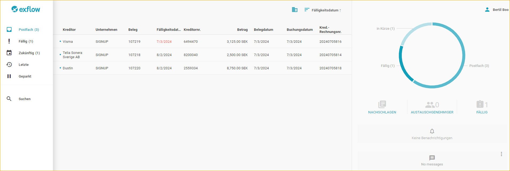
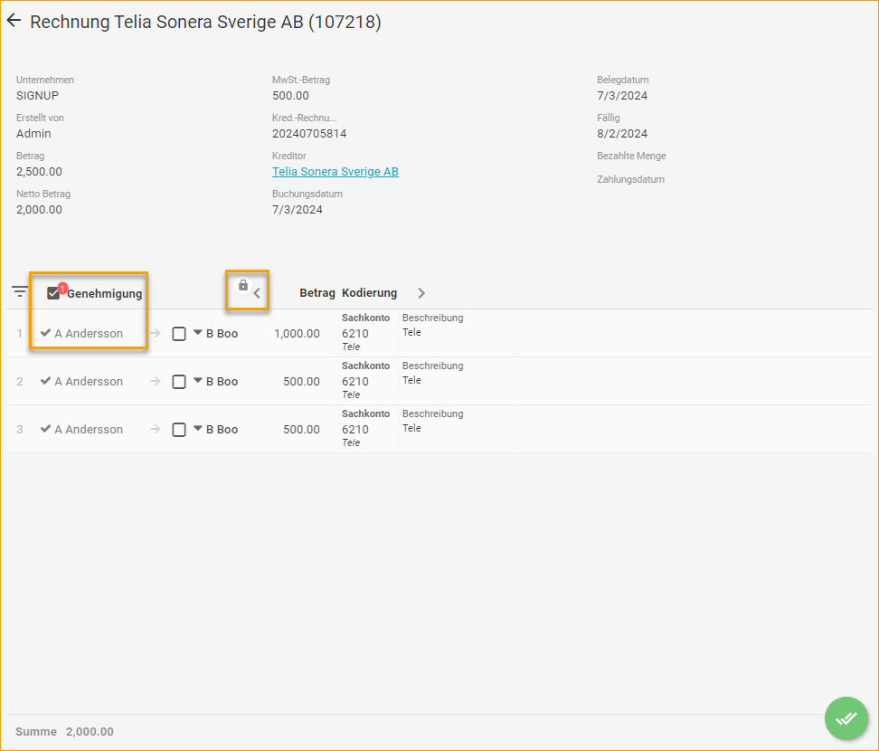
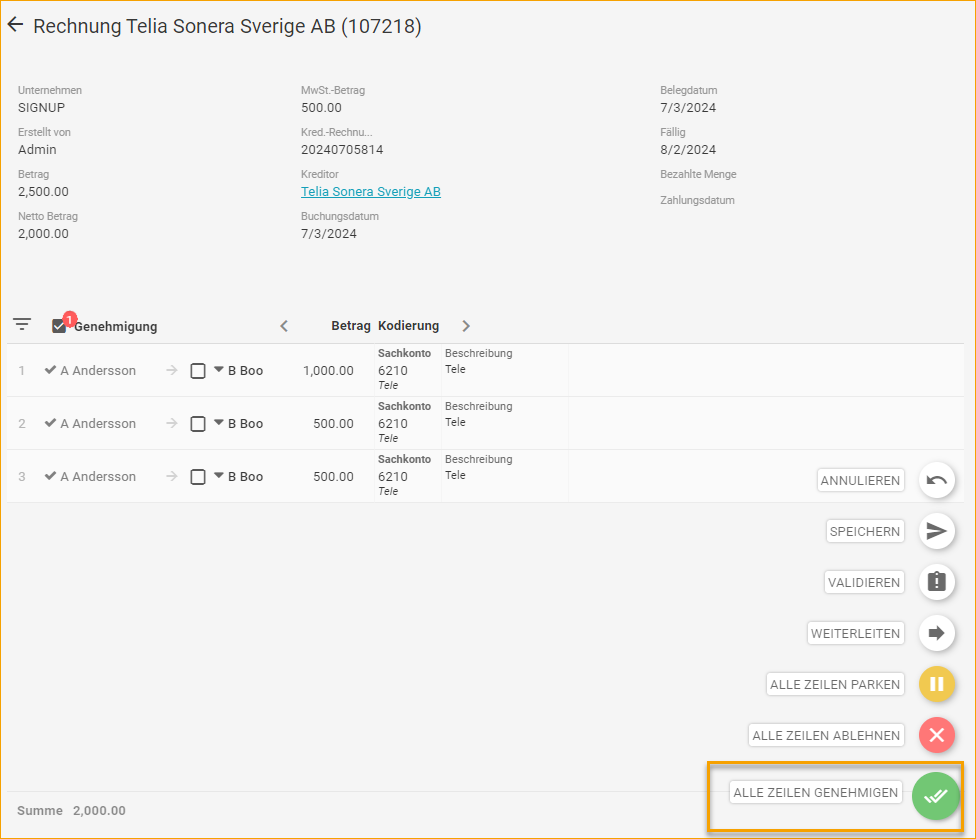
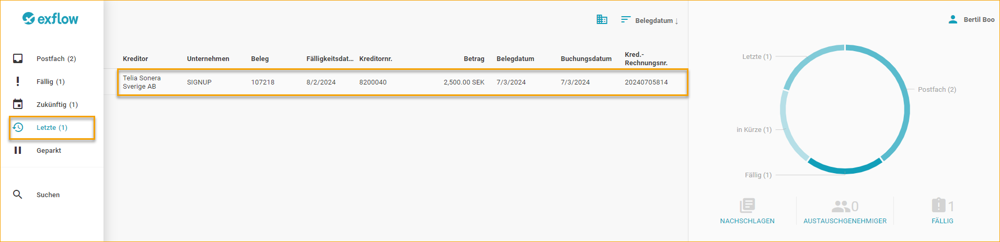
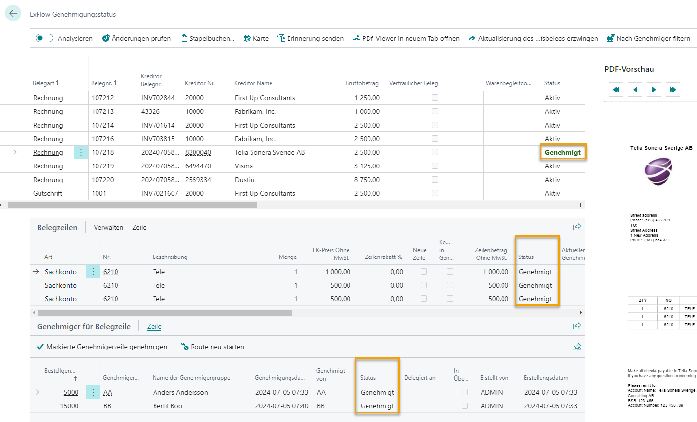
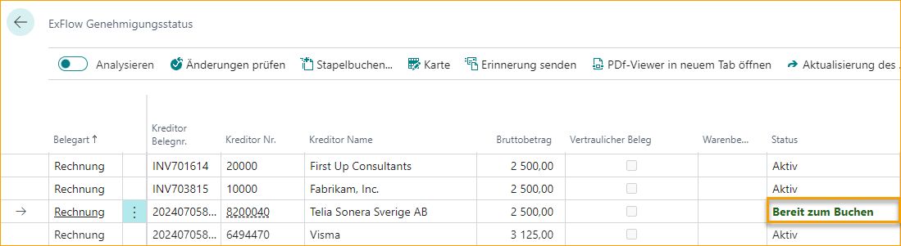
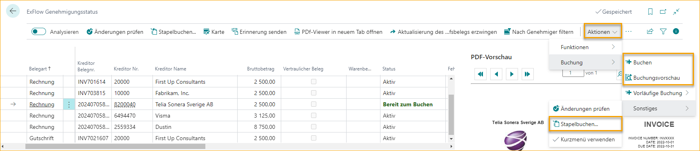

## ExFlow Web

Sobald Rechnungen aus dem Importjournal erstellt wurden, sind sie bereit zur Genehmigung/Bearbeitung in ExFlow Web für aktuelle Genehmiger.

Klicken Sie auf die Rechnung, um sie zur Genehmigung zu öffnen. Dort finden Sie Informationen zu den Rechnungspositionen und ein Bild. Die Liste kann auch automatisch erweitert werden.

Je nach Berechtigungsrolle in ExFlow User in Business Central kann der Benutzer die Positionen bezüglich Dimensionen anpassen, das Konto ändern usw.

In diesem Fall genehmigt der Benutzer alle Positionen auf dieser Rechnung, indem er auf die Schaltfläche "Genehmigen" klickt.

Nach der Genehmigung wird die Rechnung in den Ordner "Aktuell" verschoben und der Genehmigungsstatus in Business Central wird aktualisiert. Die Rechnung wird auch an den nächsten Genehmiger gesendet, sofern vorhanden.

Der Status wird nun auf der Seite "ExFlow Genehmigungsstatus" aktualisiert.

Der Rechnungsstatus wartet nun darauf, auf "Bereit zur Buchung" aktualisiert zu werden. Der Administrator aktualisiert den "Status" der Rechnung und genehmigt die vorgenommenen Änderungen an den Positionen, indem er die Funktion "Änderungen überprüfen" verwendet.

Der nächste Schritt besteht darin, die Rechnung mit der Funktion "Buchen" oder "Stapelbuchung" zu buchen. Es gibt auch eine Funktion für die Vorschau der Buchung.

Gehe zu: ***Aktionen \--\> Buchung \--\> Buchen / Buchungsvorschau / Stapelbuchung\...***

