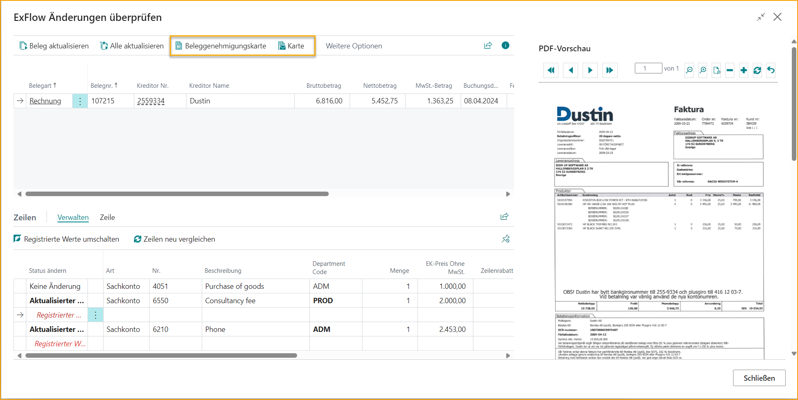
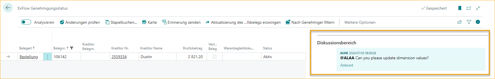
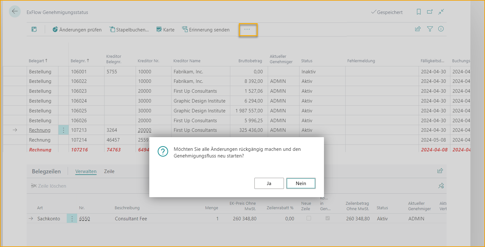
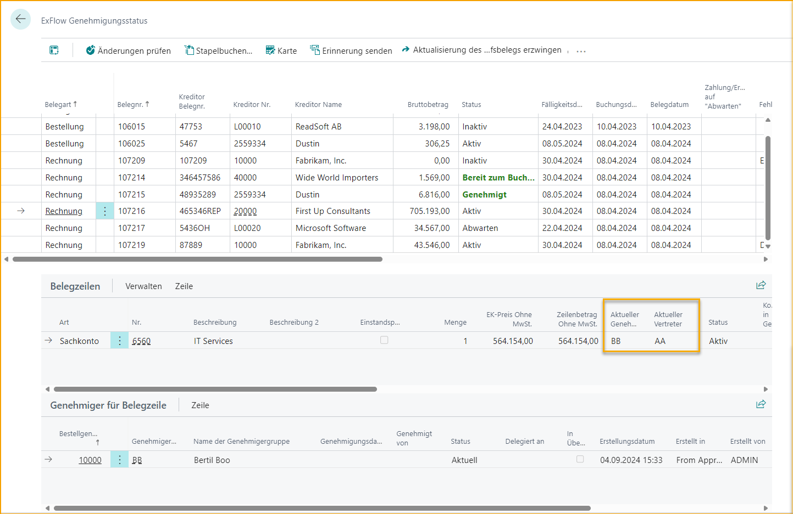
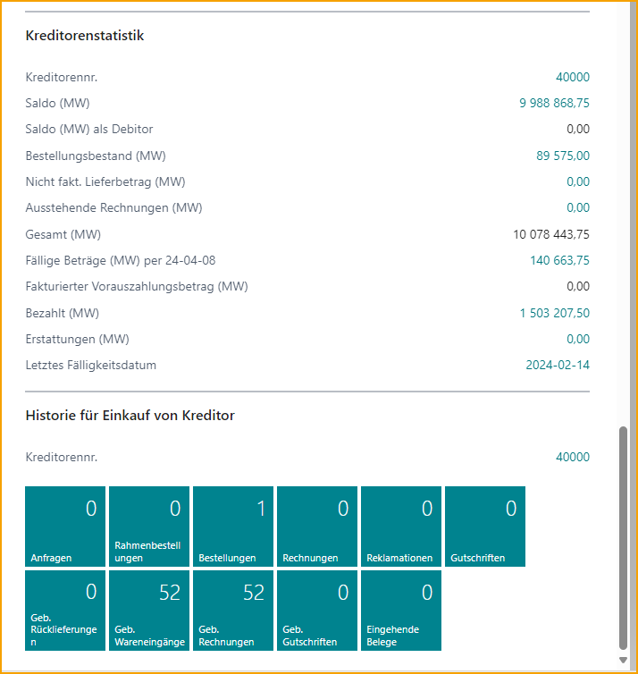

## ExFlow Genehmigungsstatus

Gehe zu: ***ExFlow Genehmigungsstatus***

Wenn ein Dokument aus dem ExFlow Import Journal erstellt und zur Genehmigung gesendet wird, kann das Dokument im Genehmigungsstatus gefunden werden.

| ExFlow Genehmigungsstatus||
|:-|:-| 
|**Änderungen überprüfen**|    [***Änderungen überprüfen***](https://docs.exflow.cloud/business-central/docs/user-manual/approval-workflow/exflow-approval-status#verify-changes)
|**Stapel buchen**|    [***Stapel buchen***](https://docs.exflow.cloud/business-central/docs/user-manual/approval-workflow/exflow-approval-status#post-batch)
|**Karte**|    Öffnet die Standard-Einkaufsdokumentkarte
|**Erinnerung senden**|     [***Erinnerung senden***](https://docs.exflow.cloud/business-central/docs/user-manual/approval-workflow/exflow-approval-status#send-reminder)
|**PDF-Viewer in neuem Tab öffnen**|   [***PDF-Viewer in neuem Tab öffnen***](https://docs.exflow.cloud/business-central/docs/user-manual/approval-workflow/exflow-approval-status#open-pdf--viewer-in-new-tab)
|**Erzwungene Aktualisierung des Einkaufsdokuments**|  [***Erzwungene Aktualisierung des Einkaufsdokuments***](https://docs.exflow.cloud/business-central/docs/user-manual/approval-workflow/exflow-approval-status#force-update-on-purchase-document)
|**Filter auf Genehmiger setzen**|   [***Filter auf Genehmiger setzen***](https://docs.exflow.cloud/business-central/docs/user-manual/approval-workflow/exflow-approval-status#filter-on-approver)
|*Aktionen--> Funktionen*|    
|**Buchungsdatum stapelweise aktualisieren**|    Buchungsdatum stapelweise aktualisieren
|**Budgetinformationen auf Dokumenten aktualisieren**| Aktualisiert Budgetinformationen auf Dokumenten. Lesen Sie mehr im Abschnitt [***G/L Budgetkontrolle***](https://docs.exflow.cloud/business-central/docs/user-manual/business-functionality/gl-budget-control#gl-budget-control)
|**Über ExFlow**|   [***Über ExFlow***](https://docs.exflow.cloud/business-central/docs/user-manual/help-and-support/about-exflow#about-exflow)
|**Andere --> Erzwungene Aktualisierung des Einkaufsdokuments**|  [***Erzwungene Aktualisierung des Einkaufsdokuments***](https://docs.exflow.cloud/business-central/docs/user-manual/approval-workflow/exflow-approval-status#force-update-on-purchase-document)
|*Aktionen--> Buchung*|    
|**Buchen**|    Dokument buchen
|**Buchungsvorschau**|    Buchungsvorschau 
|**Vorläufige Buchung**|  [***Vorläufige Buchung***](https://docs.exflow.cloud/business-central/docs/user-manual/approval-workflow/exflow-approval-status#preliminary-posting)
|**Vorläufige Buchung-->Buchen**|    Vorläufige Dokumente buchen 
|**Vorläufige Buchung-->Buchungsvorschau**|    Buchungsvorschau der vorläufigen Dokumente
|**Vorläufige Buchung-->Stornieren**|    Vorläufige Buchung stornieren
|**Vorläufige Buchung-->Einträge finden**|    Einträge der vorläufigen Dokumente finden
|*Aktionen--> Buchung--> Andere*|   
|**Änderungen überprüfen**|    [***Änderungen überprüfen***](https://docs.exflow.cloud/business-central/docs/user-manual/approval-workflow/exflow-approval-status#verify-changes)
|**Stapel buchen**|    [***Stapel buchen***](https://docs.exflow.cloud/business-central/docs/user-manual/approval-workflow/exflow-approval-status#post-batch)
|*Verwandt--> Genehmigungsstatus*|    
|**Vertrag anzeigen**|    Vertrag anzeigen, falls einer mit dem Dokument verbunden ist. Lesen Sie mehr im Abschnitt [***Vertrag***](https://docs.exflow.cloud/business-central/docs/user-manual/business-functionality/contract#contract)
|**Dokumentänderungen rückgängig machen**|     [***Dokumentänderungen rückgängig machen***](https://docs.exflow.cloud/business-central/docs/user-manual/approval-workflow/exflow-approval-status#revert-document-changes)
|**Benachrichtigung über nicht erhaltene Bestellung senden**|  [***Benachrichtigung über nicht erhaltene Bestellung senden***](https://docs.exflow.cloud/business-central/docs/user-manual/approval-workflow/email-reminders#unreceived-order---approved)
|**Verwandt--> Genehmigungsstatus-->Karte**|    Öffnet die Standard-Einkaufsdokumentkarte
|**Verwandt--> Genehmigungsstatus-->Erinnerung senden**|  [***Erinnerung senden***](https://docs.exflow.cloud/business-central/docs/user-manual/approval-workflow/exflow-approval-status#send-reminder)
|*Verwandt--> Dateien*|    
|**Dokumentbild anzeigen**|   [***PDF herunterladen oder öffnen***](https://docs.exflow.cloud/business-central/docs/user-manual/approval-workflow/exflow-approval-status#show-document-image)
|**Importdetails anzeigen (OCR)**|    [***Importdetails anzeigen***](https://docs.exflow.cloud/business-central/docs/user-manual/approval-workflow/exflow-approval-status#show-import-details)
|**Bild importieren oder ersetzen**|  [***Bild importieren oder ersetzen***](https://docs.exflow.cloud/business-central/docs/user-manual/approval-workflow/exflow-approval-status#import-or-replace-image)  
|**Verwandt--> Dateien-->Andere--> PDF-Viewer in neuem Tab öffnen**|    [***PDF-Viewer in neuem Tab öffnen***](https://docs.exflow.cloud/business-central/docs/user-manual/approval-workflow/exflow-approval-status#open-pdf--viewer-in-new-tab)
|*Verwandt--> Genehmiger*|    
|**Genehmigungsnachverfolgung**|    Bericht ausführen [***ExFlow Genehmigungsnachverfolgung***](https://docs.exflow.cloud/business-central/docs/user-manual/business-intelligence-and-reporting/reports#exflow-approval-follow-up)
|**Pro Genehmiger**|    Zeigt eine gefilterte Seite pro Genehmiger an
|**Nächster Genehmiger**|    Zeigt eine gefilterte Seite bei der nächsten genehmigenden Person an
|**Genehmigerfilter zurücksetzen**|    Den Filter zurücksetzen, der in [***Filter auf Genehmiger setzen***](https://docs.exflow.cloud/business-central/docs/user-manual/approval-workflow/exflow-approval-status#filter-on-approver) gesetzt wurde

### Aktueller Genehmiger

Der Genehmigungsstatus zeigt alle Rechnungen, die zur Genehmigung ausstehen und/oder genehmigt und bereit zur Buchung sind. Ein Administrator kann Informationen zum Status sowohl der Rechnung als auch des nächsten Genehmigers für diese spezifische Rechnung einsehen.

In diesem Beispiel hat Anders Andersson alle seine Zeilen genehmigt und Bertil Boo ist der aktuelle Genehmiger.

Die Standard-Einkaufsdokumentkarte kann aus dem Genehmigungsstatus-Menü geöffnet werden.

### Änderungen überprüfen
Wenn ein Dokument genehmigt wird, wird der Status auf "Genehmigt" aktualisiert. Das Dokument muss jedoch noch überprüft werden. Klicken Sie auf "Änderungen überprüfen", um zu sehen, ob ein Genehmiger auf ExFlow Web Änderungen vorgenommen hat.

Wenn im Genehmigungsstatus keine Filter gesetzt sind, wirkt die Funktion "Änderungen überprüfen" auf alle Dokumente mit dem Status "Genehmigt". Wenn ein aktiver Filter vorhanden ist (z. B. nur Dokumente für einen bestimmten Lieferanten werden angezeigt), wird "Änderungen überprüfen" nur auf die Dokumente in der gefilterten Ansicht angewendet. Alle genehmigten Dokumente außerhalb des Filters behalten den Status "Genehmigt".

Die Verwendung eines Filters für den Dokumenttyp im Genehmigungsstatus, der Bestellung und Angebot von der Überprüfung ausschließt, kann vorteilhaft sein, wenn ein Systembenutzer nur andere Dokumenttypen wie Rechnung oder Gutschrift überprüfen möchte.

ExFlow Änderungen überprüfen zeigt alle Zeilen, die auf ExFlow Web geändert wurden. Sowohl registrierte Werte in Rot als auch aktualisierte Werte in Schwarz auf den Dokumentzeilen.

Zeilen ohne Änderungen erhalten den Änderungsstatus "Keine Änderung".

Verwenden Sie "Dokument aktualisieren", um die Dokumentkarte für ein bestimmtes Dokument zu aktualisieren, oder "Alle aktualisieren". Wenn alle Dokumente aktualisiert sind, wird die Seite automatisch geschlossen.

"Dokumentgenehmigungskarte" öffnet die endgültige genehmigte ExFlow-Karte.

Öffnen Sie die "Karte", um zur ursprünglichen Business Central Standard-Einkaufsdokumentkarte zu gelangen.

Der PDF-Viewer (FactBox) zeigt das Dokumentbild. Es besteht auch die Möglichkeit, mit Strg+I das Dokumentbild herunterzuladen oder über Verwandt --> Dokumentbild anzeigen zu gehen.

Wenn auf ExFlow Web keine Änderungen vorgenommen wurden, wird der Status im Genehmigungsstatus automatisch auf "Bereit zur Buchung" aktualisiert.

Es besteht die Möglichkeit, den Schritt "Änderungen überprüfen" auf der Genehmigungsstatusseite zu überspringen, wenn keine Änderungen an dem genehmigten Dokument vorgenommen wurden. In diesem Fall wird die Aktion "Änderungen überprüfen" automatisch ausgeführt und der Dokumentstatus auf "Bereit zur Buchung" geändert.

Diese Funktion kann in den ExFlow-Einstellungen unter **Hintergrundverarbeitung** durch Aktivieren von **Änderungen automatisch überprüfen** aktiviert werden.

Diese Funktion kann auch (und pro Lieferant eingerichtet) in [***ExFlow Lieferanteneinstellungen***](https://docs.exflow.cloud/business-central/docs/user-manual/business-functionality/vendor-setup#vendor-setup) gefunden werden.

Darüber hinaus kann eine weitere Funktion namens Änderungen überprüfen umgehen vom AP-Personal genutzt werden. Lesen Sie mehr darüber im Abschnitt [***Änderungen überprüfen umgehen***](https://docs.exflow.cloud/business-central/docs/user-manual/business-functionality/bypass-verify-changes).

#### Änderungen ablehnen in Änderungen überprüfen
Der Genehmigungsprozess kann von einem ausgewählten Genehmiger auf der Seite "ExFlow Änderungen überprüfen" neu gestartet werden. Diese Funktion befindet sich im Genehmiger-FactBox.

Die Funktion Genehmigungsprozess neu starten hat zwei Optionen.

* **Von markiertem Genehmiger neu starten** - die markierten "Dokumentzeilen" vom markierten Genehmiger neu starten. 
* **Von markiertem Genehmiger für alle Zeilen neu starten** - alle "Dokumentzeilen", die mit dem markierten Genehmiger verbunden sind, neu starten.

Nach Auswahl einer der möglichen Optionen wird das Diskussionsfeld-Dialogfeld geöffnet, in dem ein Kommentar für den Genehmiger hinterlassen werden kann.

Der Kommentar wird im Diskussionsfeld im Genehmigungsstatus gespeichert und der Genehmiger kann den Kommentar im Chat auf ExFlow Web sehen. Außerdem kann der Genehmiger, falls eingerichtet, eine E-Mail erhalten.

### Stapel buchen
Gehe zu: ***Stapel buchen***

Nach Änderungen überprüfen ist das Dokument nun bereit zur Buchung.

Um alle Dokumente, die bereit zur Buchung sind, stapelweise zu buchen, verwenden Sie Stapel buchen.

Um das Buchungsdatum für alle Dokumente zu aktualisieren, geben Sie ein neues Datum im Feld Buchungsdatum ein und aktivieren Sie Buchungsdatum ersetzen.

Wenn ein oder mehrere Dokumente einen Abgrenzungscode haben, erscheint beim Ersetzen des Buchungsdatums folgende Frage:

**Ja:** Um das Abgrenzungsstartdatum gemäß den Einstellungen im Abgrenzungscode für alle Dokumentzeilen zu aktualisieren.
**Nein:** Um das Abgrenzungsstartdatum wie erstellt auf allen Dokumentzeilen beizubehalten.

### Dokument buchen

Gehe zu: ***Aktion --> Buchung --> Buchen (F9)***

Um ein Dokument nach dem anderen zu buchen, verwenden Sie Buchen (F9).

Es gibt auch die Möglichkeit, mehrere Dokumente manuell auszuwählen und Stapel buchen zu verwenden, um alle markierten Dokumente zu buchen. Verwenden Sie "Mehr auswählen", um die zu buchenden Dokumente manuell auszuwählen.

Klicken Sie dann auf Stapel buchen, um mit der Buchung fortzufahren.

### Buchungsvorschau

Gehe zu: ***Genehmigungsstatus --> Aktionen --> Buchung --> Buchungsvorschau (Strg+Alt+F9)***

Verwenden Sie "Buchungsvorschau" (Strg+Alt+F9), um die Einträge zu überprüfen, die aus den aktuellen Daten auf der Karte vor der eigentlichen Buchung erstellt werden.

Die Buchungsvorschau kann für alle Dokumentstatus verwendet werden, nicht nur für Dokumente mit dem Status "Bereit zur Buchung".

Um die Buchungsvorschau während des Genehmigungsprozesses zu verwenden, verwenden Sie "Erzwungene Aktualisierung des Einkaufsdokuments", um die Karte zu aktualisieren.

### Vorläufige Buchung

Wenn die vorläufige Buchung aktiviert ist, können Buchung, Buchungsvorschau, Stornieren und Einträge finden aus dem Genehmigungsstatus durchgeführt werden.

Gehe zu: ***Genehmigungsstatus --> Aktionen --> Buchung --> Vorläufige Buchung***

Lesen Sie mehr im Abschnitt [***Vorläufige Buchung***](https://docs.exflow.cloud/business-central/docs/user-manual/business-functionality/preliminary-posting)

### Erinnerung senden

Erinnerung für dieses Dokument an die aktuellen Genehmiger für alle Zeilen eines Einkaufsdokuments senden.

#### Erinnerung für mehrere Dokumente senden
Verwenden Sie "Mehr auswählen", um mehrere Dokumente zu markieren und klicken Sie auf "Erinnerung senden". Erinnerungen werden dann an alle aktuellen Genehmiger für diese ausgewählten Dokumente gesendet.

Folgende Nachricht wird dann angezeigt:

#### E-Mail-Erinnerungen für abgelehnte Dokumente senden
Gehe zu: ***ExFlow E-Mail-Einrichtung***

Es ist möglich, E-Mail-Erinnerungen für abgelehnte ExFlow-Genehmigungsdokumente zu senden, wenn ein Angebot, eine Bestellung, eine Rechnung und/oder eine Gutschrift abgelehnt wird. Um Erinnerungen für abgelehnte Genehmigungsdokumente senden zu können, muss der Dokumentstatus im Genehmigungsstatus "Abgelehnt" sein.

Lesen Sie mehr im Abschnitt [***ExFlow E-Mail-Einrichtung --> Abgelehnte Bestellung, Abgelehntes Angebot und Abgelehnte Rechnung/Gutschrift***](https://docs.exflow.cloud/business-central/docs/user-manual/business-functionality/exflow-email-setup)

### PDF-Viewer in neuem Tab öffnen

Es ist möglich, das PDF in einem neuen separaten Tab zu öffnen, um eine bessere Ansicht des Dokumentenbildes zu erhalten.

### Erzwungene Aktualisierung des Einkaufsdokuments

Wenn während des Genehmigungsprozesses Änderungen erforderlich sind, verwenden Sie die Funktion "Erzwungene Aktualisierung des Einkaufsdokuments", um die Karte zu aktualisieren. Jetzt können Änderungen in der Karte vorgenommen werden, ohne dass Änderungen von ExFlow Web gelöscht werden.

Verwenden Sie "Dokument aktualisieren", um die Dokumentkarte für das ausgewählte Dokument zu aktualisieren. Wenn das Dokument aktualisiert ist, wird die Seite automatisch geschlossen.

### Filter auf Genehmiger setzen

Filtern Sie nach einem bestimmten Genehmiger (Genehmigungsgruppe) und Status in der Genehmigungsstatusliste.

### Dokumentbild anzeigen

Gehe zu: ***Genehmigungsstatus --> Verwandt --> Dateien --> Dokumentbild anzeigen*** 

Um das PDF herunterzuladen oder zu öffnen.

### Importdetails anzeigen

Gehe zu: ***Genehmigungsstatus --> Verwandt --> Dateien --> Importdetails anzeigen*** 

Um Importdetails anzuzeigen.

### Bild importieren oder ersetzen

Gehe zu: ***Genehmigungsstatus --> Verwandt --> Dateien --> Bild importieren oder ersetzen*** 

Um das PDF zu importieren oder zu ersetzen.

### G/L-Konto während der Genehmigung ändern

Gehe zu: ***ExFlow Genehmigungsstatus --> Karte***

Das Ändern der Nummer (entfernt die alte Nummer und fügt die neue hinzu) auf einem G/L-Konto, das einen Genehmigungsfluss hat, wird es entfernen und ein neues einfügen, falls zutreffend.

### Eine Einkaufsrechnung im Genehmigungsstatus löschen

Gehe zu: ***Einkaufsrechnung/Einkaufsgutschrift***

Wenn das Dokument erstellt, aber nicht gebucht wurde, folgt das Löschen dem Standard von Business Central.

Gehe zur Einkaufsrechnung/Einkaufsgutschrift, indem du auf "Karte" klickst und lösche. Die Genehmigungsstatuskarte wird mit der Rechnungsnummer in "ExFlow Gelöschte Dokumente" gespeichert.

Gebuchte Einkaufsrechnungen sollten nicht gelöscht werden. Beginne mit der Erstellung einer Gutschrift, die die Rechnung neutralisiert. Erstelle dann eine neue Einkaufsrechnung, falls erforderlich.

### Dokumentänderungen rückgängig machen

Gehe zu: **''...'' --> Verwandt --> Genehmigungsstatus --> Dokumentänderungen rückgängig machen** 

Verwenden Sie *Dokumentänderungen rückgängig machen*, um das Dokument wieder auf den ursprünglichen Zustand zurückzusetzen und alle Änderungen an den Dokumentzeilen durch Genehmiger zu verwerfen.

#### Für geänderte Dokumentzeilen mit dem Status *Genehmigt, Abgelehnt oder In Bearbeitung*

Um die geänderten Dokumentzeilen zurückzusetzen, können AP-Benutzer diese Funktion verwenden, um alle Änderungen zurückzusetzen, anstatt die Genehmigungsstatuskarte manuell zu bearbeiten.

Wenn AP-Benutzer die Frage mit Ja beantworten: *''Möchten Sie alle Änderungen rückgängig machen und den Genehmigungsfluss neu starten?''*, werden alle Änderungen rückgängig gemacht und der Genehmigungsfluss wird neu gestartet.

Zurückgesetzte Dokumente (genehmigt/abgelehnt/in Bearbeitung) werden ebenfalls auf ''Aktiv'' gesetzt.

#### Nichts zum Rückgängigmachen

Für Dokumente mit dem Status ''Bereit zur Buchung'' wird es nicht möglich sein, Änderungen rückgängig zu machen und den Genehmigungsfluss neu zu starten. Die Nachricht: *''Nichts zum Rückgängigmachen''* wird angezeigt.  

Die gleiche Nachricht wird angezeigt, wenn es keine Änderungen an den Dokumenten gibt.  

Diese Funktion wird nicht auf Dokumente angewendet, die auf Kopfebene auf Genehmigt, In Bearbeitung oder Abgelehnt gesetzt sind (ohne Änderungen an den Zeilen). Wenn der Genehmigungsfluss in diesen Fällen neu gestartet werden muss, kann ''Route neu starten'' wie gewohnt auf den Dokumentzeilen im Genehmigungsstatus verwendet werden.

Das Diskussionsfeld/der Chat wird beim Verwenden dieser Funktion nicht rückgängig gemacht/gelöscht.  

## Genehmigungsstatus - Zeilen

| Dokumentzeilen --> Zeile |  |
|:-|:-|
| Genehmigung               | Öffnet die ExFlow Dokumentgenehmigungskarte
| Abschließen               | Markierte Dokumentzeile(n) genehmigen
| Route neu starten               | Genehmigungsfluss für Dokument (Zeile(n)) neu starten
| Auf alle Zeilen kopieren                | Kopiert den aktuellen Genehmigungsfluss der Zeile auf andere Zeilen im Dokument. Alle Genehmiger in der Genehmigungsregel müssen genehmigen
| Verfügbare Genehmigungsregeln anzeigen                | Öffnet eine Liste der verfügbaren Genehmigungsregeln
| Dimension                | Zeigt die Dimension auf der spezifischen Dokumentzeile an
| Abgrenzungsplan                | Öffnet den Abgrenzungsplan, wenn ein Abgrenzungscode gesetzt ist
| Aktuelle Dimensionseigentümer anzeigen                | Zeigt den Dimensionseigentümer an
| Budget anzeigen                | Zeigt die Budgetübersicht an

| Dok.-Zeilen-Genehmiger |  |
|:-|:-|
| Markierte Genehmigerzeile genehmigen               | Markierte Zeile abschließen, die Zeile muss den Status "Aktuell" haben
| Route neu starten               | Genehmigungsfluss neu starten. Lesen Sie mehr darüber im Abschnitt "Abgelehnte Rechnung bearbeiten / Genehmigungsfluss neu starten"

 

### Genehmigungsfluss ändern
Zeile auswählen und gehen zu: ***Dokumentzeilen --> Zeile --> Genehmigung***

Ein neues Fenster öffnet die Rechnungszeilenkarte (Titel; BEARBEITEN - GENEHMIGUNG).

Fügen Sie Genehmiger hinzu und/oder entfernen Sie diese bei Bedarf, indem Sie auf Verwalten klicken.

**Neue Genehmiger vorschlagen** 
Neue Genehmiger vorschlagen löscht aktuelle und fügt neue Genehmiger aus der neuen Genehmigungsregel hinzu.

**Auf alle Zeilen kopieren** 
Wenn ein Dokument viele Dokumentzeilen enthält, hilft "Auf alle Zeilen kopieren" dabei, die Genehmigungsgruppe (von einer Zeile) auf alle Zeilen zu kopieren.

### Abgelehnte Rechnung bearbeiten / Genehmigungsfluss neu starten

Dies ist zu verwenden, wenn der korrekte Genehmigungsworkflow ausgewählt wurde, aber aus irgendeinem Grund neu gestartet werden muss (zum Beispiel eine Ablehnung).

Wenn ein Dokument auf ExFlow Web abgelehnt wird, muss der Genehmiger einen Kommentar hinzufügen, der auf der Genehmigerzeile gespeichert wird, und das Dokument muss in Business Central bearbeitet werden.

Bei Verwendung automatischer Genehmigungsregeln wird empfohlen, die Daten auf der Rechnungskarte zu aktualisieren. Dann weist ExFlow automatisch einen neuen Genehmigungsworkflow basierend auf den neuen Daten zu.

Eine andere Möglichkeit besteht darin, den Genehmigungsfluss auf der Zeile neu zu starten, indem Sie auf "Route neu starten" klicken. Oder fügen Sie nach dem Genehmiger, der das Dokument abgelehnt hat, manuell einen neuen Genehmiger ein. Der neue Genehmiger erhält den Status "Aktuell" und kann dann den Kommentar des abgelehnten Genehmigers sehen.

Diese Funktion befindet sich im Abschnitt "Dokumentzeilen".  
***Dokumentzeilen --> Zeile --> Route neu starten***

Das Neustarten der Route von Dokumentzeilen hat zwei Optionen.

**Zeile neu starten** - startet die "Dokumentzeilen" neu, alle verbundenen "Dok.-Zeilen-Genehmiger"-Zeilen.

**Alle Zeilen neu starten** - startet alle "Dokumentzeilen" und alle verbundenen "Dok.-Zeilen-Genehmiger"-Zeilen neu.

Um von markiertem Genehmiger auf einer oder allen Zeilen neu zu starten.  
Gehe zu: ***Dok.-Zeilen-Genehmiger --> Route neu starten***

**Zeile neu starten** - startet die "Dokumentzeilen" neu, alle verbundenen "Dok.-Zeilen-Genehmiger"-Zeilen.

**Alle Zeilen neu starten** - startet alle "Dokumentzeilen" und alle verbundenen "Dok.-Zeilen-Genehmiger"-Zeilen neu.

**Von markiertem Genehmiger neu starten** - startet von markiertem Genehmiger auf markierter Zeile neu.

**Von markiertem Genehmiger für alle Zeilen neu starten** z.B. zwei "Dokumentzeilen" mit drei Genehmigern, alle Zeilen genehmigt, Neustart stehend auf dem zweiten Genehmiger, diese Option startet alle "Dokumentzeilen" vom gleichen Benutzer auf Zeilen, die diesen Benutzer enthalten, neu. Wenn dieser Benutzer mehr als einmal vorkommt, startet die Route von der ersten Zeile des Benutzers neu.

### Aktuellen Vertreter auf den Dokumentzeilen anzeigen

In den Dokumentzeilen im Genehmigungsstatus ist es möglich zu sehen, wer der aktuelle Vertreter für den aktuellen Genehmiger ist.

Lesen Sie mehr darüber, wie Sie mit Vertretern arbeiten, im Abschnitt [***Einen Vertreter während der Urlaubszeit hinzufügen***](https://docs.exflow.cloud/business-central/docs/user-manual/business-functionality/exflow-user#add-a-replacer-during-vacation-time)

## FactBoxes im Genehmigungsstatus
Finden Sie nützliche FactBoxes auf der rechten Seite im Genehmigungsstatus.

| FactBox |  |
|:-|:-|
| PDF-Vorschau               | [***PDF-Vorschau***](https://docs.exflow.cloud/business-central/docs/user-manual/approval-workflow/exflow-approval-status#pdf-preview)
| Eingehende Dokumentdateien               | [***Eingehende Dokumentdateien***](https://docs.exflow.cloud/business-central/docs/user-manual/approval-workflow/exflow-approval-status#incoming-document-files)
| Diskussionsfeld               | [***Diskussionsfeld***](https://docs.exflow.cloud/business-central/docs/user-manual/approval-workflow/exflow-approval-status#discussion-panel)
| Lieferantenstatistik und Historie des Lieferanten              | [***Lieferantenstatistik und Historie des Lieferanten***](https://docs.exflow.cloud/business-central/docs/user-manual/approval-workflow/exflow-approval-status#vendor-statistic-and-buy-from-vendor-history)

### PDF-Vorschau
Ändern Sie die Größe der PDF-Vorschau. Drücken Sie - / +, um die Größe des PDFs zu verringern oder zu erhöhen.

Setzen Sie die Größe der FactBox zurück. Klicken Sie auf "Wiederherstellen".

"Verkleinern", "Vergrößern" und Zoom zurücksetzen

Ändern Sie die PDF-Seitennummer. Verwenden Sie die "Aufzeichnungstasten".

Öffnen Sie die PDF-Datei in voller Größe. 
Gehe zu: ***Navigieren --> Dateien --> Dokumentbild anzeigen (Strg+I)*** 

### Eingehende Dokumentdateien
Anzeigen und Hinzufügen von Anhängen. Um ein Dokument anzuhängen, ohne den Hauptanhang zu ersetzen. 

Gehe zu: ***FactBox --> Eingehende Dokumentdateien --> Datei anhängen***

Klicken Sie auf "Auswählen", suchen Sie die Datei, die angehängt werden soll, und klicken Sie auf "Öffnen".

Es kann auch aus dem Eingehenden Dokument in Business Central Standard erfolgen.

#### PDF-Dokumentbild ändern
Wenn das PDF-Bild geändert werden muss, kann dies vor dem Buchen des Dokuments erfolgen.  

Gehe zu: **Verwandt --> Dateien --> Bild importieren oder ersetzen**

Es kann auch aus dem Eingehenden Dokument in Business Central Standard erfolgen. 

#### Datei von Einkaufsrechnung oder Einkaufsgutschrift anhängen

Anhänge, die von der Einkaufsrechnungs- und Einkaufsgutschriftkarte in Business Central Standard erstellt wurden, werden in ExFlow nicht angezeigt. Daher empfehlen wir, stattdessen die Eingehenden Dokumentdateien in der FactBox aus dem Genehmigungsstatus zu verwenden.

### Diskussionsfeld
Wenn Sie einen Kommentar im Diskussionsfeld aus dem Genehmigungsstatus hinzufügen und auf SENDEN klicken, kann der Kommentar in der FactBox rechts mit der ID des erstellenden Benutzers, Datum und Uhrzeit angezeigt werden. Auf ExFlow Web wird er im Chat auf dem Dokument angezeigt.

Wenn ein Benutzer mit @ erwähnt wird, kann dieser Benutzer dieses Dokument und den Kommentar auf ExFlow Web sehen, auch wenn der Benutzer **nicht** im Genehmigungsfluss ist.

Lesen Sie mehr über Einstellungen und wie Sie das Diskussionsfeld verwenden im Abschnitt: [***Benachrichtigungen in Business Central --> Diskussionsfeld / Chat und Zeilenkommentare***](https://docs.exflow.cloud/business-central/docs/user-manual/approval-workflow/notifications-in-business-central#discussion-panel--chat-and-line-comments). 

#### Kommentare von Genehmigern lesen

Wenn ein Web-Genehmiger einen Kommentar im Chat im Kopfbereich hinzufügt und auf "SENDEN" klickt, kann der Kommentar in der FactBox rechts mit der ID des Genehmigers, Datum und Uhrzeit angezeigt werden.

Das Dokument hat auch eine Markierung im Kopfbereich "Kommentar im Diskussionsfeld", wenn Kommentare von ExFlow oder ExFlow Web gemacht wurden.

Wenn ein Web-Genehmiger einen Kommentar zu einer Zeile hinzufügt, wird der Kommentar in "Dok.-Zeilen-Genehmiger" im Feld "Kommentar" angezeigt.

Lesen Sie mehr über Einstellungen und wie Sie das Diskussionsfeld verwenden im Abschnitt: [***Benachrichtigungen in Business Central --> Diskussionsfeld / Chat und Zeilenkommentare***](https://docs.exflow.cloud/business-central/docs/user-manual/approval-workflow/notifications-in-business-central#discussion-panel--chat-and-line-comments).

### Lieferantenstatistik und Historie des Lieferanten

Finden Sie Lieferanteninformationen in den FactBoxes Lieferantenstatistik und Historie des Lieferanten.

Diese FactBoxes können auch in der ExFlow Genehmigungshistorie gefunden werden.

 

## Hintergrundverarbeitung

Finden Sie alle Informationen zur Hintergrundverarbeitung [***hier***](https://docs.exflow.cloud/business-central/docs/user-manual/technical/exflow-setup#background-processing)

Gehe zu ***ExFlow Einrichtung --> Hintergrundverarbeitung***

Folgende Einstellungen gelten nur für Dokumente ohne Änderungen.

Wenn Änderungen von ExFlow Web vorgenommen wurden, müssen diese weiterhin manuell im Genehmigungsstatus durch Ausführen von Änderungen überprüfen aktualisiert werden.

### Überprüfung mit Job-Warteschlange und Überprüfung & Buchung mit Job-Warteschlange
Aktivieren Sie eine dieser Einstellungen, um automatisch eine Job-Warteschlange zu erstellen, die genehmigte Rechnungen ohne Änderungen von ExFlow Web im Genehmigungsstatus "Überprüft" oder "Überprüft und gebucht" automatisch überprüft oder überprüft und bucht.

### Änderungen automatisch überprüfen
Aktualisiert Dokumente mit dem Status "Genehmigt" auf "Bereit zur Buchung" ohne Job-Warteschlange.

Die Job-Warteschlange "Ex Verify & Post Job Queue" ist standardmäßig so konfiguriert, dass sie stündlich an Wochentagen ausgeführt wird, wenn eine der genannten Hintergrundverarbeitungseinstellungen in der ExFlow Einrichtung aktiviert ist.

Wenn die Funktion deaktiviert wird, verschwindet die Job-Warteschlange "Ex Verify & Post Job Queue" aus der Liste der "Job-Warteschlange Einträge".

### Überprüfung mit Job-Warteschlange
Diese Einstellung gibt an, ob die Überprüfung genehmigter Dokumente im Hintergrund geplant werden soll. Dies gilt nur für Dokumente ohne Änderungen auf ExFlow Web.

### Überprüfung & Buchung mit Job-Warteschlange
Gibt an, ob Dokumente mit dem Status "Bereit zur Buchung" im Genehmigungsstatus im Hintergrund geplant und nach der Überprüfung gebucht werden sollen.

Alle "ExFlow web - geänderten" Dokumente, die in ExFlow Änderungen überprüfen im Genehmigungsstatus aktualisiert werden müssen, werden von diesem geplanten Job ausgeschlossen. Eine Nachricht im Feld Fehlermeldung im ExFlow Genehmigungsstatus wird bei diesen nicht aktualisierten Dokumenten sichtbar sein.

### Änderungen automatisch überprüfen
Diese Einstellung ermöglicht es, den Schritt "Änderungen überprüfen" auf der Genehmigungsstatusseite zu überspringen, wenn keine Änderungen an dem genehmigten Dokument vorgenommen wurden. Der Dokumentstatus wird automatisch auf "Bereit zur Buchung" geändert.

Die Einstellung "Änderungen automatisch überprüfen" kann auch in den ExFlow Lieferanteneinstellungen gefunden werden. Es ist möglich zu wählen, ob diese Funktion für einen bestimmten Lieferanten aktiviert/deaktiviert werden soll. Oder die Einstellung in der ExFlow Einrichtung für alle Lieferanten aktivieren. Lesen Sie mehr über diese Funktionalität im Abschnitt **Änderungen überprüfen**.

### Dokumente automatisch erstellen

Aktivieren Sie dieses Feld, wenn alle interpretierten Dokumente automatisch aus dem ExFlow Import Journal erstellt werden sollen. Diese Funktion kann auch pro Lieferant in den Lieferanteneinstellungen eingerichtet werden, wenn die Dokumente eines bestimmten Lieferanten (zum Beispiel) von dieser Einstellung ausgeschlossen werden sollen.

Wenn die Funktion aktiviert ist, werden alle interpretierten Dokumente ohne Fehler oder Warnmeldungen automatisch erstellt und zur Genehmigung gesendet.

Es ist möglich, die Liste der ExFlow Import Journale zu personalisieren und die Spalte "Dokumente automatisch erstellen" dort hinzuzufügen und zu aktivieren, um ein dediziertes Journal für die automatische Dokumentenerstellung zu haben.

Diese Funktion kann ohne jegliche Einrichtung im ExFlow Import Journal verwendet werden, klicken Sie einfach auf Ja im untenstehenden Popup:

Lesen Sie mehr darüber im Abschnitt [***Batch Import Documents from Interpretation***](https://docs.exflow.cloud/business-central/docs/user-manual/approval-workflow/exflow-import-journals#batch-import-documents-from-interpretation)

## Dokumentenbuchungsprüfungen

Finden Sie alle Informationen zu Dokumentenbuchungsprüfungen [***hier***](https://docs.exflow.cloud/business-central/docs/user-manual/technical/exflow-setup#doc-posting-checks)

### Rechnungsrundung

Wenn die Rechnungsrundung in ***Business Central --> Einkaufs- und Kreditoreneinrichtung --> Allgemein*** aktiviert ist, unterstützt ExFlow die automatische Buchung der Rechnungsrundung, um den Bruttobetrag auf dem Dokument abzugleichen.  

Gehe zu: ***ExFlow Einrichtung --> Dokumentenbuchungsprüfungen***

Aktivieren Sie "Rechnungsrundung" und fügen Sie einen Wert in "Maximale Differenz für Bruttobetrag" ein. Stellen Sie außerdem sicher, dass die Einstellung "Bruttobetrag prüfen" ebenfalls aktiviert ist.

ExFlow führt eine Kontrolle zwischen dem Bruttobetrag im Kopf des Einkaufsdokuments und dem Dokumentzeilenbetrag durch. Eine Rundungszeile wird erstellt, wenn die Bruttobetragsdifferenz innerhalb der Toleranz von "Maximale Differenz für Bruttobetrag" liegt, wenn gebucht wird. Die Buchung erfolgt gemäß den Standard-Einstellungen von Business Central.

Wenn SweBase (für schwedische Kunden) installiert ist, wird die Rundung von SweBase gehandhabt und ExFlow Rundung kann nur für vorläufige Buchungen durchgeführt werden.

Lesen Sie mehr im Abschnitt [***Vorläufige Buchung***](https://docs.exflow.cloud/business-central/docs/user-manual/business-functionality/preliminary-posting)

### G/L-Kontenzeilen mit Zeilenbetrag = Null löschen
Gehe zu: ***ExFlow Setup --> Dokumentbuchungskontrollen --> G/L-Kontenzeilen mit Zeilenbetrag = Null löschen*** 
Wenn Kontenzeilen mit einem Zeilenbetrag von 0 (null) zu einem Dokument hinzugefügt werden müssen, bevor es erstellt wird, aber nicht beim Buchen beibehalten werden sollen, ist es ratsam, "G/L-Kontenzeilen mit Zeilenbetrag = Null löschen" in ExFlow Setup zu aktivieren.

Wenn diese Einstellung aktiviert ist, werden alle Dokumentzeilen mit null Betrag vor dem Buchen des Dokuments gelöscht.

## Eskalation

Finden Sie alle Informationen zur Eskalation [***hier***](https://docs.exflow.cloud/business-central/docs/user-manual/technical/exflow-setup#escalation)

### Abgelehnte und überfällige Dokumente hervorheben

Um es einfacher zu machen, Dokumente zu sehen, die abgelehnt wurden oder kurz vor dem Fälligkeitsdatum stehen, gibt es die Möglichkeit, eine Einstellung in der ExFlow Einrichtung zu aktivieren, um diese Dokumente im Genehmigungsstatus mit roter Schrift hervorzuheben.

#### Einrichtung Abgelehnte und überfällige Dokumente hervorheben
Gehe zu: ***ExFlow Einrichtung --> Eskalation***

Aktivieren Sie *"Abgelehnte und überfällige Dokumente hervorheben"*, um die Einstellung zu aktivieren.

Geben Sie eine Zahl in *"Anzahl der überfälligen Tage vor Hervorhebung"* ein, um anzugeben, wie viele Tage vor dem Fälligkeitsdatum die Dokumente hervorgehoben werden sollen.

Diese Einstellung arbeitet in Bezug auf das Fälligkeitsdatum des Dokuments und das Arbeitsdatum des Benutzers. "0" wird das Dokument am Fälligkeitsdatum hervorheben.

