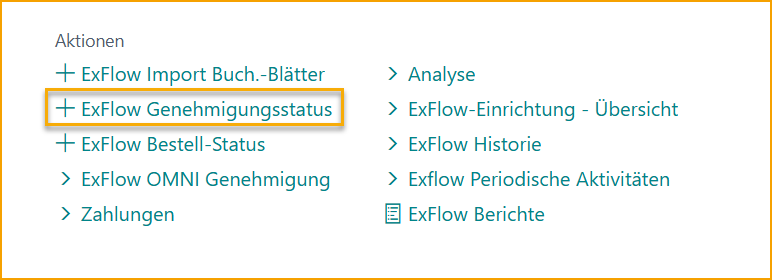
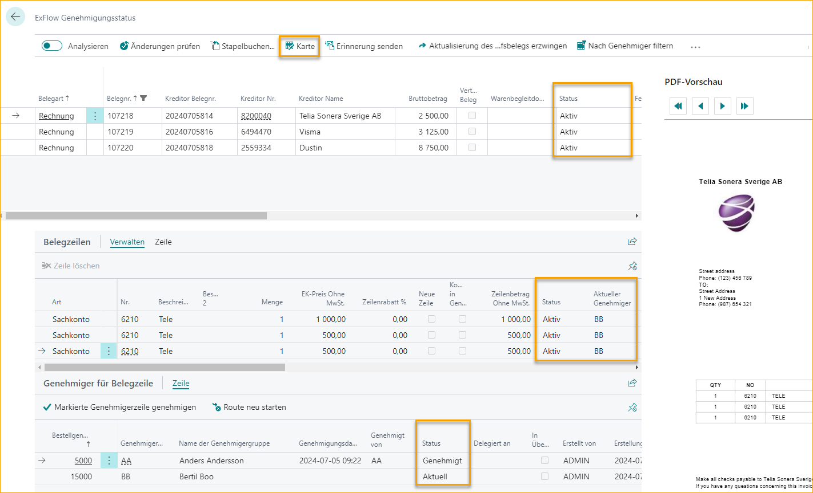
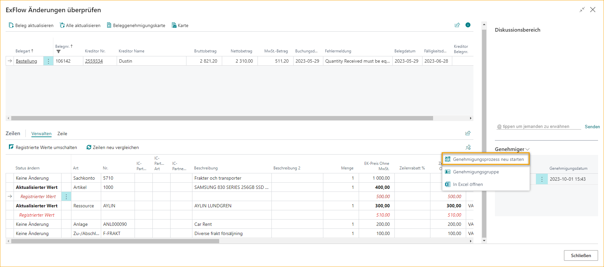
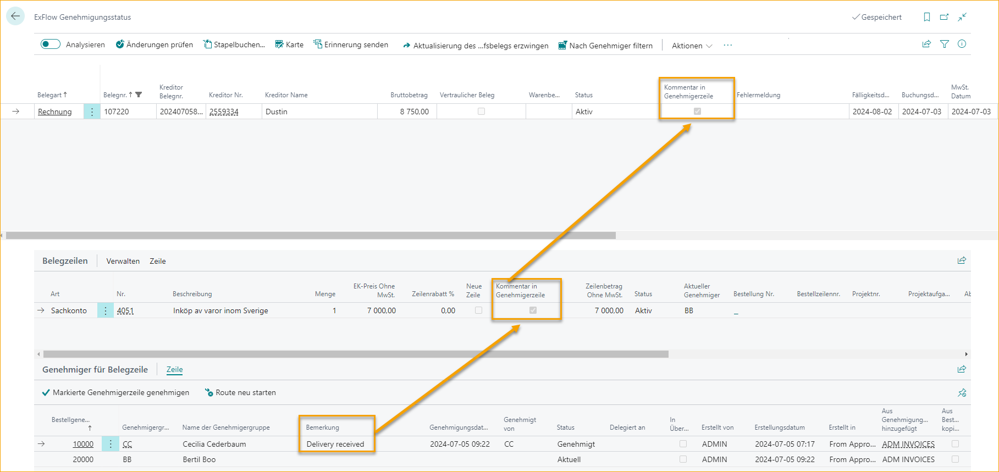

## ExFlow Genehmigungsstatus

Gehe zu: ***ExFlow Genehmigungsstatus***

Wie erwähnt, wenn ein Dokument aus dem ExFlow Import Journal erstellt wird, kann das Dokument im Genehmigungsstatus gefunden werden.

Der Genehmigungsstatus zeigt alle Rechnungen, die zur Genehmigung ausstehen und/oder genehmigt und bereit zur Buchung sind. Ein Administrator kann Informationen zum Status einsehen. Sowohl für die Rechnung als auch für den nächsten Genehmiger dieser spezifischen Rechnung.

In diesem Beispiel hat Anders Andersson alle seine Zeilen genehmigt und Bertil Boo ist der aktuelle Genehmiger.

### Abgelehnte und überfällige Dokumente hervorheben

Um es einfacher zu machen, abgelehnte oder nahe am Fälligkeitsdatum befindliche Dokumente zu sehen, gibt es die Möglichkeit, eine Einstellung in ExFlow Setup zu aktivieren, um diese Dokumente im Genehmigungsstatus mit roter Schrift hervorzuheben.

### Abgelehnte und überfällige Dokumente hervorheben einrichten
Gehe zu: ***ExFlow Setup - Eskalation***

Aktivieren Sie *"Abgelehnte und überfällige Dokumente hervorheben"*, um die Einstellung zu aktivieren.

Geben Sie eine Zahl in *"Anzahl der überfälligen Tage vor Hervorhebung"* ein, um anzugeben, wie viele Tage vor dem Fälligkeitsdatum die Dokumente hervorgehoben werden sollen.

Diese Einstellung funktioniert in Bezug auf das Fälligkeitsdatum des Dokuments und das Arbeitsdatum des Benutzers "0" wird das Dokument am Fälligkeitsdatum hervorheben.

### E-Mail-Erinnerungen für abgelehnte Dokumente senden
Gehe zu: ***ExFlow E-Mail Setup***

Es ist möglich, E-Mail-Erinnerungen für abgelehnte ExFlow-Genehmigungsdokumente zu senden, wenn ein Angebot, eine Bestellung, eine Rechnung und/oder eine Gutschrift abgelehnt wird. Um Erinnerungen für abgelehnte Genehmigungsdokumente senden zu können, muss der Dokumentstatus im Genehmigungsstatus "Abgelehnt" sein.

Lesen Sie mehr im Abschnitt [***ExFlow E-Mail Setup --> Abgelehnter Auftrag, Abgelehntes Angebot und Abgelehnte Rechnung/Gutschrift***](https://docs.exflow.cloud/business-central/docs/user-manual/business-functionality/exflow-email-setup#rejected-order,-rejected-quote,-and-rejected-invoice/credit)

### Änderungen überprüfen
Wenn das Dokument genehmigt ist, wird der Status auf "Genehmigt" aktualisiert. Das Dokument muss jedoch noch überprüft werden. Klicken Sie auf "Änderungen überprüfen", um zu sehen, ob ein Genehmiger auf ExFlow Web Änderungen vorgenommen hat.

Wenn kein Filter in der Ansicht Genehmigungsstatus gesetzt ist, wirkt die Funktion "Änderungen überprüfen" auf alle Dokumente mit dem Status "Genehmigt". Wenn ein aktiver Filter vorhanden ist (z. B. werden nur Dokumente für einen bestimmten Lieferanten angezeigt), wird "Änderungen überprüfen" nur auf die Dokumente in der gefilterten Ansicht angewendet. Alle genehmigten Dokumente außerhalb des Filters behalten den Status Genehmigt.

Die Verwendung eines Filters für den Dokumenttyp im Genehmigungsstatus, der das Ausschließen von Bestellungen und Angeboten von der Überprüfung ermöglicht, kann von Vorteil sein, wenn ein Systembenutzer nur andere Dokumenttypen wie Rechnungen oder Gutschriften überprüfen möchte.

ExFlow Änderungen überprüfen zeigt alle Zeilen, die auf ExFlow Web geändert wurden. Sowohl registrierter Wert in Rot als auch aktualisierter Wert in Schwarz auf den Dokumentzeilen.

Zeilen ohne Änderungen erhalten den Änderungsstatus "Keine Änderung".

Verwenden Sie Dokument aktualisieren, um die Dokumentkarte für ein bestimmtes Dokument zu aktualisieren, oder Alle aktualisieren. Wenn alle Dokumente aktualisiert sind, wird die Seite automatisch geschlossen.

"Dokumentgenehmigungskarte" öffnet die endgültige genehmigte ExFlow-Karte.

Öffnen Sie die "Karte", um in die ursprüngliche Business Central Standard-Einkaufsdokumentkarte zu gelangen.

Der PDF-Viewer (FactBox) zeigt das Dokumentbild. Es besteht auch die Möglichkeit, Strg+I zu verwenden, um das Dokumentbild herunterzuladen oder über Zugehörige --> Dokumentbild anzeigen zu gehen.

Wenn keine Änderungen auf ExFlow Web vorgenommen wurden, wird der Status im Genehmigungsstatus automatisch auf "Bereit zur Buchung" aktualisiert.

Es besteht die Möglichkeit, den Schritt "Änderungen überprüfen" auf der Genehmigungsstatusseite zu überspringen, wenn keine Änderungen am genehmigten Dokument vorgenommen wurden. In diesem Fall wird die Aktion "Änderungen überprüfen" automatisch ausgeführt und der Dokumentstatus wird in "Bereit zur Buchung" geändert.

Diese Funktion kann in ExFlow Setup unter **Hintergrundverarbeitung** aktiviert werden, indem **Änderungen automatisch überprüfen** aktiviert wird.

Diese Funktion kann auch (und pro Lieferant eingerichtet) im **ExFlow Lieferanteneinrichtung** gefunden werden.

Darüber hinaus kann eine weitere Funktion namens Änderungen überprüfen umgehen vom AP-Personal genutzt werden. Lesen Sie mehr darüber im Abschnitt [***Änderungen überprüfen umgehen***](https://docs.exflow.cloud/business-central/docs/user-manual/business-functionality/bypass-verify-changes)

### Änderungen in Änderungen überprüfen ablehnen
Der Genehmigungsprozess kann von einem ausgewählten Genehmiger auf der Seite "ExFlow Änderungen überprüfen" neu gestartet werden. Diese Funktion befindet sich im Genehmiger-FactBox.

Die Funktion Genehmigungsprozess neu starten hat zwei Optionen.

* **Von markiertem Genehmiger neu starten** - startet die markierten “Dokumentzeilen” vom markierten Genehmiger neu. 
* **Von markiertem Genehmiger für alle Zeilen neu starten** - startet alle “Dokumentzeilen”, die mit dem markierten Genehmiger verbunden sind, neu.

Nach Auswahl einer der möglichen Optionen wird das Diskussionsfeld-Dialogfeld geöffnet, in dem ein Kommentar für den Genehmiger hinterlassen werden kann.

Der Kommentar wird im Diskussionsfeld im Genehmigungsstatus gespeichert und der Genehmiger kann den Kommentar im Chat auf ExFlow Web sehen. Außerdem kann der Genehmiger, wenn die Einrichtung erfolgt ist, eine E-Mail erhalten.

### Stapelbuchung

Gehe zu: ***Stapelbuchung***

Nach Änderungen überprüfen ist das Dokument nun bereit zur Buchung.

Um alle Dokumente, die zur Buchung bereit sind, stapelweise zu buchen, verwenden Sie Stapelbuchung.

Um das Buchungsdatum für alle Dokumente zu aktualisieren, geben Sie ein neues Datum im Feld Buchungsdatum ein und aktivieren Sie Buchungsdatum ersetzen.

Wenn ein oder mehrere Dokumente einen Abgrenzungscode haben, wenn Buchungsdatum ersetzen verwendet wird, erscheint folgende Frage:

**Ja:** Um das Abgrenzungsstartdatum gemäß den Einstellungen auf dem Abgrenzungscode für alle Dokumentzeilen zu aktualisieren.
**Nein:** Um das Abgrenzungsstartdatum wie erstellt auf allen Dokumentzeilen beizubehalten.

### Dokument Posten

Gehe zu: ***Aktion \--\> Posten \--\> Posten (F9)***

Um ein Dokument nach dem anderen zu posten, verwenden Sie Posten (F9).

Es gibt auch eine Option, mehrere Dokumente manuell auszuwählen und Post Batch zu verwenden, um alle markierten Dokumente zu posten. Verwenden Sie "Mehr auswählen", um die zu postenden Dokumente manuell auszuwählen.

Klicken Sie dann auf Post Batch, um mit dem Posten fortzufahren.

### Vorschau Posten

Gehe zu: ***Genehmigungsstatus \--\>*** ***Aktionen \--\> Posten \--\> Vorschau Posten***

Verwenden Sie "Vorschau Posten", um die Einträge zu überprüfen, die aus den aktuellen Daten auf der Karte erstellt werden, bevor das eigentliche Posten erfolgt. Vorschau Posten kann für alle Dokumentstatus verwendet werden, nicht nur für Dokumente mit dem Status "Bereit zum Posten". Um Vorschau Posten während des Genehmigungsflusses zu verwenden, verwenden Sie "Erzwinge Aktualisierung auf Einkaufsdokument", um die Karte zu aktualisieren.

### Vorläufiges Posten
Wenn Vorläufiges Posten aktiviert ist, können Posten, Vorschau Posten, Rückgängig machen und Einträge finden vom Genehmigungsstatus aus durchgeführt werden.
Gehe zu: ***Genehmigungsstatus --> Aktionen --> Posten --> Vorläufiges Posten***
Lesen Sie mehr im Abschnitt [***Vorläufiges Posten***](https://docs.exflow.cloud/business-central/docs/user-manual/business-functionality/preliminary-posting) 

### Erinnerung senden

Senden Sie eine Erinnerung für dieses Dokument an die aktuellen Genehmiger für alle Zeilen eines Einkaufsdokuments.

### Erinnerung für mehrere Dokumente senden
Verwenden Sie "Mehr auswählen", um mehrere Dokumente zu markieren, und klicken Sie auf "Erinnerung senden". Erinnerungen werden dann an alle aktuellen Genehmiger für diese ausgewählten Dokumente gesendet.

Folgende Nachricht wird dann angezeigt:

### PDF-Viewer in neuem Tab öffnen

Es ist möglich, das PDF in einem neuen Tab zu öffnen. Die ExFlow-Web-URL muss in der ExFlow-E-Mail-Einrichtung (E-Mail-Typ "Posteingangserinnerung") im Standardunternehmen festgelegt sein.

Lesen Sie mehr im Abschnitt [***ExFlow E-Mail-Einrichtung***](https://docs.exflow.cloud/business-central/docs/user-manual/business-functionality/exflow-email-setup#inbox-reminder) 

### Einkaufsdokument erzwingen

Wenn während des Genehmigungsprozesses Änderungen erforderlich sind, verwenden Sie die Funktion "Einkaufsdokumente erzwingen", um die Karte zu aktualisieren. Jetzt können Änderungen in der Karte vorgenommen werden, ohne dass Änderungen von ExFlow Web gelöscht werden.

Verwenden Sie Dokument aktualisieren, um die Dokumentkarte für das ausgewählte Dokument zu aktualisieren. Wenn das Dokument aktualisiert wird, schließt sich die Seite automatisch.

### Nach Genehmiger filtern

Filtern Sie nach einem bestimmten Genehmiger (Genehmigungsgruppe) und Status in der Genehmigungsstatusliste.

### Dokumentbild anzeigen
Um PDF herunterzuladen oder zu öffnen
Gehe zu: ***Genehmigungsstatus --> Verwandt --> Dateien --> Dokumentbild anzeigen***

### Importdetails anzeigen
Um Importdetails anzuzeigen
Gehe zu: ***Genehmigungsstatus --> Verwandt --> Dateien --> Importdetails anzeigen***

### Bild importieren oder ersetzen
Um PDF zu importieren oder zu ersetzen
Gehe zu: ***Genehmigungsstatus --> Verwandt --> Dateien --> Dokumentbild anzeigen***

### Abgelehnte Rechnung bearbeiten / Genehmigungsfluss neu starten

Dies ist zu verwenden, wenn der richtige Genehmigungsworkflow ausgewählt wurde, aber aus irgendeinem Grund neu gestartet werden muss (z.B. eine Ablehnung).

Wenn das Dokument auf ExFlow Web abgelehnt wird, muss der Genehmiger einen Kommentar hinzufügen, der in der Genehmigungslinie gespeichert wird, und das Dokument muss in Business Central bearbeitet werden.

Bei Verwendung automatischer Genehmigungsregeln wird empfohlen, stattdessen die Daten auf der Rechnungskarte zu aktualisieren. Dann weist ExFlow automatisch einen neuen Genehmigungsworkflow basierend auf den neuen Daten zu.

Eine andere Möglichkeit besteht darin, den Genehmigungsfluss in der Zeile neu zu starten, indem Sie auf "Route neu starten" klicken. Oder fügen Sie nach dem Genehmiger, der das Dokument abgelehnt hat, manuell einen neuen Genehmiger hinzu. Der neue Genehmiger erhält den Status Aktuell und kann dann den Kommentar des abgelehnten Genehmigers einsehen.

Diese Funktion befindet sich im Abschnitt "Dokumentzeilen". 
***Dokumentzeilen \--\> Zeile \--\> Route neu starten***

Das Neustarten der Route aus den Dokumentzeilen hat zwei Optionen.

**Zeile neu starten** - startet die "Dokumentzeilen" neu, alle verbundenen "Dok. Zeilen Genehmiger" Zeilen.

**Alle Zeilen neu starten** - startet alle "Dokumentzeilen" und alle verbundenen "Dok. Zeilen Genehmiger" Zeilen neu.

Um von markiertem Genehmiger auf einer oder allen Zeilen neu zu starten. 
Gehe zu: ***Dok. Zeilen Genehmiger \--\> Route neu starten.***

**Zeile neu starten** - startet die "Dokumentzeilen" neu, alle verbundenen "Dok. Zeilen Genehmiger" Zeilen.

**Alle Zeilen neu starten** - startet alle "Dokumentzeilen" und alle verbundenen "Dok. Zeilen Genehmiger" Zeilen neu.

**Von markiertem Genehmiger neu starten** - startet von markiertem Genehmiger auf markierter Zeile neu.

**Von markiertem Genehmiger für alle Zeilen neu starten** - z.B. zwei "Dokumentzeilen" mit drei Genehmigern, alle Zeilen genehmigt, Neustart stehend auf dem zweiten Genehmiger, diese Option startet alle "Dokumentzeilen" vom selben Benutzer auf Zeilen, die diesen Benutzer enthalten. Wenn dieser Benutzer mehr als einmal vorkommt, startet die Route von der ersten Zeile des Benutzers neu.

### Genehmigungsfluss ändern
Zeile auswählen und gehe zu: ***Dokumentzeilen \--\> Zeile \--\> Genehmigung.***

Ein neues Fenster öffnet die Rechnungslinienkarte (Titel; BEARBEITEN - GENEHMIGUNG).

Fügen Sie bei Bedarf Genehmiger hinzu und/oder entfernen Sie Genehmiger auf den "Genehmigungslinien", indem Sie auf Verwalten klicken.

**Neue Genehmiger vorschlagen** 
Neue Genehmiger vorschlagen löscht aktuelle und fügt neue Genehmiger aus neuer Genehmigungsregel hinzu.

**In alle Zeilen kopieren** 
Wenn ein Dokument viele Dokumentzeilen enthält, hilft "In alle Zeilen kopieren" dabei, die Genehmigungsgruppe (von einer Zeile) in alle Zeilen zu kopieren.

### G/L-Konto während der Genehmigung ändern
Gehe zu: ***ExFlow Genehmigungsstatus \--\> Karte***

Das Ändern der Nummer (entfernt die alte Nummer und fügt die neue hinzu) auf einem G/L-Konto, das einen Genehmigungsfluss hat, wird es entfernen und, falls zutreffend, ein neues einfügen.

### Eine Einkaufsrechnung im Genehmigungsstatus löschen
Gehe zu: ***Einkaufsrechnung/Einkaufsgutschrift***

Wenn das Dokument erstellt, aber nicht gebucht wurde, erfolgt das Löschen gemäß dem Standard von Business Central.

Gehe zu Einkaufsrechnung/Einkaufsgutschrift, indem du auf "Karte" klickst und lösche. Die Genehmigungsstatuskarte wird mit der Rechnungsnummer in "ExFlow Gelöschte Dokumente" gespeichert.

Gebuchte Einkaufsrechnungen sollten nicht gelöscht werden. Beginne mit der Erstellung einer Gutschrift, die die Rechnung neutralisiert. Erstelle dann bei Bedarf eine neue Einkaufsrechnung.

### FactBoxes im Genehmigungsstatus
Rechts im Genehmigungsstatus befindet sich ein nützliches FactBox.

**PDF-Vorschau** 
Größe der PDF-Vorschau ändern Drücke - / +, um die Größe der PDF zu verringern oder zu erhöhen.

Größe des FactBox zurücksetzen Klicke auf "Wiederherstellen".

"Verkleinern", "Vergrößern" und Zoom zurücksetzen

PDF-Seitennummer ändern Verwende "Aufnahmetasten".

PDF-Datei in voller Größe öffnen. 
Gehe zu: ***Navigieren \--\> Dateien \--\> Dokumentenbild anzeigen (Strg+I)***

**Eingehende Dokumentdateien** 
Datei anzeigen und hinzufügen.

Um ein Dokument anzuhängen, ohne den Hauptanhang zu ersetzen. 
Gehe zu: ***FactBox \--\> Eingehende Dokumentdateien \--\> Datei anhängen*** 

Klicke auf "Auswählen", suche die Datei, die angehängt werden soll, und klicke auf "Öffnen".

Es kann auch aus dem Eingehenden Dokument im Business Central Standard erfolgen.

**PDF-Dokumentenbild ändern** 
Wenn das PDF-Bild geändert werden muss, kann dies vor dem Buchen des Dokuments erfolgen. 
Gehe zu: **Navigieren \--\> Dateien \--\> Bild importieren oder ersetzen***

Es kann auch aus dem Eingehenden Dokument im Business Central Standard erfolgen.

**Diskussionspanel** 
Wenn ein Kommentar im Diskussionspanel aus dem Genehmigungsstatus hinzugefügt und auf SENDEN geklickt wird, kann der Kommentar im FactBox rechts mit der ID des Erstellers, Datum und Uhrzeit angezeigt werden. Auf ExFlow Web wird es im Chat auf dem Dokument angezeigt.

Wenn ein Benutzer mit @ erwähnt wird, kann der Benutzer dieses Dokument und den Kommentar auf ExFlow Web sehen, auch wenn der Benutzer **nicht** im Genehmigungsfluss ist.

Lies mehr über Einstellungen und wie man das Diskussionspanel verwendet im Abschnitt: [***Benachrichtigungen in Business Central \--\> Diskussionspanel / Chat und Zeilenkommentare***](https://docs.exflow.cloud/business-central/docs/user-manual/approval-workflow/notifications-in-business-central#discussion-panel--chat-and-line-comments).

### Kommentare von Genehmigern lesen

Wenn ein Web-Genehmiger einen Kommentar im Chat im Kopfbereich hinzufügt und auf "SENDEN" klickt, kann der Kommentar im FactBox rechts mit der ID des Genehmigers, Datum und Uhrzeit angezeigt werden.

Das Dokument wird auch ein Tag im Kopfbereich "Kommentar im Diskussionspanel" haben, wenn Kommentare von ExFlow oder ExFlow Web gemacht wurden.

Wenn ein Web-Genehmiger einen Kommentar zu einer Zeile hinzufügt, wird der Kommentar im Feld "Kommentar" auf "Dok.-Zeilen-Genehmiger" angezeigt.

Lies mehr über Einstellungen und wie man das Diskussionspanel verwendet im Abschnitt: [***Benachrichtigungen in Business Central \--\> Diskussionspanel / Chat und Zeilenkommentare***](https://docs.exflow.cloud/business-central/docs/user-manual/approval-workflow/notifications-in-business-central#discussion-panel--chat-and-line-comments).

### Datei von Einkaufsrechnung oder Einkaufsgutschrift anhängen

Anhänge, die von der Einkaufsrechnung und der Einkaufsgutschriftkarte im Business Central Standard erstellt wurden, werden nicht in ExFlow angezeigt. Daher empfehlen wir, stattdessen die Eingehenden Dokumentdateien im FactBox aus dem Genehmigungsstatus zu verwenden.

### Hintergrundverarbeitung

Gehe zu ***ExFlow Setup \--\> Hintergrundverarbeitung***

Folgende Einstellungen gelten nur für Dokumente ohne Änderungen.

Wenn Änderungen von ExFlow Web vorgenommen wurden, müssen diese weiterhin manuell im Genehmigungsstatus aktualisiert werden, indem Änderungen überprüft werden.

**"Mit Job-Warteschlange überprüfen"** und **"Mit Job-Warteschlange überprüfen und buchen"**. 
Aktiviere eine dieser Einstellungen, um automatisch eine Job-Warteschlange zu erstellen, die genehmigte Rechnungen ohne Änderungen von ExFlow Web im Genehmigungsstatus "überprüft" oder "überprüft und bucht".

**"Änderungen automatisch überprüfen"** Aktualisiert Dokumente mit dem Status "Genehmigt" auf "Bereit für Buchung" ohne Job-Queue-Eintrag.

Die Job-Queue "Ex Verify & Post Job Queue" ist standardmäßig so konfiguriert, dass sie jede Stunde an Wochentagen ausgeführt wird, wenn eine der genannten Hintergrundverarbeitungseinstellungen in ExFlow Setup aktiviert ist.

Wenn die Funktion deaktiviert wird, verschwindet die Job-Queue "Ex Verify & Post Job Queue" aus der Liste "Job-Queue-Einträge".

**Überprüfen mit Job-Queue** 
Diese Einstellung gibt an, ob die Überprüfung genehmigter Dokumente im Hintergrund geplant werden soll. Dies gilt nur für Dokumente ohne Änderungen auf ExFlow Web.

**Überprüfen & Buchen mit Job-Queue** 
Gibt an, ob Dokumente mit dem Status "Bereit für Buchung" im Genehmigungsstatus im Hintergrund geplant und nach der Überprüfung gebucht werden sollen.

Alle "ExFlow web - geändert" Dokumente, die in ExFlow Verify Changes im Genehmigungsstatus aktualisiert werden müssen, werden von diesem geplanten Job ausgeschlossen. Eine Nachricht im Feld Fehlermeldung im ExFlow Genehmigungsstatus wird auf diesen nicht aktualisierten Dokumenten sichtbar sein.

**Änderungen automatisch überprüfen** 
Diese Einstellung ermöglicht es, den Schritt "Änderungen überprüfen" auf der Genehmigungsstatusseite zu überspringen, wenn keine Änderungen am genehmigten Dokument vorgenommen wurden. Der Dokumentstatus wird automatisch auf "Bereit für Buchung" geändert.

Die Einstellung "Änderungen automatisch überprüfen" kann auch in ExFlow Vendor Setup gefunden werden. Es ist möglich zu wählen, ob diese Funktion für einen bestimmten Lieferanten aktiviert/deaktiviert werden soll. Oder die Einstellung in ExFlow Setup für alle Lieferanten aktivieren. Lesen Sie mehr über diese Funktionalität im Abschnitt **Änderungen überprüfen**.

**Dokumente automatisch erstellen**

Aktivieren Sie dieses Feld, wenn alle interpretierten Dokumente automatisch aus dem ExFlow Import Journal erstellt werden sollen. Diese Funktion kann auch pro Lieferant im Lieferanten-Setup eingerichtet werden, wenn die Dokumente eines bestimmten Lieferanten (zum Beispiel) von dieser Einstellung ausgeschlossen werden sollen.

Wenn die Funktion aktiviert ist, werden alle interpretierten Dokumente ohne Fehler oder Warnmeldungen automatisch erstellt und zur Genehmigung gesendet.

Es ist möglich, die Liste der ExFlow Import Journals zu personalisieren und die Spalte "Dokumente automatisch erstellen" dort hinzuzufügen und zu aktivieren, um ein dediziertes Journal für die automatische Erstellung von Dokumenten zu haben.

Diese Funktion kann ohne Einrichtung im ExFlow Import Journal verwendet werden, klicken Sie einfach auf Ja im folgenden Popup:

Lesen Sie mehr darüber im Abschnitt [***Batch-Import von Dokumenten aus der Interpretation. ***](https://docs.exflow.cloud/business-central/docs/user-manual/approval-workflow/exflow-import-journals#batch-import-documents-from-interpretation)

### Rechnungsrundung

Wenn die Rechnungsrundung in ***Business Central \--\> Einkauf & Verbindlichkeiten Setup\--\> Allgemein*** aktiviert ist, unterstützt ExFlow die automatische Buchung der Rechnungsrundung, um den Bruttobetrag auf dem Dokument abzugleichen. 

Gehen Sie zu: ***ExFlow Setup \--\> Dok.-Buchungsprüfungen***

Aktivieren Sie "Rechnungsrundung" und fügen Sie einen Wert in "Maximale Differenz für Bruttobetrag" ein. Stellen Sie außerdem sicher, dass die Einstellung "Bruttobetrag prüfen" ebenfalls aktiviert ist.

ExFlow führt eine Kontrolle zwischen dem Bruttobetrag auf dem Einkaufsdokumentenkopf und dem Dokumentenlinienbetrag durch. Eine Rundungszeile wird erstellt, wenn die Bruttobetragsdifferenz innerhalb der Toleranz "Maximale Differenz für Bruttobetrag" liegt, wenn gebucht wird. Die Buchung erfolgt gemäß den Standard-Einstellungen von Business Central.

Wenn SweBase (für schwedische Kunden) installiert ist, wird die Rundung von SweBase gehandhabt und ExFlow Rundung kann nur für vorläufige Buchungen durchgeführt werden.

Lesen Sie mehr im Abschnitt [***Vorläufige Buchung***](https://docs.exflow.cloud/business-central/docs/user-manual/business-functionality/preliminary-posting)

### Aktuellen Vertreter in den Dokumentzeilen anzeigen

In den Dokumentzeilen im Genehmigungsstatus ist es möglich zu sehen, wer der aktuelle Vertreter für den aktuellen Genehmiger ist.

Lesen Sie mehr darüber, wie Sie mit Vertretern arbeiten, im Abschnitt [***Einen Vertreter während der Urlaubszeit hinzufügen***](https://docs.exflow.cloud/business-central/docs/user-manual/business-functionality/exflow-user#add-a-replacer-during-vacation-time)

