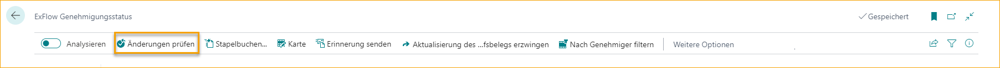

## ExFlow Genehmigungsstatus

Gehe zu: ***ExFlow Genehmigungsstatus***

Wie bereits erwähnt, wenn ein Dokument aus dem ExFlow Import Journal erstellt wird, kann das Dokument im Genehmigungsstatus gefunden werden.

Der Genehmigungsstatus zeigt alle Rechnungen an, die zur Genehmigung ausstehen und/oder genehmigt und bereit zur Buchung sind. Ein Administrator kann Informationen zum Status sowohl für die Rechnung als auch für den nächsten Genehmiger für diese spezifische Rechnung sehen.

In diesem Beispiel hat Anders Andersson alle seine Positionen genehmigt und Bertil Boo ist der aktuelle Genehmiger.

### Abgelehnte und überfällige Dokumente hervorheben

Um es einfacher zu machen, abgelehnte oder kurz vor dem Fälligkeitsdatum stehende Dokumente zu erkennen, besteht die Möglichkeit, eine Einstellung in ExFlow Setup zu aktivieren, um diese Dokumente im Genehmigungsstatus mit roter Schrift hervorzuheben.

### Einstellung für abgelehnte und überfällige Dokumente festlegen
Gehe zu: ***ExFlow Setup - Eskalation***

Aktivieren Sie *"Abgelehnte und überfällige Dokumente hervorheben"*, um die Einstellung zu aktivieren.

Geben Sie eine Zahl in *"Anzahl der überfälligen Tage vor der Hervorhebung"* ein, um anzugeben, wie viele Tage vor dem Fälligkeitsdatum die Dokumente hervorgehoben werden sollen.

Diese Einstellung wirkt in Bezug auf das Fälligkeitsdatum des Dokuments und das Arbeitsdatum des Benutzers. "0" hebt das Dokument am Fälligkeitsdatum hervor.

### E-Mail-Erinnerungen für abgelehnte Dokumente senden
Gehe zu: ***ExFlow E-Mail-Setup***

Es ist möglich, E-Mail-Erinnerungen für abgelehnte ExFlow-Genehmigungsdokumente zu senden, wenn ein Angebot, eine Bestellung, eine Rechnung und/oder eine Gutschrift abgelehnt wird. Um Erinnerungen für abgelehnte Genehmigungsdokumente senden zu können, muss der Dokumentstatus im Genehmigungsstatus auf "Abgelehnt" stehen.

Lesen Sie mehr im Abschnitt [***ExFlow E-Mail-Setup --> Abgelehnte Bestellung, abgelehntes Angebot und abgelehnte Rechnung/Gutschrift***](https://docs.exflow.cloud/business-central/docs/user-manual/business-functionality/exflow-email-setup#rejected-order,-rejected-quote,-and-rejected-invoice/credit)

### Änderungen überprüfen
Wenn ein Dokument genehmigt wird, wird der Status auf "Genehmigt" aktualisiert. Das Dokument muss jedoch immer noch überprüft werden. Klicken Sie auf "Änderungen überprüfen", um zu sehen, ob ein Genehmiger auf ExFlow Web Änderungen vorgenommen hat.

Wenn in der Ansicht des Genehmigungsstatus kein Filter festgelegt ist, wirkt die Funktion "Änderungen überprüfen" auf alle Dokumente mit dem Status "Genehmigt". Wenn ein aktiver Filter vorhanden ist (zum Beispiel werden nur Dokumente für einen bestimmten Lieferanten angezeigt), wird "Änderungen überprüfen" nur auf die Dokumente in der gefilterten Ansicht angewendet. Genehmigte Dokumente außerhalb des Filters behalten weiterhin den Status "Genehmigt".

Die Verwendung eines Filters für den Dokumententyp im Genehmigungsstatus, der so eingestellt ist, dass Bestellung und Angebot von der Überprüfung ausgeschlossen werden, kann vorteilhaft sein, wenn ein Systembenutzer nur andere Dokumententypen wie Rechnung oder Gutschrift überprüfen möchte.

ExFlow Änderungen überprüfen zeigt alle Zeilen an, die auf ExFlow Web geändert wurden. Sowohl der registrierte Wert in Rot als auch der aktualisierte Wert in Schwarz auf den Dokumentzeilen.

Zeilen ohne Änderungen erhalten den Änderungsstatus "Keine Änderung".

Verwenden Sie "Dokument aktualisieren", um die Dokumentenkarte für ein bestimmtes Dokument oder "Alle aktualisieren" zu aktualisieren. Wenn alle Dokumente aktualisiert sind, wird die Seite automatisch geschlossen.

"Genehmigungskarte" öffnet die endgültig genehmigte ExFlow-Karte.

Öffnen Sie die "Karte", um zur ursprünglichen Business Central-Standardkarte für den Einkauf zu gelangen.

Wenn auf ExFlow Web keine Änderungen vorgenommen wurden, wird der Status im Genehmigungsstatus automatisch auf "Bereit zur Buchung" aktualisiert.

Es besteht die Möglichkeit, den Schritt "Änderungen überprüfen" in der Seite "Genehmigungsstatus" zu überspringen, wenn keine Änderungen am genehmigten Dokument vorgenommen wurden. In diesem Fall wird die Aktion "Änderungen überprüfen" automatisch ausgeführt und der Dokumentstatus wird auf "Bereit zur Buchung" geändert.

Diese Funktion kann in ExFlow Setup unter **Hintergrundverarbeitung** aktiviert werden, indem **Änderungen automatisch überprüfen** aktiviert wird.

Diese Funktion kann auch in **ExFlow Lieferanteneinrichtung** gefunden und für jeden Lieferanten eingerichtet werden.

### Änderungen in "Änderungen überprüfen" ablehnen
Der Genehmigungsprozess kann von einem ausgewählten Genehmiger auf der Seite "ExFlow Änderungen überprüfen" neu gestartet werden. Diese Funktion befindet sich in der Genehmiger-Factbox.

Die Funktion "Genehmigungsprozess neu starten" hat zwei Optionen.

* **Von markiertem Genehmiger neu starten** - startet die markierten "Dokumentzeilen" vom markierten Genehmiger neu. 
* **Von markiertem Genehmiger für alle Zeilen neu starten** - startet alle "Dokumentzeilen", die mit dem markierten Genehmiger verbunden sind, neu.

Nach Auswahl einer der möglichen Optionen wird das Dialogfeld "Diskussionspanel" geöffnet, in dem ein Kommentar für den Genehmiger hinterlassen werden kann.

Der Kommentar wird im Diskussionspanel im Genehmigungsstatus gespeichert und der Genehmiger kann den Kommentar im Chat auf ExFlow Web sehen. Wenn die Einrichtung erfolgt ist, kann der Genehmiger auch eine E-Mail erhalten.

### Stapelbuchung

Gehe zu: ***Stapelbuchung***

Nach der Überprüfung der Änderungen ist das Dokument jetzt bereit zur Buchung.

Verwenden Sie die Stapelbuchung, um alle Dokumente, die zur Buchung bereit sind, in einem Stapel zu buchen.

Um das Buchungsdatum für alle Dokumente zu aktualisieren, geben Sie ein neues Datum im Feld Buchungsdatum ein und aktivieren Sie "Buchungsdatum ersetzen".

Wenn ein oder mehrere Dokumente einen Abgrenzungskode haben und "Buchungsdatum ersetzen" verwendet wird, wird folgende Frage angezeigt:

**Ja:** Um das Abgrenzungsstartdatum gemäß den Einstellungen des Abgrenzungskodes für alle Dokumentzeilen zu aktualisieren.
**Nein:** Um das Abgrenzungsstartdatum beizubehalten, wie es bei allen Dokumentzeilen erstellt wurde.

### Dokument buchen

Gehe zu: ***Aktion \--\> Buchen \--\> Buchen (F9)***

Verwenden Sie "Buchen (F9)", um ein Dokument einzeln zu buchen.

Es besteht auch die Möglichkeit, mehrere Dokumente manuell auszuwählen und mit "Stapelbuchung" alle markierten Dokumente zu buchen. Verwenden Sie "Weitere auswählen", um die Dokumente manuell auszuwählen, die gebucht werden sollen.

Klicken Sie dann auf "Stapelbuchung", um mit der Buchung fortzufahren.

### Vorschau der Buchung

Gehe zu: ***Genehmigungsstatus \--\>*** ***Aktionen \--\> Buchung \--\>
Vorschau der Buchung***

Verwende "Vorschau der Buchung", um Einträge zu überprüfen, die aus den aktuellen Daten auf der Karte erstellt werden, bevor die tatsächliche Buchung erfolgt. Die Vorschau der Buchung kann für alle Dokumentenstatus verwendet werden, nicht nur für Dokumente mit dem Status "Bereit zur Buchung". Um die Vorschau der Buchung während des Genehmigungsprozesses zu verwenden, verwende "Erzwinge Aktualisierung des Einkaufsdokuments", um die Karte zu aktualisieren.

### Vorläufige Buchung
Wenn die vorläufige Buchung aktiviert ist, können Buchung, Vorschau der Buchung, Stornierung und Suche nach Einträgen im Genehmigungsstatus durchgeführt werden.
Gehe zu: ***Genehmigungsstatus --> Aktionen --> Buchung --> Vorläufige Buchung***
Weitere Informationen finden Sie im Abschnitt [***Vorläufige Buchung***](https://docs.exflow.cloud/business-central/docs/user-manual/business-functionality/preliminary-posting) 

### Erinnerung senden

Senden Sie eine Erinnerung für dieses Dokument an die aktuellen Genehmiger für alle Positionen in einem Einkaufsdokument.

### Erinnerung für mehrere Dokumente senden
Verwenden Sie "Mehrere auswählen", um mehrere Dokumente zu markieren, und klicken Sie auf "Erinnerung senden". Erinnerungen werden dann an alle aktuellen Genehmiger für diese ausgewählten Dokumente gesendet.

Es wird folgende Meldung angezeigt:

### PDF-Viewer in neuem Tab öffnen

Es ist möglich, das PDF in einem neuen Tab zu öffnen. Die ExFlow-Web-URL muss in der ExFlow-E-Mail-Konfiguration (E-Mail-Typ "Posteingangserinnerung") im Standardunternehmen festgelegt sein.

Weitere Informationen finden Sie im Abschnitt [***ExFlow E-Mail-Konfiguration***](https://docs.exflow.cloud/business-central/docs/user-manual/business-functionality/exflow-email-setup#inbox-reminder) 

### Erzwinge Aktualisierung des Einkaufsdokuments

Wenn während des Genehmigungsprozesses Änderungen erforderlich sind, verwenden Sie die Benutzerfunktion "Erzwinge Aktualisierung des Einkaufsdokuments", um die Karte zu aktualisieren. Jetzt können Änderungen in der Karte vorgenommen werden, ohne dass die Änderungen von ExFlow Web gelöscht werden.

Verwenden Sie "Dokument aktualisieren", um die Dokumentenkarte für das ausgewählte Dokument zu aktualisieren. Wenn das Dokument aktualisiert wird, wird die Seite automatisch geschlossen.

### Filtern nach Genehmiger

Filtern Sie nach einem bestimmten Genehmiger (Genehmigungsgruppe) und Status in der Liste des Genehmigungsstatus.

### Dokumentbild anzeigen
Zum Herunterladen oder Öffnen des PDFs
Gehe zu: ***Genehmigungsstatus --> Verwandte --> Dateien --> Dokumentbild anzeigen***

### Importdetails anzeigen
Um Importdetails anzuzeigen
Gehe zu: ***Genehmigungsstatus --> Verwandte --> Dateien --> Importdetails anzeigen***

### Bild importieren oder ersetzen
Um ein PDF zu importieren oder zu ersetzen
Gehe zu: ***Genehmigungsstatus --> Verwandte --> Dateien --> Dokumentbild anzeigen***

### Abgelehnte Rechnung behandeln / Genehmigungsprozess neu starten

Dies wird verwendet, wenn der richtige Genehmigungsworkflow ausgewählt wurde, aber aus irgendeinem Grund neu gestartet werden muss (z. B. eine Ablehnung).

Wenn das Dokument auf ExFlow Web abgelehnt wird, muss der Genehmiger einen Kommentar hinzufügen, der in der Genehmigerzeile gespeichert wird, und das Dokument muss in Business Central behandelt werden.

Bei Verwendung automatischer Genehmigungsregeln ist die empfohlene Option, die Daten auf der Rechnungskarte zu aktualisieren. ExFlow weist dann automatisch einen neuen Genehmigungsworkflow basierend auf den neuen Daten zu.

Eine andere Möglichkeit besteht darin, den Genehmigungsprozess in der Zeile durch Klicken auf "Route neu starten" neu zu starten. Oder fügen Sie einen neuen Genehmiger manuell nach dem Genehmiger ein, der das Dokument abgelehnt hat. Der neue Genehmiger erhält den Status "Aktuell" und kann dann den abgelehnten Kommentar des Genehmigers anzeigen.

Diese Funktion befindet sich im Abschnitt "Dokumentzeilen". 
***Dokumentzeilen \--\> Zeile \--\> Route neu starten***

Das Neustarten der Route aus den Dokumentzeilen bietet zwei Optionen.

**Zeile neu starten** - startet die "Dokumentzeilen" und alle verbundenen "Genehmigerzeilen" neu.

**Alle Zeilen neu starten** - startet alle "Dokumentzeilen" und alle verbundenen "Genehmigerzeilen" neu.

Um von einem markierten Genehmiger auf einer oder allen Zeilen neu zu starten. 
Gehe zu: ***Genehmigerzeilen \--\> Route neu starten.***

**Zeile neu starten** - startet die "Dokumentzeilen" und alle verbundenen "Genehmigerzeilen" neu.

**Alle Zeilen neu starten** - startet alle "Dokumentzeilen" und alle verbundenen "Genehmigerzeilen" neu.

**Von markiertem Genehmiger neu starten** - startet von markiertem Genehmiger auf
markierter Zeile neu.

**Von markiertem Genehmiger für alle Zeilen neu starten -** z. B. zwei "Dokumentzeilen" mit drei Genehmigern, alle Zeilen genehmigt, Neustart auf dem zweiten Genehmiger, diese Option startet alle "Dokumentzeilen" vom selben Benutzer auf Zeilen, die diesen Benutzer enthalten. Wenn dieser Benutzer mehrmals vorkommt, wird die Route ab der ersten Zeile des Benutzers neu gestartet.

### Genehmigungsworkflow ändern
Zeile auswählen und gehen Sie zu: ***Dokumentzeilen \--\> Zeile \--\> Genehmigung.***

Ein neues Fenster öffnet die Rechnungszeilenkarte (Titel: BEARBEITEN - GENEHMIGUNG).

Fügen Sie Genehmiger zur "Genehmigerzeilen" hinzu und/oder entfernen Sie sie bei Bedarf, indem Sie auf "Verwalten" klicken.

**Neue Genehmiger vorschlagen** 
Neue Genehmiger vorschlagen löscht die aktuellen Genehmiger und fügt neue Genehmiger basierend auf der neuen Genehmigungsregel hinzu.

**Auf alle Zeilen kopieren** 
Wenn ein Dokument viele Dokumentzeilen enthält, hilft "Auf alle Zeilen kopieren" dabei, die Genehmigungsgruppe (von einer Zeile) auf alle Zeilen zu kopieren.

### Ändern des G/L-Kontos während der Genehmigung
Gehe zu: ***ExFlow Genehmigungsstatus \--\> Karte***

Das Ändern der Nummer (entfernt die alte Nummer und fügt die neue hinzu) auf einem G/L-Konto, das einen Genehmigungsworkflow hat, entfernt es und fügt es neu ein, falls zutreffend.

### Löschen einer genehmigten Eingangsrechnung
Gehe zu: ***Eingangsrechnung/Eingangsgutschrift***

Wenn das Dokument erstellt, aber noch nicht gebucht ist, erfolgt das Löschen gemäß dem Business Central-Standard.

Gehe zu Eingangsrechnung/Eingangsgutschrift, indem du auf "Karte" klickst, und lösche das Dokument. Die Genehmigungsstatuskarte wird mit der Rechnungsnummer in "ExFlow gelöschte Dokumente" gespeichert.

Gebuchte Eingangsrechnungen sollten nicht gelöscht werden. Erstelle stattdessen eine Gutschrift, die die Rechnung neutralisiert. Erstelle dann bei Bedarf eine neue Eingangsrechnung.

### FactBoxes im Genehmigungsstatus
Im Genehmigungsstatus befinden sich nützliche FactBoxes auf der rechten Seite.

**PDF-Vorschau** 
Ändere die Größe der PDF-Vorschau, indem du -/+ drückst, um die Größe des PDFs zu verringern oder zu vergrößern.

Setze die Größe der FactBox zurück, indem du auf "Wiederherstellen" klickst.

"Verkleinern", "Vergrößern" und Zoom zurücksetzen

Ändere die Seitenzahl des PDFs mit den "Aufzeichnungsschaltflächen".

Öffne die PDF-Datei in voller Größe. 
Gehe zu: ***Navigieren \--\> Dateien \--\> Dokumentenbild anzeigen (Strg+I)***

**Eingehende Dokumente** 
Zeige an und füge Anhänge hinzu.

Um ein Dokument anzuhängen, ohne den Hauptanhang zu ersetzen, gehe zu: ***FactBox \--\> Eingehende Dokumente \--\> Datei anhängen*** 

Klicke auf "Auswählen", durchsuche die Datei, die du anhängen möchtest, und klicke auf "Öffnen".

Dies kann auch über das Eingehende Dokument im Business Central-Standard erfolgen.

**Ändern des PDF-Dokumentenbilds** 
Wenn das PDF-Bild vor der Buchung des Dokuments geändert werden muss, gehe zu: ***Navigieren \--\> Dateien \--\> Bild importieren oder ersetzen***

Dies kann auch über das Eingehende Dokument im Business Central-Standard erfolgen.

**Diskussionsbereich** 
Wenn ein Benutzer einen Kommentar im Diskussionsbereich im Genehmigungsstatus hinzufügt und auf SEND klickt, wird der Kommentar in der FactBox auf der rechten Seite mit der Benutzer-ID, dem Datum und der Uhrzeit angezeigt. Auf ExFlow Web wird er im Chat des Dokuments angezeigt.

Wenn ein Benutzer mit @ erwähnt wird, kann er das Dokument sehen und im ExFlow Web kommentieren, auch wenn er nicht im Genehmigungsworkflow ist.

Weitere Informationen zu Einstellungen und zur Verwendung des Diskussionsbereichs findest du im Abschnitt: [***Benachrichtigungen in Business Central \--\> Diskussionsbereich / Chat und Zeilenkommentare***](https://docs.exflow.cloud/business-central/docs/user-manual/approval-workflow/notifications-in-business-central#discussion-panel--chat-and-line-comments).

### Kommentare von Genehmigern lesen

Wenn ein Web-Genehmiger einen Kommentar im Chat im Header hinzufügt und auf "SEND" klickt, wird der Kommentar in der FactBox auf der rechten Seite mit der Genehmiger-ID, dem Datum und der Uhrzeit angezeigt.

Das Dokument hat auch einen Tag im Header "Kommentar im Diskussionsbereich", wenn Kommentare von ExFlow oder ExFlow Web vorhanden sind.

Wenn ein Web-Genehmiger einen Kommentar zu einer Zeile hinzufügt, wird der Kommentar in "Zeilen-Genehmiger" im Feld "Kommentar" angezeigt.

Weitere Informationen zu Einstellungen und zur Verwendung des Diskussionsbereichs findest du im Abschnitt: [***Benachrichtigungen in Business Central \--\> Diskussionsbereich / Chat und Zeilenkommentare***](https://docs.exflow.cloud/business-central/docs/user-manual/approval-workflow/notifications-in-business-central#discussion-panel--chat-and-line-comments).

### Anhängen einer Datei von Eingangsrechnung oder Eingangsgutschrift

Anhänge, die von der Eingangsrechnung und der Eingangsgutschriftskarte im Business Central-Standard erstellt wurden, werden nicht in ExFlow angezeigt. Daher empfehlen wir die Verwendung von Eingehende Dokumente in der FactBox im Genehmigungsstatus.

### Hintergrundverarbeitung

Gehe zu ***ExFlow Setup \--\> Hintergrundverarbeitung***

Die folgenden Einstellungen gelten nur für Dokumente ohne Änderungen.

Wenn Änderungen von ExFlow Web vorgenommen wurden, müssen sie dennoch manuell im Genehmigungsstatus aktualisiert werden, indem "Änderungen überprüfen" ausgeführt wird.

**"Mit Job-Warteschlange überprüfen"** und **"Mit Job-Warteschlange überprüfen und buchen"**. 
Aktiviere eine dieser Einstellungen, um automatisch eine Job-Warteschlange zu erstellen, die genehmigte Rechnungen ohne Änderungen von ExFlow Web im Genehmigungsstatus "überprüft" oder "überprüft und gebucht".

**"Änderungen automatisch überprüfen"** Aktualisiert Dokumente mit dem Status "Genehmigt" automatisch auf "Bereit zur Buchung" ohne Job-Warteschlangeneintrag.

Die Job-Warteschlange "Ex Verify & Post Job Queue" ist standardmäßig so konfiguriert, dass sie an Wochentagen jede Stunde ausgeführt wird, wenn eine der genannten Hintergrundverarbeitungseinstellungen in ExFlow Setup aktiviert ist.

Wenn die Funktion deaktiviert wird, verschwindet die Job-Warteschlange "Ex Verify & Post Job Queue" aus der Liste der "Job-Warteschlangeneinträge".

**Mit Job-Warteschlange überprüfen** 
Diese Einstellung legt fest, ob die Überprüfung genehmigter Dokumente im Hintergrund geplant werden soll. Dies gilt nur für Dokumente ohne Änderungen auf ExFlow Web.

**Überprüfen und Posten mit Job-Warteschlange** 
Gibt an, ob Dokumente mit dem Status "Bereit zur Veröffentlichung" in der Genehmigungsstatus in der Hintergrundplanung geplant werden sollen und nach der Überprüfung veröffentlicht werden.

Alle "ExFlow Web - geänderten" Dokumente, die in ExFlow Verify Changes im Genehmigungsstatus aktualisiert werden müssen, werden von diesem geplanten Job ausgeschlossen. Eine Meldung im Fehlermeldungs-Feld im ExFlow Genehmigungsstatus wird auf diesen nicht aktualisierten Dokumenten angezeigt.

**Automatische Überprüfung von Änderungen** 
Diese Einstellung ermöglicht das Überspringen des Schritts "Überprüfen von Änderungen" auf der Genehmigungsstatus-Seite, wenn keine Änderungen am genehmigten Dokument vorgenommen wurden. Der Dokumentenstatus wird automatisch auf "Bereit zur Veröffentlichung" geändert.

Die Einstellung "Automatische Überprüfung von Änderungen" kann auch in der ExFlow Vendor-Einrichtung gefunden werden. Es ist möglich, festzulegen, ob diese Funktion für einen bestimmten Lieferanten aktiviert/deaktiviert werden soll. Oder aktivieren Sie die Einstellung in der ExFlow Einrichtung für alle Lieferanten. Lesen Sie mehr über diese Funktionalität im Abschnitt **Überprüfen von Änderungen**.

**Dokumente automatisch erstellen**

Aktivieren Sie dieses Feld, wenn alle interpretierten Dokumente automatisch aus dem ExFlow Import Journal erstellt werden sollen. Diese Funktion kann auch pro Lieferant in der Vendor-Einrichtung eingerichtet werden, wenn die Dokumente eines bestimmten Lieferanten (z. B.) von dieser Einstellung ausgeschlossen werden sollen.

Wenn die Funktion aktiviert ist, werden alle interpretierten Dokumente ohne Fehler- oder Warnmeldungen automatisch erstellt und zur Genehmigung gesendet.

Es ist möglich, die ExFlow Import Journals-Listenseite zu personalisieren und die Spalte "Dokumente automatisch erstellen" dort hinzuzufügen und zu aktivieren, um ein dediziertes Journal für automatisch erstellte Dokumente zu haben.

Diese Funktion kann ohne jegliche Einrichtung im ExFlow Import Journal verwendet werden, klicken Sie einfach auf Ja in dem untenstehenden Pop-up:

Lesen Sie mehr darüber im Abschnitt [***Batch-Import von Dokumenten aus der Interpretation. ***](https://docs.exflow.cloud/business-central/docs/user-manual/approval-workflow/exflow-import-journals#batch-import-documents-from-interpretation)

### Rechnungsrundung

Wenn die Rechnungsrundung in ***Business Central \--\> Einkauf & Verbindlichkeiten Einrichtung\--\> Allgemein*** aktiviert ist, unterstützt ExFlow das automatische Buchen der Rechnungsrundung, um den Bruttobetrag auf dem Dokument anzupassen. 

Gehe zu: ***ExFlow Einrichtung \--\> Dok. Buchungsprüfungen***

Aktivieren Sie "Rechnungsrundung" und geben Sie einen Wert für "Maximale Differenz für Bruttobetrag" ein. Stellen Sie außerdem sicher, dass die Einstellung "Bruttobetrag prüfen" ebenfalls aktiviert ist.

ExFlow führt eine Kontrolle zwischen dem Bruttobetrag im Kopf des Einkaufsdokuments und dem Betrag der Dokumentenposition durch. Eine Rundungslinie wird erstellt, wenn die Differenz des Bruttobetrags innerhalb der Toleranz von "Maximale Differenz für Bruttobetrag" liegt. Die Buchung erfolgt gemäß den Standard Business Central-Einstellungen.

Wenn Swebase (für schwedische Kunden) installiert ist, wird die Rundung von Swebase behandelt und ExFlow Rounding kann nur für Vorläufige Buchung durchgeführt werden. 

Lesen Sie mehr im Abschnitt: 
[***Vorläufige Buchung***](https://docs.exflow.cloud/business-central/docs/user-manual/business-functionality/preliminary-posting)
