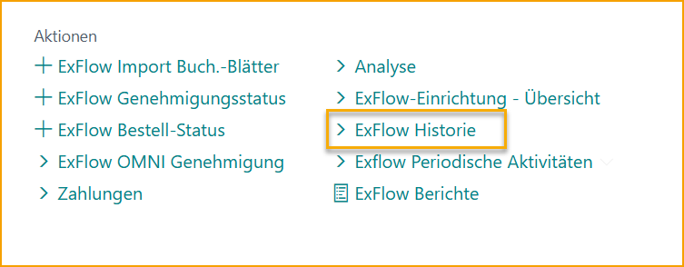
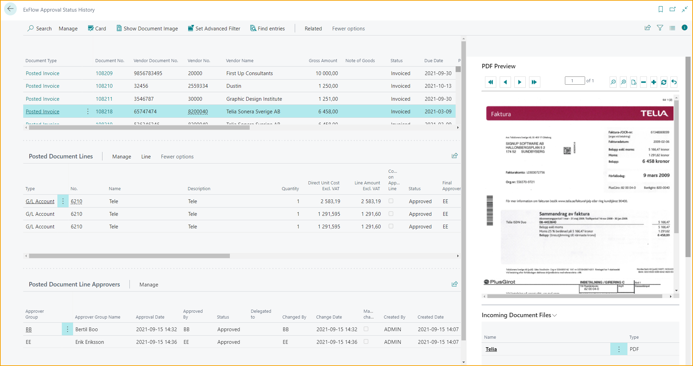
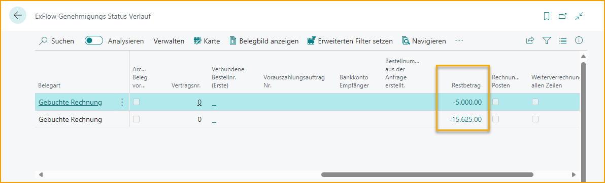
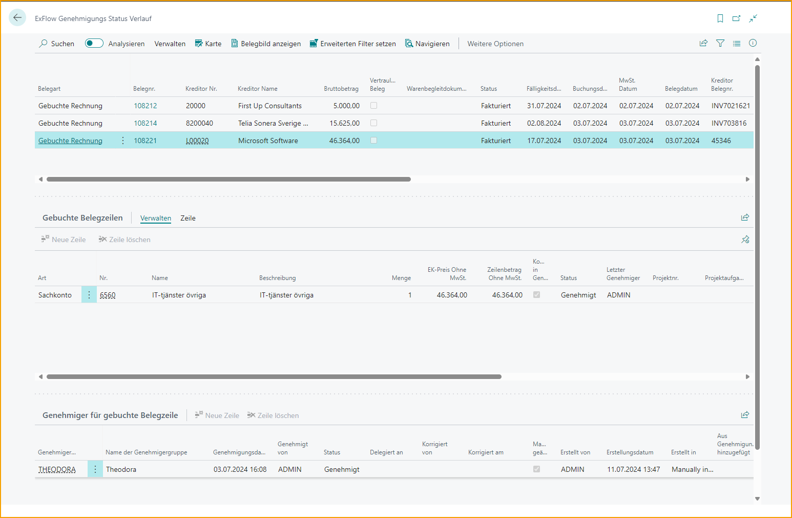
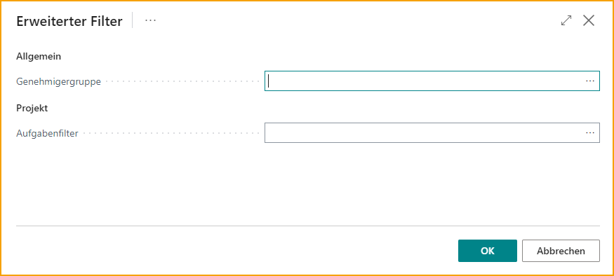
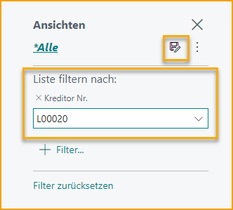
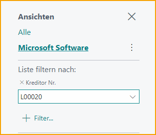
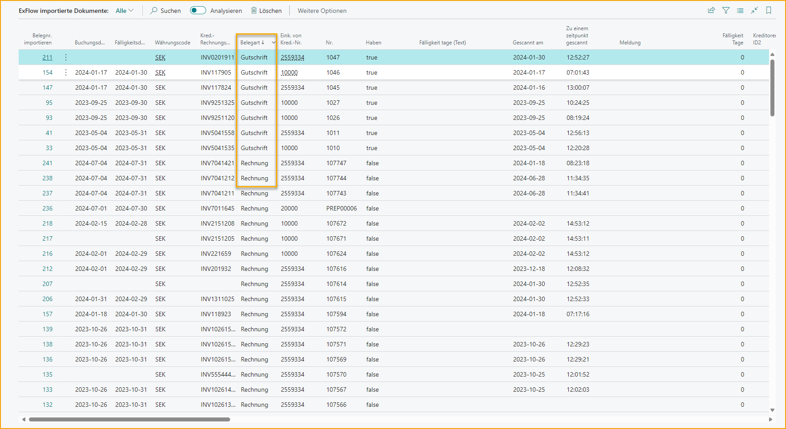
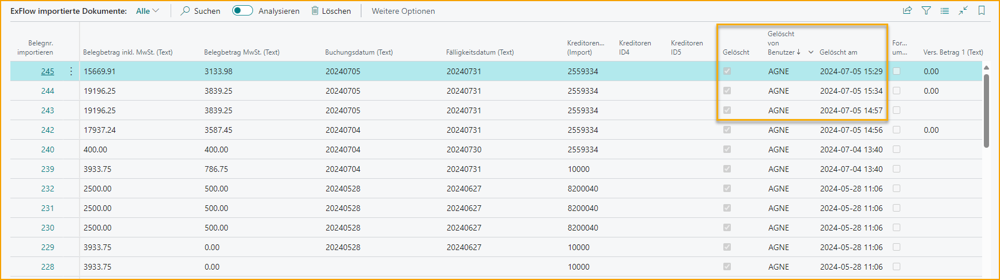
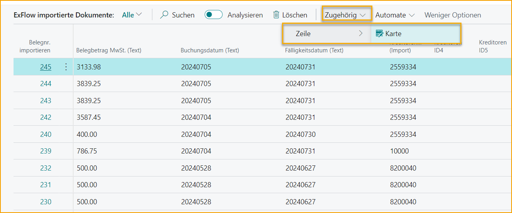

## Dokumentenverlauf

### Dokumente suchen

Gehe zu: ***Historie \--\> ExFlow Dokumente suchen***

ExFlow Dokumente suchen kann verwendet werden, um Dokumente nach verschiedenen Kriterien innerhalb von ExFlow zu durchsuchen.

Lesen Sie mehr darüber, wie Sie diese Funktion verwenden, im Abschnitt [***Dokumente suchen***](https://docs.signupsoftware.com/business-central/docs/user-manual/business-functionality/search-documents#search-documents)

### Genehmigungsstatusverlauf

Gehe zu: ***ExFlow Historie \--\> ExFlow Genehmigungsstatusverlauf***

Funktion zur Anzeige des ExFlow Genehmigungsstatusverlaufs für gebuchte Dokumente, abgeschlossene Bestellungen und Angebote. Finden Sie zugehörige Informationen/Dokumente zu einem bestimmten Dokument, sowohl die "Gebuchte Rechnung oder Gebuchtes Gutschrift" Karte als auch die "Ex Doc Karte". Es ist auch möglich, die zugehörigen OCR-Importinformationen für das Dokument zu finden oder nach "Genehmigungsgruppe" zu filtern.

Der ExFlow Genehmigungsstatusverlauf enthält auch abgeschlossene Bestellungen und Angebote. Ein abgeschlossenes Angebot ist ein Angebot, das in eine Bestellung umgewandelt wurde. Eine abgeschlossene Bestellung ist eine Bestellung, die genehmigt, fakturiert und entfernt wurde. Lesen Sie mehr im Abschnitt [***ExFlow Bestellstatus.***](https://docs.signupsoftware.com/business-central/docs/user-manual/approval-workflow/exflow-order-status#exflow-order-status-1)

Für gebuchte Rechnungen und Gutschriften ist es möglich, den "Restbetrag" aus den Kreditorenposten direkt im ExFlow Genehmigungsstatusverlauf zu sehen. Dies bedeutet, dass es möglich ist zu sehen, ob das Dokument bezahlt ist oder nicht.

#### Erweiterter Filter für ein gebuchtes Dokument setzen

Verwenden Sie den Genehmigungsstatusverlauf, um zuvor gebuchte ExFlow-Dokumente zu finden.

Finden Sie spezifische Dokumente entweder durch Suche oder durch Setzen verschiedener Standardfilter. Um zuvor gebuchte Dokumente basierend auf entweder Genehmiger oder Projekt zu finden, verwenden Sie die Funktion Erweiterter Filter setzen:

Wählen Sie eine oder mehrere Genehmigergruppe(n) und/oder Projekt(e) aus. Klicken Sie auf OK, und die Liste der Dokumente wird gefiltert, um nur Rechnungen anzuzeigen, bei denen das ausgewählte Projekt auf mindestens einer Rechnungszeile erscheint und/oder der ausgewählte Genehmiger im Genehmigungsfluss für mindestens eine Rechnungszeile erscheint.

Um den erweiterten Filter zurückzusetzen, wählen Sie Verwandt \--\> Genehmiger \--\> Filter zurücksetzen

#### Filter speichern

Im ExFlow Genehmigungsstatusverlauf ist es möglich, Filter zu speichern.

Verwenden Sie den Standard von Business Central, um alle Filter zu setzen. Klicken Sie auf Speichern und benennen Sie den Filter.

#### Kommentare von Genehmigern lesen

Wenn Kommentare im Diskussionspanel/Chat oder auf der Dokumentenzeile hinzugefügt werden, werden sie auf die gleiche Weise wie im Genehmigungsstatus angezeigt.

### Importierte Dokumente

Gehe zu: ***ExFlow Historie \--\> ExFlow Importierte Dokumente***

Alle interpretierten und importierten Dokumente werden in ExFlow Importierte Dokumente angezeigt.

Wenn ein Benutzer ein importiertes Dokument löscht, können die interpretierten Daten hier als gelöscht markiert gefunden werden, zusammen mit dem Benutzer, der gelöscht hat, und dem Datum und der Uhrzeit der Löschung.

Um interpretierte Zeilen anzuzeigen, öffnen Sie die Karte.

Gehe zu: ***Verwandt \--\> Zeile \--\> Karte***

### Chat-Benachrichtigungsverlauf

Gehe zu: ***ExFlow Historie \--\> ExFlow Chat-Benachrichtigungsverlauf***

Ein ExFlow-Benutzer kann ExFlow-Chat-Benachrichtigungen anzeigen, in denen der Benutzer in den letzten 90 Tagen markiert wurde.

Lesen Sie mehr darüber im Abschnitt [***Diskussionspanel / Chat und Zeilenkommentare.***](https://docs.signupsoftware.com/business-central/docs/user-manual/approval-workflow/notifications-in-business-central#discussion-panel--chat-and-line-comments)

### Gelöschte Dokumente

Gehe zu: ***ExFlow Historie \--\> ExFlow Gelöschte Dokumente***

Wenn ein Dokument in ExFlow erstellt, aber noch nicht gebucht wurde, ist es möglich, das Dokument zu löschen. In diesem Fall wird das Dokument gespeichert und kann in ExFlow Gelöschte Dokumente gefunden werden.

Und wenn eine Einkaufsrechnung oder ein Einkaufsgutschrift für die Genehmigung abgehakt wird, wird das ExFlow-Dokument entfernt und die Informationen werden in ExFlow Gelöschte Dokumente gespeichert.

Klicken Sie auf „Dokumenttyp“, um die Karte „Gelöschte Dokumente“ zu öffnen und die Details zu überprüfen.

