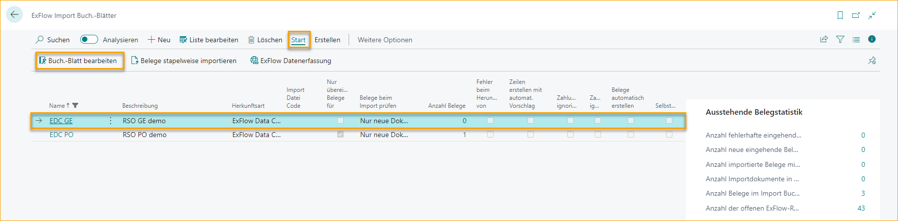
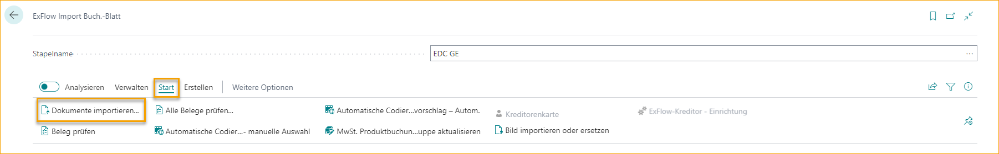
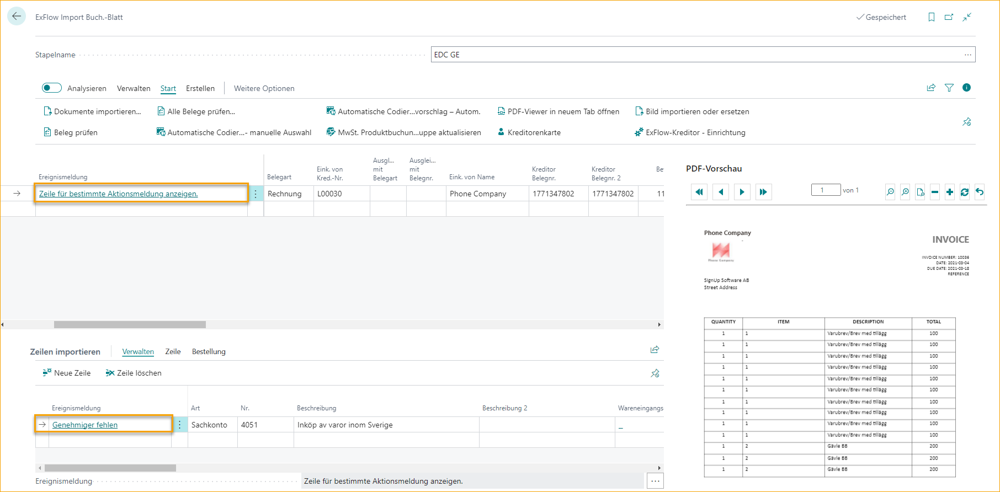
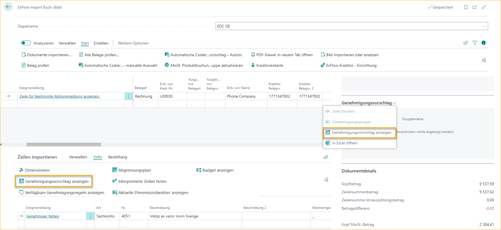
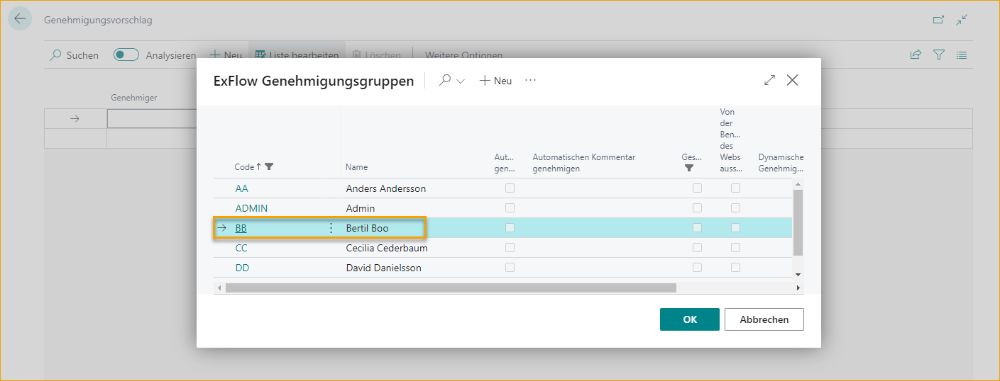
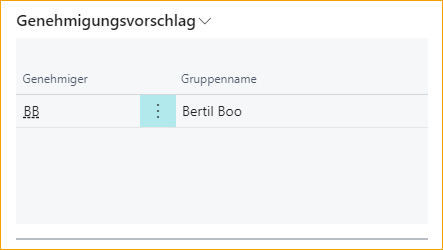
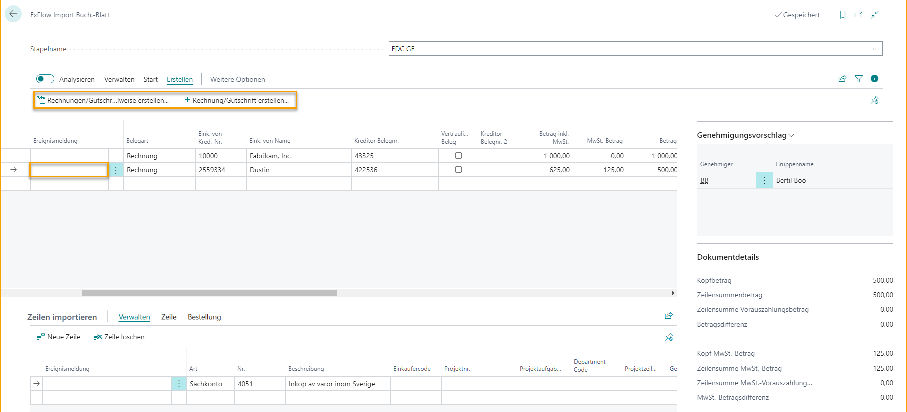
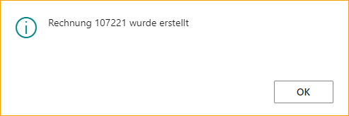

## Prozess der Ausgabenrechnung

Dieses Kapitel gibt ein Beispiel für einen Rechnungsfluss in ExFlow von der Importierung bis zur Genehmigung und Buchung in ExFlow / Business Central.

Die folgenden Schritte werden vom "ExFlow Import Journal" zum "ExFlow Genehmigungsstatus" gemacht und der letzte Schritt besteht darin, die gebuchte Rechnung im "ExFlow Genehmigungsstatusverlauf" anzuzeigen.

Schritte im ExFlow Import Journal

Schritt 1: Dokument importieren

Schritt 2: "Aktionsnachricht" überprüfen und bearbeiten. Wenn leer, zu Schritt 4 wechseln.

Schritt 3: Überprüfen und prüfen, ob alle Aktionen durchgeführt wurden.

Schritt 4: Rechnung oder Gutschrift erstellen

### Importieren und Bearbeiten einer Ausgabenrechnung

Das Importieren von Rechnungen erfolgt über das "ExFlow Import Journal". Importieren Sie Dokumente entweder in alle Journale oder öffnen Sie ein bestimmtes Journal und importieren Sie Dokumente.

Dieser Teil beschreibt, wie aus einem speziell für "Ausgabenrechnungen" erstellten Journal importiert wird.

Wählen Sie ein Journal aus und öffnen Sie es durch Klicken auf "Journal bearbeiten" oder den Namen.

Schritt 1: Dokument importieren

Gehe zu: ***Aktionen \--\> Importieren \--\> Dokumente importieren\...***

Wenn der Import abgeschlossen ist, wird eine neue Zeile erstellt.

Schritt 2: "Aktionsnachrichten" überprüfen und bearbeiten.

In diesem Beispiel gibt es keine vordefinierten Genehmigungsregeln, daher müssen Genehmiger manuell zur Rechnungsposition hinzugefügt werden.

Wählen Sie: ***Zeile \--\> Genehmigungsvorschlag anzeigen***

Fügen Sie einen oder mehrere Genehmiger hinzu.

Im FactBox auf der rechten Seite werden die Genehmiger im "Genehmigungsvorschlag" aktualisiert.

Schritt 3: Dokument überprüfen

Gehe zu: ***Prozess \--\> Dokument überprüfen / Stapelweise Dokumente überprüfen***

Wenn alle Aktionsnachrichten bearbeitet wurden, "Dokument überprüfen", um zu sehen, ob die Aktionsnachricht leer ist und daher bereit zur Erstellung ist.

Schritt 4: Dokument erstellen

Gehe zu: ***Erstellen \--\> "Stapelweise erstellen R..nungen/Gutschriften"\... / "Rechnung/Gutschrift erstellen"***

Erstellen Sie eine Rechnung oder Gutschrift, indem Sie auf "Rechnung/Gutschrift erstellen" klicken.

