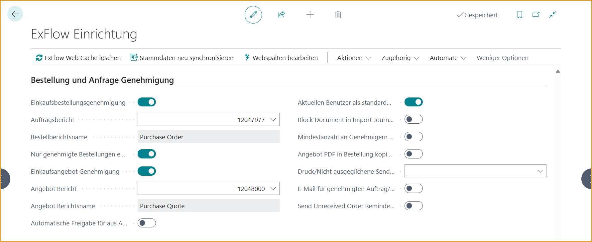

## ExFlow Bestellstatus

Gehe zu: ***ExFlow Bestellstatus***

Wenn eine Bestellung oder ein Angebot zur Genehmigung markiert wird, befindet es sich im ExFlow Bestellstatus und im ExFlow Genehmigungsstatus. Wenn eine Bestellung oder ein Angebot freigegeben wird, ändert sich der Status von Inaktiv auf Aktiv. Nicht freigegebene Bestellungen oder Angebote haben den Status Inaktiv und sind auf ExFlow Web nicht sichtbar.

### Einrichtung der Bestell- und Angebotsgenehmigung

Gehe zu**: *Setup \--\> ExFlow Einrichtung \--\> Bestell- und Angebotsgenehmigung*** 
Um die Funktion zur Bestell- und Angebotsgenehmigung zu verwenden, sind einige Einstellungen erforderlich.

**Bestellgenehmigung** 
Um automatisch eine Genehmigungsflagge auf allen Bestelldokumenten hinzuzufügen, muss "Bestellgenehmigung" aktiviert sein. Außerdem wird für die Genehmigung einer Bestellung auf ExFlow Web ein PDF benötigt.

**Bestellbericht** 
Um eine Bestellung zur Genehmigung auf ExFlow Web zu senden, wird ein PDF benötigt. 
Wählen Sie einen Bericht aus der Liste aus, um die Bestell-PDF anzeigen zu können.

**Nur genehmigte Bestellungen empfangen**  
Aktivieren Sie diese Einstellung, um den Buchungseingang zu verhindern, wenn die Bestellung noch nicht genehmigt ist.

Folgende Fehlermeldung wird angezeigt, wenn diese Einstellung aktiviert ist und ein Benutzer versucht, Buchungseingänge für eine nicht genehmigte Bestellung zu buchen.

**Angebotsgenehmigung** 
Um automatisch eine Genehmigungsflagge auf allen Angeboten hinzuzufügen, muss "Angebotsgenehmigung" aktiviert sein. 
Um ein Angebot zur Genehmigung auf ExFlow Web zu senden, wird ein PDF benötigt.

**Angebotsbericht** 
Um ein Angebot zur Genehmigung auf ExFlow Web zu senden, wird ein PDF benötigt. 
Wählen Sie einen Bericht aus der Liste aus, um das Angebots-PDF anzeigen zu können.

**Automatische Genehmigung von aus Angeboten erstellten Bestellungen** 
Diese Einstellung ist relevant, wenn sowohl die Bestell- als auch die Angebotsgenehmigung aktiviert sind. Mit dieser Funktion ist es möglich, die automatische Genehmigung von aus Angeboten erstellten Bestellungen zu aktivieren. Wenn diese Einstellung verwendet wird, werden alle Genehmiger vom Angebot in die Bestellung kopiert und die Bestellung wird sofort genehmigt.

**Aktuellen Benutzer als Standard-Erstgenehmiger festlegen** 
Verwenden Sie dies, um den Benutzer, der das Angebot oder die Bestellung erstellt, als Erstgenehmiger des Dokuments hinzuzufügen. 
Abhängig von der ExFlow Einrichtung kann der Erstgenehmiger als Filter in Genehmigungsregeln verwendet werden, um Genehmigungsabläufe für Angebote und Bestellungen zu erstellen. Der Erstgenehmiger kann auch ein tatsächlicher Genehmiger sein.

Um diese Funktion zu verwenden, muss der Business Central-Benutzer ein ExFlow-Systembenutzer sein. Lesen Sie mehr im Abschnitt [***ExFlow Benutzer***](https://docs.exflow.cloud/business-central/docs/user-manual/business-functionality/exflow-user).

**Rechnungsblockierung im Importjournal, wenn Bestellung nicht genehmigt ist** 
Fügen Sie eine Warnmeldung hinzu, wenn ein Dokument einer nicht genehmigten Bestellung zugeordnet wird. In diesem Beispiel wird der Forderungsposten gebucht, auch wenn die Bestellung nicht genehmigt ist.

Dann wird beim Zuordnen der Rechnung im Importjournal eine Warnmeldung angezeigt, dass die erhaltenen Bestellpositionen nicht genehmigt sind.

Wie bei anderen Warnmeldungen im Importjournal kann dies durch Akzeptieren gelöst werden:

**Überprüfung der Mindestanzahl von Genehmigern für Angebote und Bestellungen** 
Gibt an, ob die Einstellung "Mindestanzahl von Genehmigern" unter dem Tab "Dokumentbuchungsprüfungen" auch für Angebote und Bestellungen gilt.

**Angebots-PDF in Bestellung kopieren** 
Eine Kopie eines Angebots-PDF-Anhangs wird der Bestellung hinzugefügt, wenn die Bestellung erstellt wird. 
Nachdem eine Bestellung aus einem Angebot erstellt wurde, kann die Kopie des Angebots-PDF-Anhangs als eingehendes Dokument in ExFlow Bestellstatus und ExFlow Genehmigungsstatus sowie als Anhang in ExFlow Web gefunden werden.

**Drucken/Versenden bei nicht genehmigten Dokumenten blockieren** 
Diese Einstellung legt fest, ob das Drucken oder Versenden einer Bestellung, eines Angebots oder beider Funktionen blockiert werden soll, wenn die Bestellung oder das Angebot zur Genehmigung versendet wird und noch nicht vollständig genehmigt ist.br/ 
Diese Einstellung ist nur relevant für Benutzer, die nicht über Berechtigungen als EX ACCOUNTANT oder EX ADMIN verfügen. 
Benutzer, die die Berechtigung als EX ACCOUNTANT oder EX ADMIN haben, können diese Funktion immer verwenden, auch wenn das Dokument nicht vollständig genehmigt ist. 

In diesem Beispiel verwendet ein Benutzer, der nicht über die Berechtigung als EX ACCOUNTANT oder EX ADMIN verfügt, die Aktion Drucken/Versenden für ein nicht vollständig genehmigtes Dokument und erhält eine Fehlermeldung. 

### Erstellen einer zur Genehmigung erforderlichen Bestellung oder eines Angebots

Beim Erstellen eines Angebots oder einer Bestellung wird aufgrund der Einstellungen die Genehmigungsflagge aktiviert und der ExFlow-Status auf Inaktiv gesetzt.

Um das Angebot/Bestellung zur Genehmigung zu senden, sind Genehmiger erforderlich und es muss freigegeben werden. Das Angebot/Bestellung ist jetzt sowohl im ExFlow Bestellstatus als auch im ExFlow Genehmigungsstatus sichtbar, aber noch nicht auf ExFlow Web.

Wenn der Business Central-Benutzer, der die Bestellung/das Angebot erstellt, mit einem ExFlow-Benutzer verbunden ist, wird der Erstgenehmiger automatisch zu allen Positionen hinzugefügt und kann daher als Filter in Genehmigungsregeln verwendet werden.

### ExFlow Genehmigungsstatus

Bestellungen und Angebote, die noch eine Aktion erfordern, finden Sie im ExFlow Genehmigungsstatus. Nach der Genehmigung führen Sie "Änderungen überprüfen" aus, um die Bestellungen oder Angebote mit allen Änderungen zu aktualisieren.

Wenn ein Angebot genehmigt und überprüft wird, verschwindet es aus dem Genehmigungsstatus.

ExFlow erstellt automatisch eine Bestellung. Das Angebot wird gelöscht, wie es in Business Central Standard der Fall ist, während Genehmigungsfluss, Kommentare, Anhänge usw. im ExFlow Genehmigungsstatusverlauf gespeichert werden.

Aufgrund der Einstellungen in der ExFlow Einrichtung kann der Angebotsgenehmigungsfluss auch auf die Bestellung kopiert und die Bestellung als genehmigt markiert werden. Andernfalls muss die Bestellung freigegeben werden, wenn die Bestellgenehmigung aktiviert ist.

Das Angebot kann nicht in eine Bestellung umgewandelt werden, wenn es zur Genehmigung aktiviert ist, aber noch nicht genehmigt wurde. Die Funktion heißt "Bestellung erstellen".

Wenn eine Bestellung genehmigt und überprüft wird, verschwindet sie aus dem Genehmigungsstatus und kann nun im ExFlow Bestellstatus gefunden werden.

### ExFlow Bestellstatus

Diese Ansicht dient hauptsächlich zur Verfolgung von Bestell- und Angebotsgenehmigungen.

Im ExFlow Bestellstatus bleiben die Bestellungen oder Angebote so lange bestehen, wie sie als Karte existieren.

Die Bestellung oder das Angebot muss immer noch auf ExFlow Web genehmigt und dann aus dem ExFlow Genehmigungsstatus überprüft werden.

Nach der Überprüfung der Bestellung wird das Feld "Bestellung genehmigt und überprüft" angekreuzt. In dieser Hinsicht verhalten sich Bestellungen und Angebote unterschiedlich, da Angebote direkt gelöscht werden, wenn die Bestellung erstellt wird, während Bestellungen als in Rechnung gestellt angezeigt werden, bis sie in der Standardversion von Business Central durch einen Job gelöscht werden.

Verfolgen Sie den aktuellen Status im ExFlow Bestellstatus in der Spalte "Status".

Es ist auch möglich zu sehen, ob die Bestellung aus einem Angebot erstellt wurde und ob die Genehmigung vom Angebot auf die Bestellung kopiert wurde.

Um eine Bestellung zu löschen, muss die Bestellung vollständig empfangen und vollständig in Rechnung gestellt sein. Das Löschen einer Bestellung erfolgt über die Aufgabe ***In Rechnung gestellte Bestellung löschen***. Die Bestellung wird auch gelöscht, wenn sie direkt von der Bestellkarte in der Standardversion von Business Central außerhalb von ExFlow in Rechnung gestellt wird.

Beim Löschen einer Bestellung, die genehmigt und vollständig in Rechnung gestellt ist, werden Genehmigungsfluss, Kommentare, Anhänge usw. im ExFlow Genehmigungsstatusverlauf gespeichert.

