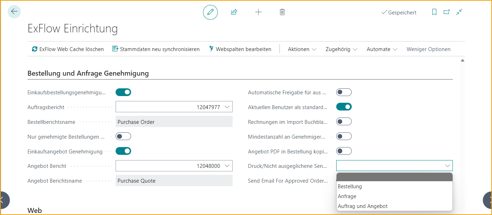
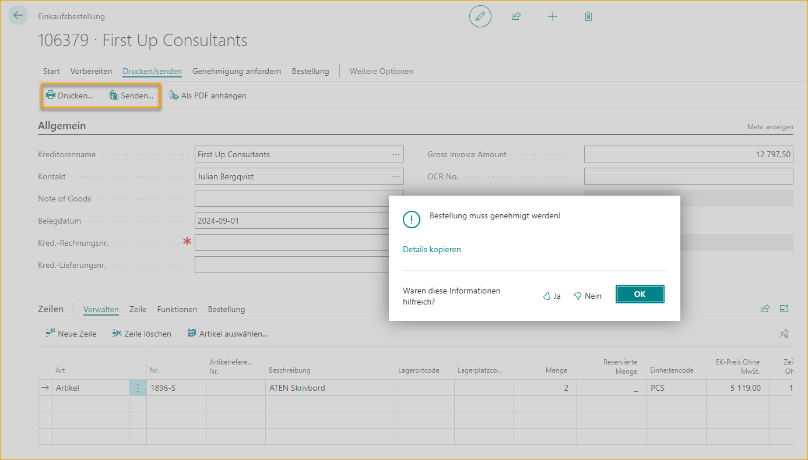

## ExFlow Bestellstatus

Gehe zu: ***ExFlow Bestellstatus***

Wenn eine Bestellung oder ein Angebot zur Genehmigung markiert wird, ist es im ExFlow Bestellstatus und im ExFlow Genehmigungsstatus zu finden. Wenn eine Bestellung oder ein Angebot freigegeben wird, ändert sich der Status von Inaktiv zu Aktiv. Nicht freigegebene Bestellungen oder Angebote haben den Status Inaktiv und können auf ExFlow Web nicht eingesehen werden.

### Einrichtung der Bestell- und Angebotsgenehmigung

Gehe zu**: *Setup \--\> ExFlow Setup \--\> Bestell- und Angebotsgenehmigung*** 
Um die Funktion der Bestell- und Angebotsgenehmigung zu nutzen, sind einige Einstellungen erforderlich.

**Bestellgenehmigung** 
Um automatisch ein Genehmigungskennzeichen auf allen Bestelldokumenten hinzuzufügen, muss die "Bestellgenehmigung" aktiv sein. Außerdem wird ein PDF benötigt, um eine Bestellung zur Genehmigung an ExFlow Web zu senden.

**Bestellbericht** 
Um eine Bestellung zur Genehmigung an ExFlow Web zu senden, wird ein PDF benötigt. 
Wählen Sie einen Bericht aus der Liste, um das Bestell-PDF anzeigen zu können.

**Nur genehmigte Bestellungen empfangen**  
Aktivieren Sie diese Einstellung, um das Buchen von Wareneingängen zu verhindern, wenn die Bestellung noch nicht genehmigt ist.

Folgende Fehlermeldung erscheint, wenn diese Einstellung aktiviert ist und ein Benutzer versucht, Wareneingänge auf eine nicht genehmigte Bestellung zu buchen.

**Angebotsgenehmigung** 
Um automatisch ein Genehmigungskennzeichen auf allen Angeboten hinzuzufügen, muss die "Angebotsgenehmigung" aktiv sein. 
Um ein Angebot zur Genehmigung an ExFlow Web zu senden, wird ein PDF benötigt.

**Angebotsbericht** 
Um ein Angebot zur Genehmigung an ExFlow Web zu senden, wird ein PDF benötigt. 
Wählen Sie einen Bericht aus der Liste, um das Angebots-PDF anzeigen zu können.

**Automatische Genehmigung von Bestellungen, die aus Angeboten erstellt wurden** 
Diese Einstellung ist relevant, wenn sowohl die Bestellgenehmigung als auch die Angebotsgenehmigung aktiviert sind. Mit dieser Funktion ist es möglich, die automatische Genehmigung von Bestellungen, die aus Angeboten erstellt wurden, zu aktivieren. Wenn diese Einstellung verwendet wird, werden alle Genehmiger aus dem Angebot in die Bestellung übernommen und die Bestellung wird sofort genehmigt.

**Aktuellen Benutzer als Standard-Erstgenehmiger festlegen** 
Verwenden Sie diese Option, um den Benutzer, der das Angebot oder die Bestellung erstellt, als Erstgenehmiger des Dokuments hinzuzufügen. 
Je nach ExFlow Setup kann der Erstgenehmiger als Filter in Genehmigungsregeln verwendet werden, um Genehmigungsabläufe für Angebote und Bestellungen zu erstellen. Der Erstgenehmiger kann auch ein tatsächlicher Genehmiger sein.

Um diese Funktion zu nutzen, muss der Business Central Benutzer ein ExFlow Systembenutzer sein. Lesen Sie mehr im Abschnitt [***ExFlow Benutzer***](https://docs.exflow.cloud/business-central/docs/user-manual/business-functionality/exflow-user).

**Rechnung im Importjournal blockieren, wenn Bestellung nicht genehmigt ist** 
Um eine Warnmeldung hinzuzufügen, wenn ein Dokument mit einer nicht genehmigten Bestellung abgeglichen wird. In diesem Beispiel wird der Wareneingang gebucht, auch wenn die Bestellung nicht genehmigt ist.

Dann, wenn die Rechnung im Importjournal abgeglichen wird, informiert eine Warnmeldung, dass die empfangenen Bestellpositionen nicht genehmigt sind.

Wie bei anderen Warnmeldungen im Importjournal kann dies durch Akzeptieren der Meldung behoben werden:

**Überprüfen Sie die Mindestanzahl der Genehmiger für Angebote und Bestellungen** 
Gibt an, ob die Einstellung für "Mindestanzahl der Genehmiger" unter dem Tab "Dokumentenprüfungen" auch für Angebote und Bestellungen gilt.

**Kopieren Sie das Angebots-PDF in die Bestellung** 
Eine Kopie eines Angebots-PDF-Anhangs wird der Bestellung hinzugefügt, wenn die Bestellung erstellt wird. 
Nachdem die Bestellung aus einem Angebots-PDF erstellt wurde, kann die Kopie des Angebots-PDF-Anhangs als eingehende Dokumentdatei im ExFlow-Bestellstatus und im ExFlow-Genehmigungsstatus sowie als Anhang in ExFlow Web gefunden werden.

**Drucken/Senden von nicht genehmigten Dokumenten blockieren** 
Die Einstellung gibt an, ob das Drucken oder Senden von einer Bestellung, einem Angebot oder beidem blockiert werden soll, wenn die Bestellung oder das Angebot zur Genehmigung gesendet und nicht vollständig genehmigt wurde.
Diese Einstellung ist nur für Benutzer relevant, die keine Berechtigungen als EX ACCOUNTANT oder EX ADMIN haben. 
Benutzer mit der Berechtigung EX ACCOUNTANT oder EX ADMIN können diese Funktion immer nutzen, auch wenn das Dokument nicht vollständig genehmigt ist.

In diesem Beispiel verwendet ein Benutzer, der keine Berechtigung als EX ACCOUNTANT oder EX ADMIN hat, die Aktion Drucken/Senden für ein nicht vollständig genehmigtes Dokument und erhält eine Fehlermeldung.

**E-Mail für genehmigte Bestellung/Angebot senden**  
Wenn diese Einstellung aktiviert ist, wird eine Benachrichtigung über die genehmigte Bestellung oder das Angebot gesendet, wenn das Dokument genehmigt wird.

Lesen Sie mehr darüber im Abschnitt [***Genehmigte Bestellung/Angebot***](https://docs.exflow.cloud/business-central/docs/user-manual/approval-workflow/email-reminders#approved-orderquote)

### Erstellen Sie ein Angebot oder eine Bestellung zur Genehmigung

Beim Erstellen eines Angebots oder einer Bestellung wird aufgrund der Einstellungen die Genehmigungsflagge aktiviert und der ExFlow-Status auf Inaktiv gesetzt.

Um das Angebot/die Bestellung zur Genehmigung zu senden, benötigt es Genehmiger und muss freigegeben werden. Das Angebot/die Bestellung ist nun sowohl im ExFlow-Bestellstatus als auch im ExFlow-Genehmigungsstatus sichtbar, jedoch noch nicht in ExFlow Web.

Wenn der Business Central-Benutzer, der die Bestellung/das Angebot erstellt, mit einem ExFlow-Benutzer verbunden ist, wird der erste Genehmiger automatisch auf allen Zeilen hinzugefügt und kann daher als Filter in Genehmigungsregeln verwendet werden.

### ExFlow-Genehmigungsstatus

Bestellungen und Angebote, die noch eine Aktion erfordern, finden Sie im ExFlow-Genehmigungsstatus. Nach der Genehmigung führen Sie "Änderungen überprüfen" aus, um die Bestellungen oder Angebote mit etwaigen Änderungen zu aktualisieren.

Wenn ein Angebot genehmigt und überprüft wurde, verschwindet es aus dem Genehmigungsstatus.

ExFlow erstellt automatisch eine Bestellung. Das Angebot wird gemäß Business Central-Standard gelöscht, während der Genehmigungsfluss, Kommentare, Anhänge usw. im ExFlow-Genehmigungsstatusverlauf gespeichert werden.

Aufgrund der Einstellungen im ExFlow-Setup kann der Genehmigungsfluss des Angebots auch auf die Bestellung kopiert und die Bestellung als genehmigt markiert werden. Andernfalls muss die Bestellung freigegeben werden, wenn die Bestellgenehmigung aktiviert ist.

Das Angebot kann nicht in eine Bestellung umgewandelt werden, wenn es zur Genehmigung aktiviert, aber noch nicht genehmigt ist. Die Funktion wird "Bestellung erstellen" genannt.

Wenn eine Bestellung genehmigt und überprüft wurde, verschwindet sie aus dem Genehmigungsstatus und kann nun im ExFlow-Bestellstatus gefunden werden.

### ExFlow-Bestellstatus

Diese Ansicht verfolgt hauptsächlich die Genehmigungen von Bestellungen und Angeboten.

Im ExFlow-Bestellstatus bleiben die Bestellungen oder Angebote so lange bestehen, wie sie als Karte existieren.

Die Bestellung oder das Angebot muss noch in ExFlow Web genehmigt und dann aus dem ExFlow-Genehmigungsstatus überprüft werden.

Nach der Überprüfung der Bestellung wird das Feld "Bestellung genehmigt und überprüft" angekreuzt. In dieser Hinsicht verhalten sich Bestellungen und Angebote unterschiedlich, da Angebote direkt entfernt werden, wenn die Bestellung erstellt wird, während Bestellungen als fakturiert angezeigt werden, bis sie durch einen Job in Business Central Standard entfernt werden.

Verfolgen Sie den aktuellen Status in der Spalte "Status" im ExFlow-Bestellstatus.

Es ist auch möglich zu sehen, ob die Bestellung aus einem Angebot erstellt wurde und ob die Genehmigung vom Angebot auf die Bestellung kopiert wurde.

Um eine Bestellung zu löschen, muss die Bestellung vollständig empfangen und vollständig fakturiert sein. Das Löschen einer Bestellung erfolgt über die Aufgabe ***Fakturierte Bestellung löschen***. Die Bestellung wird auch gelöscht, wenn sie direkt aus der Bestellkarte in Business Central Standard außerhalb von ExFlow fakturiert wird.

Beim Löschen einer Bestellung, die genehmigt und vollständig fakturiert ist, werden der Genehmigungsfluss, Kommentare und Anhänge usw. im ExFlow-Genehmigungsstatusverlauf gespeichert.

