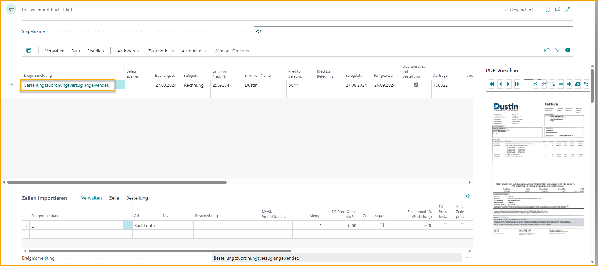

## Prozess zur Abgleichung von Bestellungen

### Importieren von Eingangsrechnungen mit Bestellabgleich

Der Import von Rechnungen erfolgt über "ExFlow Import Journals". Verwenden Sie die Funktion "Batch Import Documents", um Rechnungen für alle Journale zu importieren, oder geben Sie ein Importjournal ein/bearbeiten Sie es, um Dokumente in einem bestimmten Journal zu importieren.

### Abgleich auf Header-Ebene

Wenn eine Bestellnummer auf der Rechnung erkannt wurde, wird sie in der Spalte "Order No. (Import)" angezeigt. ExFlow sucht automatisch in der Liste der verfügbaren Bestellungen in Business Central nach der Lieferanten- und importierten Bestellnummer.

ExFlow kann sowohl anhand der internen Bestellnummer als auch anhand der Bestellnummer des Lieferanten abgleichen, letztere muss jedoch in der tatsächlichen Bestellung selbst eingerichtet sein.

In der Spalte "Order No." wird die abgeglichene Bestellung angezeigt, sofern sie gefunden wurde.

Dieser Vorgang kann auch manuell ausgelöst werden, wenn auf der Rechnung keine importierte Bestellnummer vorhanden ist. Geben Sie die Bestellnummer manuell in die Spalte "Order No." ein.

Je nachdem, ob ExFlow für den Zwei-Wege-Abgleich oder den Drei-Wege-Abgleich konfiguriert ist, unterscheiden sich die nächsten Schritte des Prozesses geringfügig.

Weitere Informationen dazu finden Sie in diesem Handbuch im Abschnitt **"Abgeglichene Bestellrechnungen"**.

#### Drei-Wege-Abgleich

Bedeutet, dass ExFlow die Rechnung mit der Bestellung und den zugehörigen gebuchten Wareneingängen abgleicht.

Dies erfolgt standardmäßig automatisch, kann jedoch auch manuell durch Verwendung der Funktion "Get Receipt/Return Shpmt./Order Lines" ausgelöst werden.

Der Drei-Wege-Abgleich erfordert, dass die Eingangsrechnung zugehörige gebuchte Bestellungen hat. ExFlow ruft alle verfügbaren gebuchten Wareneingangslinien ab und fügt sie als Rechnungspositionen hinzu.

Diese Funktion kann auch nützlich sein, wenn eine Rechnung auf Header-Ebene mit mehreren Bestellungen abgeglichen werden soll.

Beim Auswählen von Wareneingangslinien auf der Seite "Get Receipt Lines" besteht die Möglichkeit, die Linien auszuschließen, die bereits vollständig mit einer anderen Rechnung im Importjournal abgeglichen wurden oder noch nicht im Genehmigungsstatus gebucht wurden. Klicken Sie auf "Exclude fully matched", um solche Wareneingangslinien auszublenden:

Im folgenden Bild sind die abgeglichenen Linien ausgeblendet. Klicken Sie auf "Show All", um die Seite zurückzusetzen und alle Wareneingangslinien erneut anzuzeigen. Beide Aktionen in "Get Receipt Lines" gelten auch für Gutschriften und Rücksendebestellungen.

Es ist möglich, die Einstellung "Disable Currency Filter in Get Receipt Lines" unter dem Abschnitt "PO Matching" in der ExFlow-Konfiguration zu aktivieren, um die Leistung beim Verwenden von "Get Receipt Lines" im Importjournal zu verbessern. Es wird dann kein Filter für die Währungscodes festgelegt, wenn die Auswahlseite geöffnet wird.

#### Zwei-Wege-Abgleich

Bedeutet, dass ExFlow die Rechnung direkt mit der Bestellung abgleicht, ohne dass gebuchte Wareneingänge erforderlich sind.

Konflikte, Kosten- oder Mengenabweichungen werden als Aktionsnachricht angezeigt und müssen korrigiert werden, bevor die Rechnung erstellt und zur Genehmigung gesendet werden kann.

### Bestellabgleich auf Zeilenebene

Hierfür ist es erforderlich, dass die Rechnung auf Header- und Zeilenebene in ExFlow Data Capture oder einer anderen OCR-Lösung interpretiert wurde, die verwendet wird.

Der Bestellabgleich auf Zeilenebene liefert genauere Ergebnisse bei der Identifizierung von Abweichungen. Der Zeilenabgleich bietet auch wesentlich mehr Konfigurationsmöglichkeiten für die Einrichtung von Validierungen und zulässigen Schwellenwerten.

Eine Voraussetzung für genaue Ergebnisse beim Zeilenabgleich besteht darin, dass wesentliche Informationen aus den Lieferantenrechnungen extrahiert werden können, damit ExFlow verstehen kann, welche Bestellzeilen mit welchen Rechnungszeilen abgeglichen werden sollen.

Artikelnummer, Menge, Einzelpreis und Gesamtbetrag der Zeile sind einige der wichtigeren Werte, die aus der Rechnung extrahiert werden sollten, um ExFlow bei der Zuordnung der richtigen Rechnungszeilen zu Bestellzeilen zu unterstützen.

ExFlow kann auch die Artikelnummer des Lieferanten abgleichen, wenn sie in Business Central als "Lieferantenartikelnummer" oder "Querverweise" eingerichtet ist. Es besteht auch die Möglichkeit, spezifische ExFlow OCR-Importzuordnungen einzurichten, bei denen importierte Werte übersetzt und bestimmten G/L-Konten oder Artikeln zugeordnet werden können.

Sowohl der Zwei-Wege-Abgleich als auch der Drei-Wege-Abgleich werden beim Bestellabgleich auf Zeilenebene in ExFlow unterstützt.

Einer der größten Vorteile des Zeilenabgleichs im Vergleich zum Headerabgleich besteht darin, dass ExFlow Validierungen für jede interpretierte Rechnungszeile durchführen und genau angeben kann, was korrigiert werden muss und um welche Art von Problem es sich handelt. Während der Headerabgleich nur Informationen liefert, dass ein Konflikt oder Preisunterschied zwischen der Summe der Bestellzeilen und dem Gesamtbetrag der Rechnung besteht.

Die Konfiguration des Zeilenabgleichs finden Sie in der ExFlow-Setup.

Das folgende Beispiel beschreibt, wie aus einem Journal importiert wird, das nur für "Bestellabgeglichene Rechnungen" erstellt wurde.

Wählen Sie das Journal aus und öffnen Sie es durch Klicken auf "Journal bearbeiten" oder auf den Namen.

**Schritt 1 -- Dokument importieren** 
Gehe zu: ***Aktionen \--\> Importieren \--\> Dokumente importieren\...*** 
Wenn der Import abgeschlossen ist, wird eine neue Zeile erstellt.

**Schritt 2 -- "Aktion-Nachrichten" überprüfen und bearbeiten** (**A** im Bild unten). 
Häufige Aktion-Nachrichten und Lösungen:

- **Es gibt Zeilen, die mit der Bestellung übereinstimmen, aber bei denen der Wareneingang fehlt!** 
    Die Lieferung wurde nicht gebucht. Gehe zur Bestellung und buche den Wareneingang -- Empfangen. 
    Führe nach dem Empfangen der Lieferung eine Überprüfung durch und ExFlow wird die Rechnung mit dem gebuchten Wareneingang abgleichen. 
    **Prozess \--\> Dokument überprüfen***
    (**B** im Bild unten)
    

- **Der Betrag (15 867,25) entspricht nicht der Summe der Zeilen (15 628,00)** 
    Ändere die Preise und Zeilen, damit sie mit der Rechnung übereinstimmen. Verwende "Zeileninformationen" in der FactBox für Summen und Differenzen. (**E** im Bild unten).

- **Wenn die Rechnung mehr als eine Bestellung enthält** 
Verwende "Wareneingang/Rücksendung abrufen."
***Aktionen \--\> Bestellung \--\> Wareneingang/Rücksendung abrufen/Bestellzeilen*** (**C** im Bild unten). 

- **Siehe Zeile für spezifische Aktion-Nachricht - Differenz zwischen dem Einzelpreis der Rechnung und dem Einheitskosten der Bestellung!** 
    Korrigiere den direkten Einheitspreis ohne MwSt. oder korrigiere den Bestellpreis, um die Bestellung mit der Rechnung abzugleichen.
    Oder deaktiviere "Einheitskosten testen" bei der Importierung von Zeilen und sende die Rechnung zur Genehmigung. (**D** im Bild unten).  
    

**Schritt 3 -- Dokumente batchweise überprüfen** 
Gehe zu: ***Prozess \--\> Dokument überprüfen / Dokumente batchweise überprüfen*** 
Wenn alle Aktion-Nachrichten bearbeitet wurden, "Dokument überprüfen", um zu sehen, ob die Aktion-Nachrichten leer sind und somit bereit zur Erstellung sind.

**Schritt 4 -- Rechnung/Gutschrift erstellen** 
Gehe zu: ***Erstellen \--\> "Batch Rechnungen/Gutschriften erstellen"\... / "Rechnung/Gutschrift erstellen"*** 
Erstelle eine Rechnung oder Gutschrift, indem du auf "Rechnung/Gutschrift erstellen" klickst.

### Bestellabgleich -- Direktlieferung

ExFlow unterstützt Direktlieferungsbestellungen. Die gängigste Konfiguration hierfür ist wahrscheinlich die Arbeit mit der Abgleichung von Rechnungen mit Bestellungen unter Verwendung der Einstellungen *"Dokumente abgleichen mit: Bestellung"* und *"Bestellungen automatisch empfangen"*. Weitere Informationen hierzu findest du im Abschnitt: "***Bestellabgleich von Eingangsrechnungen".***

Das folgende Beispiel zeigt, wie man mit Direktlieferungen zusammen mit dem ExFlow Bestellabgleich arbeitet:

Erstelle eine Verkaufsbestellung, markiere die Verkaufszeilen für Direktlieferung, indem du das Kontrollkästchen "Direktlieferung" aktivierst. Gib dann die Verkaufsbestellung frei.

Erstelle eine Einkaufsbestellung. Wähle im Kopfteil "Verkauf an Kundennummer" mit dem Kunden (School of Fine Art) aus der gerade erstellten Verkaufsbestellung aus. Verwende im Kopfteil Aktionen \--\> Funktionen \--\> Direktlieferung \--\> Verkaufsbestellung abrufen. Gib dann die Einkaufsbestellung frei.

Importiere eine Rechnung in das ExFlow Import Journal vom Lieferanten (Dustin) bezüglich der Direktlieferung. Verwende Aktionen \--\> Bestellung \--\> Wareneingang/Rücksendung abrufen/Bestellzeilen, um die Zeilen abzurufen.

Erstelle und sende die Rechnung zur Genehmigung, genehmige und überprüfe dann die Rechnung. Wenn "Änderungen überprüfen" im Genehmigungsstatus ausgeführt wurde, werden die Artikel in der Einkaufsbestellung automatisch empfangen und die Artikel in der Verkaufsbestellung automatisch versendet.

Gehe zur Verkaufsbestellung zurück, um die Verkaufsbestellung zu fakturieren. Wenn dies nicht vor dem Buchen der Rechnung aus dem ExFlow Genehmigungsstatus erfolgt, tritt folgende Meldung auf:

Wenn die Verkaufsbestellung fakturiert ist, kann die Rechnung im Genehmigungsstatus wie gewohnt gebucht werden.

### Rechnung mit Wareneingangs-, Bestell- oder sowohl Wareneingangs- als auch Bestellzeilen abgleichen
Gehe zu: ***Setup \--\> ExFlow Setup \--\> Bestellabgleich \--\> Dokumente abgleichen mit*** 

Die Einstellung "**Dokumente abgleichen mit**" legt fest, ob ExFlow importierte Eingangsrechnungen mit Einkaufsbestellungen, Wareneingängen oder sowohl Wareneingangs- als auch Bestellzeilen abgleichen soll.

**Wareneingang:** ExFlow findet automatisch die Einkaufsbestellung anhand der importierten Bestellnummer. ExFlow ruft automatisch die verfügbaren gebuchten Wareneingänge ab, die mit der Einkaufsbestellung verknüpft sind, wenn die Einstellung "**Einkaufsbestellungen automatisch empfangen**" aktiviert ist.

**Bestellung:** Dies ermöglicht es, eine Eingangsrechnung direkt mit einer Einkaufsbestellung abzugleichen, für die noch keine Wareneingänge gebucht wurden. Der Wareneingang muss jedoch vor der endgültigen Buchung der Rechnung gebucht werden. Dies kann entweder manuell von der Einkaufsbestellung aus erfolgen oder automatisch durch Aktivieren der Einstellung "**Einkaufsbestellungen automatisch empfangen**".

**Bestellung und Wareneingang:** Mit dieser Einstellung ist es möglich, eine Eingangsrechnung sowohl mit gebuchten Wareneingängen als auch mit Bestellzeilen abzugleichen. Das bedeutet, dass ExFlow Wareneingänge für eine abgeglichene Zeile abruft und noch nicht empfangene Bestellzeilen abruft. Darüber hinaus ist es bei Bedarf möglich, ExFlow automatisch Bestellzeilen empfangen zu lassen, indem die Einstellung "**Einkaufsbestellungen automatisch empfangen**" aktiviert wird.

Durch Aktivieren von "Einkaufsbestellungen automatisch empfangen" empfängt ExFlow alle Zeilen, die mit einer Einkaufsbestellung abgeglichen sind. Was ExFlow empfängt, basiert auf den zugelassenen Zeilentypen aus der "Setup für automatisches Empfangen von Zeilentypen" (Das Setup öffnet sich automatisch, nachdem "Einkaufsbestellungen automatisch empfangen" auf TRUE gesetzt wurde).

Wenn Änderungen erforderlich sind, gehe zu: ***ExFlow Setup --> Verwandt --> Erweitert --> Setup für automatisches Empfangen von Zeilentypen***

Die gleiche Funktion findest du auch auf der Seite "ExFlow Lieferanten Setup".

### Automatische Genehmigung der Bestellübereinstimmung von Rechnungen

#### ExFlow-Einrichtung - Bestellübereinstimmung

***Einrichtung \--\> ExFlow-Einrichtung \--\> Bestellübereinstimmung \--\> Automatische Genehmigung von Rechnungen***

Es gibt drei Optionen, um automatisch genehmigte Bestellübereinstimmungen von Rechnungen zu ermöglichen.

**Nie:** Mit dieser Einstellung wird die automatische Genehmigung deaktiviert. Alle Bestellübereinstimmungen von Rechnungen erfordern eine manuelle Genehmigung.

**Wenn der Unterschied innerhalb der Toleranz liegt:** Wenn die importierte Rechnung mit einer Bestellung übereinstimmt und keine Mengen- oder Preisabweichungen aufweist, wird sie automatisch genehmigt. Dies gilt auch, wenn Abweichungen innerhalb des zulässigen Schwellenwerts liegen.

**Wenn die übereinstimmende Bestellung genehmigt ist:** Die gleichen Anforderungen wie bei der vorherigen Option, mit der zusätzlichen Voraussetzung, dass die übereinstimmende Bestellung über ExFlow genehmigt wurde.

**Benutzer für automatische Genehmigung:** Geben Sie einen ExFlow-Benutzer an, der als Stempel in der Transaktion und im Verlauf für automatisch übereinstimmende und genehmigte Rechnungen verwendet wird. Wenn Sie diese Einstellung leer lassen, wird der Benutzer verwendet, der die Einkaufsrechnung aus dem ExFlow-Importjournal erstellt hat.

### Stapelimport von Dokumenten aus der Interpretation

Um Bestellübereinstimmungen von Dokumenten in einem separaten Importjournal zu importieren, fügen Sie ein neues Importjournal hinzu und verwenden Sie "Nur Bestellübereinstimmungen von Dokumenten".

### Automatische Differenzzeile

Im ExFlow-Importjournal ist es möglich, beim Abgleich einer Bestellung automatisch eine Differenzzeile für das G/L-Konto, den Artikel oder die Gebühr (Artikel) zu erkennen und zu erstellen.

Fügen Sie "ExFlow-Kaufcode" im Feld "Diff.Line Purch. Code" unter Bestellübereinstimmung in der ExFlow-Einrichtung hinzu.

### Automatische Deaktivierung der Bestellübereinstimmung für Sonstige Kosten
Gehen Sie zu ***ExFlow-Einrichtung --> OCR-Import --> Automatische Deaktivierung der Bestellübereinstimmung für Sonstige Kosten***

Bei der Arbeit mit interpretierten Kosten auf Zeilenebene besteht die Möglichkeit, diese Kosten auf jeden Zeilentyp mit ExFlow OCR-Import Mapping abzubilden.

Finden Sie die Einstellung "Automatische Deaktivierung der Bestellübereinstimmung für Sonstige Kosten" in der ExFlow-Einrichtung. Wenn diese Einstellung aktiviert ist, werden diese neu zugeordneten Kosten nicht mit der Bestellung abgeglichen. Diese Einstellung kann für Fälle verwendet werden, in denen der Fracht- oder Serviceaufschlag nicht als Zeile in der Bestellung erstellt wird.

Die gleiche Funktion ist auch in der ExFlow-Anbieter-Einrichtungsliste zu finden, jedoch ist diese Funktion standardmäßig ausgeblendet. Verwenden Sie Personalisieren, um diese Einstellung bei Bedarf zur Liste hinzuzufügen.

### Verzögerung der Bestellübereinstimmung für Dokumentdatum und Fälligkeitsdatum
Gehen Sie zu ***ExFlow-Einrichtung --> Bestellübereinstimmung --> Verzögerung des Dokumentdatums (Tage) / Verzögerung des Fälligkeitsdatums (Tage)***

Es ist möglich, ExFlow den Bestellübereinstimmungsprozess verzögern zu lassen, sowohl mit dem importierten Rechnungsdatum als auch mit dem Fälligkeitsdatum.

Wenn eine interpretierte Rechnung im Importjournal importiert wird, verzögert ExFlow den Bestellabgleich gemäß den Einstellungen in der ExFlow-Einrichtung und zeigt eine Aktionsmeldung im Importjournal an.

Nehmen wir ein Beispiel: ''Verzögerung des Dokumentdatums'' ist auf ''1D'' eingestellt. Dann wartet ExFlow einen Tag, um die Wareneingangslinien abzurufen und die Bestellung mit der Rechnung im Importjournal abzugleichen.

Gleiches Verfahren für ''Verzögerung des Fälligkeitsdatums''. Wenn ''-20D'' in diesem Feld eingestellt ist, ruft ExFlow die Wareneingangslinien ab und gleicht 20 Tage vor dem Rechnungsfälligkeitsdatum ab. Diese Funktion hat eine höhere Priorisierung als die oben genannte Funktion, um sicherzustellen, dass eine Rechnung niemals überfällig wird.

Für die spezifische Dokumentzeile wird auch eine Aktionsmeldung für den angewendeten verzögerten Bestellabgleichszeitraum angezeigt. Wenn es Zeit ist, den Bestellabgleichsprozess fortzusetzen (gemäß der Datumsformel in den Einstellungen), verschwindet die Aktionsmeldung und das Dokument ist bereit zur Erstellung.

### Bestellübereinstimmende Zeilen mit Einheitskostenunterschieden in ExFlow Web

Wenn ein Dokument im Importjournal erstellt wird und zwischen der Bestellung und der interpretierten Rechnung eine Einheitspreisabweichung besteht, können Benutzer das Kontrollkästchen ''Test Unit Cost'' in den Importzeilen deaktivieren und das Dokument wie gewohnt erstellen.

Wenn ExFlow-Benutzer diese bestellübereinstimmende Rechnung zur Genehmigung in ExFlow Web erhalten, können sie auch auf Zeilenebene über die Webspalte ''Reason Check'' über Unterschiede informiert werden.

Um diese Spalte zu ExFlow Web hinzuzufügen, gehen Sie einfach zur ExFlow-Einrichtung und klicken Sie auf ''[***Webspalten bearbeiten***](https://docs.exflow.cloud/business-central/docs/user-manual/technical/exflow-web#edit-web-columns-in-business-central)'', um die Webspalte Reason Check hinzuzufügen.

Dies erleichtert es dem Genehmiger, zu verstehen, wo die Abweichung liegt, und das Dokument anschließend in ExFlow Web zu bearbeiten.

