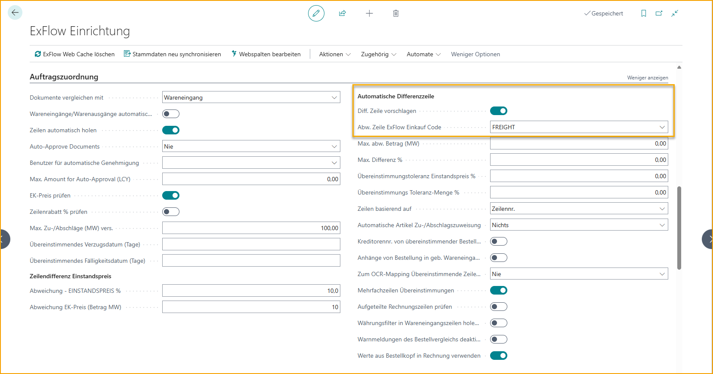
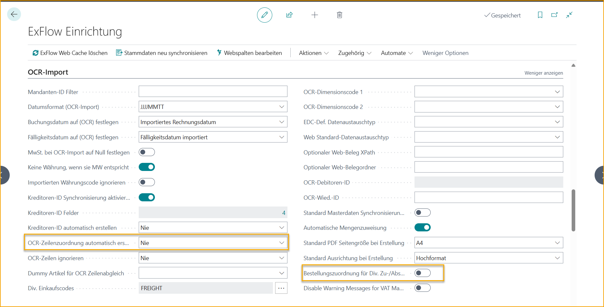
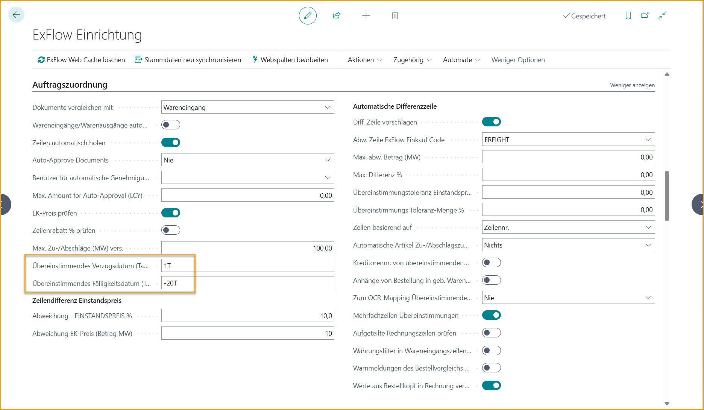
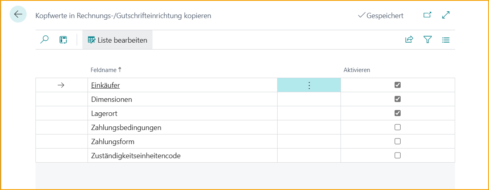

## Einkaufsauftragsabgleich-Prozess

## Ausführen des Auftragsabgleich-Assistenten
Dieses Benutzerhandbuch ist Ihr Leitfaden für die Einrichtung von ExFlow, um Rechnungen mühelos mit Einkaufsaufträgen abzugleichen. Mit Blick auf Einfachheit konzipiert, macht der Auftragsabgleich-Assistent den Prozess unkompliziert und benutzerfreundlich.

Suchen Sie nach ExFlow Auftragsabgleich-Assistent.

### Kopf- oder Zeilenabgleich
Der erste Schritt bei der Einrichtung des Auftragsabgleich-Assistenten besteht darin, festzulegen, ob der Abgleich von Rechnungen mit Einkaufsaufträgen auf Kopfebene oder Zeilenebene durchgeführt werden soll.

**Kopfebene-Abgleich:** 
Wenn Sie den Kopfebene-Abgleich wählen, vergleicht der Auftragsabgleich die Gesamtrechnungssumme mit dem verfügbaren Gesamtwert des Einkaufsauftrags.

Diese Methode eignet sich, wenn die Details einzelner Artikel oder Dienstleistungen auf der Rechnung nicht mit bestimmten Artikeln auf dem Einkaufsauftrag abgeglichen werden müssen, oder wenn die Rechnungszeilenangaben für einen genauen Abgleich zu dürftig sind.

**Zeilenebene-Abgleich:** 
Wenn Sie den Zeilenebene-Abgleich wählen, vergleicht der Auftragsabgleich jede interpretierte Rechnungszeile mit den entsprechenden Zeilenpositionen auf dem Einkaufsauftrag.

Dieser Ansatz stellt sicher, dass jeder einzelne Artikel oder jede Dienstleistung auf der Rechnung genau mit dem entsprechenden Artikel auf dem Einkaufsauftrag abgeglichen wird.

Der Zeilenabgleich verwendet interpretierte Informationen wie Rechnungsmenge, Einzelpreis, Zeilensumme und mehr, um eine genaue Übereinstimmung mit der entsprechenden Einkaufsauftragszeile zu erzielen und mögliche Diskrepanzen identifizieren zu können.

### Dokumente abgleichen mit
Der nächste Schritt besteht darin, festzulegen, wie Rechnungen mit Einkaufsaufträgen in Bezug auf Wareneingänge abgeglichen werden sollen.
Es gibt drei Optionen zu berücksichtigen:

**Wareneingang:** 
Wählen Sie diese Option, wenn Rechnungen nur mit Einkaufsaufträgen abgeglichen werden sollen, die zugehörige Wareneingänge haben.

Dies stellt sicher, dass die Artikel im Lager eingegangen und erfasst sind und mit der Rechnung übereinstimmen, bevor die Rechnung abgeglichen und zur Genehmigung und endgültigen Buchung gesendet wird. 

**Auftrag:** 
Wählen Sie diese Option, wenn Rechnungen mit Einkaufsaufträgen abgeglichen werden sollen, unabhängig davon, ob ein zugehöriger Wareneingang vorhanden ist.

Dies ermöglicht den Abgleich von Rechnungen, auch wenn der Eingang von Waren oder Dienstleistungen nicht bestätigt wurde, was Flexibilität in Ihrem Abgleichsprozess bietet.

Nützlich in Szenarien wie Direktlieferungen oder wenn Wareneingänge nicht verfügbar sind oder erforderlich sind, um die Rechnung vollständig abzugleichen und zur Genehmigung und Buchung zu senden.

**Auftrag und Wareneingang:** 
Wenn Sie eine Kombination der beiden vorherigen Optionen bevorzugen, wählen Sie diese Option.

In diesem Fall können Rechnungen mit Einkaufsaufträgen mit oder ohne zugehörige Wareneingänge abgeglichen werden, was maximale Flexibilität in Abgleichsszenarien bietet.

Es ist möglich, Rechnungszeilen mit Einkaufsaufträgen mit und ohne eingegangene Artikelzeilen abzugleichen. Außerdem ist es möglich, Rechnungszeilen mit teilweise eingegangenen Artikelzeilen auf dem Auftrag abzugleichen und zur Genehmigung und Buchung zu senden.

### Automatische Genehmigung abgeglichener Rechnungen
**Niemals:** 
Wählen Sie diese Option, wenn alle abgeglichenen Rechnungen einen manuellen Genehmigungsprozess durchlaufen sollen. In diesem Fall werden keine Rechnungen automatisch genehmigt, unabhängig von etwaigen Differenzen oder Schwellenwerten.

**Wenn die Differenz innerhalb der Toleranz liegt:** 
Wählen Sie diese Option, wenn abgeglichene Rechnungen nur dann automatisch genehmigt werden sollen, wenn die Differenz zwischen der Rechnung und dem Einkaufsauftrag innerhalb des festgelegten zulässigen Schwellenwerts oder der Toleranz für die automatische Genehmigung liegt.

Diese Option ermöglicht eine effiziente Verarbeitung von Rechnungen mit geringfügigen Abweichungen und stellt sicher, dass nur erhebliche Unterschiede eine manuelle Genehmigung erfordern.

**Wenn der abgeglichene Auftrag genehmigt ist:** 
Diese Option fügt eine zusätzliche Genehmigungsebene hinzu, indem sie erfordert, dass der abgeglichene Auftrag durch ExFlow überprüft und genehmigt wurde, um sicherzustellen, dass Rechnungen nur dann automatisch genehmigt werden, wenn die erforderliche Autorisierung vorliegt.

### Maximaler Betrag für die automatische Genehmigung
Wenn Sie die automatische Genehmigung abgeglichener Rechnungen zugelassen haben, können Sie hier den maximalen Betrag für die automatische Genehmigung festlegen. Dieser Parameter definiert die Schwelle, über die Rechnungen unabhängig von den Abgleichsergebnissen eine manuelle Genehmigung erfordern.

### Warnung bei Toleranzüberschreitung
Aktivieren Sie diese Einstellung, wenn Sie möchten, dass die Buchhalter während des Imports von abgeglichenen Rechnungen eine Warnung erhalten, wenn es Abweichungen über Ihrer zulässigen Toleranz für die automatische Genehmigung gibt. 
Unabhängig davon, ob diese Einstellung aktiviert ist oder nicht, erfordern Abweichungen, die höher als Ihre zulässige Toleranz sind, immer eine manuelle Genehmigung der Rechnungszeile.

### Abweichung Direkte Stückkosten (%) und Abweichung Direkte Stückkosten (Betrag LCY)
Definieren Sie die Abweichungsschwellenwerte für die direkten Stückkosten der Rechnungszeilen im Vergleich zu den abgeglichenen Auftragszeilen. Diese Schwellenwerte bestimmen die zulässigen Unterschiede zwischen der Rechnung und dem Einkaufsauftrag für die automatische Genehmigung.

### Automatische Differenzbehandlung
Die Funktion zur automatischen Differenzbehandlung ermöglicht es ExFlow, automatisch eine Differenzzeile vorzuschlagen, wenn während des Auftragsabgleichs zusätzliche oder unerwartete Kosten wie Fracht oder andere Gebühren identifiziert werden. 
Sie können wählen, ob ExFlow eine Rechnungszeile des Typs Artikelgebühr oder Sachkonto vorschlagen soll.
Geben Sie dann an, welches Sachkonto oder welche Artikelgebühr für die vorgeschlagene Zeile verwendet werden soll.

### Max. Diff. Betrag (LCY) und Max. Diff. % 
Hier können Sie eine zulässige Toleranz für die automatisch vorgeschlagene Differenzzeile für die automatische Genehmigung festlegen.

### Automatisches Buchen von Wareneingängen
Die Funktion "Automatisches Buchen von Wareneingängen" ermöglicht das automatische Buchen von Wareneingängen im Abgleichsprozess. Bitte beachten Sie jedoch, dass diese Funktion nur genutzt werden kann, wenn Rechnungen mit **„Auftrag“** oder **„Auftrag und Wareneingang“** abgeglichen werden.

Das Abgleichen von Rechnungen mit der Logik **„Auftrag“** oder **„Auftrag und Wareneingang“** ermöglicht es ExFlow, eine Rechnung vollständig abzugleichen und zur Genehmigung und Buchung zu senden. Business Central erfordert jedoch immer, dass Wareneingänge gebucht werden, bevor die abgeglichene Rechnung gebucht und der Einkaufsauftrag fakturiert werden kann.

Diese Einstellung ermöglicht es ExFlow, die genehmigte Menge der abgeglichenen Rechnungszeilen automatisch zu buchen und zu fakturieren. Sie wird ausgeführt, sobald die Rechnung den Status „Bereit zur Buchung“ im Genehmigungsstatus hat.
Wenn diese Einstellung deaktiviert ist, müssen Sie die Wareneingänge manuell buchen.

### Assistent abschließen
Klicken Sie auf "Fertigstellen", um den Assistenten zu schließen und die Einstellungen anzuwenden.

### ExFlow Setup
Felder im ExFlow Setup, die vom Auftragsabgleich-Assistenten betroffen sind, sind im Bild unten ausgewählt:

## Import von Einkaufsrechnungen mit Auftragsabgleich

Der Import von Rechnungen erfolgt über "ExFlow Import Journals". Verwenden Sie die Funktion "Batch Import Documents", um Rechnungen für alle Journale zu importieren, oder geben/bearbeiten Sie ein Import Journal, um Dokumente in einem bestimmten Journal zu importieren.

### Auftragsabgleich auf Kopfebene

Wenn eine Einkaufsauftragsnummer auf der Rechnung interpretiert wurde, wird sie in der Spalte "Order No. (Import)" sichtbar. ExFlow durchsucht automatisch die Liste der verfügbaren Einkaufsaufträge in Business Central basierend auf dem Lieferanten und der importierten Einkaufsauftragsnummer.

ExFlow kann sowohl auf die interne Einkaufsauftragsnummer als auch auf die Einkaufsauftragsnummer des Lieferanten abgleichen, wobei letzteres erfordert, dass sie auf dem eigentlichen Einkaufsauftrag eingerichtet ist.

Die Spalte "Order No." zeigt den abgeglichenen Einkaufsauftrag an, wenn er gefunden wird.

Dieses Verfahren kann auch manuell ausgelöst werden, wenn die Rechnung keine importierte Einkaufsauftragsnummer enthält. Geben Sie die Einkaufsauftragsnummer manuell in die Spalte "Order No." ein.

Je nachdem, ob ExFlow für den Zwei-Wege-Abgleich oder den Drei-Wege-Abgleich konfiguriert ist, werden die nächsten Schritte des Prozesses leicht unterschiedlich sein.

#### Drei-Wege-Abgleich

Bedeutet, dass ExFlow die Rechnung mit dem Einkaufsauftrag und den zugehörigen gebuchten Wareneingängen abgleicht.

Dies erfolgt standardmäßig automatisch, kann aber auch manuell ausgelöst werden, indem die Funktion "Get Receipt/Return Shpmt./Order Lines" verwendet wird.

Der Drei-Wege-Abgleich erfordert, dass die Einkaufsrechnung zugehörige gebuchte Einkaufsaufträge hat. ExFlow ruft alle verfügbaren gebuchten Wareneingangszeilen ab und fügt sie als Rechnungszeilen hinzu.

Diese Funktion kann auch nützlich sein, wenn eine Rechnung mit mehreren Einkaufsaufträgen auf Kopfebene abgeglichen werden soll.

Beim Auswählen von Wareneingangszeilen auf der Seite "Get Receipt Lines" besteht die Möglichkeit, die Zeilen auszuschließen, die bereits vollständig mit einer anderen Rechnung im Import Journal abgeglichen oder noch nicht im Genehmigungsstatus gebucht sind.
Klicken Sie auf "Exclude fully matched", um solche Wareneingangszeilen auszublenden:

Im Bild unten sind die abgeglichenen Zeilen ausgeblendet. Klicken Sie auf "Show All", um die Seite zurückzusetzen und alle Wareneingangszeilen erneut anzuzeigen. Beide Aktionen in "Get Receipt Lines" existieren auch für Gutschriften und Einkaufsrücksendungen.

Es ist möglich, die Einstellung "Disable Currency Filter in Get Receipt Lines" im Abschnitt PO Matching im ExFlow Setup zu aktivieren, um die Leistung beim Verwenden von Get Receipt Lines im Import Journal zu verbessern. Es wird dann kein Filter auf den Währungscode gesetzt, wenn die Auswahlseite geöffnet wird.

#### Zwei-Wege-Abgleich

Bedeutet, dass ExFlow die Rechnung direkt mit dem Einkaufsauftrag abgleicht.
Ohne die Anforderung, zugehörige gebuchte Wareneingänge zu haben.

Alle Konflikte, Kosten- oder Mengenabweichungen werden in Form einer Aktionsnachricht angezeigt und müssen korrigiert werden, bevor die Rechnung erstellt und zur Genehmigung gesendet werden kann.

### Auftragsabgleich auf Zeilenebene

Dies erfordert, dass die Rechnung auf Kopf- und Zeilenebene in ExFlow Data Capture oder einer anderen verwendeten OCR-Lösung interpretiert wurde.

Der auf Zeilenebene durchgeführte Auftragsabgleich liefert genauere Ergebnisse bei der Identifizierung von Abweichungen. Der Abgleich auf Zeilenebene bietet auch viel mehr Konfigurationsmöglichkeiten bei der Einrichtung von Validierungen und zulässigen Schwellenwerten.

Eine Voraussetzung für genaue Ergebnisse beim Abgleich auf Zeilenebene ist, dass es möglich ist, wesentliche Informationen aus den Lieferantenrechnungen zu extrahieren, damit ExFlow verstehen kann, mit welchen Auftragszeilen abgeglichen werden soll.

Artikelnummer, Menge, Einzelpreis und Zeilengesamtbetrag sind einige der wichtigsten Werte, die aus der Rechnung extrahiert werden müssen, um ExFlow zu helfen, die richtigen Rechnungszeilen mit den Auftragszeilen abzugleichen.

ExFlow kann auch die Artikelnummer des Lieferanten abgleichen, wenn sie in Business Central als "Vendor Item No." oder "Cross references" eingerichtet ist. Es gibt auch eine Option, spezifische ExFlow OCR Import-Mappings einzurichten, bei denen importierte Werte übersetzt und bestimmten Sachkonten oder Artikeln zugeordnet werden können.

Sowohl der Zwei-Wege-Abgleich als auch der Drei-Wege-Abgleich werden beim Auftragsabgleich auf Zeilenebene in ExFlow unterstützt.

Einer der größten Vorteile des Zeilenabgleichs im Vergleich zum Kopfabgleich besteht darin, dass ExFlow Validierungen für jede interpretierte Rechnungszeile ausführen und genau angeben kann, was korrigiert werden muss und um welche Art von Problem es sich handelt. Während der Kopfabgleich nur Informationen darüber liefert, dass es einen Konflikt oder Preisunterschied zwischen der Summe der Auftragszeilen und dem Gesamtrechnungsbetrag gibt.

Die Konfiguration des Zeilenabgleichs finden Sie im ExFlow Setup.

Das folgende Beispiel beschreibt, wie man aus einem Journal importiert, das nur für "Einkaufsauftragsabgeglichene Rechnungen" verwendet wird.

Wählen Sie das Journal aus und öffnen Sie es, indem Sie auf "Edit Journal" klicken oder auf den Namen klicken.

**Schritt 1 -- Dokument importieren** 
Gehen Sie zu: ***Home \--\> Import Documents\...*** 
Wenn der Import abgeschlossen ist, wird eine neue Zeile erstellt.

**Schritt 2 -- Überprüfen und Bearbeiten von "Action Messages"** (**A** im Bild unten). 
Häufige Aktionsnachrichten und Lösungen:

- **Es gibt Zeilen, die mit dem Auftrag abgeglichen sind, aber bei denen der Wareneingang fehlt!** 
    Die Lieferung wurde nicht gebucht. Gehen Sie zum Einkaufsauftrag und buchen Sie den Wareneingang. 
    Führen Sie die Überprüfung nach dem Wareneingang durch, und ExFlow wird die Rechnung mit der gebuchten Lieferung abgleichen. 
    ***Home \--\> Verify Document***
    (**B** im Bild unten)
    

- **Betrag (XX,XX) stimmt nicht mit der Summe der Zeilen (XX,XX) überein** 
    Ändern Sie die Preise und Zeilen, damit sie mit der Rechnung übereinstimmen. Verwenden Sie "Line Details" im FactBox für Summen und Unterschiede. (**E** im Bild unten).

- **Wenn die Rechnung mehr als einen Auftrag enthält** 
Verwenden Sie "Get Receipt/Return Shpmt."
***Actions \--\> Order \--\> Get Receipt/Return Shpmt./Order Lines*** (**C** im Bild unten). 

- **Siehe Zeile für spezifische Aktionsnachricht - Zeilenunterschied zwischen der Rechnung und den Auftragsstückkosten!** 
    Korrigieren Sie die direkten Stückkosten ohne MwSt. oder korrigieren Sie den Auftragspreis, um den Auftrag mit der Rechnung abzugleichen.
    Oder deaktivieren Sie "Test Unit Cost" auf den Importzeilen und senden Sie die Rechnung zur Genehmigung. (**D** im Bild unten).  
    

**Schritt 3 -- Alle Dokumente überprüfen...** 
Gehen Sie zu: ***Home \--\> Verify All Documents*** 
Wenn alle Aktionsnachrichten bearbeitet wurden, "Verify Document", um zu sehen, ob die Aktionsnachricht leer ist und das Dokument daher zur Erstellung bereit ist.

**Schritt 4 -- Rechnung/Gutschrift erstellen** 
Gehen Sie zu: ***Create \--\> "Batch Create I..s/Cr.Memos"\... / "Create Invoice/Cr.Memo"*** 
Erstellen Sie eine Rechnung oder Gutschrift, indem Sie auf "Create Invoice/Credit Memo" klicken.

### Auftragsabgleich - Direktlieferung

ExFlow unterstützt Direktlieferungsaufträge. Für Unterstützung bei der Standardfunktion für Direktlieferungen wenden Sie sich bitte an einen vertrauenswürdigen Partner oder den Microsoft-Support.

Die häufigste Einrichtung für Direktlieferungen besteht wahrscheinlich darin, mit dem Abgleich von Rechnungen gegenüber Aufträgen zu arbeiten, indem die Einstellungen *"Dokumente abgleichen mit: Auftrag"* und *"Wareneingangszeilen automatisch buchen"* verwendet werden.

Das folgende Beispiel zeigt, wie man mit Direktlieferungen zusammen mit dem ExFlow Auftragsabgleich arbeitet:

Erstellen Sie einen Verkaufsauftrag, markieren Sie die Verkaufszeilen für die Direktlieferung, indem Sie das Kontrollkästchen "Drop Shipment" aktivieren. Dann geben Sie den Verkaufsauftrag frei.

Erstellen Sie einen Einkaufsauftrag. Wählen Sie den ''Ship-To'' Kunden (zusammen mit anderen erforderlichen Informationen), in diesem Beispiel wird der Kunde ''School of Fine Art'' ausgewählt.

Verwenden Sie im Kopfbereich Aktionen \--\> Funktionen \--\> Direktlieferung \--\> Verkaufsauftrag abrufen. Dann geben Sie den Einkaufsauftrag frei.

Importieren Sie eine Rechnung in das ExFlow Import Journal vom Lieferanten (Dustin) bezüglich der Direktlieferung. Verwenden Sie Aktionen \--\> Auftrag \--\> Get
Receipt/Return Shpmt./Order Lines, um die Zeilen abzurufen.

Erstellen und senden Sie die Rechnung zur Genehmigung, dann genehmigen und überprüfen Sie die Rechnung. Wenn "Verify Changes" im Genehmigungsstatus ausgeführt wurde, werden die Artikel im Einkaufsauftrag automatisch empfangen und die Artikel im Verkaufsauftrag automatisch versendet.

Gehen Sie zurück zum Verkaufsauftrag, um den Verkaufsauftrag zu fakturieren. Wenn dies nicht vor dem Buchen der Rechnung aus dem ExFlow Genehmigungsstatus erfolgt, wird folgende Meldung angezeigt:

Wenn der Verkaufsauftrag fakturiert ist, kann die Rechnung im Genehmigungsstatus wie gewohnt gebucht werden.

### Rechnung mit Wareneingangs-, Auftrags- oder sowohl Wareneingangs- als auch Auftragszeilen abgleichen
Gehen Sie zu: ***Setup \--\> ExFlow Setup \--\> PO Matching \--\> Dokumente abgleichen mit***

Die Einstellung "**Dokumente abgleichen mit**" gibt an, ob ExFlow importierte Einkaufsrechnungen mit Einkaufsaufträgen, Wareneingängen oder sowohl Wareneingangs- als auch Auftragszeilen abgleichen soll.

**Wareneingang:** ExFlow findet automatisch den Einkaufsauftrag basierend auf der importierten Auftragsnummer. ExFlow ruft automatisch die verfügbaren gebuchten Wareneingänge ab, die mit dem Einkaufsauftrag verbunden sind, wenn die Einstellung "**Zeilen automatisch abrufen**" aktiviert ist.

**Auftrag:** Dies ermöglicht den Abgleich einer Einkaufsrechnung direkt mit einem Einkaufsauftrag, der keine gebuchten Wareneingänge hat.   Der Wareneingang muss vor der endgültigen Buchung der Rechnung gebucht werden. Dies kann entweder manuell aus dem Einkaufsauftrag erfolgen oder automatisch durch Aktivieren der Einstellung "**Wareneingangszeilen automatisch buchen**".   ExFlow ruft automatisch die verfügbaren Auftragszeilen ab, die mit dem Einkaufsauftrag verbunden sind, wenn die Einstellung "**Zeilen automatisch abrufen**" aktiviert ist.

**Auftrag und Wareneingang:** Mit dieser Einstellung ist es möglich, eine Einkaufsrechnung sowohl mit gebuchten Wareneingangs- als auch Auftragszeilen abzugleichen. Dies bedeutet, dass ExFlow die Wareneingänge auf einer abgeglichenen Zeile und noch nicht empfangene Auftragszeilen abruft. Darüber hinaus ist es möglich, dass ExFlow die Auftragszeilen automatisch empfängt, indem die Einstellung "**Wareneingangszeilen automatisch buchen**" aktiviert wird, falls erforderlich.

Durch Aktivieren von “Wareneingangszeilen automatisch buchen” empfängt ExFlow alle Zeilen, die einem Einkaufsauftrag zugeordnet sind. Was ExFlow empfängt, basiert auf den zulässigen Zeilentypen aus der "Auto Receiving Line Types Setup" (Setup wird automatisch geöffnet, nachdem die Einstellung “Wareneingangszeilen automatisch buchen” auf TRUE gesetzt wurde).

Wenn Änderungen erforderlich sind, gehen Sie zu: ***ExFlow Setup --> Related --> Advanced --> Auto Receiving Line Types Setup***

Die gleiche Funktion kann auch auf der Seite "ExFlow Vendor Setup" gefunden werden.

### Automatische Genehmigung von Einkaufsauftragsabgeglichene Rechnungen

#### ExFlow Setup - PO Matching

***Setup \--\> ExFlow Setup \--\> PO Matching \--\> Auto Approve
Invoices***

Um automatisch genehmigte auftragsabgeglichene Rechnungen zu erhalten, gibt es drei Optionen.

**Niemals:** Mit dieser Einstellung ist die automatische Genehmigung deaktiviert. Alle auftragsabgeglichene Einkaufsrechnungen erfordern eine manuelle Genehmigung.

**Wenn die Differenz innerhalb der Toleranz liegt:** Wenn die importierte Rechnung mit einem Einkaufsauftrag ohne Mengen- oder Preisabweichungen übereinstimmt, wird sie automatisch genehmigt. Dies gilt auch, wenn es Abweichungen innerhalb des zulässigen Schwellenwerts gibt.

**Wenn der abgeglichene Auftrag genehmigt ist:** Gleiche Anforderungen wie bei der vorherigen Option, mit der zusätzlichen Bedingung, dass der abgeglichene Einkaufsauftrag durch ExFlow genehmigt worden sein muss.

**Benutzer für die automatische Genehmigung:** Geben Sie einen ExFlow-Benutzer an, der als Stempel in der Transaktion und Historie für Rechnungen verwendet wird, die automatisch mit einem Einkaufsauftrag abgeglichen und genehmigt wurden. Wenn dieses Feld leer bleibt, wird der Benutzer verwendet, der die Einkaufsrechnung aus dem ExFlow Import Journal erstellt hat.

### Batch Import Documents from Interpretation

Um auftragsabgeglichene Dokumente in einem separaten Import Journal zu importieren, fügen Sie ein neues Import Journal hinzu und verwenden Sie "Nur auftragsabgeglichene Dokumente".

### Automatische Differenzzeile

Im ExFlow Import Journal beim Abgleich von Einkaufsaufträgen ist es möglich, automatisch eine Differenzzeile zu einem Sachkonto, Artikel oder einer Gebühr (Artikel) zu erkennen und zu erstellen.

Fügen Sie "ExFlow Purchase Code" im Feld "Diff.Line Purch. Code" unter PO Matching im ExFlow Setup hinzu.

Sonstige Gebühren und Differenzzeilen können mit einem Einkaufsauftrag abgeglichen werden, wenn sie innerhalb der Toleranz liegen. Wenn das Feld "Order No." ausgefüllt ist und die Zeile eine perfekte Übereinstimmung mit der Einkaufsauftragszeile darstellt, wird sie abgeglichen. Wenn keine perfekte Übereinstimmung vorliegt, werden alle Abweichungen (Menge oder Preis) als Aktionsnachricht angezeigt.

### Automatische Deaktivierung des PO-Abgleichs für sonstige Gebühren
Gehen Sie zu ***ExFlow Setup --> OCR Import --> Automatische Deaktivierung des PO-Abgleichs für sonstige Gebühren***

Beim Arbeiten mit interpretierten Gebühren auf Zeilenebene besteht die Möglichkeit, diese Gebühren mit einem beliebigen Zeilentyp mithilfe der ExFlow OCR Import Mapping zuzuordnen.

Finden Sie die Einstellung "Automatische Deaktivierung des PO-Abgleichs für sonstige Gebühren" im ExFlow Setup. Wenn diese Einstellung aktiviert ist, werden diese neu zugeordneten Gebühren nicht mit dem Einkaufsauftrag abgeglichen. Diese Einstellung kann in den Fällen verwendet werden, in denen die Fracht- oder Servicegebühr nicht als Zeile auf dem Einkaufsauftrag erstellt wurde.

Diese Einstellung kann nur aktiviert werden, wenn ''Auto Create OCR Line Mapping'' auf ''Ask'' oder ''Always'' gesetzt ist.

"Automatische Deaktivierung des PO-Abgleichs für sonstige Gebühren" kann auch in der ExFlow Vendor Setup-Liste gefunden werden. Diese Funktion ist standardmäßig ausgeblendet, personalisieren Sie die Liste, um diese Einstellung hinzuzufügen, falls erforderlich.

### PO-Abgleich Verzögerung des Belegdatums und Fälligkeitsdatums
Gehen Sie zu ***ExFlow Setup --> PO Matching --> Matching Delay Doc. Date (Days) / Matching Delay Due. Date (Days)***

Es ist möglich, dass ExFlow den Einkaufsauftragsabgleichsprozess sowohl mit dem importierten Rechnungsdatum als auch/oder dem Fälligkeitsdatum verzögert. 

Wenn eine interpretierte Rechnung in das Import Journal importiert wird, verzögert ExFlow den Einkaufsauftragsabgleichsprozess gemäß den Einstellungen im ExFlow Setup und zeigt eine Aktionsnachricht im Import Journal an. 

Nehmen wir ein Beispiel: ''Matching Delay Doc Date'' ist auf ''1D'' gesetzt. Dann wartet ExFlow einen Tag, um die Wareneingangszeilen abzurufen und den Einkaufsauftrag mit der Rechnung im Import Journal abzugleichen. 

Gleiches Verfahren für ''Matching Delay Due Date''. Wenn ''-20D'' in diesem Feld gesetzt ist, ruft ExFlow die Wareneingangszeilen ab und gleicht 20 Tage vor dem Fälligkeitsdatum der Rechnung ab. Diese Funktion hat eine höhere Priorität als die oben genannte Funktion, um sicherzustellen, dass eine Rechnung niemals fällig wird.

Eine Aktionsnachricht wird auch für die spezifische Dokumentzeile während des angewendeten verzögerten Einkaufsauftragsabgleichszeitraums angezeigt. Wenn es an der Zeit ist, mit dem Einkaufsauftragsabgleichsprozess fortzufahren (gemäß der Datumsformel in den Einstellungen), verschwindet die Aktionsnachricht und das Dokument ist zur Erstellung bereit.

### Artikelnummer-Abgleichspriorität

Gehen Sie zu: **Artikelnummer-Abgleichspriorität** oder über **ExFlow Setup --> Related --> Advanced --> Artikelnummer-Abgleichspriorität**

Diese Funktion hilft dabei, die Reihenfolge zu bestimmen, in der das System versucht, importierte Rechnungen mit Artikeln und Auftragszeilen abzugleichen. 

Dies kann nützlich sein, wenn beispielsweise dieselbe Artikelnummer sowohl in der Standardartikelliste als auch in der Lieferantenartikelnummer vorhanden ist. Oder wenn Rechnungszeilen importiert werden, bei denen die meisten Lieferantenartikelreferenzen sind, sollten Sie der "Artikelreferenz" eine höhere Priorität einräumen. Deaktivieren Sie Abgleichstypen, die falsche Übereinstimmungen liefern oder nicht verwendet werden, indem Sie sie deaktivieren.

| Artikelnummer-Abgleichspriorität |  |
|:-|:-|
| **OCR Mapping**         |Artikelnummer nach dem abgleichen, was im *OCR Import Mapping* angegeben ist
| **Standard-Sachkonto/Dummy-Artikel**  |Artikelnummer nach dem *Vordefinierten Konto* (ExFlow Setup --> General) oder *Dummy-Artikel für OCR-Zeilenmapping* (ExFlow Setup --> OCR Import) abgleichen. Dies wird nur durchgeführt, wenn die importierte Artikelnummer leer ist.    Wenn keine importierte Nummer und keine Auftragsnummer (importiert) vorhanden ist, wird automatisch das Dummy-Sachkonto verwendet. Wenn eine importierte Auftragsnummer vorhanden ist, wird der Dummy-Artikel verwendet.
| **Artikel**         |Artikelnummer nach der tatsächlichen *Artikelnummer* in Business Central abgleichen
| **Artikel mit Lieferantennummer**   |Artikelnummer nach dem abgleichen, was unter Replenishment--> Purchase hinzugefügt wurde. Wenn auf der Artikelkarte eine *Lieferantennummer* zusammen mit einer spezifischen *Lieferantenartikelnummer* angegeben ist, wird dies priorisiert.
| **Artikel Lieferant**         |Artikelnummer nach der *Lieferantenartikelnummer* auf der Artikelkarte in Business Central abgleichen
| **Artikelreferenz**         |Artikelnummer nach der *Lieferantenreferenz* auf der Artikelkarte in Business Central abgleichen
| **Einkaufsauftrag**         |Artikelnummer nach den Einkaufsauftragszeilen abgleichen, bei denen die Lieferantenartikelnummer der Einkaufszeile mit der importierten Nummer übereinstimmt.
| **Erster Lauf Originalnummer**  |ExFlow entfernt Junk-Zeichen auf der interpretierten Artikelnummer (alle Zeichen, die nicht A...Z und 0..9 sind) und versucht es erneut.
| **Sachkonto**         |Der erste Check besteht darin, zu sehen, ob die interpretierte Auftragsnummer einen Wert hat. Wenn sie leer ist, sucht ExFlow nach einem Sachkonto mit der importierten Nummer. Wenn dies gefunden wird, wird dieses Sachkonto verwendet, andernfalls wird das vordefinierte Sachkonto verwendet (wenn ein Konto unter ExFlow Setup --> General vorhanden ist). Wenn die importierte Auftragsnummer nicht leer ist, wird die Dummy-Artikelnummer verwendet (falls vorhanden im ExFlow Setup --> OCR Import)   Der Unterschied bei dieser Option (im Vergleich zur obigen Option ''Standard-Sachkonto/Dummy-Artikel'') besteht darin, dass ExFlow überprüft, ob ein Sachkonto vorhanden ist, bevor das vordefinierte Sachkonto verwendet wird.

Richten Sie eine Artikelnummer-Abgleichspriorität ein, um die Reihenfolge des Abgleichs festzulegen. Diese Einstellungen ermöglichen es ExFlow, fortschrittlichere Abgleiche von Artikeln und Auftragszeilen basierend auf Priorität und Abgleichstyp durchzuführen.

Verwenden Sie die Schaltflächen "Move Up" und "Move Down", um Abgleichstypen in der Liste nach oben oder unten zu verschieben.
Je höher ein Abgleichstyp platziert ist, desto höher ist seine Priorität im Abgleichsprozess.

Diese Funktion kann auch pro Lieferant unter [***Vendor Setup***](https://docs.signupsoftware.com/business-central/docs/user-manual/business-functionality/vendor-setup#vendor-setup) eingerichtet werden.

### Kopieren von Einkaufsauftragskopfwerten

Für Kunden, die auf Kopfebene interpretieren und abgleichen, können einige Werte aus dem Auftragskopf jetzt vom Auftragskopf in den Rechnungskopf kopiert werden. 

Beginnen Sie mit der Aktivierung von "Use PO Header Values on Invoice" im ExFlow Setup. 

Gehen Sie zu: ***ExFlow Setup – Order Matching --> Copy Header Values to Invoice/Credit Memo***

Wählen Sie Felder zum Kopieren in “PO Header Value on Invoice Setup” 

Gehen Sie zu: ***ExFlow Setup – Related --> Advanced --> PO Header Values on Invoice Setup***

Für die US- und CA-Lokalisierung können auch Steuerpflichtig und Steuergebiet vom Einkaufsauftrag in die Einkaufsrechnung kopiert werden.

Use PO Head Values on Invoice kann pro Lieferant aus dem ExFlow Vendor Setup ausgewählt werden. 

Gehen Sie zu: ***ExFlow Vendor Setup --> ExFlow Vendor Setup Card*** --> Drücken Sie “Show more” auf dem Order Matching-Schnelltab.

Die zu kopierenden Felder verwenden immer die Einstellungen aus dem ExFlow Setup.

## ExFlow Web

### PO-abgeglichene Zeilen mit Stückkostenunterschieden im ExFlow Web

Wenn ein Dokument im Import Journal erstellt wird, mit einer Abweichung des Stückpreises zwischen dem Einkaufsauftrag und der interpretierten Rechnung, können Benutzer das Kontrollkästchen ''Test Unit Cost'' auf den Importzeilen deaktivieren und das Dokument wie gewohnt erstellen. 

Später im Genehmigungsstatus können Benutzer die Seite personalisieren und die Spalte ''Unit Cost Mismatched'' auf den Dokumentzeilen eingeben, um zu sehen, ob die spezifische Rechnung eine Abweichung der Stückkosten zwischen dem Einkaufsauftrag und der Rechnungszeile aufweist. 

 

Wenn ExFlow-Benutzer diese PO-abgeglichene Rechnung zur Genehmigung im ExFlow Web erhalten, können sie auch über die Spalte ''Reason Check'' auf Zeilenebene über die Abweichung informiert werden. 

Um diese Spalte zum ExFlow Web hinzuzufügen, gehen Sie einfach zu ExFlow Setup und klicken Sie auf ''[***Edit Web Columns***](https://docs.signupsoftware.com/business-central/docs/user-manual/technical/exflow-web#edit-web-columns-in-business-central)'', um die Webspalte Reason Check hinzuzufügen. 

Dies würde es dem Genehmiger erleichtern zu verstehen, wo die Abweichung liegt, und das Dokument anschließend im ExFlow Web zu bearbeiten.

