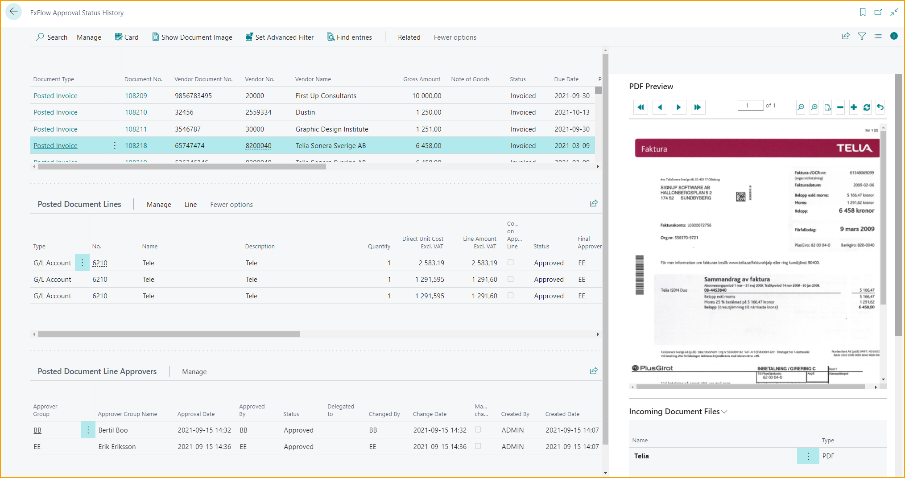
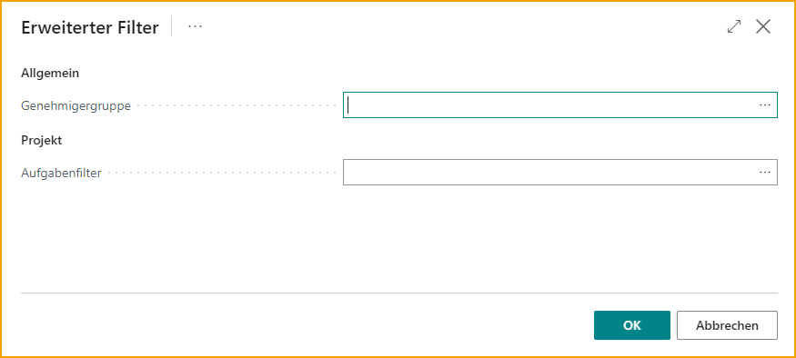
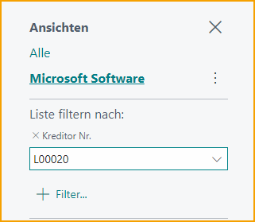
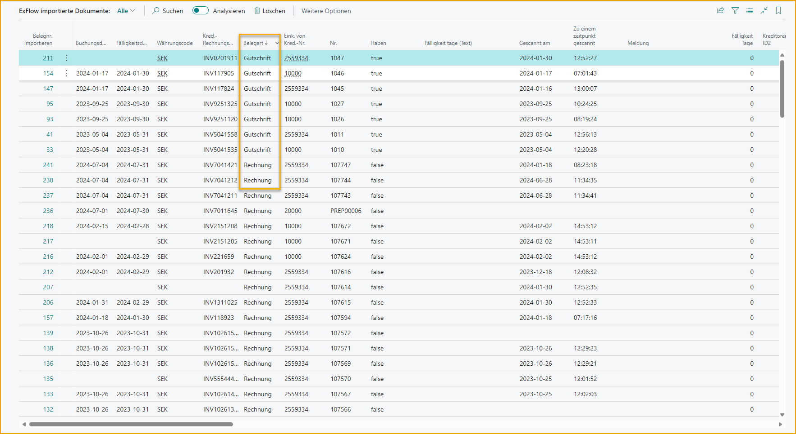
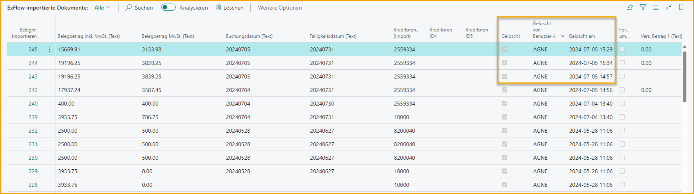
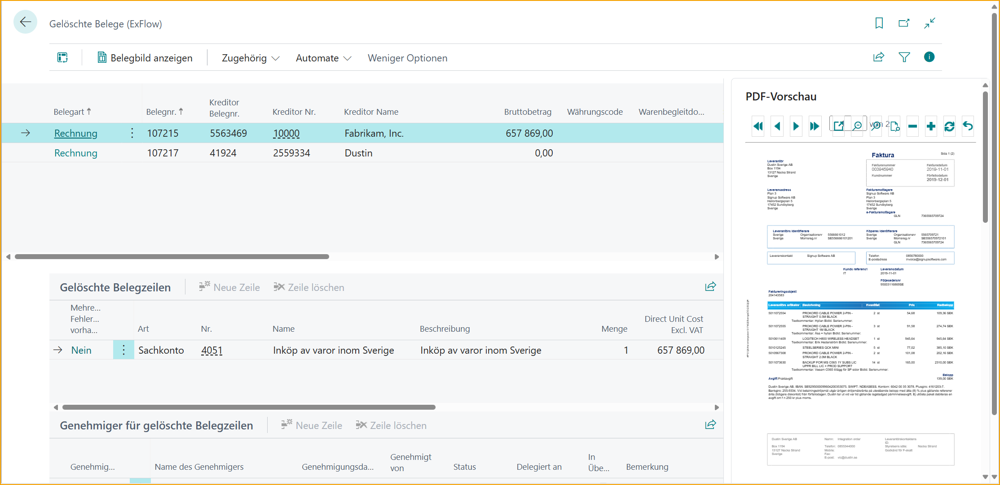

## Dokumentenverlauf

### Dokumente suchen

Gehe zu: ***Verlauf \--\> ExFlow Dokumente suchen***

ExFlow Dokumente suchen kann verwendet werden, um Dokumente nach verschiedenen Kriterien innerhalb von ExFlow zu suchen. Erfahren Sie mehr darüber, wie Sie diese Funktion im Abschnitt Dokumente suchen verwenden.

### Genehmigungsstatusverlauf

Gehe zu: ***ExFlow Verlauf \--\> ExFlow Genehmigungsstatusverlauf***

Funktion zum Anzeigen des ExFlow Genehmigungsstatusverlaufs für gebuchte Dokumente, abgeschlossene Bestellungen und Angebote. Finden Sie verwandte Informationen/Dokumente zu einem bestimmten Dokument, sowohl die Karte "Gebuchte Rechnung oder gebuchte Gutschrift" als auch die "Ex-Dokument-Karte". Es ist auch möglich, die zugehörigen OCR-Importinformationen für das Dokument zu finden oder nach "Genehmigungsgruppe" zu filtern.

Für gebuchte Rechnungen und Gutschriften ist es möglich, den "Verbleibenden Betrag" aus den Lieferantenbuchungssätzen direkt im ExFlow Genehmigungsstatusverlauf zu sehen. Dies bedeutet, dass Sie sehen können, ob das Dokument bezahlt wurde oder nicht.

Der ExFlow Genehmigungsstatusverlauf enthält auch abgeschlossene Bestellungen und Angebote. Ein abgeschlossenes Angebot ist ein Angebot, das in eine Bestellung umgewandelt wurde. Eine abgeschlossene Bestellung ist eine genehmigte, fakturierte und entfernte Bestellung. Lesen Sie mehr im Abschnitt **ExFlow Bestellstatus**.

#### Erweiterten Filter für ein gebuchtes Dokument festlegen

Verwenden Sie den Genehmigungsstatusverlauf, um zuvor gebuchte ExFlow-Dokumente zu finden.

Finden Sie bestimmte Dokumente entweder durch Suche oder durch Festlegen verschiedener Standardfilter. Um zuvor gebuchte Dokumente basierend auf Genehmiger oder Aufgabe zu finden, verwenden Sie die Funktion Erweiterten Filter festlegen:

Wählen Sie eine oder mehrere Genehmigergruppe(n) und/oder Aufgabe(n) aus. Klicken Sie auf OK, und die Liste der Dokumente wird gefiltert, um nur Rechnungen anzuzeigen, bei denen die ausgewählte(n) Aufgabe(n) in mindestens einer Rechnungszeile und/oder der ausgewählte(n) Genehmiger in der Genehmigungsabfolge für mindestens eine Rechnungszeile erscheinen.

Um den erweiterten Filter zurückzusetzen, wählen Sie Verwandt \--\> Genehmiger \--\> Filter zurücksetzen

#### Filter speichern

Im ExFlow Genehmigungsstatusverlauf ist es möglich, den Filter zu speichern.

Verwenden Sie Business Central Standard, um alle Filter festzulegen. Klicken Sie auf Speichern und geben Sie dem Filter einen Namen.

#### Kommentare von Genehmigern lesen

Wenn Kommentare im Diskussionsbereich/Chat oder auf der Dokumentenzeile hinzugefügt werden, werden sie genauso wie im Genehmigungsstatus angezeigt. Lesen Sie mehr oben.

### Importierte Dokumente

Gehe zu: ***ExFlow Verlauf \--\> ExFlow Importierte Dokumente***

Alle interpretierten und importierten Dokumente werden in ExFlow Importierte Dokumente angezeigt.

Wenn das Dokument sich noch im Importjournal befindet, wurde noch kein Dokument erstellt und der Dokumententyp wird als Angebot angezeigt.

Wenn ein Benutzer ein importiertes Dokument löscht, können interpretierte Daten hier als Gelöscht zusammen mit Gelöscht von Benutzer und Gelöscht am Datum und Uhrzeit gefunden werden.

Um interpretierte Zeilen anzuzeigen, öffnen Sie die Karte.

Gehe zu: ***Verwandt \--\> Zeile \--\> Karte***

### Chat-Benachrichtigungsverlauf

Gehe zu: ***ExFlow Verlauf \--\> ExFlow Chat-Benachrichtigungsverlauf***

Ein ExFlow-Benutzer kann ExFlow Chat-Benachrichtigungen anzeigen, in denen der Benutzer in den letzten 90 Tagen markiert wurde.

Lesen Sie mehr im Abschnitt Diskussionsbereich / Chat.

### Gelöschte Dokumente

Gehe zu: ***ExFlow Verlauf \--\> ExFlow Gelöschte Dokumente***

Wenn ein Dokument in ExFlow erstellt, aber noch nicht gebucht wurde, ist es möglich, das Dokument zu löschen. In diesem Fall wird das Dokument gespeichert und kann in ExFlow Gelöschte Dokumente gefunden werden.

Und wenn eine Eingangsrechnung oder eine Gutschrift für die Genehmigung abgewählt wird, wird das ExFlow-Dokument entfernt und die Informationen werden in ExFlow Gelöschte Dokumente gespeichert.

