### Eskalationsauftrag

Gehe zu: ***Periodische Aktivitäten --> ExFlow-Eskalationsjob***

Um den Eskalationsauftrag auszuführen, muss er aktiviert werden.

Dieser Job genehmigt automatisch die überfälligen Dokumente des Benutzers und fügt
Eine neue genehmigende Person aus dem Setup. Die allgemeine Einrichtung erfolgt über "ExFlow Setup"
und/oder pro ExFlow-Benutzer aus der "ExFlow-Genehmigungsgruppe".

Der Job kann ausgeführt werden, wenn der Benutzer im Genehmigungsstatus auf "Änderungen überprüfen" klickt.
Ausführen des Berichts manuell (Berichts-ID 12013629) oder durch Einrichten eines Projektwarteschlangeneintrags (CU 12057074) in Business Central Standard.

#### ExFlow-Einrichtung

Gehen Sie zu: ***Setup --> ExFlow-Setup --> Eskalation***

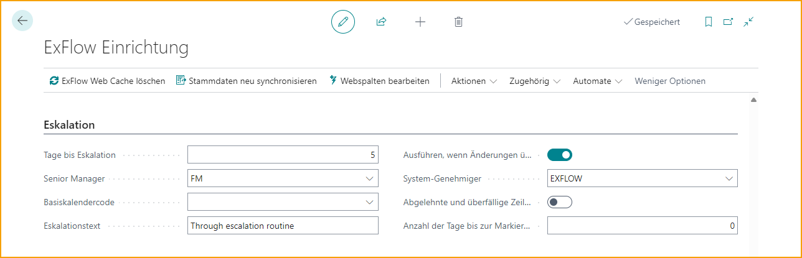

|Eskalation||
|:-|:-|	
|**Tage vor der Eskalation**| 	Berechnet ab dem Zeitpunkt, an dem der Benutzer das Dokument zur Genehmigung erhalten hat.    ("Datum der Statusänderung" auf "Genehmiger der Belegposition" in "Genehmigungsstatus.  Das Serverdatum setzt das "Statusänderungsdatum".)    Lesen Sie mehr dazu im Abschnitt [***Eskalation***](https://docs.exflow.cloud/business-central/docs/user-manual/business-functionality/approval-groups#escalation)
|**Leitender Angestellter**| 	Benutzer, der alle überfälligen Rechnungen erhält. Der vorgesetzte Genehmiger muss über die gleiche oder eine höhere Berechtigung verfügen, da die Berechtigung in ExFlow nicht geerbt wird.
|**Basis-Kalendercode**| 	Gibt den Basiskalendercode an, der für die Berechnung der Arbeitstage bei einer Eskalation verwendet werden soll. Wenn kein Basiskalender hinzugefügt wird, werden Samstag und Sonntag nicht berücksichtigt.
|**Eskalationstext**| 	Gibt den Text an, der für eskalierte Genehmigerpositionen verwendet werden soll. Interne Informationen werden in den Kommentaren eingetragen.
|**Ausführen, wenn Änderungen überprüft werden**| 	Führen Sie den Eskalationsauftrag aus, wenn Sie die Option "Änderungen am Genehmigungsstatus überprüfen" verwenden.
|**System-Genehmiger**| 	Gibt die Genehmiger-ID für den Systemgenehmiger an, der bei der automatischen Genehmigung von eskalierten Rechnungen verwendet wird. Wenn leer, wird der aktuelle BC-Benutzer verwendet
|**Abgelehnte und überfällige Dokumente hervorheben**| 	Aktivieren Sie diese Einstellung, um den Text von abgelehnten und/oder überfälligen Dokumenten im Genehmigungsstatus rot zu färben. Damit sind sie leichter zu erkennen.
|**Nein. der überfälligen Tage vor dem Highlight**| 	Legen Sie eine Nr. Anzahl der Tage, an denen das Dokument mit rotem Text im Genehmigungsstatus angezeigt werden soll. Die Nr. von Tagen wirkt sich auf das Fälligkeitsdatum des Dokuments aus. Mit "0" wird das Dokument am Fälligkeitsdatum markiert.

#### ExFlow-Genehmigungsgruppe

Gehe zu: ***Setup --> ExFlow Manual Setup --> ExFlow Approval Groups***

Verwenden Sie Eskalationseinstellungen in der ExFlow Approval Group, wenn eine separate Einrichtung erforderlich ist.

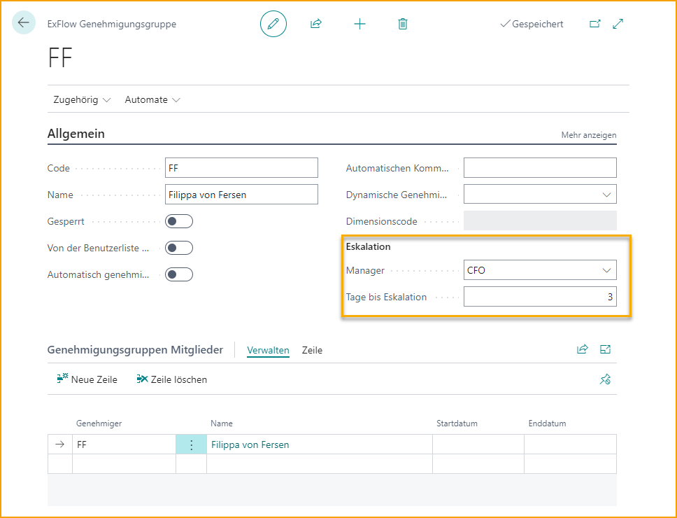

#### Genehmigungsstatus

Wenn "Ausführen bei Änderungen überprüfen" in ExFlow Setup ausgewählt ist, wird der Eskalationsjob ausgeführt, wenn der Benutzer im Genehmigungsstatus auf Änderungen überprüfen klickt.

#### ExFlow Start Eskalationsjob

Gehe zu: ***Periodische Aktivitäten \--\> ExFlow Eskalationsjob***

Führen Sie den ExFlow Eskalationsjob manuell aus oder richten Sie den Job in "Job Queue Entries" in Business Central Standard ein.

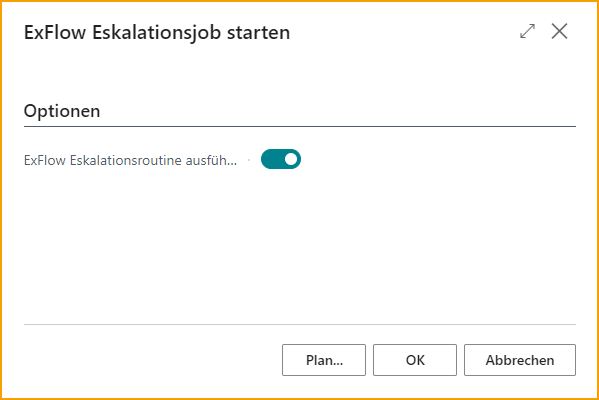

#### Beispiel mit Benutzern und einer allgemeinen Eskalationseinstellung in ExFlow Setup

In diesem Beispiel ist CC (Cecilia Cederbaum) der aktuelle Genehmiger und es gibt keine Einrichtung für Eskalation in der Approval Group CC. Der zweite Genehmiger ist EE (Erik Eriksson).

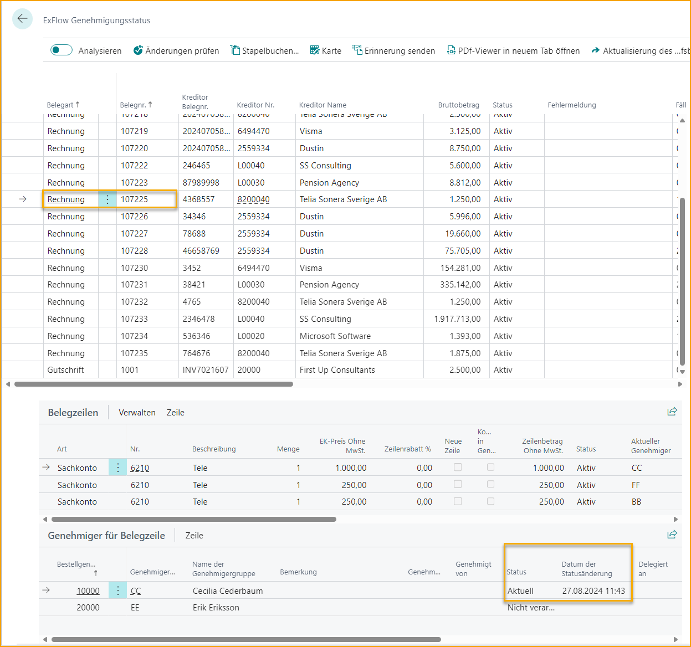

Der Eskalationsjob wird CC automatisch genehmigen und einen neuen Genehmiger, FM (Finance Manager), aus ExFlow Setup hinzufügen, da die Anzahl der Tage zwischen dem Dokumentdatum und heute mehr als 5 Tage beträgt.

(Einrichtung, siehe Bild oben unter ExFlow Eskalationsjob --> ExFlow Setup).

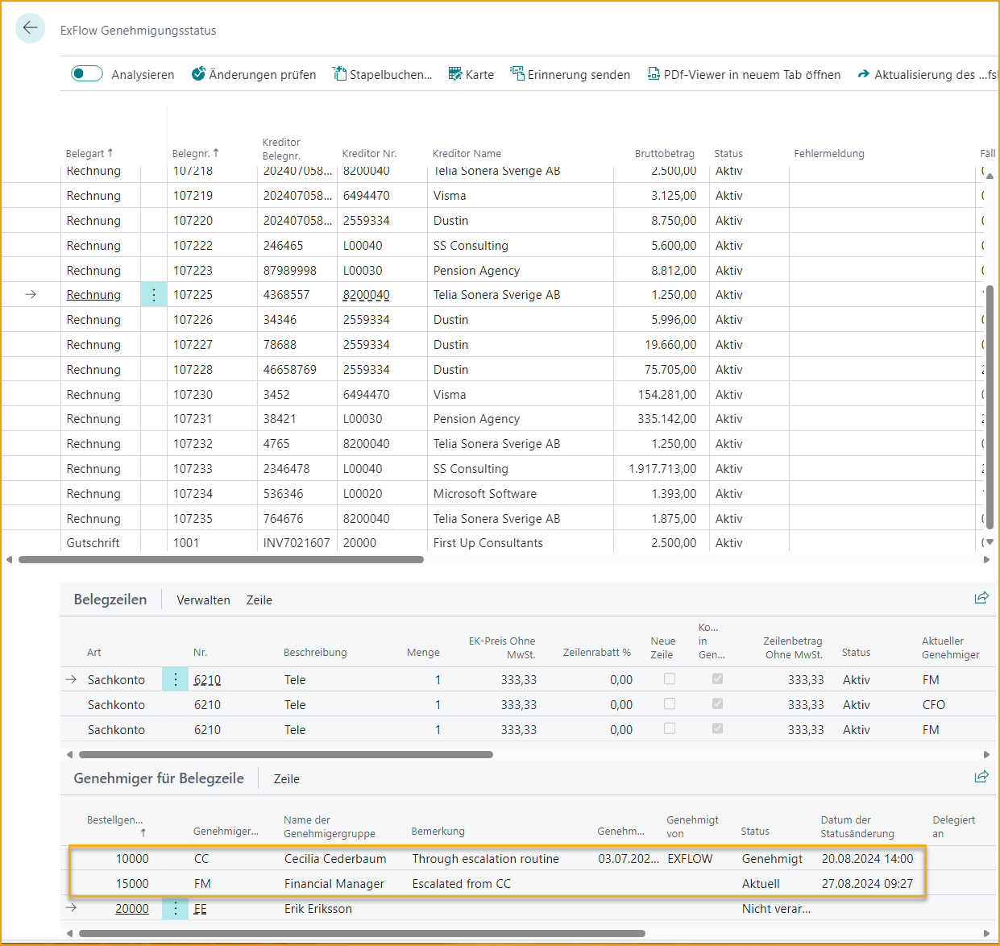

#### Beispiel mit Benutzern, die Eskalationseinstellungen in der Genehmigungsgruppe haben

In diesem Beispiel ist der erste und aktuelle Genehmiger FF (Filippa von Fersen). FF hat eine Eskalationseinstellung in der Genehmigungsgruppe.

(Einrichtung, siehe Bild oben unter ExFlow Eskalationsjob - ExFlow Genehmigungsgruppe)

Der zweite Genehmiger ist EE (Erik Eriksson).

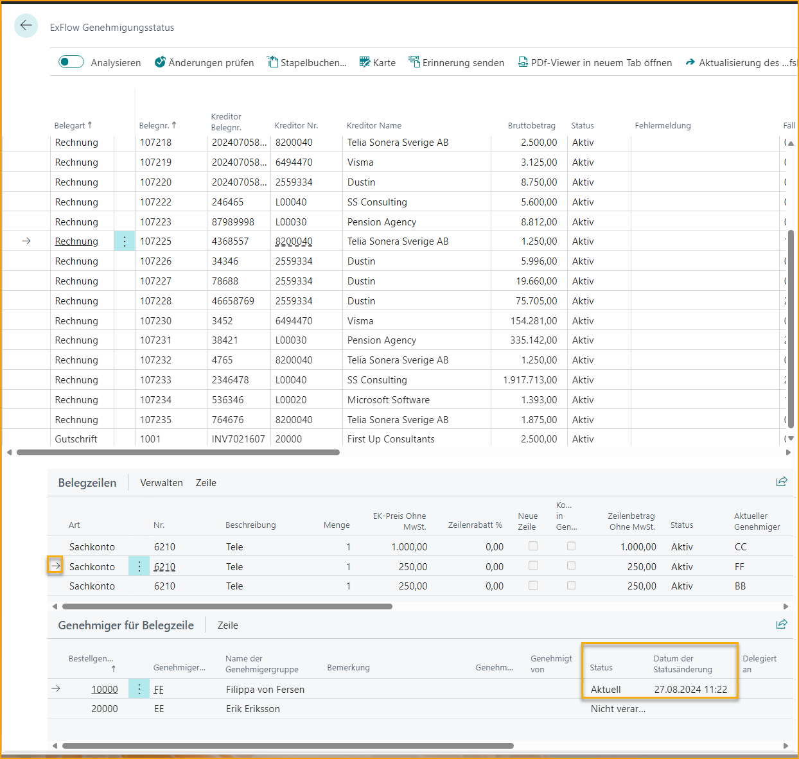

Der Eskalationsjob genehmigt FF automatisch und fügt einen neuen Genehmiger, CFO, aus der Eskalationseinstellung in der Genehmigungsgruppe FF hinzu. Da die Anzahl der Tage zwischen dem Dokument und heute mehr als 3 Tage beträgt, muss EE nach dem CFO noch genehmigen.

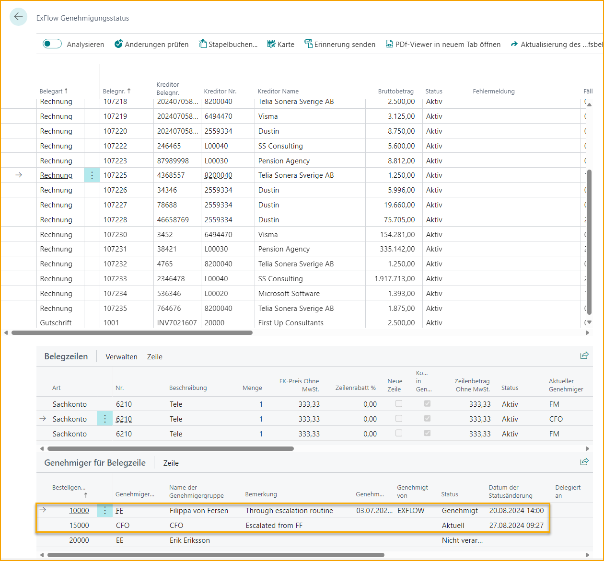

### Batch-E-Mails senden

Gehen Sie zu: ***Periodische Aktivitäten --> ExFlow Batch-E-Mails senden***

Batch-E-Mails werden normalerweise automatisch über Job Queue Entries im Business Central Standard ausgeführt. Bei Bedarf kann der Job jedoch manuell ausgeführt werden.

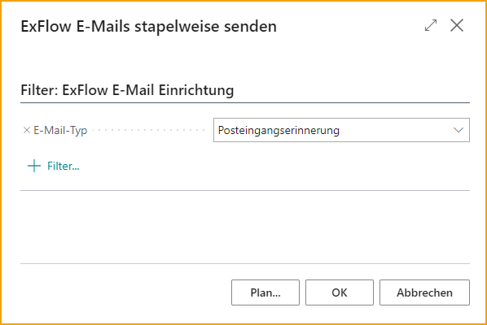

Diese Funktion kann auch in "ExFlow E-Mail-Einrichtung" gefunden werden.

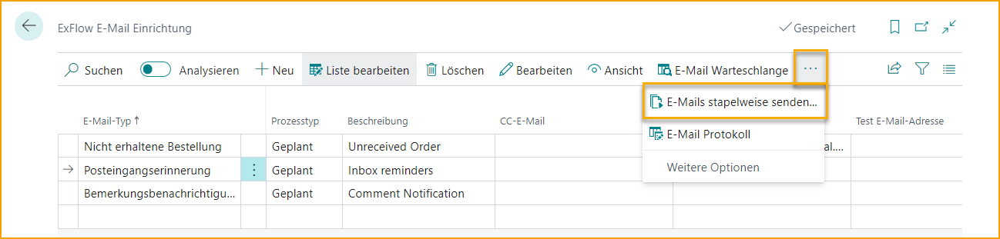

Erinnerungen an bestimmte Benutzer aus der "ExFlow Benutzer"-Liste senden.

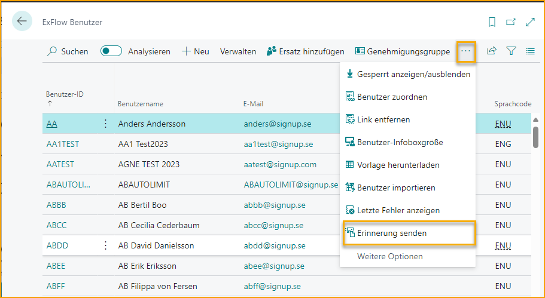

Um eine Erinnerung an alle aktuellen Benutzer für ein bestimmtes Dokument zu senden, führen Sie den Bericht aus dem ExFlow Genehmigungsstatus aus, indem Sie die Dokumentzeile markieren und "Erinnerung senden" auswählen.

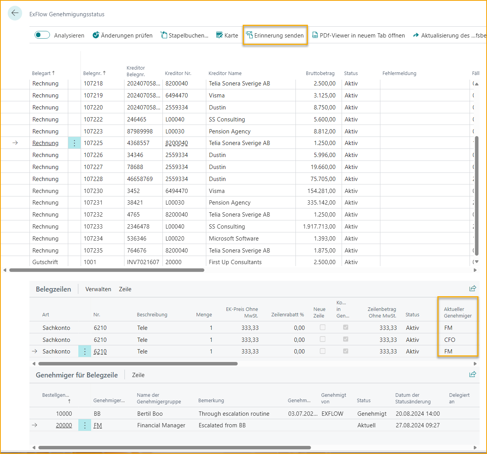

### Batch-Dokumente importieren

Gehen Sie zu: ***Periodische Aktivitäten \--\> ExFlow Batch-Dokumente importieren***

Dieser Bericht ist eine weitere Möglichkeit, alle Dokumente in das Importjournal zu importieren und kann auch automatisch über Job Queue Entries im Business Central Standard ausgeführt werden.

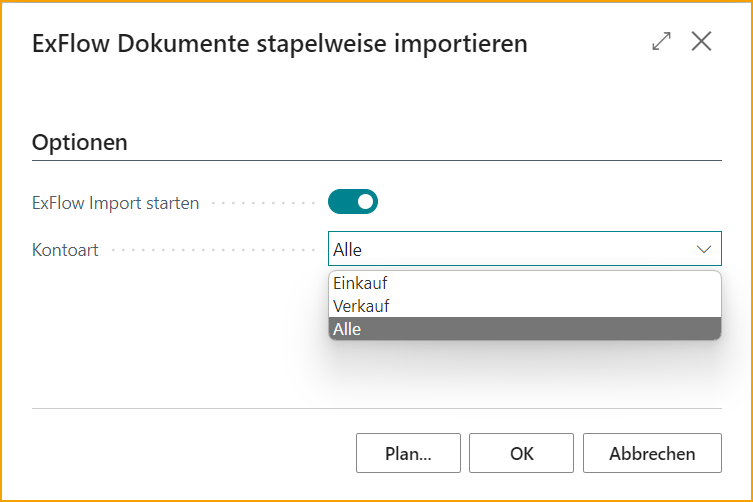

### Stellvertreter zuweisen

Gehen Sie zu: ***Periodische Aktivitäten \--\> ExFlow Stellvertreter zuweisen***

Von Stellvertreter zuweisen können Genehmiger vorübergehend hinzugefügt oder entfernt werden.

Aktion Hinzufügen oder Entfernen auswählen.

Genehmiger hinzufügen.

Benutzer als Stellvertreter hinzufügen.

Startdatum und Enddatum können nur verwendet werden, wenn Aktion auf Hinzufügen gesetzt ist.

Diese Funktion kann auch unter ExFlow Benutzer gefunden werden.

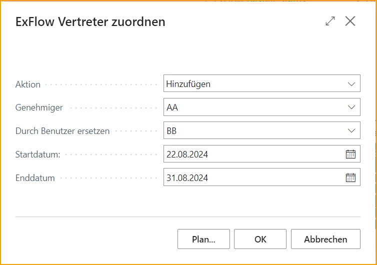

### Re-Invoicing-Einträge

Informationen zu Rechnungen, die an Kunden gesendet werden sollen, finden Sie in ExFlow Re-Invoicing-Einträge.

Lesen Sie mehr darüber im Abschnitt [***Re-Invoicing.***](https://docs.exflow.cloud/business-central/docs/user-manual/business-functionality/re-invoicing#re-invoicing)

### Automatische Kodierungsvorschläge

Um den automatischen Kodierungsvorschlag anzuwenden, ist es erforderlich, die Funktionen ExFlow Kodierungs-IDs für Kodierungsvorschläge und ExFlow Erstellung automatischer Kodierungsvorschläge auszuführen.

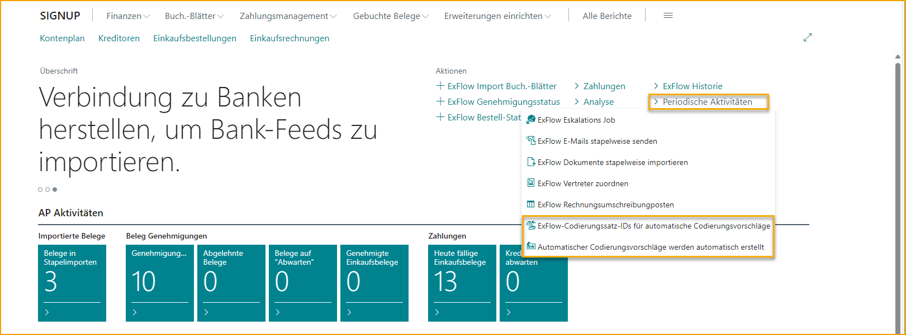    Lesen Sie mehr darüber im Abschnitt [***Automatische Kodierungsvorschlag-Einrichtung***](https://docs.exflow.cloud/business-central/docs/user-manual/business-functionality/automatic-coding-suggestion-setup#automatic-coding-suggestion-setup)

