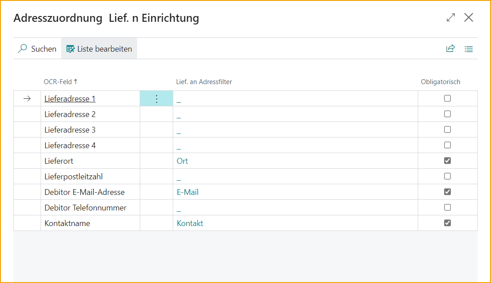

## Konfiguration des Verkaufsauftrags im ExFlow Data Capture-Konto

Gehe zu: **ExFlow Data Capture-Konto**

Bitte beachten Sie, dass *zwei separate Anmeldungen* bei ExFlow Data Capture (EDC) erforderlich sind, um sowohl mit Einkaufs- als auch mit Verkaufsdokumenten zu arbeiten. 

Um Verkaufsaufträge in Business Central importieren zu können, muss ein neues ExFlow Data Capture-Verkaufskonto eingerichtet werden.

  

**Konfigurationsschritte:**
Navigieren Sie zu ExFlow Data Capture-Konten, um auf die Konfiguration zuzugreifen.
Klicken Sie auf Neu, um eine neue Verbindung zu initiieren.

Geben Sie der Verbindung einen geeigneten Code und wählen Sie den Verbindungstyp: *Verkauf*

**Verbindungsdetails:**
Um die Verbindung abzuschließen, stellen Sie sicher, dass Sie die folgenden Verbindungsdetails haben, um eine Verbindung zu EDC herzustellen. Diese werden von Signup Software oder Ihrem vertrauenswürdigen Business Central-Partner bereitgestellt.

- *Benutzername*
- *Passwort*
- *Autorisierungsschlüssel*

**Standard-EDC-Dokumentvorlagen**
Wählen Sie die Dokumentvorlage, die für die Interpretation durch EDC verwendet wird.

**Datenaustauschtyp**
Wählen Sie den „EDC2EXFSO“, der der Standard-Austauschtyp für EDC-Verkaufsaufträge ist.

**Unternehmensauswahl:**
Die Konfiguration der ExFlow Data Capture-Konten ermöglicht die Verwendung derselben Anmeldeinformationen in allen Unternehmen innerhalb von Business Central.
Dies liegt daran, dass das Benutzerkonto Zugriff auf alle Unternehmen in EDC hat. 
*Wichtig:* Wählen Sie während der Konfiguration das richtige Unternehmen als Käufer und Master-Datenfilter aus, um sicherzustellen, dass die Verbindung mit dem beabsichtigten Unternehmen hergestellt wird.

**Abschließen der Konfiguration:**
Überprüfen Sie die eingegebenen Details, bevor Sie den Konfigurationsprozess abschließen.
Aktivieren Sie die Master-Daten-Synchronisation, um den Upload von Kundenstammdaten zu ermöglichen.
Aktivieren Sie abschließend „aktivieren“ und akzeptieren Sie alle Aufforderungen.
Testen Sie die Verbindung, um eine erfolgreiche Integration zwischen Business Central und ExFlow Data Capture sicherzustellen.

### Einrichtung des Verkaufsauftragsimports
Gehe zu: **ExFlow Sales Order Import Setup**

Der nächste Schritt besteht darin, einige Parameter in der *ExFlow Sales Order Import Setup* festzulegen.

| Allgemein      |   | 
|:-|:-|
|**Dummy-Artikelnummer für Verkaufsauftragsimport:**                        | Gibt den Dummy-Artikel an, der verwendet wird, falls keine andere Übereinstimmung für die importierte Verkaufsauftragszeile gefunden wird.
**OCR-Mapping automatisch aktualisieren, wenn Dummy-Artikel angewendet wird**     | Gibt an, ob das OCR-Mapping automatisch aktualisiert wird, wenn der Benutzer eine Auswahl trifft, nachdem der Dummy-Artikel während des Imports angewendet wurde.
**Buchung auf Dummy-Artikel zulassen**                                     | Gibt an, ob die Buchung auf Dummy-Artikel zulässig ist.
**Dokumente automatisch erstellen** | Entscheidet, ob Dokumente ohne Fehler automatisch als Verkaufsaufträge beim Import erstellt werden.
**Ship-To Address Code erforderlich**                                  | Gibt an, ob das Feld Ship-To Address Code erforderlich ist. Wenn aktiviert, muss ein Code ausgewählt werden, um den Verkaufsauftrag zu erstellen.
**Benutzerdefinierte Adresse verwenden** | Verwenden Sie die aus dem OCR-Dienst interpretierte benutzerdefinierte Adresse oder fügen Sie sie manuell hinzu, nachdem der Auftrag erstellt wurde. Wenn Adressfelder nicht aus dem Import ausgefüllt werden, wird der Auftrag mit der Standardversandadresse des Kunden erstellt. Wenn diese Einstellung aktiviert ist, wird ''Ship-To Address Code'' deaktiviert.
**Kontakt-Nr. erforderlich**                                           | Gibt an, ob das Feld Kontakt-Nr. erforderlich ist. Wenn aktiviert, muss ein Code ausgewählt werden, um den Verkaufsauftrag zu erstellen.
**Bestelldatum festlegen auf**                                               | Gibt an, auf welches Datum das Bestelldatum im Verkaufsauftrag festgelegt werden soll.
**BOM-Artikel automatisch auflösen** | Gibt an, ob importierte BOM-Artikelzeilen beim Erstellen des Verkaufsauftrags aufgelöst werden.
**Dimension von kopieren** | Gibt an, von wo aus aufgelöste BOM-Artikel Dimensionen kopieren sollen.
**Standard-Nr.-Serie** | Gibt die Nr.-Serie an, die beim Erstellen von Verkaufsaufträgen mit ExFlow verwendet wird. Wenn leer, wird die Nr.-Serie aus der Verkaufs- und Forderungseinrichtung verwendet.

 

Gehe zu: **ExFlow Sales Order Import Setup --> Verwandt --> ExFlow Sales Order Matching Priority**

Bearbeiten Sie die Liste, wenn eine Matching-Priorität befolgt oder im Matching-Prozess ausgeschlossen werden soll.

Gehe zu: **ExFlow Sales Order Import Setup --> Verwandt --> Ship-To Address Matching Setup**

Bearbeiten Sie die Liste, um Änderungen bezüglich der Pflichtfelder der interpretierten Werte vorzunehmen, wie z.B. Kontaktname oder Lieferstadt. Wenn der interpretierte Wert nicht mit der Ship-To-Adresse des Kunden übereinstimmt, bleibt das importierte Dokument mit einem Fehler in der importierten Verkaufsliste und muss manuell bearbeitet werden.

Alle als Pflichtfeld markierten Felder müssen erfüllt sein, um Fehler im importierten Dokument zu vermeiden. Es muss beispielsweise ein Ship-To-Address-Filter ''Stadt'', ''E-Mail'' und ''Kontakt'' gemäß dem untenstehenden Beispiel vorhanden sein.

Darüber hinaus ist es möglich, mehr als einen Wert im Ship-To-Address-Filter hinzuzufügen. Beispielsweise im OCR-Feld ''Kontaktname'', fügen Sie den Filter ''Name, Kontakt und Telefonnummer'' im Ship-To-Address-Filter hinzu. So ist es bei der Interpretation eines Kontaktnamens in EDC möglich, beispielsweise eine Telefonnummer anstelle eines Namens zu interpretieren. Es ist auch möglich, mit der Interpretation von mehr als einem spezifischen Kontakt/Namen zu arbeiten. Solange die Informationen im Kunden in Business Central vorhanden sind, wird das Verkaufsdokument beim Import verarbeitet und erstellt.

