### Verkaufsauftragsimport-Workflow

Gehe zu: **ExFlow Verkaufsdokument-Importliste**

Interpretiere die Verkaufsaufträge in ExFlow Data Capture.

Klicke auf *Verkaufsdokument importieren*, um die Verkaufsaufträge zu importieren, und dann auf *Ja*.

  

Importierte Verkaufsaufträge ohne Fehler werden direkt erstellt und können in der Standard-Verkaufsauftragsliste gefunden werden.

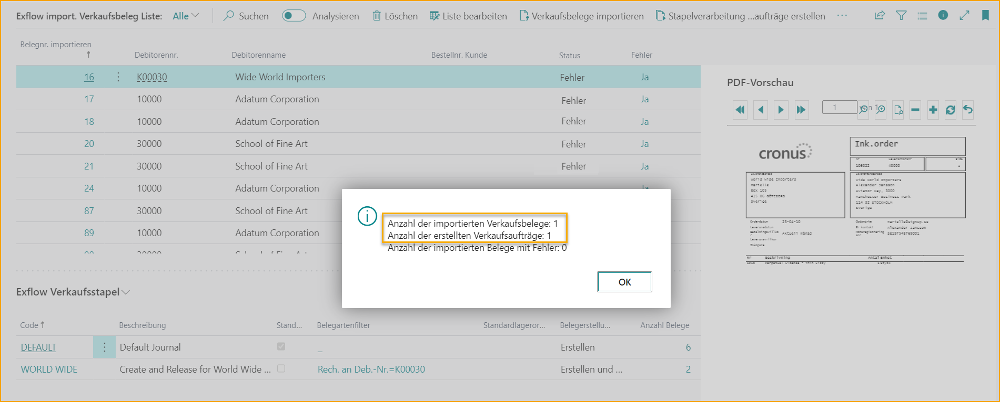  

Finde den neu erstellten Verkaufsauftrag in der ausgewählten Verkaufsauftragscharge oder indem du auf die Anzahl der Dokumente in der Verkaufsauftragscharge klickst.

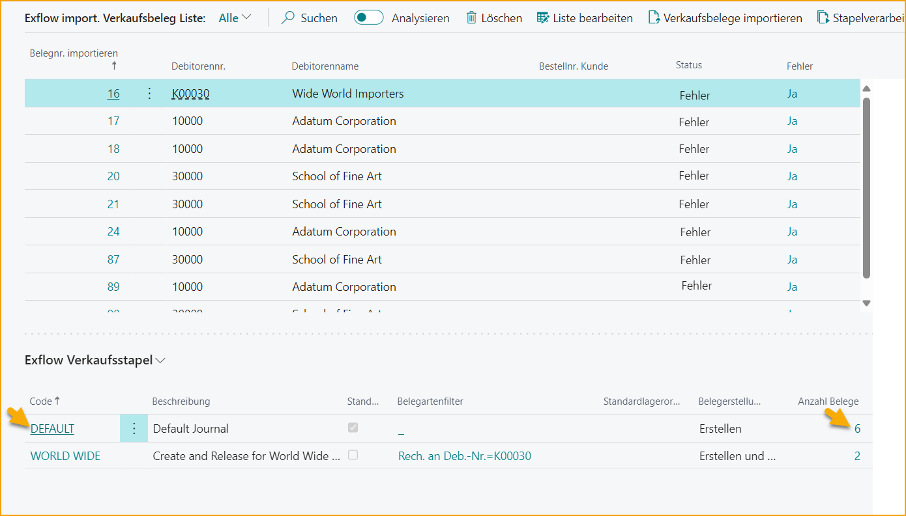  

Da diese ausgewählte Standardzeitschrift als "Erstellen" festgelegt ist, werden alle Verkaufsaufträge erstellt und haben den Status "Offen".

  

Wenn der Wert "Erstellen und Freigeben" für den Wert "Dokument erstellen" festgelegt wurde, wäre der Verkaufsauftrag ebenfalls freigegeben worden.

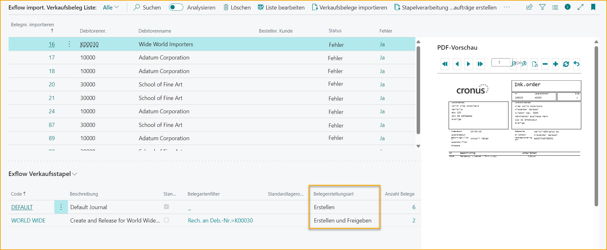  

### Umgang mit importierten Verkaufsaufträgen mit Fehlern

Im folgenden Beispiel existiert eine Standard-Verkaufsauftragscharge und eine weitere Verkaufsauftragscharge wird für den Kunden Adatum Corporation erstellt.

Importierte Dokumente mit Fehlern bleiben in der Verkaufsdokument-Importliste stecken, bis der Fehler manuell behoben wird.

Klicke auf Ja, um die Fehlermeldung zu öffnen.

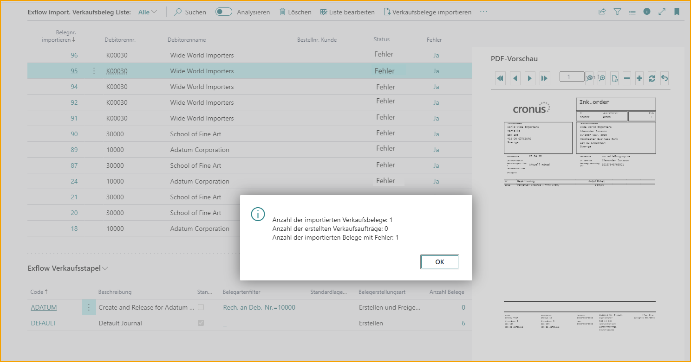  

Fehlermeldung:

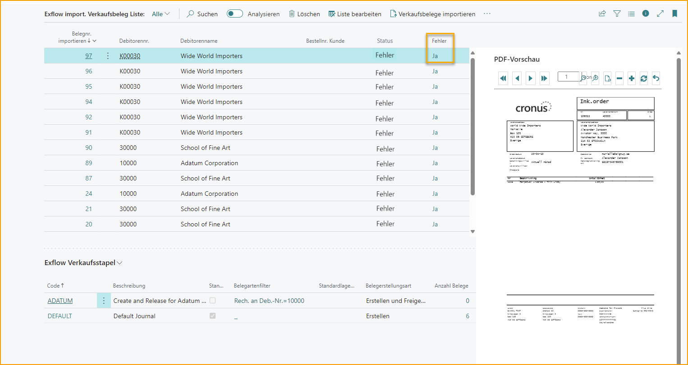  

Es ist auch möglich, auf die Importdokumentnummer zu klicken, um die Fehlermeldung und andere Informationen anzuzeigen. Wenn ein Dokument einen Fehler aufweist, hat es den Status "Fehler", bis der Fehler behoben ist.

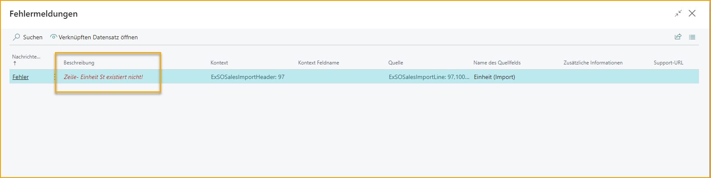  

Von der Karte aus hast du die Möglichkeit, einen interpretierten Wert einem anderen Wert zuzuordnen. Zum Beispiel kann ein unbekannter und rot markierter Mengeneinheitswert "Stück" in eine Mengeneinheit umgewandelt werden, die Business Central kennt, in diesem Beispiel "Stk.".

  

Klicke auf die drei Punkte in den Importzeilen, um eine Zuordnung vorzunehmen, und gehe in die Detailansicht:

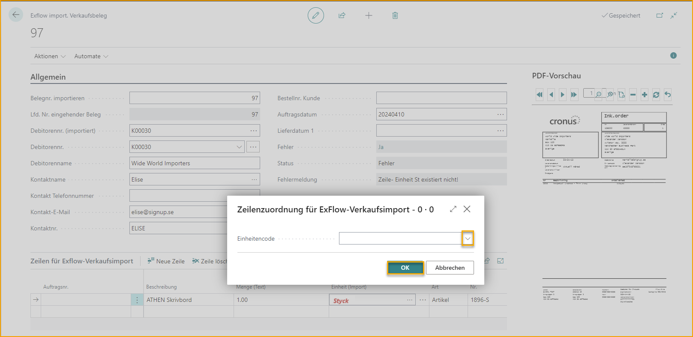  

Wähle den richtigen Mengeneinheitscode aus und klicke auf OK.

  

Die Mengeneinheit (Import) wird nicht mehr rot markiert sein und die neue Mengeneinheit wird nun in den Zeilen eingetragen. Das Dokument ist nicht mehr blockiert, daher ändert sich der Dokumentstatus von "Fehler" zu "Verarbeitet".

  

Jetzt ist es möglich, den Verkaufsauftrag zu erstellen, klicke einfach auf "Verkaufsaufträge im Batch erstellen".

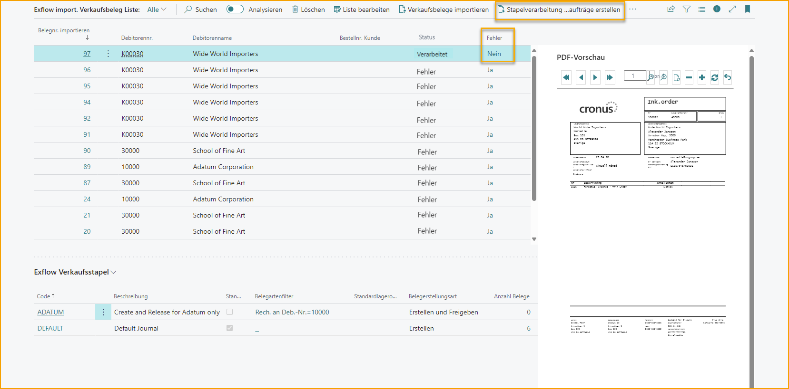  

Füge bei Bedarf einen Filter hinzu oder klicke auf OK.

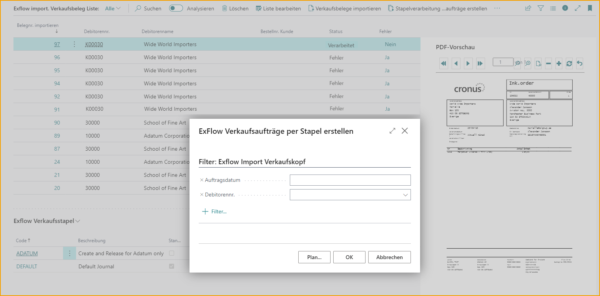  

Es wird eine Bestätigung zur Erstellung des Verkaufsauftrags angezeigt.

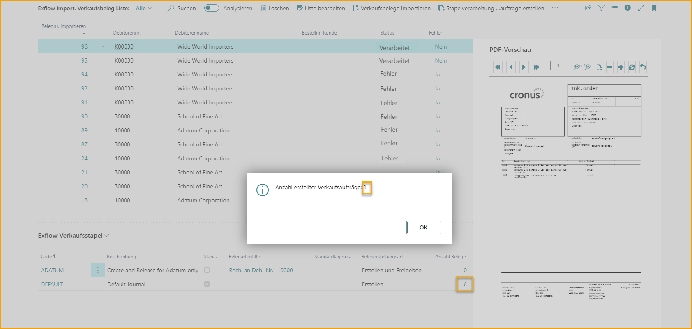  

Um alle erstellten Verkaufsaufträge anzuzeigen, klicke auf die Anzahl der Dokumente in der Verkaufsauftragscharge. In diesem Beispiel wurden drei Verkaufsaufträge erstellt, aber nicht freigegeben.

  

Wenn die Verkaufsaufträge sofort erstellt und freigegeben werden sollen, bearbeite die Liste und nehme die Änderung vor.

  

Wenn ein Filter hinzugefügt wird, z.B. wird der Wert "Dokumentfilter" auf "Rechnungsempfänger" festgelegt, werden alle Dokumente in dieser spezifischen "Rechnungsempfänger-Nr."-Charge importiert.

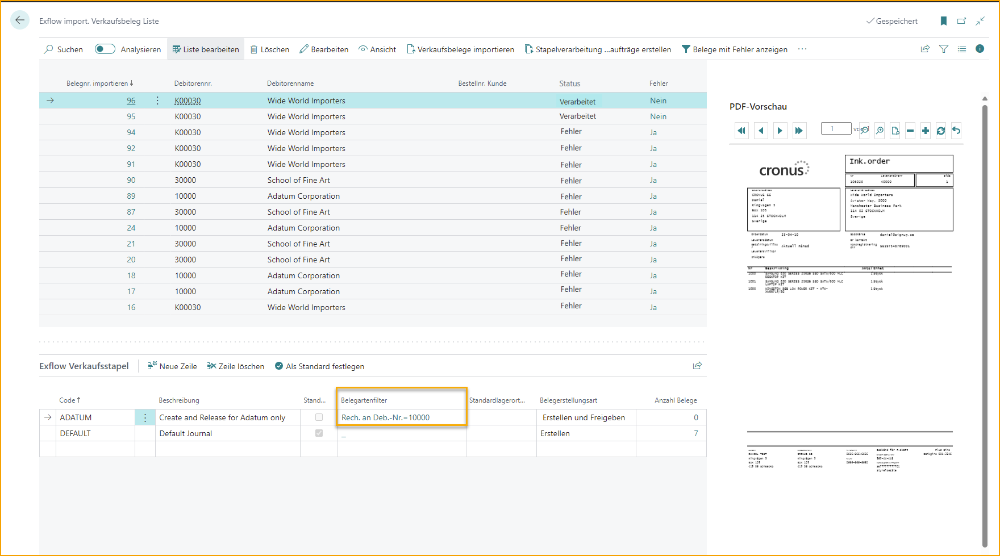  
