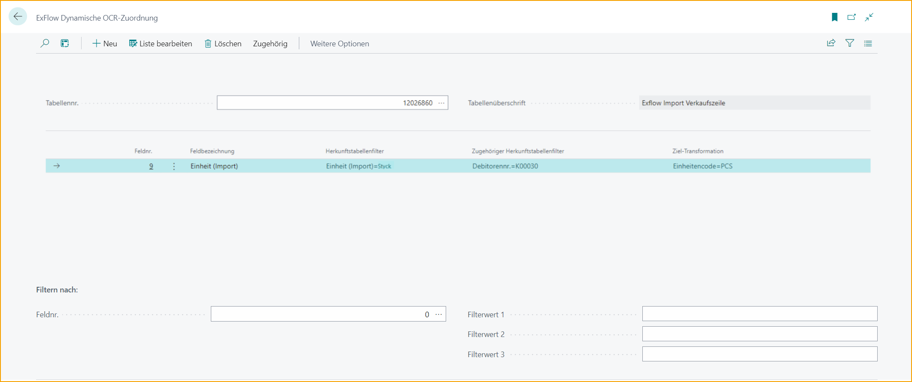

### Dynamisches OCR-Mapping

Gehe zu: **ExFlow Dynamisches OCR-Mapping**

Verwende das **ExFlow Dynamische OCR-Mapping**, um einen importierten Kundewert in einen erkennbaren Wert umzuwandeln. Zum Beispiel kann ein Wert, der in ExFlow Data Capture für einen bestimmten Kunden interpretiert wird, wie ein Mengeneinheitscode namens "Stück", stattdessen in "Stk." umgewandelt werden, und die Verkaufsbestellung kann ohne Fehler erstellt werden.

Alle Zuordnungen können in der Liste des ExFlow Dynamischen OCR-Mappings für die jeweilige Tabellennummer angezeigt werden.

Weitere Informationen und ein Beispiel finden Sie im Abschnitt [Umgang mit importierten Verkaufsaufträgen mit Fehlern](https://docs.exflow.cloud/business-central/docs/user-manual/sales-order-workflow/sales-import#handling-imported-sales-orders-with-error).

