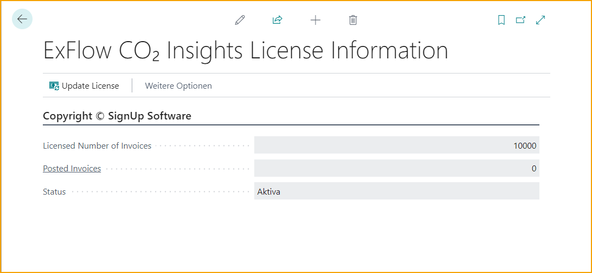
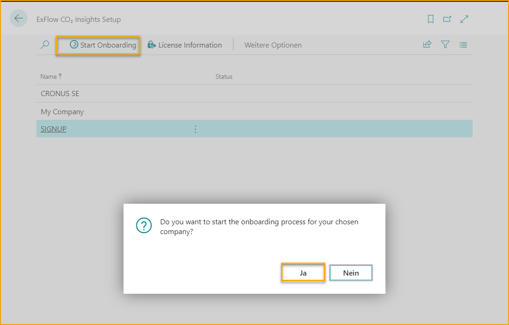
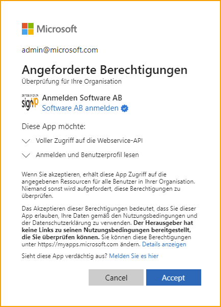
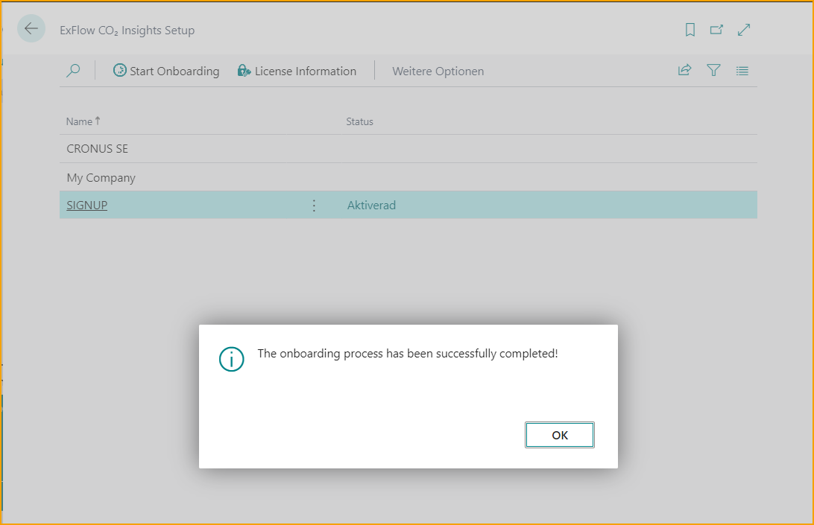
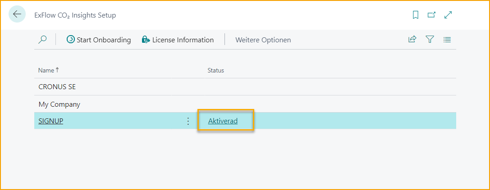

## ExFlow CO₂ Einblicke

### So richten Sie ExFlow CO₂ Einblicke ein

#### Lizenzschlüssel eingeben

Um mit der Einrichtung von CO₂ Einblicke in ExFlow Business Central zu beginnen, suchen Sie nach ***ExFlow CO₂ Einblicke Lizenzinformationen*** und geben Sie den bereitgestellten Lizenzschlüssel ein.

 

#### Berechtigungen für Business Central Benutzer
Der nächste Schritt besteht darin, das Berechtigungsset namens *EXCOADMIN* für ausgewählte Business Central Benutzer hinzuzufügen, die die Konfiguration von CO₂ Einblicke in Business Central verwalten werden.

Alle anderen Benutzer, die die CO₂ Einblicke Plattform nutzen werden, können das Berechtigungsset namens *EXCOREADER* erhalten.

Eines dieser Berechtigungssets muss den Benutzern zugewiesen werden, um auf die CO₂ Einblicke Plattform zugreifen zu können, wenn die Konfiguration abgeschlossen ist.  

#### Onboarding in ExFlow CO₂ Einblicke Setup
Gehen Sie zu **ExFlow CO₂ Einblicke Setup**

Gehen Sie zu ‘’ExFlow CO₂ Einblicke Setup’’, um das Onboarding für das ausgewählte Unternehmen zu starten.

 

Der Benutzer wird dann aufgefordert, die Zustimmung gemäß dem untenstehenden Bild zu erteilen.

  

Eine erfolgreiche Onboarding-Bestätigung wird empfangen, wenn der Zustimmungsprozess abgeschlossen ist.

 

Wenn der Onboarding-Prozess abgeschlossen ist und die Zustimmung erteilt wurde, ist es möglich, auf die CO₂ Einblicke Plattform zuzugreifen, indem Sie auf ‘’Onboarded’’ klicken.

Dies setzt natürlich voraus, dass der Benutzer das erforderliche CO₂ Berechtigungsset auf der Business Central Benutzerkarte hat, wie zuvor erwähnt.

 

 
