## Die CO₂ Einblicke Plattform

Die CO₂ Einblicke Plattform ist in verschiedene Abschnitte unterteilt. Der erste Abschnitt heißt Review, und unter diesem Abschnitt finden Sie **Carbon footprint**.

Auf dieser Seite erhalten Benutzer Einblicke in die Gesamtemissionen des Unternehmens über einen ausgewählten Zeitraum und die Emissionsintensität. Es ist auch möglich, ein Dashboard mit der monatlichen Aufschlüsselung und der Kategorisierung anzuzeigen.

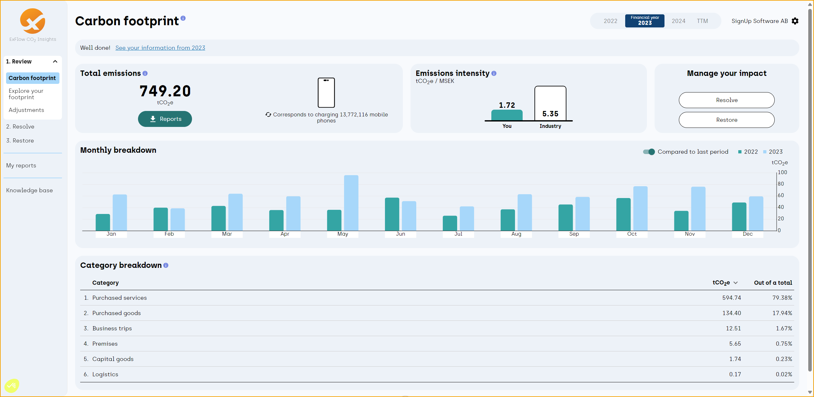 

Nutzen Sie **Explore your footprint**, um ein besseres Verständnis der Emissionen des Unternehmens zu erhalten und die Daten zu analysieren. Passen Sie verschiedene Zeiträume an und vergleichen Sie diese, um die Ergebnisse in Kategorien, Bereiche und Lieferanten unterteilt zu sehen.

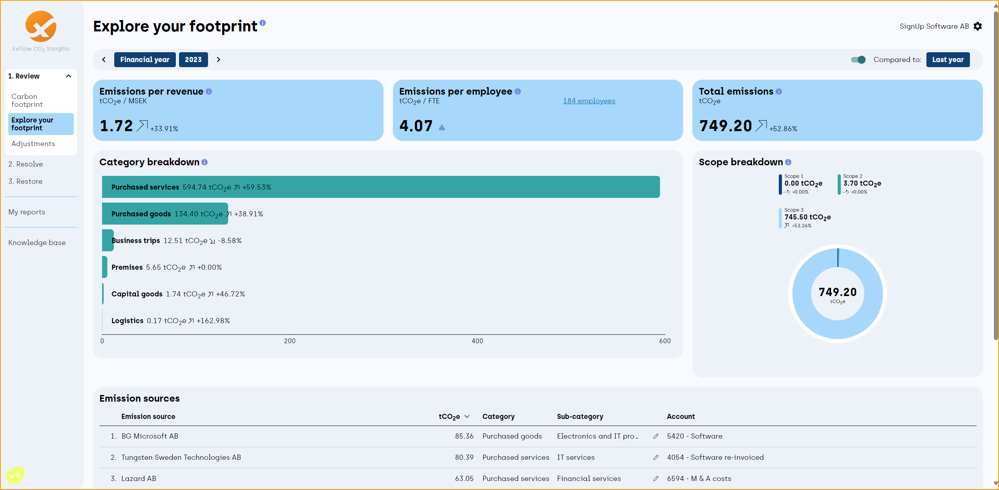 

Wenn einige Einträge unter Emissionsquellen nicht korrekt zugeordnet sind, können wir den Stift verwenden und die notwendigen Anpassungen vornehmen.

Zum Beispiel hat die Emissionsquelle ‘’BG Microsoft AB’’ die ‘’Kategorie: Kauf von Waren’’,
aber wir müssen sie in ‘’Kategorie: Erbrachte Dienstleistungen’’ und ‘’Unterkategorie: IT-Dienstleistungen’’ ändern.

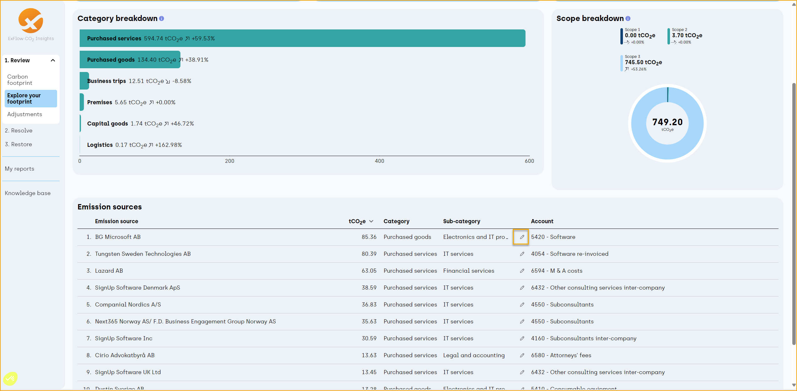 

Von hier aus ist es auch möglich, ‘’Immer diese Kategorie für diesen Lieferanten verwenden’’ oder ‘’Immer diese Kategorie für dieses Konto verwenden’’ auszuwählen.

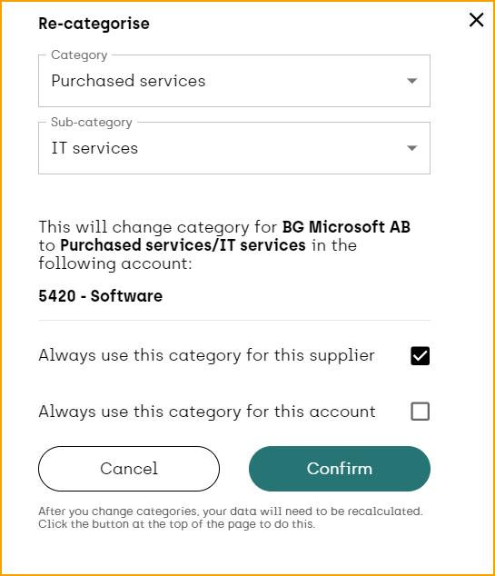 

Gehen Sie unter **Review and Adjustments**, um bereits durchgeführte Anpassungen anzuzeigen oder aktuelle Daten für das ausgewählte Jahr zu bearbeiten, um eine bessere Berechnung der Emissionen des Unternehmens zu erhalten. Es ist möglich, Unternehmensstandorte, Fahrzeuge und Maschinen oder Kältemittel hinzuzufügen oder zu bearbeiten.

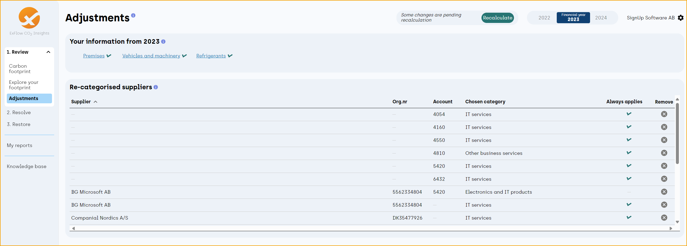 

Unter Standorte kann beispielsweise ein Büro oder eine beheizte Garage zusammen mit Informationen über deren Fläche, Stromverbrauch, Heizquelle und Verbrauch eingegeben werden.

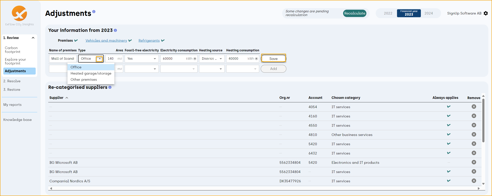 

Unter Fahrzeuge und Maschinen können wir auch ein Firmenfahrzeug oder andere Lastwagen hinzufügen und Informationen über den Kraftstoff, die Einheit und die Menge pro Jahr eingeben.

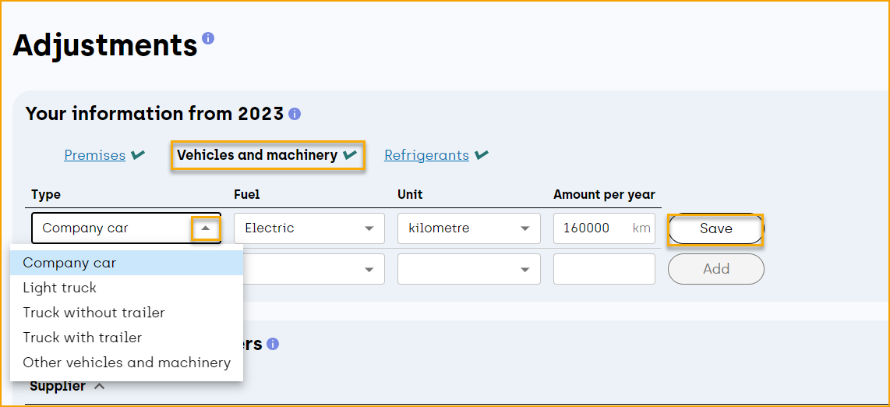 

Anpassungen können auch für die Kältemittel Ihres Unternehmens vorgenommen werden, wählen Sie einfach den Typ und die Menge aus.

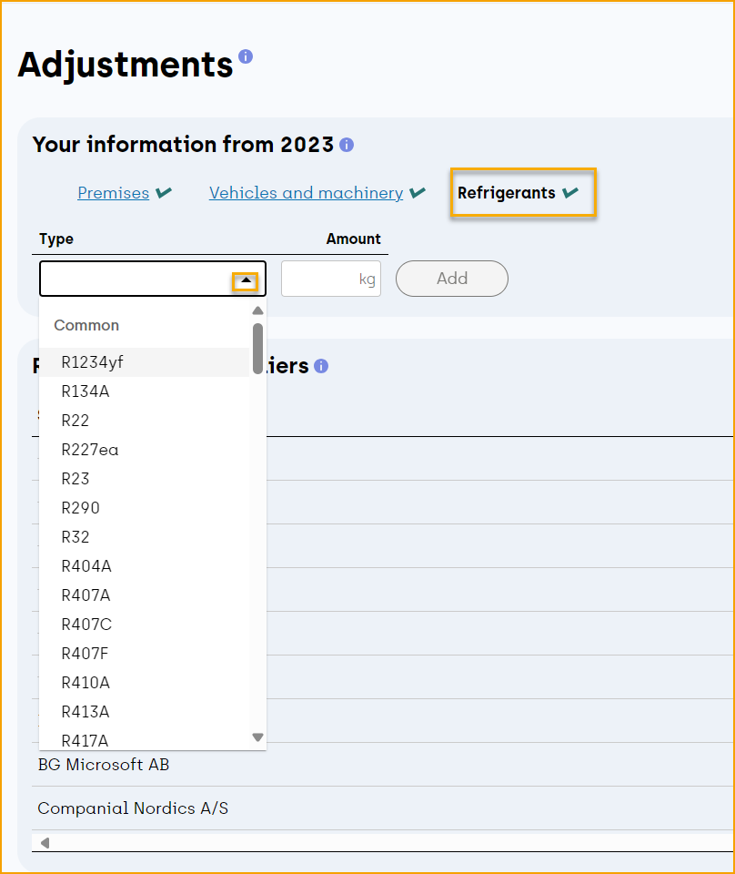 

Berechnen Sie neu, um die Änderungen abzuschließen und die aktualisierten Daten anzuzeigen.

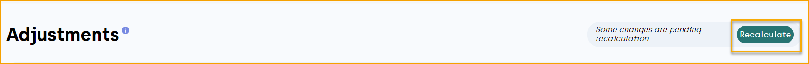 

Nutzen Sie Resolve als Ihr Klimaschutzplanungswerkzeug, wo es möglich ist, verschiedene Aktionspläne zu erstellen.

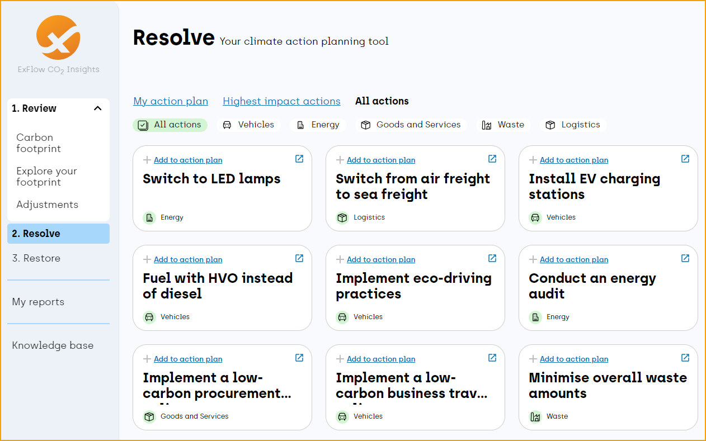 

Besuchen Sie den Abschnitt Restore, um herauszufinden, wie Sie die CO₂-Kompensation erleichtern und vertrauenswürdige Klimaprojekte finanzieren können, um Ihren CO₂-Fußabdruck zu verringern.

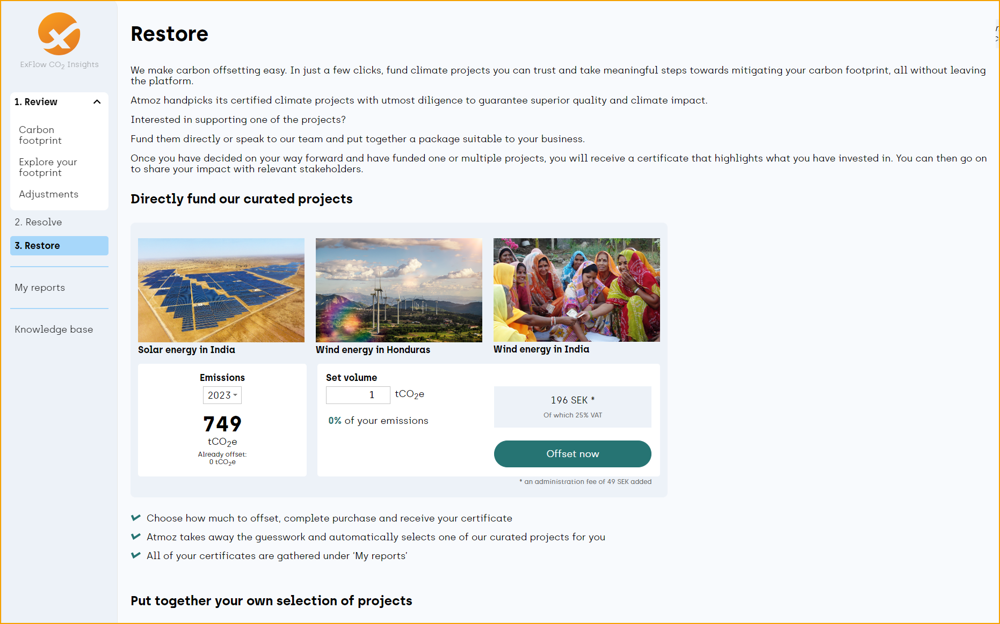 

Laden Sie Emissionsdaten oder Klimaberichte pro Geschäftsjahr unter ‘’My reports’’ herunter.
Darüber hinaus können Sie abgeschlossene Transaktionen Ihrer CO₂-Kompensationen anzeigen.

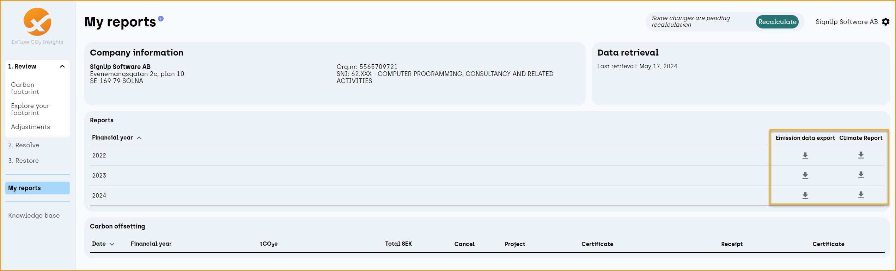 

Ein allgemeiner Tipp ist auch, den Abschnitt Knowledge base zu nutzen, um mehr über Methodik und Glossar zu lesen und zu lernen.

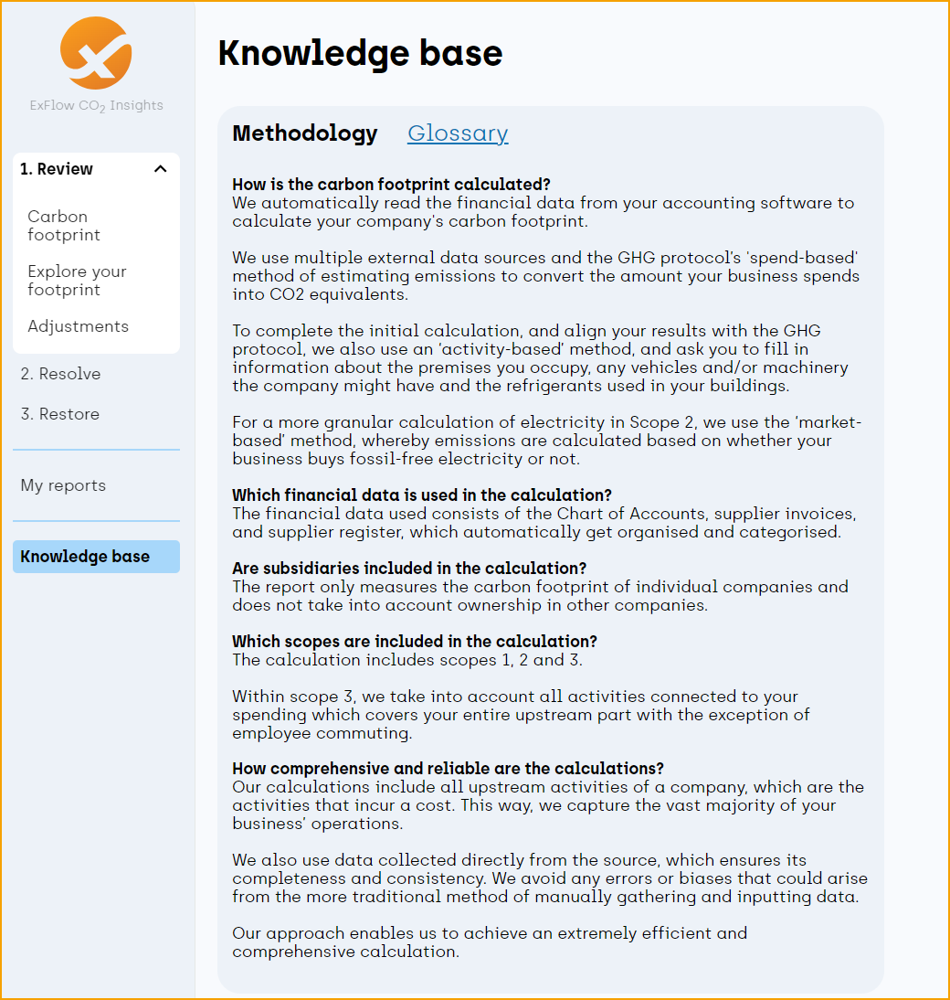 
