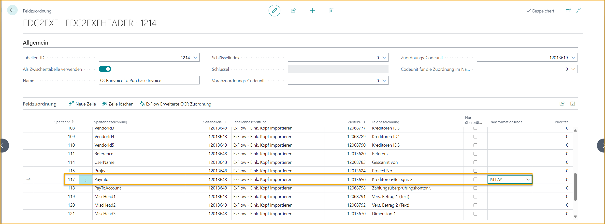
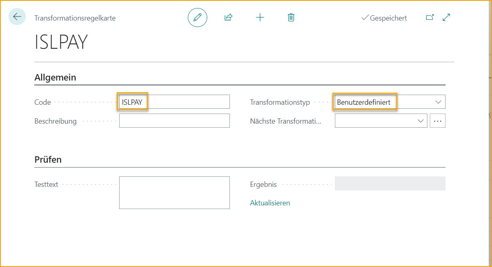

## Lokalisierung Island

### Sprache

ExFlow unterstützt die isländische Sprache in Business Central.

### Zahlungsreferenz

#### Hintergrund

Isländische Rechnungen enthalten eine Zahlungsreferenz, die im Feld "Zahlungsreferenz" im Kopf der Eingangsrechnung angezeigt werden sollte.

Das Format der interpretierten Zahlungsreferenz auf der Rechnung muss transformiert werden, um das korrekte Format in ExFlow zu erhalten.

Das korrekte Format beinhaltet in folgender Reihenfolge:

- Unternehmensregistrierungsnummer des Lieferanten

- Fälligkeitsdatum

- Anspruchsnummer

Beispiel:

Eingabe: **4601171350**\> 0**112266**+ 03\<**032266**\> **300820**+

Ausgabe: **4601171350 300820 032266123456**

Format: RRRRRRRRRR DDMMJJ NNNNNNNNNNNN

#### Lösung

##### Transformation

Die interpretierte Zahlungsreferenz auf der Rechnung muss im XML-Tag "PaymId" exportiert werden.

"PaymId" ist standardmäßig dem Feld "Lieferantenbelegnr. 2" im Importjournal zugeordnet.

Die interpretierte Zahlungsreferenz muss immer die volle und vollständige Länge haben.

Eine Transformationsregel wird in der Datenaustauschdefinition verwendet, um die Zahlungsreferenz in das korrekte Format zu transformieren. Die Logik der Transformationsregel ist so programmiert, dass sie das eingehende Format: **4601171350**\> **0112266+ 03\<032266\>** **300820**+ verarbeitet und das ausgehende Format: **4601171350 300820 032266123456** erstellt.

Diese Logik wird durch Erstellen eines benutzerdefinierten Transformationscodes namens "ISLPAY" ausgelöst und dem Feld "PaymId" hinzugefügt.

##### Befüllen des Kopfs der Eingangsrechnung

Die transformierte Zahlungsreferenz wird in "Lieferantenbelegnr. 2" im Importjournal importiert.

Wenn die Rechnung erstellt wird, wird das Feld "Zahlungsreferenz" im Kopf der Eingangsrechnung mit der transformierten Zahlungsreferenz aus "Lieferantenbelegnr. 2" im Format **01171350 300820 032266123456** befüllt.

