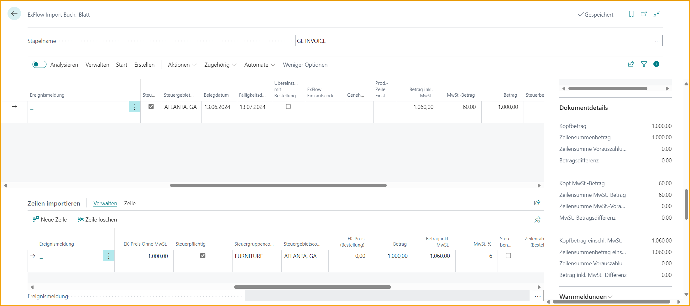
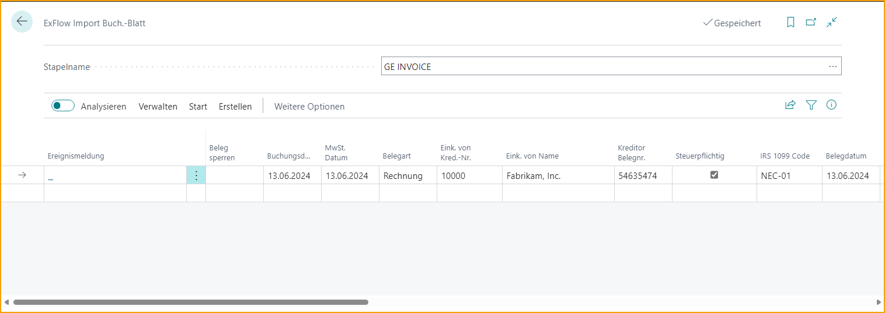
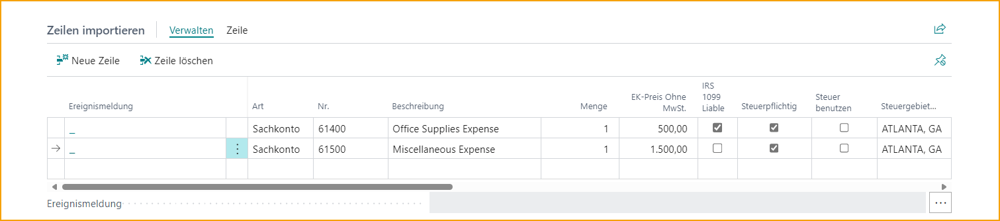
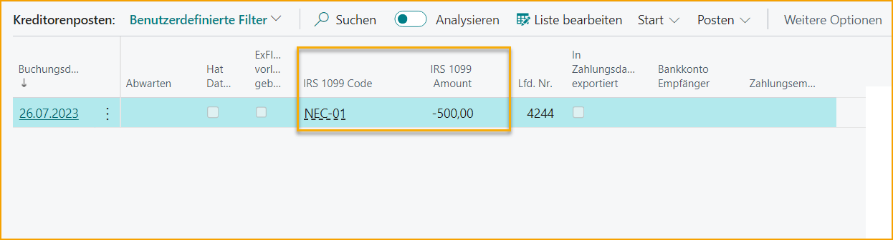

## Lokalisierung USA

### US-Verkaufssteuer

Gehe zu: ***Setup \--\> ExFlow Setup \--\> Registerkarte "Dokumenterstellungskontrollen"***

Aktiviere "Umsatzsteuer zulassen" in ExFlow Setup.

Mit dieser Einstellung wird die VAT-Produktposten-Gruppe im ExFlow Import Journal nicht mehr obligatorisch. Diese Einstellung wird normalerweise mit der Steuerbuchungseinrichtung für die Umsatzsteuer kombiniert.

Um die US-Verkaufssteuer zu unterstützen, wurden auch die steuerspezifischen Felder für den Kopf und die Positionen des Einkaufsdokuments im ExFlow Import Journal implementiert. Die Funktionalitäten für diese Felder sind ähnlich wie im Einkaufsdokument.

**Die zusätzlichen Felder im Dokumentkopf sind:**

- Steuerpflichtig
- Steuerbereichscode
- Steuerbefreiungsnummer

**Und in den Dokumentpositionen:**

- Steuerpflichtig
- Steuerbereichscode
- Steuergruppencode

Mit Hilfe der US-Steuerkonfiguration unterstützt das Importjournal auch Steuerberechnungen auf Basis der US-Steuer. Die Funktionalität zum Abrufen des Steuerbereichscodes usw. aus den Unternehmensinformationen und dem Standort anstelle der Lieferantenkarte wird ebenfalls im Importjournal abgebildet.

### Lieferanten 1099-steuerpflichtige Transaktionen 
Bevor Sie 1099-steuerpflichtige Transaktionen verarbeiten können, müssen Sie **1099-Formularfelder** und **Lieferanten** als 1099-steuerpflichtig in Business Central einrichten. Bitte beachten Sie die Microsoft-Dokumentation zur Einrichtung von 1099 und zur Verarbeitung von Transaktionen in Business Central.  

#### Um ein Dokument als 1099-steuerpflichtig in ExFlow zu verarbeiten 
* Importieren Sie eine Rechnung für einen Lieferanten, der mit dem entsprechenden IRS-1099-Code usw. eingerichtet wurde (siehe Microsoft-Anweisungen zur Einrichtung von 1099-Lieferanten).
* Optional können Sie auf der Kopfzeile des Importjournals im Feld IRS-1099-Code den Standardwert überschreiben oder löschen, um eine Transaktion ohne IRS-1099-Code zu haben.

* Wenn ein Teil des Rechnungsbetrags 1099-steuerpflichtig ist und ein Teil nicht, aktivieren/deaktivieren Sie das Kontrollkästchen "IRS-1099-steuerpflichtig", um die Zeilen zu kennzeichnen, die 1099-steuerpflichtig sind.

* Setzen Sie die Verarbeitung fort und buchen Sie das Dokument.
* Sobald das Dokument gebucht ist, können Sie zur Liste der Lieferantenbuchungssätze gehen und feststellen, dass die Felder IRS-1099-Code und IRS-1099-Betrag automatisch ausgefüllt sind.

### Behandlung des Steuergruppencodes im ExFlow-Einkaufscode

Wenn der Steuergruppencode in einer Rechnungsposition von dem Wert abweichen soll, der auf dem Stammrecord ausgewählt wurde, kann dies über einen ExFlow-Einkaufscode gehandhabt werden.

Beispiel: Wenn der Steuergruppencode auf einer G/L-Kontokarte für Büromaterial auf NICHT-STEUERBAR voreingestellt ist, während eine Position auf einer Einkaufsrechnung mit diesem G/L-Konto als STEUERBAR markiert werden muss, können Benutzer dies einfach in den ExFlow-Einkaufscode-Zeilen gemäß dem folgenden Bild hinzufügen.

Dies ermöglicht es Benutzern, die Rechnungserstellung in diesen spezifischen Szenarien zu automatisieren.

### Steuerspalten im Web

Es ist möglich, steuerbezogene Felder in ExFlow Web sichtbar zu machen, indem Sie die Spalten in ExFlow Setup hinzufügen.

Lesen Sie mehr darüber, wie Sie Web-Spalten bearbeiten können, im Abschnitt [***ExFlow Web.***](https://docs.exflow.cloud/business-central/docs/user-manual/technical/exflow-web#exflow-web)

