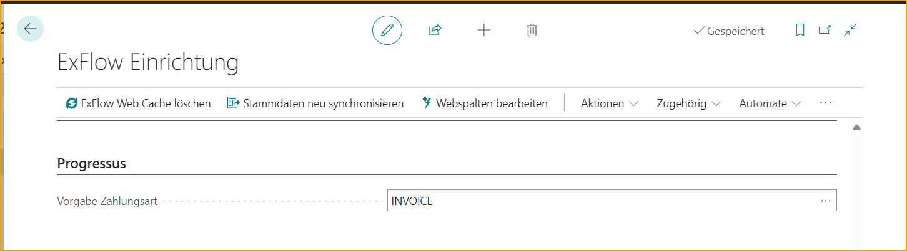
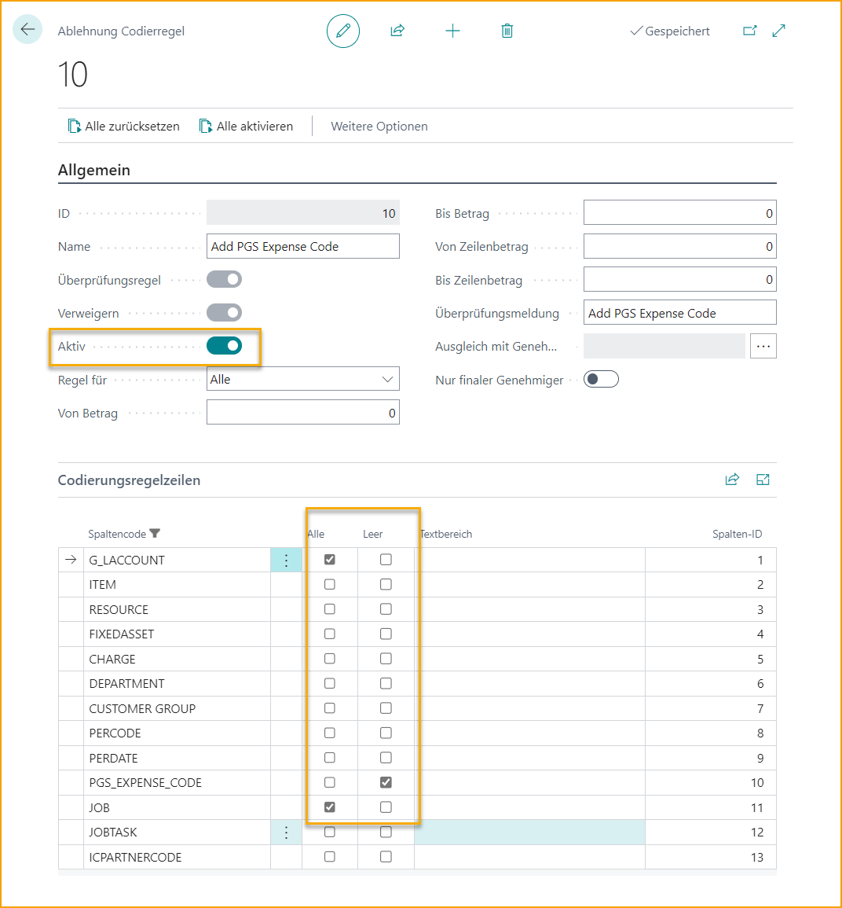

## Progressus

Progressus ist ein Add-On zur Erweiterung der Funktionalität von Jobs.

### ExFlow Setup

Im ExFlow Setup müssen Sie wie bei PGS Expense Code, Job (Projekt) und Job Task (Projektaufgabe) und unter Bearbeiten von Web-Spalten in dieser Reihenfolge vorgehen.

Wenn Sie PGS Expense Code hinzufügen, fügt ExFlow automatisch Ablehnungsregeln für die Verwendung von PGS Expense Code bei den Linientypen: Artikel, Ressource, Sachanlagen und Gebühr (Artikel) hinzu.

Fügen Sie auch PGS Expense Payment Type für Einkaufsdokumente unter dem Schnellregister Progressus hinzu.

Fügen Sie, falls möglich, eine Standard-Job Task unter dem Schnellregister Allgemein hinzu. (Lesen Sie mehr unter **Standard-Job Task Nr.**)

### ExFlow Ablehnungsregeln mit Progressus

Beim Hinzufügen eines Jobs (Projekts) auf ExFlow Web muss der Genehmiger auch Job Task (Projektaufgabe) und PGS Expense Code hinzufügen, falls diese fehlen. Nun kann die folgende Ablehnungsregel hilfreich sein.

Eine Erinnerung, Job/Projektaufgabe hinzuzufügen, wenn Sie Job/Projekt auf ExFlow Web verwenden.

Eine Erinnerung, PGS Expense Code hinzuzufügen, wenn Sie G/L Account und Job/Projekt auf ExFlow Web verwenden.

Eine Erinnerung, Job/Projekt hinzuzufügen, wenn Sie G/L Account und PGS Expense Code auf ExFlow Web verwenden.

#### Arbeit mit Expense Resource in den Dokumentzeilen in Import Journal
Es ist auch möglich, die Expense Resource, Expense Date und Chargeable-Felder in Import Journal zu nutzen. Diese Felder müssen manuell über Personalisierung hinzugefügt werden.

Chargeable wird von der Job Task Nr. aktualisiert.  
Bitte beachten Sie jedoch, dass wenn der Linientyp ist: 
•	***Artikel***: dann wird PGS Chargeable von Item Chargeable aktualisiert.  
•	***G/L Account***: dann wird PGS Chargeable von Expense Chargeable aktualisiert.  

Dies kann manuell in den Zeilen angepasst werden.  

Darüber hinaus finden Sie diese Felder in den Zeilen auf den meisten ExFlow-Seiten: Import Journal, Genehmigungsstatus, Genehmigungsstatusverlauf und gelöschte Dokumente.

Außerdem erfolgt keine Aktualisierung der Preise über Progressus. Die Preise bleiben wie interpretiert.

#### ExFlow Purchase Code für Progressus

PSG Expense Code und PSG Payment Type sind auch im ExFlow Purchase Code verfügbar.

### Progressus Expense Code auf ExFlow Web

Aufgrund der Ablehnungsregeln muss der Genehmiger Job/Projekt, Job Task/Projektaufgabe und PGS Expense Code auf ExFlow Web hinzufügen, falls diese fehlen. Der G/L Account wird automatisch aus der Projekt Expense Posting Setup in Business Central hinzugefügt oder aktualisiert.
