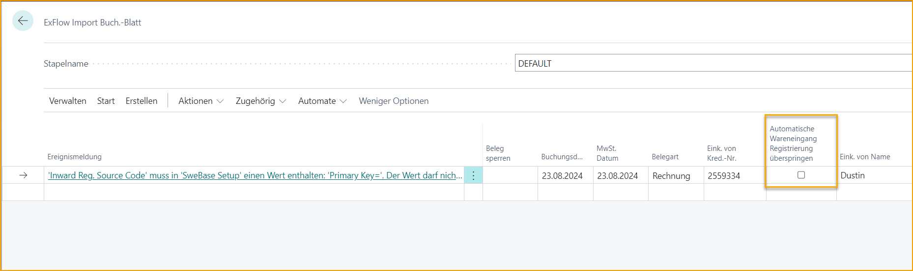

## SweBase

ExFlow unterstützt auch einige Funktionen, die in der Erweiterung SweBase zu finden sind.

Bei Fragen zu SweBase wenden Sie sich bitte an Ihren Business Central Partner.

### Zahlungsreferenz - OCR-Nummer

Das Feld OCR-Nummer kann interpretiert und importiert oder manuell im Feld "Lieferantenbeleg Nr. 2" im Importjournal hinzugefügt werden.

Beim Erstellen eines Dokuments wird dies im Feld OCR-Nummer im Dokumentenkopf hinzugefügt. Nach der Buchung kann die OCR-Nummer in den Lieferantenbuchungssätzen gefunden werden.

Die Funktionalität zur Behandlung der OCR-Nummer in der Zahlungslösung befindet sich in der Erweiterung SweBase.

### Eingangsregistrierung

Die Eingangsregistrierung kann in der ExFlow-Konfiguration aktiviert werden und wird dann automatisch auf Zeilenebene gebucht, wenn das Dokument aus dem Importjournal erstellt wird.

Beim Buchen des Dokuments werden die Eingangsregistrierungen am selben Datum wie das Buchungsdatum rückgängig gemacht.

Und wenn ein eingangsregistriertes Dokument gelöscht wird, wird es am Buchungsdatum rückgängig gemacht.

Die Eingangsregistrierungseinrichtung in der SweBase-Einrichtung ist erforderlich und "Buchungsdatum nach Eingangsregistrierung beibehalten" muss auf "true" gesetzt sein.

Um eine Eingangsregistrierung mit Rundung buchen zu können, fügen Sie bitte die Eingangs-MwSt.-Buchungseinrichtung hinzu.

#### Warnmeldungen für die Eingangsregistrierung

Wenn eine automatische Eingangsregistrierung aufgrund eines Fehlers nicht möglich ist, besteht die Möglichkeit, eine Spalte namens "Automatische Registrierung von Eingängen überspringen" im Kopf des Importjournals zu personalisieren. Aktivieren Sie diese Funktion und das Dokument kann ohne Eingangsregistrierung erstellt werden. Die Eingangsregistrierung kann dann manuell von der Karte aus gebucht werden.

### Notiz zu Waren

Das Feld "Notiz zu Waren" kann interpretiert und importiert oder manuell im Importjournal hinzugefügt werden.

Dies kann für Freitext verwendet werden, wird jedoch nicht auf ExFlow Web angezeigt.

### Erweitertes Buchungsdatum für Buchung mit Abgrenzung

In der SweBase-Einrichtung gibt es eine Einstellung, um das "Zulässige Buchungsdatum" bei der Buchung mit Abgrenzung zu erweitern.

Dies ermöglicht dem Administrator, das Dokument im Importjournal zu überprüfen und zu erstellen. Außerdem kann es im Genehmigungsstatus überprüft und gebucht werden.

### Aktualisierung der MwSt.-Produktbuchungsgruppe

In SweBase gibt es eine Funktion, um die Steuerschuld für bestimmte Waren und Dienstleistungen umzukehren.

Die gleiche Funktion kann im ExFlow Importjournal verwendet werden, um die MwSt.-Produktbuchungsgruppe aufgrund der SweBase-Einrichtung zu aktualisieren.

