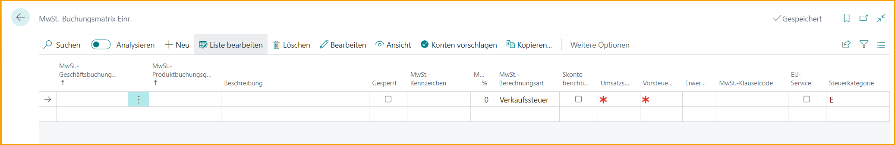
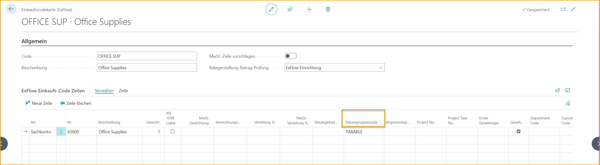

## Lokalisierung Kanada

### Sprache

ExFlow unterstützt die französische (Kanada) Sprache in Business Central.

### Kanadische Umsatzsteuer

Gehen Sie zu: ***Setup \--\> ExFlow Setup \--\> Registerkarte Dokumenterstellung überprüfen***

Aktivieren Sie "Umsatzsteuer zulassen" in den ExFlow-Einstellungen.

Mit dieser Einstellung wird die Mehrwertsteuer-Produktposten-Gruppe in ExFlow nicht mehr obligatorisch sein und ermöglicht die Verarbeitung der nordamerikanischen Umsatzsteuer.

Um die nordamerikanische Umsatzsteuer zu unterstützen, wurden auch die steuerspezifischen Felder im Kopf- und Zeilenbereich des Einkaufsdokuments in ExFlow Import Journal implementiert. Die Funktionalitäten für diese Felder sind ähnlich wie in den Einkaufsdokumenten in Business Central.

**Die zusätzlichen Felder im Dokumentkopf:**

- Steuerpflichtig

- Steuerbereichscode

- Provinzieller Steuerbereichscode

- Steuerbefreiungsnummer

**Und in den Dokumentzeilen:**

- Steuerpflichtig

- Steuerbereichscode

- Provinzieller Steuerbereichscode

- GST/HST

- Steuergruppencode

- Verwendungsteuer

Mit Hilfe der kanadischen Steuereinrichtung unterstützt das ExFlow Import Journal auch Steuerberechnungen auf Basis der kanadischen Steuer. Die Funktionalität zum Abrufen des Steuerbereichscodes usw. aus den Unternehmensinformationen und dem Standort anstelle der Lieferantenkarte spiegelt sich ebenfalls im ExFlow Import Journal wider.

Die Statistikseite ist jetzt im ExFlow Import Journal verfügbar.

Sie ermöglicht die manuelle Anpassung des Steuerbetrags, wenn es eine Abweichung zwischen dem auf den Rechnungszeilen berechneten Steuerbetrag und dem auf der Rechnung des Lieferanten erhaltenen Steuerbetrag gibt (in diesem Fall durch den OCR-Dienst interpretiert).

### Behandlung des Steuergruppencodes im ExFlow-Einkaufscode

Wenn der Steuergruppencode in einer Rechnungszeile von dem Standardwert abweichen soll, der auf dem ausgewählten Stammrecord für diese Rechnungszeile voreingestellt ist, kann dies über einen ExFlow-Einkaufscode behandelt werden.

Beispiel: Wenn der Steuergruppencode auf einer G/L-Kontokarte für Büromaterial standardmäßig auf NICHT STEUERBAR eingestellt ist, während eine Zeile auf einer Eingangsrechnung mit diesem G/L-Konto als STEUERBAR markiert werden muss, können Benutzer dies einfach in den ExFlow-Einkaufscodezeilen gemäß dem folgenden Bild hinzufügen.

Dies ermöglicht es Benutzern, die Rechnungserstellung in diesen spezifischen Szenarien zu automatisieren.

### Steuerspalten im Web

Es ist möglich, steuerbezogene Felder in ExFlow Web sichtbar zu machen, indem Sie die Spalten in ExFlow Setup hinzufügen.

Lesen Sie mehr darüber, wie Sie Web-Spalten bearbeiten können, im Abschnitt [***ExFlow Web.***](https://docs.exflow.cloud/business-central/docs/user-manual/technical/exflow-web#exflow-web)
