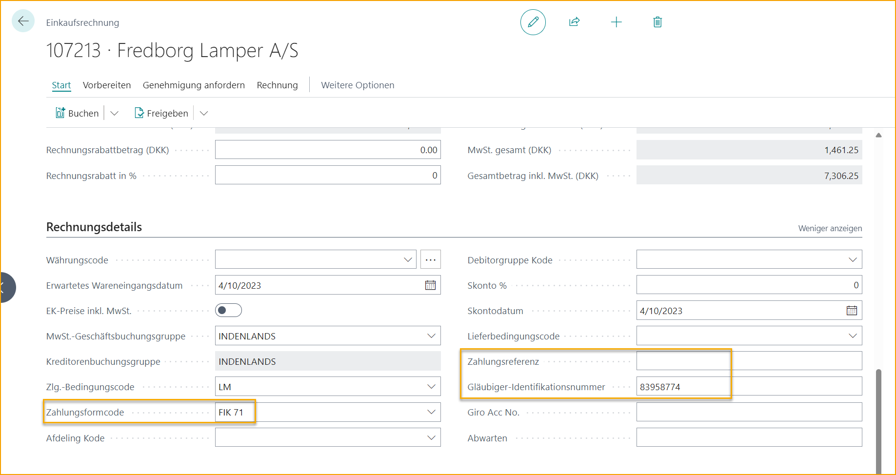
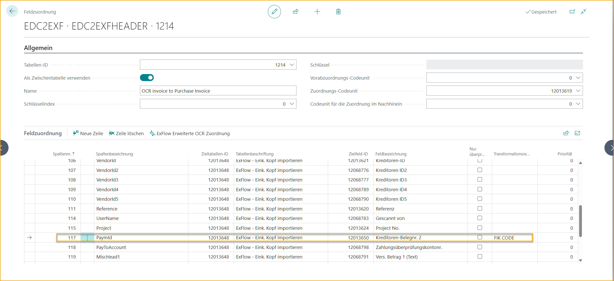
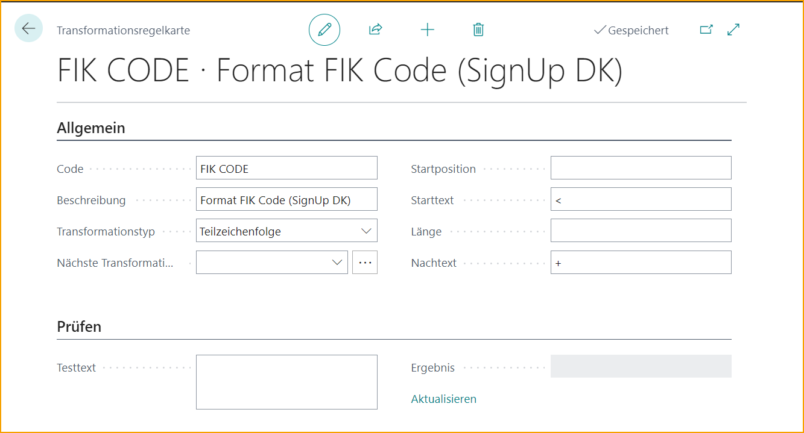

## Lokalisierung Dänemark

### Sprache

ExFlow unterstützt die dänische Sprache in Business Central.

### Zahlungsreferenz - FIK-Code

#### Hintergrund

Dänische Rechnungen enthalten eine Zahlungsreferenz namens FIK-Code, die auf der Rechnung erfasst und im Feld "Zahlungsreferenz" im Kopf der Eingangsrechnung ausgefüllt werden sollte, wenn die Rechnung aus dem Importjournal erstellt wird.

Das Format der interpretierten Zahlungsreferenz auf der Rechnung muss beim Import nach ExFlow transformiert werden, um das korrekte Format zu erhalten.

Beispiel:

Eingabe: +71\<**125396534461985**+83958774\<

Ausgabe: **125396534461985**

#### Lösung

##### Transformation

Die Transformation wird mithilfe der Funktion "Data Exchange Definition" implementiert. Die Konfiguration wird durch eine Transformationsregel ergänzt, die unnötige Zeichen entfernt.

##### Ausfüllen des Kopfs der Eingangsrechnung

Die transformierte Zahlungsreferenz wird in "Vendor Document No. 2" im Importjournal importiert.

Wenn die Rechnung erstellt wird, wird das Feld "Zahlungsreferenz" im Kopf der Eingangsrechnung mit der transformierten Zahlungsreferenz aus "Vendor Document No. 2" ausgefüllt.

