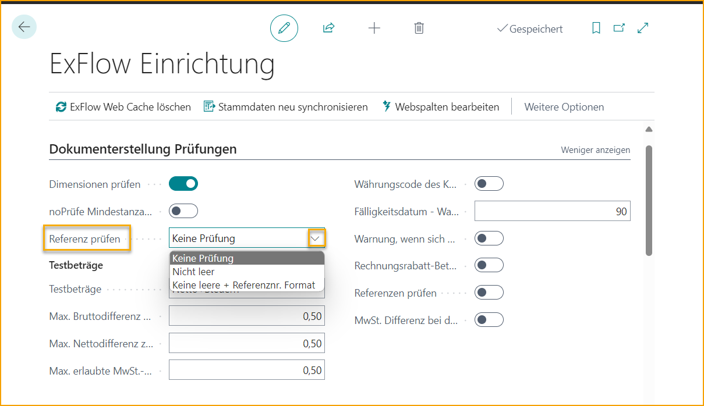
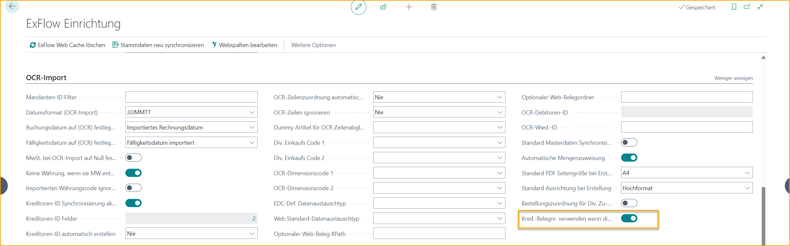
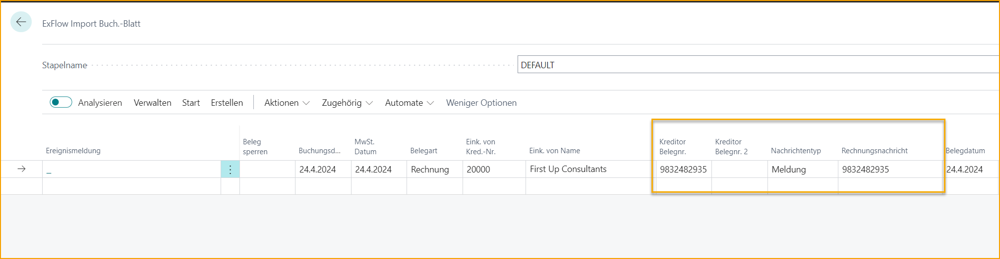
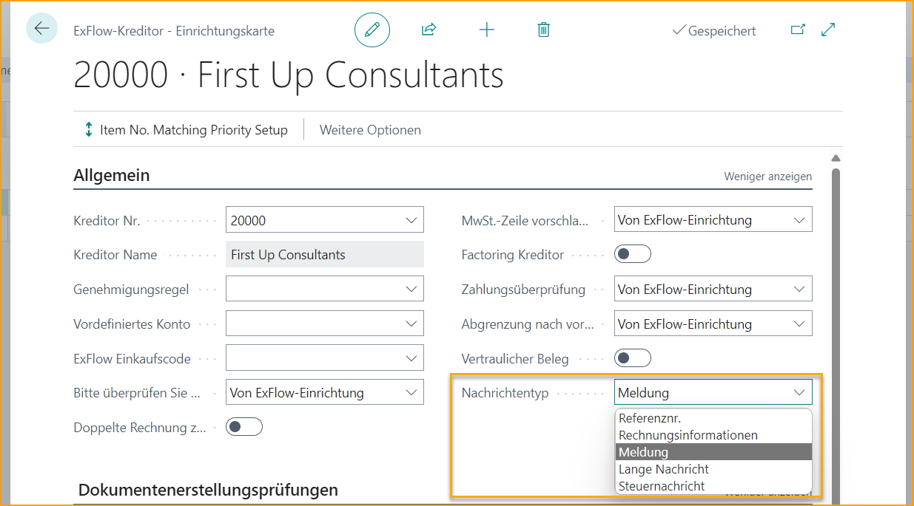

## Lokalisierung Finnland

### Sprache

ExFlow unterstützt die finnische Sprache in Business Central.

### Zahlungsreferenz

#### Hintergrund

Finnland hat die Anforderung einer Zahlungsreferenz auf ihren Einkaufsrechnungen.

Diese Zahlungsreferenz besteht tatsächlich aus zwei verschiedenen Feldern: Nachrichtentyp und Rechnungsnachricht.

Die Standard-Funktionalität für Finnland von Microsoft enthält 3 Felder im Einkaufskopf.

- Nachrichtentyp *(Pflichtfeld)*

- Rechnungsnachricht *(Pflichtfeld)*

- Rechnungsnachricht 2

Der Nachrichtentyp gibt an, welche Art von Rechnungsnachricht erwartet wird.

Der Nachrichtentyp kann einer der folgenden sein:

- Referenznummer

- Rechnungsinformationen

- Nachricht

- Lange Nachricht

- Steuernachricht

Nachrichtentyp und Rechnungsnachricht sind Pflichtfelder und müssen in der importierten Rechnung im ExFlow Import Journal vorhanden sein.

##### Lösung

Wenn die Einkaufsrechnung aus dem ExFlow Import Journal erstellt wird, werden Nachrichtentyp und Rechnungsnachricht in die entsprechenden Felder im Einkaufsrechnungskopf übertragen.

Diese Funktionalität wird in der ExFlow-Konfiguration mit zwei Einstellungen namens "Check FI Reference" und "Nachrichtentyp" konfiguriert und aktiviert. Die Einstellungen befinden sich im Abschnitt "Dokumenterstellung überprüfen".

**Referenz überprüfen**

**Keine Überprüfung:** Überprüfung ist deaktiviert.

**Nicht leer:** Rechnungsnachricht darf nicht leer sein.

**Nicht leer + Referenznummer-Format:** Rechnungsnachricht darf nicht leer sein und das Format der Nachricht wird überprüft. *(Erfordert, dass "Nachrichtentyp" = Referenznummer ist)*

### Automatische Kontengruppe

ExFlow unterstützt die automatische Kontengruppe im Import Journal und kann aus dem G/L-Konto, dem ExFlow-Einkaufscode oder manuell in der Import Journal-Zeile hinzugefügt werden.

### Verwenden der Lieferantenbelegnummer, wenn die Rechnungsnachricht leer ist

Gehe zu: **ExFlow-Konfiguration --> OCR-Import** und aktiviere die Einstellung ***Verwenden der Lieferantenbelegnummer, wenn die Rechnungsnachricht leer ist.***

Diese Einstellung legt fest, ob die interpretierte Lieferantenbelegnummer auch dann in der Rechnungsnachricht verwendet werden soll, wenn die Rechnungsnachricht leer ist. Der Nachrichtentyp wird dann auf ''Nachricht'' gesetzt. Dies erleichtert den Prozess bei der Arbeit mit nicht inländischen Dokumenten ohne Referenznummer.

### Anderen Nachrichtentyp in der Lieferantenkonfiguration auswählen
Der Standard-"Nachrichtentyp" im Import Journal ist standardmäßig auf "Referenznummer" eingestellt.
Es ist jedoch möglich, zur Lieferantenkonfigurationskarte zu gehen und einen anderen Nachrichtentyp für einen bestimmten Lieferanten festzulegen, falls erforderlich.

