## AppsForDynamics365 Portal Connector

Der AppsForDynamics365 Portal Connector erleichtert die Integration der ExFlow Travel & Expense-Anwendung in Ihr Business Central-System. Als Vermittler sorgt er dafür, dass Daten direkt an Business Central in leicht verarbeitbaren und verständlichen Formaten zur Speicherung oder Anwendung übertragen werden.

Das Portal bietet einfachen Zugang für Benutzer, die keine Business Central-Superuser sind und möglicherweise unterwegs Aufgaben in ExFlow Travel & Expense ausführen.

Diese Dokumentation enthält alle notwendigen Informationen zur Einrichtung von AppsForDynamics365 und zur Verbindung mit Business Central.

### Einrichtung der AppsForDynamics365-Integration
Dieser Abschnitt dokumentiert den Einrichtungsprozess für die AppsForDynamics365-Integration. Das Integrationsmodul wird von ExFlow Travel & Expense verwendet, um Business Central mit dem AppsForDynamics365-Portal zu verbinden.

Um die Einrichtung abzuschließen, verwenden Sie den AppsForDynamics365-Einrichtungsassistenten, der die Benutzer durch die notwendigen Schritte zur Herstellung der Verbindung zu Business Central führt. Greifen Sie auf den Assistenten zu, indem Sie entweder auf die Benachrichtigung auf der Startseite von Business Central klicken oder die AppsForDynamics365-Portal-Konfigurationsseite über die Suchfunktion aufrufen. Klicken Sie dort auf die Schaltfläche "Verbindung konfigurieren", um den Assistenten zu öffnen.

Es ist wichtig, dass dieser Assistent von jemandem mit den notwendigen Berechtigungen zur Erteilung der Zustimmung ausgeführt wird.

#### AppsForDynamics365-Verbindung konfigurieren
Gehen Sie zu: **AppsForDynamics365-Konfiguration**

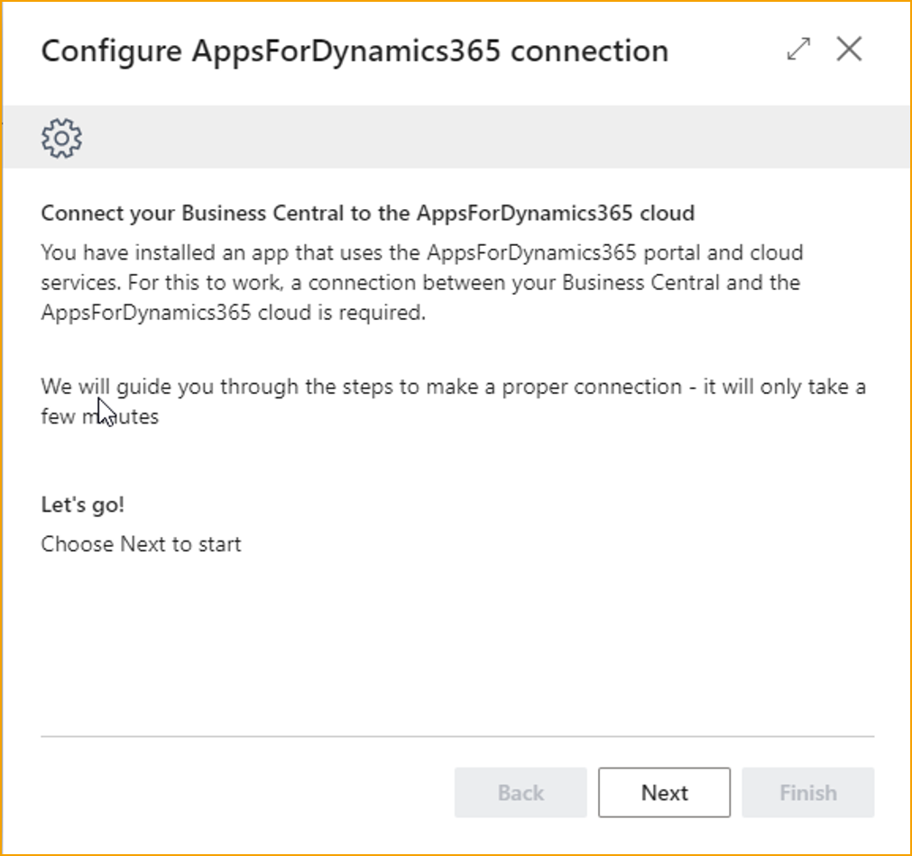

#### Lizenz überprüfen

Der erste Schritt im Prozess erfordert die Eingabe der Kunden-ID und des Lizenzschlüssels. Diese werden beim Kauf eines AppsForDynamics365-Produkts bereitgestellt. Alternativ finden Sie diese auf der Seite **Mein Konto** auf [***AppsForDynamics365***](http://www.appsfordynamics365.com).

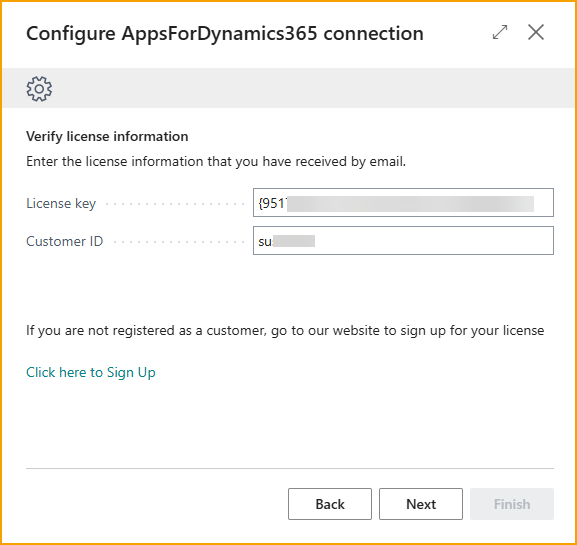

#### Zustimmung erteilen

Um AppsForDynamics365 mit Business Central zu integrieren, muss eine Zustimmung erteilt werden. Diese Zustimmung ermöglicht es AppsForDynamics365, auf den Webdienst zuzugreifen.

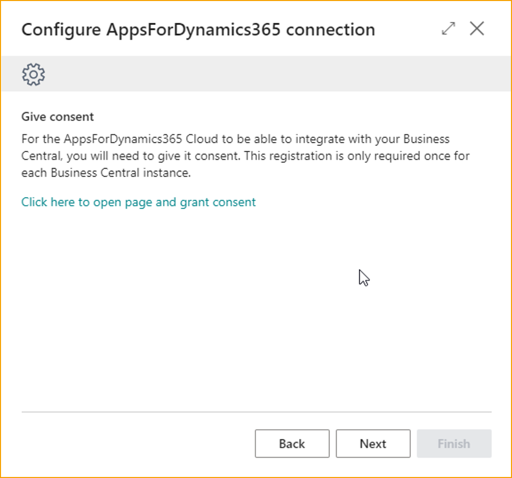

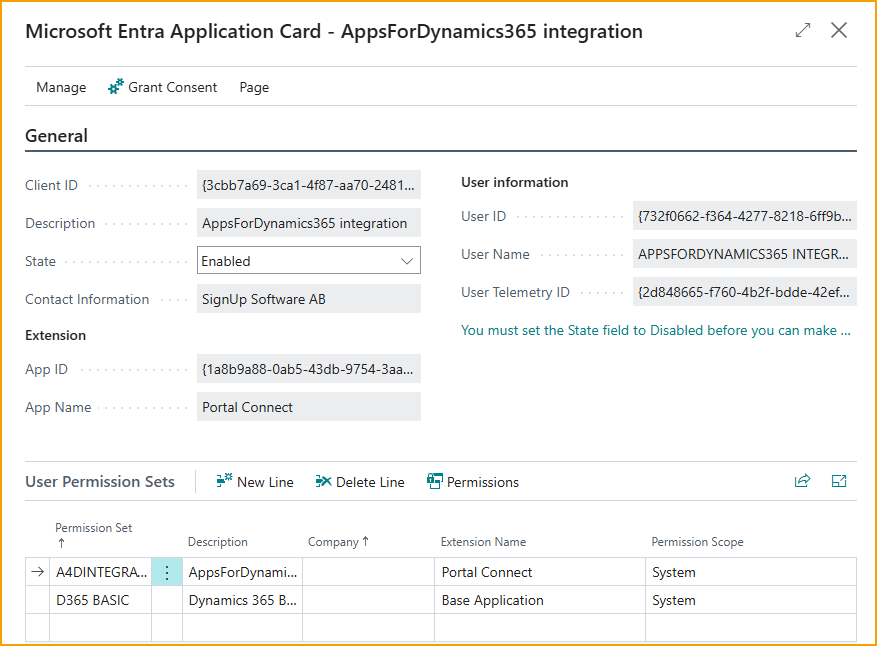

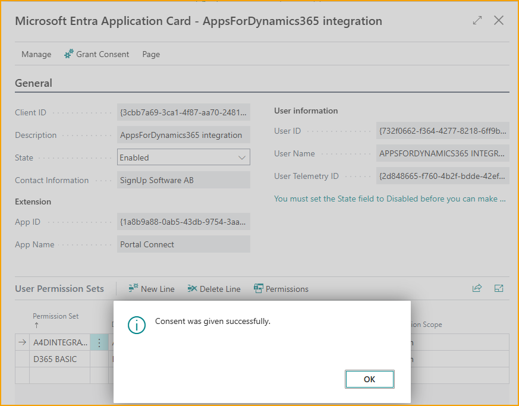

Nachdem die Zustimmung erteilt wurde, fahren Sie fort, um die Lokalisierungseinstellungen anzugeben.

#### Lokalisierungseinstellungen angeben

Wählen Sie die verwendete Zeitzone und die bevorzugte Sprache für das Portal aus. Beachten Sie, dass das Portal nicht alle Sprachen unterstützt.

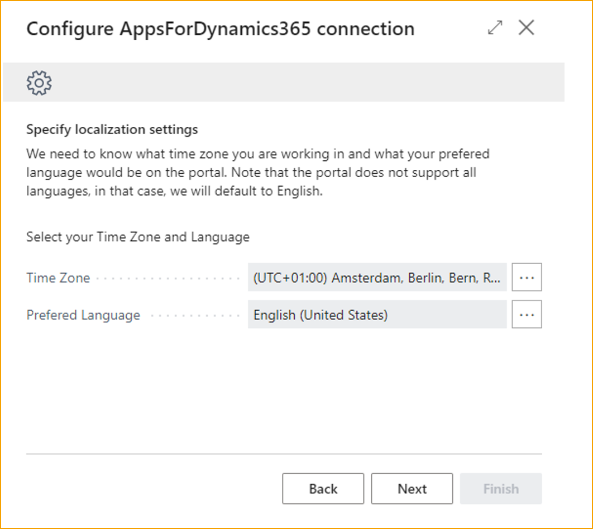

Nachdem Sie die Zeitzone und die Sprache ausgewählt haben, klicken Sie auf "Weiter" und fahren Sie fort, um die Authentifizierungsmethode auszuwählen.

#### Authentifizierungsmethode auswählen

Es stehen drei verschiedene Authentifizierungsmethoden zur Verfügung, die der Benutzer verwenden kann, um sich bei AppsForDynamics365 anzumelden: Microsoft-Login, Benutzername und Passwort, die in AppsForDynamics365 erstellt wurden, oder der gemischte Modus, eine Kombination dieser beiden.

Benutzer müssen in AppsForDynamics365 in einer bestimmten Reihenfolge erstellt werden, unabhängig von der Authentifizierungsmethode.

**Microsoft-Login** wird für die meisten Unternehmen empfohlen, die Business Central verwenden, da es die Verwendung bestehender Microsoft-Logins wie in anderen Anwendungen ermöglicht.

**AppsForDynamics365-Benutzername und Passwort** ist nützlich, wenn die meisten Mitarbeiter keinen Zugriff auf Microsoft-Logins haben. Jeder Benutzer muss ein Passwort und einen Benutzernamen haben.

**Gemischter Modus** ermöglicht die Verwendung beider Optionen, was in einigen Fällen nützlich sein kann, in denen einzelne Mitarbeiter keine Microsoft-Logins haben.

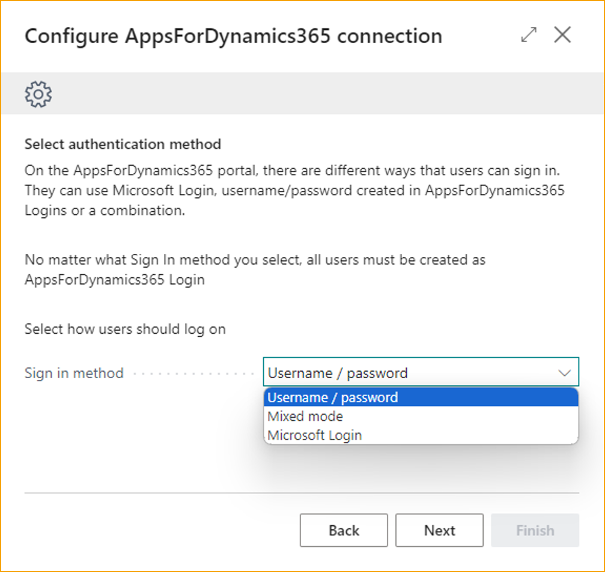

Nachdem Sie eine Authentifizierungsmethode ausgewählt haben, klicken Sie auf "Weiter" und fahren Sie fort, um die Business Central-Instanz zu registrieren.

#### Business Central-Instanz registrieren

Der Assistent registriert die Business Central-Instanz automatisch mit dem AppsForDynamics365-Konto, sobald auf "Weiter" geklickt wird. Bestätigen Sie einfach, dass die angezeigten Informationen korrekt sind.

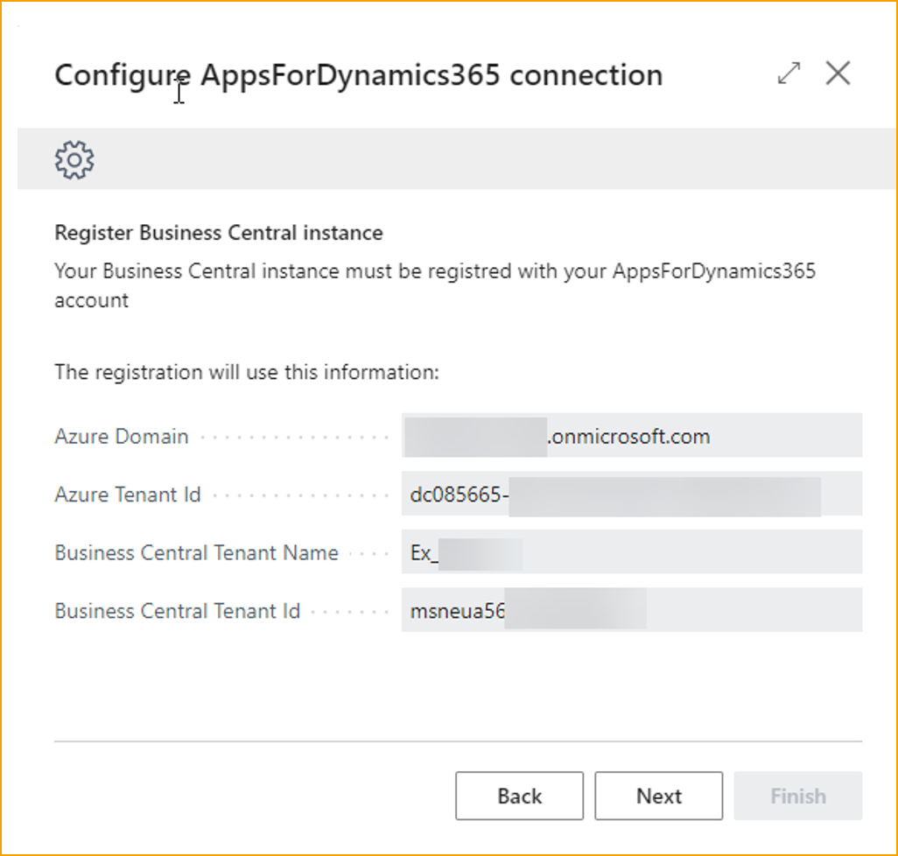

Nachdem Sie diese Informationen bestätigt haben, klicken Sie auf "Weiter" und fahren Sie fort, um das Unternehmen zu aktivieren.

#### Unternehmen aktivieren

Dieser Schritt erfordert die Einrichtung einer Webdienstverbindung. Die angezeigten Informationen werden standardmäßig verwendet. Während die Webdienstadresse nicht geändert werden kann, können Sie die Beschreibung nach Bedarf anpassen.

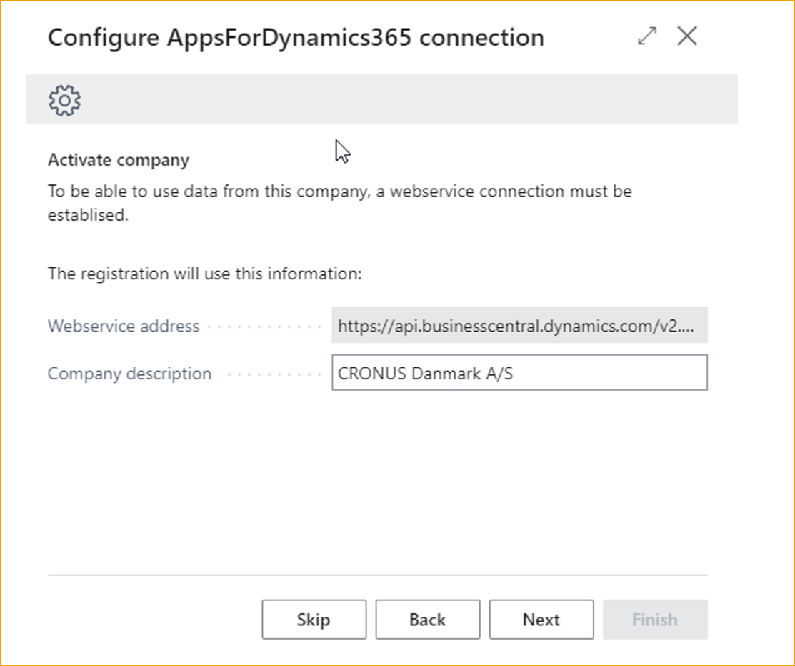

**Verbindung testen** Testen Sie die Verbindung, indem Sie auf die Schaltfläche "Verbindung testen" klicken.

Sobald dies in Ordnung ist, klicken Sie auf "Weiter" und fahren Sie fort, um Logins für Business Central-Benutzer hinzuzufügen.

#### Logins für Business Central-Benutzer hinzufügen

In diesem Schritt ist es möglich, Benutzer aus Business Central hinzuzufügen oder sie von Grund auf neu zu erstellen. Dies kann jederzeit unter "AppsForDynamics365-Login" erfolgen.

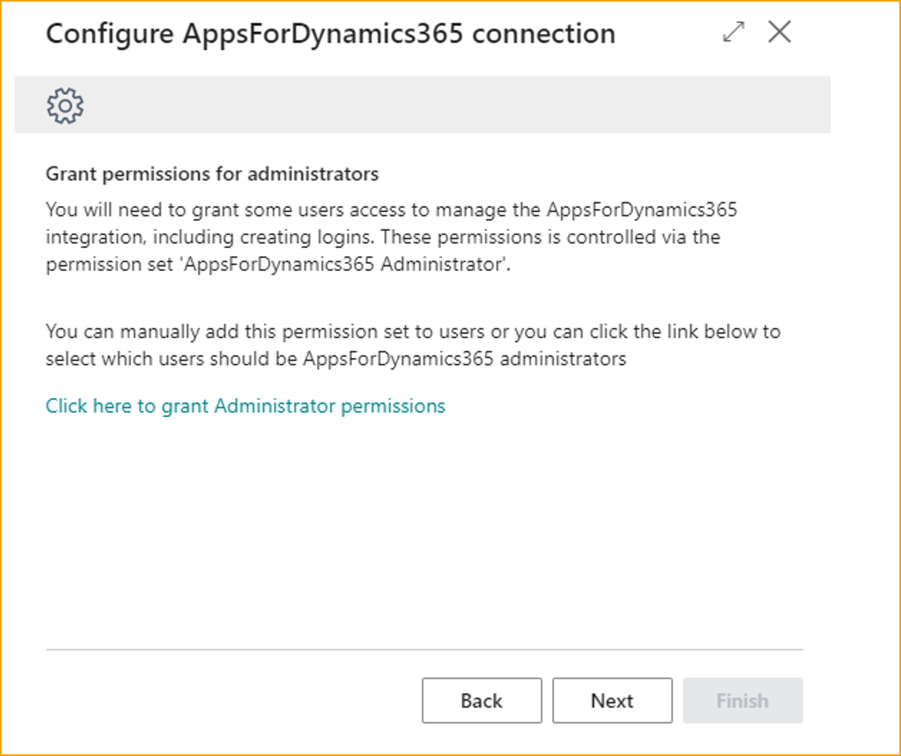

Der Konfigurationsassistent für die AppsForDynamics365-Verbindung wurde erfolgreich abgeschlossen.

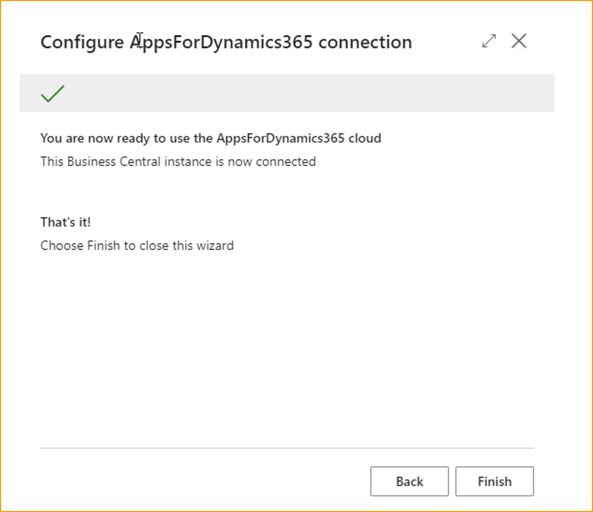
