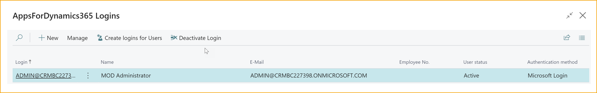
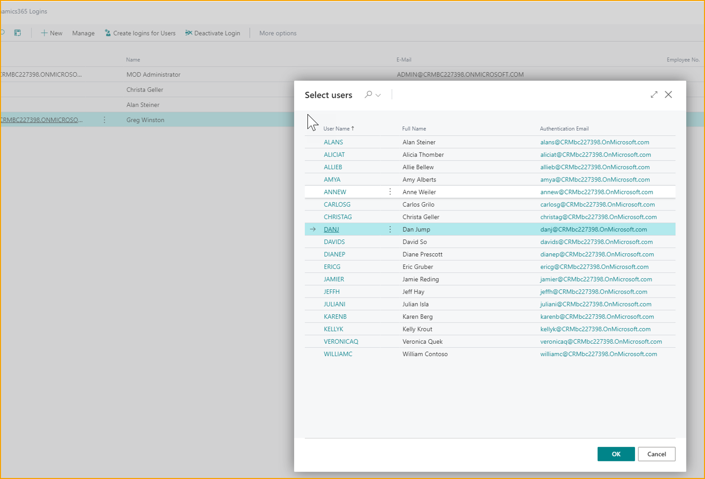
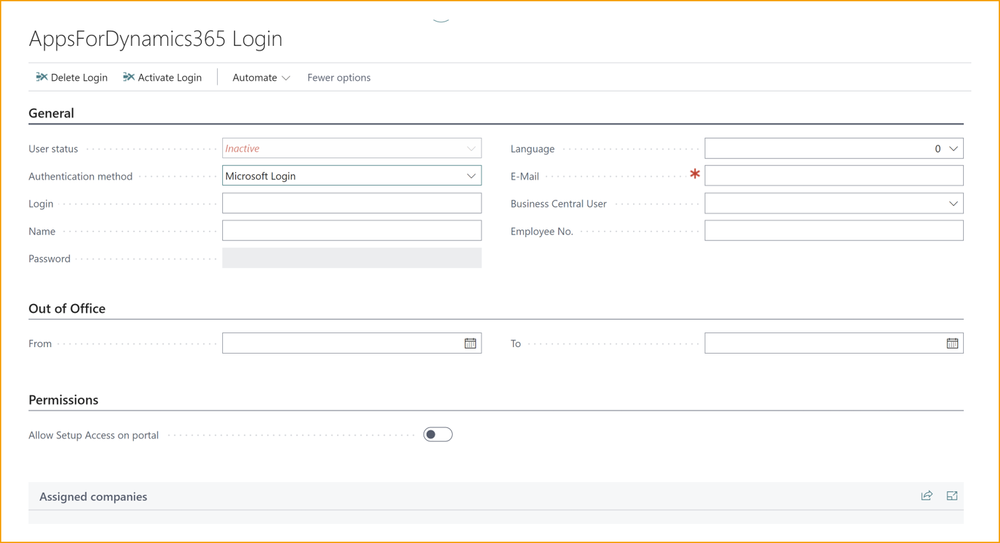
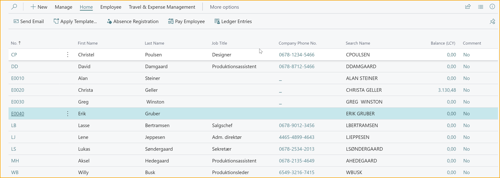
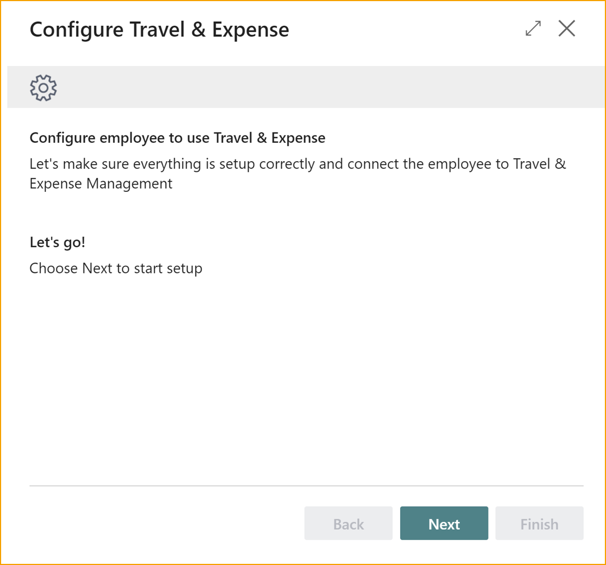
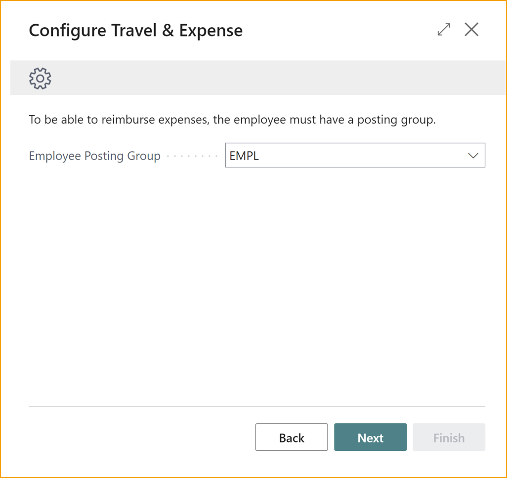
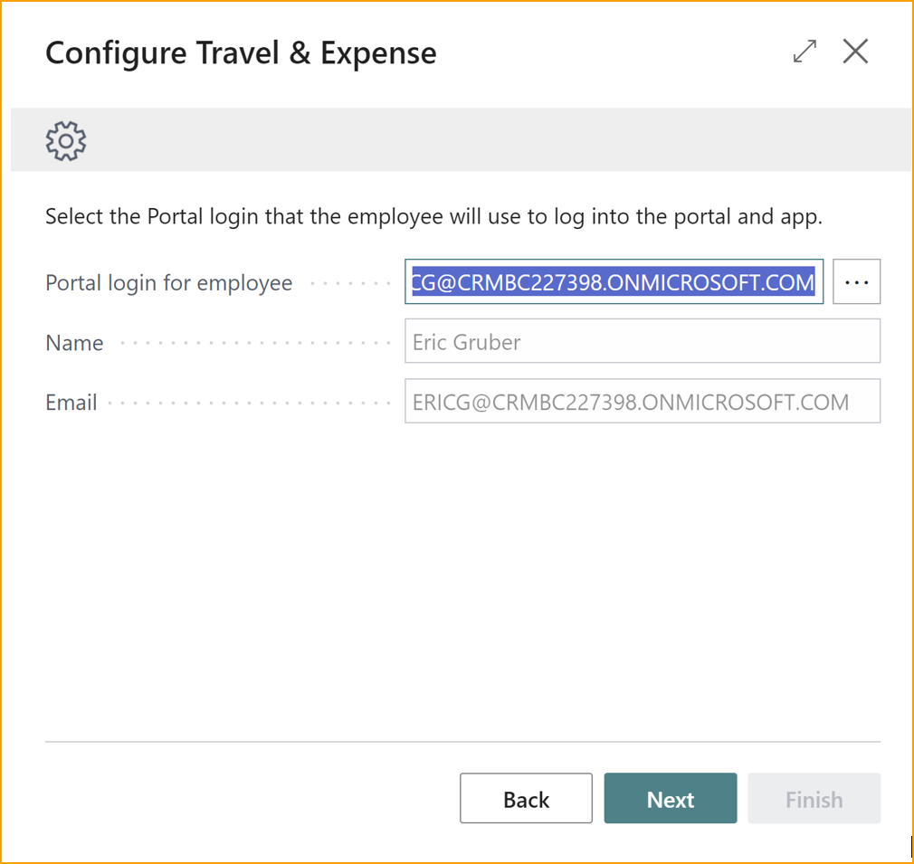
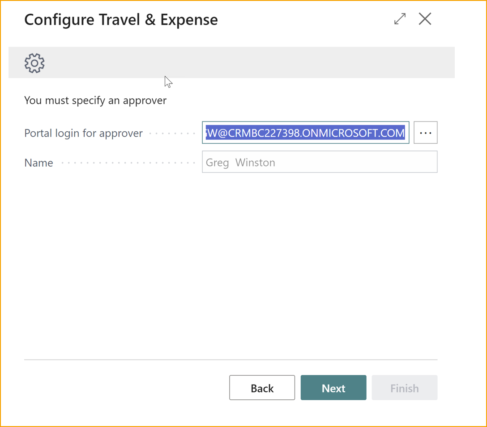
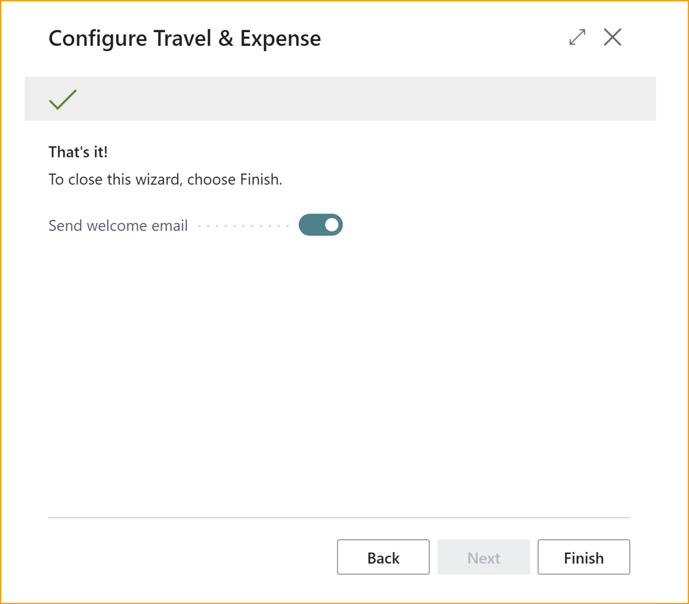

## Erste Schritte mit Reise & Spesen

Der Administrator übernimmt die Einrichtung und die Benutzer im Hintergrund. Die meisten Aufgaben, die ein Administrator erledigen muss, werden im Vorfeld erledigt, wie z.B. das Einrichten der praktischen Elemente von Reise und Spesen sowie das Erstellen von Benutzern für die Einreicher und Genehmiger.

Dieser Abschnitt hilft bei der Einrichtung von ExFlow Reise & Spesen in Business Central.

Nachfolgend sind die notwendigen Schritte zur Einrichtung aufgeführt:

- **Einrichtungsassistent**

- **Buchungsgruppen**

- **Zahlungsgruppen**

- **Regionen**

- **Spesenkategorien**

- **Verkehrsmittel**

- **Reisesätze**

Um auf die verschiedenen Ansichten in diesem Abschnitt zuzugreifen, verwenden Sie das Suchfeld oder die **Reise- und Spesenübersicht** in der oberen Leiste, um zur Ansicht "Alle erkunden" zu navigieren.

### Einrichtungsassistent

Der Einrichtungsassistent ist darauf ausgelegt, die grundlegende Einrichtung für ExFlow Reise & Spesen zu vereinfachen. Dieses Benutzerhandbuch führt die Benutzer durch die Schritte und stellt sicher, dass der Einrichtungsprozess einfach und unkompliziert ist.

Gehe zu: **Reise- & Spesenübersicht --> Einrichtungsassistent**

#### Nummernserien einrichten

Der Assistent schlägt Standardnummernserien von Business Central für Ausgaben und Kilometer vor. Anpassungen können während dieser Einrichtung vorgenommen werden.

#### Kilometerabrechnung einrichten

Legen Sie die Erstattungsmethode für Kilometer, die Buchungsgruppe und die Kilometer-Einheit fest.

#### Benachrichtigungen

Konfigurieren Sie E-Mail-Erinnerungen, um Benutzer zu informieren und ihre Aufmerksamkeit auf ausstehende Genehmigungen zu lenken.

#### Abschluss

Herzlichen Glückwunsch! Alle notwendigen Informationen wurden erfolgreich bereitgestellt, um die Einrichtung gemäß den Präferenzen zu beginnen.

### Buchungsgruppen

Buchungsgruppen sind wesentliche Klassifikationen von Ausgabentypen, die es Buchhaltern ermöglichen, Finanzdaten effizient zu verwalten und zu organisieren. Wenn Mitarbeiter Ausgaben über die App oder das Webportal einreichen, müssen sie eine Spesenkategorie auswählen, die einer der vordefinierten Buchungsgruppen entspricht.

Um eine genaue Buchhaltung zu ermöglichen, ist es wichtig, geeignete Buchungsgruppen zu erstellen, die verschiedene Steuersätze und Hauptbuchkonten umfassen. Beispielsweise erfordern **Reisesätze** spezifische Buchungsgruppen für Kilometerabrechnungen.

Bitte beachten Sie, dass nur die Finanzabteilung Zugriff auf die Konfiguration und Verwaltung dieser Buchungsgruppen hat, um sicherzustellen, dass der Prozess für Endbenutzer der App oder des Webportals reibungslos und sicher bleibt.

Gehe zu: **Reise & Spesen --> Übersicht --> Buchungseinrichtung --> Buchungsgruppen**

**Neu:** Um eine neue Buchungsgruppe zu erstellen.

**Code:** Dies dient als Kurzbeschreibung für die Buchungsgruppe.

Zum Beispiel könnten inländische Lebensmittelkosten als "Food-dom" und internationale Lebensmittelkosten als "Food-int" oder sonstige Kosten als "Misc" bezeichnet werden.

**Beschreibung:** Geben Sie eine Beschreibung ein, z.B. "Lebensmittel & Getränke Inland", "Lebensmittel & Getränke International" oder "Sonstiges".

**Hauptbuchkontonummer:** Wählen oder geben Sie die Hauptbuchkontonummer ein.

**Allg. Geschäftsbuchungsgruppe:** Wählen oder geben Sie die allgemeine Geschäftsbuchungsgruppe ein. Dies ist Business Central Standard.

**Allg. Produktbuchungsgruppe:** Wählen oder geben Sie die allgemeine Produktbuchungsgruppe ein. Dies ist Business Central Standard.

**USt.-Geschäftsbuchungsgruppe:** Wählen oder geben Sie die USt.-Geschäftsbuchungsgruppe ein. Dies ist Business Central Standard.

**USt.-Produktbuchungsgruppe:** Wählen oder geben Sie die USt.-Produktbuchungsgruppe ein. Dies ist Business Central Standard.

**Projekt-Hauptbuchkontonummer:** Wählen oder geben Sie die Projekt-Hauptbuchkontonummer ein, dies ist mit dem Projektmodul in Business Central Standard verbunden.

Bitte beachten Sie, dass der Assistent eine Buchungsgruppe für **Kilometer** erstellt.

### Zahlungsgruppen

Wie **Buchungsgruppen** und allgemeine Gruppen in Business Central werden **Zahlungsgruppen** verwendet, um Entitäten Hauptbuchkonten zuzuordnen. Diese Funktion ist besonders nützlich, wenn mehrere Kreditkartentypen verwaltet werden, die jeweils unterschiedliche Zahlungspostings erfordern.

In der Regel ist es ratsam, mindestens zwei **Zahlungsgruppen** einzurichten: eine für Firmenkreditkartentransaktionen und eine andere für die Erstattung von Mitarbeitern. Beachten Sie, dass pro **Mitarbeitertyp** nur eine **Zahlungsgruppe** zugewiesen werden kann. Für Firmenkreditkarten können bei Bedarf mehrere **Zahlungsgruppen** eingerichtet werden. Es besteht die Flexibilität, eine einzelne **Zahlungsgruppe** für jede **Kreditkartenvereinbarung** zu konfigurieren oder mehrere Vereinbarungen in einer Gruppe zusammenzufassen, je nach Präferenz.

Gehe zu: **Reise & Spesen --> Übersicht --> Buchungseinrichtung --> Zahlungsgruppen**

**Neu:** Erstellen Sie eine neue **Zahlungsgruppe**

**Code:** Dies dient als Kurzbeschreibung für die Zahlungsgruppe.

Zum Beispiel "CC" für Kreditkarte oder "EMPLOYEE" für Mitarbeiter

**Beschreibung:** Geben Sie eine Beschreibung ein.

Zum Beispiel "Kreditkarte" oder "Mitarbeiter"

**Saldo-Kontotyp:** Wählen Sie einen Saldo-Kontotyp, dies ist Business Central Standard.

**Saldo-Kontonummer:** Wählen Sie eine Saldo-Kontonummer, dies ist Business Central Standard.

### Regionen

**Regionen** enthalten Sammlungen von Ländern, was nützlich ist, wenn eine spezifische Buchungseinrichtung pro Ländersammlung erforderlich ist. Zum Beispiel kann dies nützlich sein, um die verschiedenen Steuersätze für die verschiedenen Regionen vorzubereiten.

Gehe zu: **Reise & Spesen --> Übersicht --> Einrichtung --> Regionen**

**Neu:** Erstellen Sie neue **Regionen**

**Code:** Dies dient als Kurzbeschreibung für die **Region**.

**Beschreibung:** Geben Sie eine Beschreibung für die Region ein.

**Länder hinzufügen:** Wählen Sie einen oder mehrere Ländercodes aus.

### Spesenkategorien

Um die Spesenerfassung für Benutzer zu vereinfachen, müssen **Spesenkategorien** erstellt werden. Mit diesen Kategorien und einigen zusätzlichen Variablen können Nicht-Finanzbenutzer Ausgaben erfassen und der Finanzabteilung Informationen darüber liefern, wie die Ausgaben gebucht werden sollen.

Die erstellten **Spesenkategorien** werden den Benutzern im Webportal und in der mobilen App angezeigt, wenn sie eine Ausgabe erstellen. Benutzer müssen eine Kategorie auswählen, die ihren Kauf am besten beschreibt. Zusätzlich können sie wählen, die Ausgabe mit Kollegen zu teilen oder einen Gast hinzuzufügen, was angibt, wie die Ausgabe gebucht werden soll.

Für jede **Spesenkategorie** können mehrere Buchungseinrichtungen erstellt werden, sodass die Finanzabteilung verschiedene Ausgabenszenarien effizient verwalten kann.

Gehe zu: **Reise & Spesen - Übersicht --> Buchungseinrichtung --> Spesenkategorien**

**Neu:** Erstellen Sie neue **Spesenkategorien**

**Code:** Dies zeigt kurz an, wofür die Kategorie ist, zum Beispiel: "Essen"

**Beschreibung:** Geben Sie eine Beschreibung der Kategorie ein, zum Beispiel "Essen und Getränke". Beachten Sie, dass diese Beschreibung den Benutzern in der App oder im Webportal angezeigt wird.

Konfigurieren Sie als Nächstes die Buchungseinrichtung für die spezifische Kategorie.

**Priorität:** Wenn mehrere Buchungseinrichtungen vorhanden sind, bestimmt das System, welche verwendet wird, basierend auf den Prioritätsnummern. Die Buchungseinrichtung mit der höchsten Prioritätsnummer wird vom System angewendet, wenn keine der Einrichtungen genau mit der Ausgabenerfassung übereinstimmt.

**Inland:** Wenn die Buchungseinrichtung nur relevant ist, wenn sich der Ausgabenort im eigenen Land befindet.

**Region Codes:** Wenn die Buchungseinrichtung relevant ist, wenn sich der Ausgabenort außerhalb des eigenen Landes befindet, wählen Sie eine der zuvor erstellten Regionen aus.

**Mit Gästen:** Wenn die Einrichtung erfordert, dass der Benutzer einen Gast hinzufügt, aktivieren Sie **mit Gästen**.

**Buchungsgruppen:** Wählen Sie eine der zuvor erstellten **Buchungsgruppen** aus.

**Aufteilen nach Mitarbeitern:** Wenn die Einrichtung erfordert, dass die Ausgabe zwischen Mitarbeitern aufgeteilt wird, aktivieren Sie **Aufteilen nach Mitarbeitern**.

Wiederholen Sie die obigen Schritte für so viele Kategorien und Einrichtungen wie erforderlich. Je umfassender Ihr Ansatz zur Erstellung von Kategorien und Einrichtungen ist, desto einfacher wird es für Ihre Finanzabteilung, Ausgaben zu verarbeiten.

#### Verkehrsmittel

In bestimmten Ländern gelten unterschiedliche Erstattungssätze je nach Verkehrsmittel. Zum Beispiel variieren die Sätze zwischen Autos, Autos mit Anhängern und Autos mit schweren Lasten. Bei der Konfiguration der Verkehrsmittel geben Sie den Verkehrsmitteltyp an. Wenn der Erstattungssatz für bestimmte Typen konsistent ist, ist es nur notwendig, einen Typ einzurichten.

Gehe zu: **Reise & Spesen - Übersicht --> Kilometerabrechnung --> Verkehrsmittel**

**Neu:** Erstellen Sie ein neues **Verkehrsmittel**

**Code:** Dies zeigt kurz an, wofür der Verkehrsmitteltyp ist, zum Beispiel: "Auto".

**Beschreibung:** Geben Sie die Beschreibung des Verkehrsmitteltyps ein.

### Reisesätze

Reisesätze ermöglichen die Festlegung des Erstattungssatzes für einen Mitarbeiter basierend auf einer bestimmten Reise.

Einzelne Mitarbeiter können unterschiedliche Sätze haben. Ein Satz ohne angegebene Mitarbeiternummer ist ein allgemeiner Satz, der als Standardsatz verwendet wird.

Gehe zu: **Reise & Spesen - Übersicht --> Kilometerabrechnung --> Reisesätze**

**Neu:** Erstellen Sie einen neuen Reisesatz.

**Option:** Wählen Sie das zuvor erstellte **Verkehrsmittel** aus.

**Mitarbeiternummer:** Wenn keine Mitarbeiternummer angegeben ist, wird der Satz als allgemeiner Satz betrachtet.

**Startdatum:** Verwenden Sie diese Option, wenn sich ein Satz zu einem bestimmten Zeitpunkt ändern muss.

**Ab:** Beispiel: Wenn es unterschiedliche Satzregeln gibt, abhängig von der Anzahl der gefahrenen Meilen oder Kilometer des Mitarbeiters.

**Satz:** Der Satz für die spezifische Regel.

Es ist wichtig, den Erstattungshandler in **Einrichtung (TEM)** einzurichten.

Gehe zu: **Einrichtung (TEM) --> Kilometer**

**Kilometer-Erstattungshandler:** Wenn die Erstattung über Business Central abgewickelt werden soll, wählen Sie **An Mitarbeiterbuchungskonto buchen**, wenn die Erstattung im Gehaltssystem abgewickelt wird, wählen Sie **Export zu XML**.

 

## Benutzer einrichten

### Erstellen eines AppsForDynamics365-Benutzers

Um auf das AppsForDynamics365-Portal zuzugreifen und die ExFlow Reise & Spesen-App zu verwenden, muss für jeden Benutzer ein Benutzerkonto erstellt werden. Dieses Login wird unternehmensübergreifend verwendet.

Jeder Benutzer, der Zugriff auf das AppsForDynamics365-Portal benötigt, muss als AppsForDynamics365-Benutzer eingerichtet werden. Der AppsForDynamics365-Benutzer erweitert den Business Central-Mitarbeiter, indem er sicherstellt, dass die auf dem Mitarbeiter festgelegten Einstellungen auch auf dem AppsForDynamics365-Portal durchgesetzt werden.

Gehe zu: **AppsForDynamics365-Logins**

Es gibt zwei Optionen, um einen neuen Benutzer zu erstellen.

1. **Logins für Benutzer erstellen:** Benutzer aus BC-Benutzern importieren.

2. **Neu:** Wenn der Benutzer nicht als Business Central-Benutzer erstellt wurde, geben Sie die Benutzeranmeldeinformationen manuell ein.

#### Mit einem Business Central-Benutzer erstellen

**Logins für Benutzer erstellen:** Wählen Sie den/die Benutzer aus der Liste aus.

#### Benutzer manuell erstellen

Klicken Sie auf **Neu**

|AppsForDynamics365-Login|| 
|:-|:-| 
|**Benutzerstatus**| Gibt an, ob der Benutzer aktiv oder inaktiv ist 
|**Authentifizierungsmethode**| Wählen Sie die Authentifizierungsmethode für den spezifischen Benutzer.   **Microsoft-Login**    **Benutzer/Passwort** 
|**Login:**| Benutzer-ID, die der Benutzer zum Anmelden am Portal verwendet 
|**Name:**| Der vollständige Name des Mitarbeiters 
|**Passwort:**| Das Passwort, das der Benutzer zum Anmelden am Portal verwendet. (Nur wenn "Benutzer/Passwort" ausgewählt ist) 
|**Sprache:**| Die beabsichtigte Sprache, die der Benutzer verwenden soll. 
|**E-Mail:**| Die E-Mail-Adresse des Benutzers. Diese wird für Benachrichtigungen verwendet. 
|**Business Central-Benutzer:**| Wählen Sie den Business Central-Benutzer aus, dem dieser Benutzer zugeordnet werden soll. 
|**Mitarbeiternummer:**| Dies ist die Mitarbeitermummer aus Business Central, die dem Benutzer zugeordnet ist. Sie wird automatisch ausgefüllt, wenn die Konfiguration für TEM von der Mitarbeiterkarte in Business Central ausgeführt wird.

### Zuordnung des Mitarbeiters zu AppsForDynamics365

Um die Benutzereinrichtung abzuschließen, ist es notwendig, den Business Central-Mitarbeiter dem **AppsForDynamics365-Benutzer** zuzuordnen.

Gehe zu: **Mitarbeiter**

Wählen Sie einen spezifischen Mitarbeiter aus der Liste aus, um Zugriff auf das **AppsForDynamics365-Portal** zu gewähren.

#### ExFlow Reise & Spesen konfigurieren

Klicken Sie auf: **ExFlow Reise & Spesen** --> **Für TEM konfigurieren**

Folgen Sie dem Assistenten:  

Klicken Sie auf die drei Punkte und finden Sie den Mitarbeiter in **AppsForDynamics365-Login**

Klicken Sie auf die drei Punkte und finden Sie den Manager in **AppsForDynamics365-Login**

## Kreditkarte einrichten

Kreditkartenvereinbarungen sind nützliche Werkzeuge, um Ausgaben automatisch mit den entsprechenden Kreditkartenabrechnungen abzugleichen, wenn diese eingehen. Nach der Einrichtung spart dies der Buchhaltungsabteilung Zeit und kann durch die Verwendung der Funktion **Automatischer Transaktionsimport** weiter verbessert werden.

### Vereinbarungen

Gehe zu: **Reise & Spesen - Übersicht --> Firmenkarten --> Vereinbarungen**

**Neu:** Erstellen Sie eine neue Vereinbarung.

|Vereinbarungen|| 
|:-|:-| 
|**Code:**| Geben Sie einen Code für die Vereinbarung ein, der eine Kurzbeschreibung zur einfachen Identifikation sein sollte.
|**Beschreibung:**| Geben Sie eine Beschreibung der Vereinbarung ein.
|**Kartenmarke:**| Wählen Sie eine **Kartenmarke** aus der Liste aus.
|**Zahlungsgruppe:**| Wählen Sie eine **Zahlungsgruppe** aus den zuvor erstellten aus.
|**Karten-Transaktionen:**| Wählen Sie die Methode für den Import von Kreditkartentransaktionen aus.
|**Manuelle Eingabe/Dateiimport:**| Wählen Sie diese Option, wenn die Transaktion manuell eingegeben oder mit einer Excel-Datei importiert wird.
|**Von Kontoauszug:**| Kreditkartentransaktionen werden aus dem Kontoauszug in Business Central importiert.
|**Von Bankabstimmung:**| Kreditkartentransaktionen werden aus der Bankabstimmung in Business Central importiert.
|**Automatisch von SEB-Karte:**| Kreditkartentransaktionen werden aus der SEB-Kartenintegration importiert.

Dies ist eine Liste aller Kreditkarten, die mit dieser spezifischen Vereinbarung verbunden sind. Von hier aus können mehrere Karten aus **Firmenkreditkarten** mit dieser spezifischen **Kreditkartenvereinbarung** verknüpft werden.

Unter **Verknüpfte Karten** --> **Karten** --> **Karten hinzufügen**

Wählen Sie eine spezifische Kreditkarte aus. Um mehrere Karten gleichzeitig auszuwählen, klicken Sie auf eine Kreditkartenzeile und drücken Sie Shift+Pfeil nach unten auf der Tastatur --> **OK**.

### Firmenkreditkarten

Durch Öffnen der Ansicht Firmenkreditkarten werden alle Karten angezeigt, die automatisch aus Transaktionen erstellt oder manuell eingegeben wurden. Von dieser Ansicht aus gibt es zwei Optionen, um eine neue Kreditkarte zu erstellen:

1. **Automatischer Transaktionsimport**: Wenn diese Funktion eingerichtet ist, werden Firmenkreditkarten basierend auf der Kartennummer und dem Karteninhaber automatisch erstellt.

2. **Manuelle Eingabe**: Wenn der automatische Import nicht bevorzugt wird, können **Firmenkreditkarten** manuell erstellt werden.

#### Neue Kreditkarte manuell erstellen

Gehe zu: **Firmenkreditkarten (TEM)**

**Neu**: Erstellen Sie eine neue Karte

|Firmenkarten (TEM) |  |
|:-|:-|
|**Kartennummer:**| Geben Sie die Kartennummer ein.
|**Name des Karteninhabers:**| Geben Sie den Namen der Person ein, die die Karte verwendet.
|**Zugewiesen an Mitarbeiternummer:**| Wählen Sie den Mitarbeiter aus der Liste aus.
|**Kreditkartenvereinbarung:**| Wählen Sie die entsprechende Vereinbarung für die Firmenkarte aus.

Die Firmenkreditkarte wurde registriert, muss jedoch aktiviert werden, bevor sie verwendet werden kann.

#### Kreditkarte aktivieren

Damit einer Kreditkarte der Status **Aktiv** zugewiesen werden kann, muss die Karte einer Kreditkartenvereinbarung und einem Mitarbeiter zugewiesen sein.

Wählen Sie eine **Firmenkreditkarte** aus der Liste und **Aktivieren**. Die **Firmenkreditkarte** wurde nun aktiviert.

#### Kartenverknüpfungen vorschlagen

Wenn eine oder mehrere **Firmenkreditkarten** nicht mit einem **Mitarbeiter** verknüpft wurden, führt Sie diese Funktion durch die Karten und Mitarbeiter, die das System verknüpfen möchte.

Gehe zu: **Firmenkarten** --> **Neu**

### Excel-Importdefinitionen

Ordnen Sie Excel-Dateien zu, um den Import von Kreditkartentransaktionen zu ermöglichen, die dann an die Karteninhaber zur Bearbeitung gesendet werden können.

Gehe zu: **Excel-Importdefinition (TEM)**

**Neu:** Erstellen Sie eine neue Importdefinition

|Excel-Importdefinition ||
|:-|:-| 
|**Code:** |Definieren Sie einen Code für die Importdefinition
|**Beschreibung:**| Geben Sie eine Beschreibung für die Importdefinition ein
|**Kopfzeile vor Transaktionen:**| Aktivieren Sie diese Option, wenn es Kopfzeilen in der Excel-Datei gibt.
|**Beschriftung für die erste Kopfzeilenspalte:**| Geben Sie die Zeilennummer ein, ab der die Transaktionszeilen beginnen.
|**Datumsformat:**| Wählen Sie das Datumsformat, das die Datei hat.
|**Zahlung wird als negativer Betrag angezeigt:**| Wenn der Betrag in der Datei negativ ist, aktivieren Sie diesen Parameter.

 

#### Felder den Excel-Spalten zuordnen

In diesem Abschnitt geben Sie an, welche Spalten in der Excel-Datei den Feldern in ExFlow Reise & Spesen zugeordnet werden sollen.

Beispiel: Wenn die Kartennummer in Spalte D der Excel-Datei steht, geben Sie D im Feld **Kartennummer** ein.

|Felder den Excel-Spalten zuordnen ||
|:-|:-| 
|**Kartennummer:**| Definieren Sie die Spalte für die Kreditkartennummer.
|**Karteninhaber:** |Definieren Sie die Spalte für den Karteninhaber.
|**Transaktionsdatum:**| Definieren Sie die Spalte für das Transaktionsdatum.
|**Transaktionsbetrag:**| Definieren Sie die Spalte für den Transaktionsbetrag.
|**Währung:** |Definieren Sie die Spalte für die Währung, nicht obligatorisch.
|**Abrechnungsbetrag:**| Definieren Sie die Spalte für den Abrechnungsbetrag.
|**Beschreibung:**| Definieren Sie die Spalte für die Transaktionsbeschreibung.
|**Land:** |Definieren Sie die Spalte für das Land, nicht obligatorisch.
|**MCC:**| Definieren Sie die Spalte für MCC, nicht obligatorisch.
|**MCC-Beschreibung:**| Definieren Sie die Spalte für die MCC-Beschreibung, nicht obligatorisch.
|**Eindeutige Referenz:**| Definieren Sie die Spalte für die eindeutige Referenz, nicht obligatorisch.
|**Rechnungsnummer:**| Definieren Sie die Spalte für die Rechnungsnummer, nicht obligatorisch.

## Tagegelder einrichten

Tagegelder sind tägliche Pauschalen, die Mitarbeitern zur Deckung der täglichen Ausgaben während Geschäftsreisen zur Verfügung gestellt werden. Sie vereinfachen den Prozess der Ausgabenerfassung, indem sie einen festen Betrag bieten.

### Einrichtung

Berechnungsregeln werden auf der Seite Tagegeld-Einrichtung konfiguriert (nur in der Pro-Edition verfügbar). 
Gehe zu: **Einrichtung** --> **Berechnungsregel ändern** 

 

Wählen Sie die Berechnungsregel aus. 

Gehe zu: **Tagegeld-Berechnungsregel ändern** 

 

Die Regeln zur Berechnung von Tagegeldern variieren je nach Land, und derzeit unterstützen wir diese Berechnungsregelsets: Schwedisch, Finnisch, Dänisch, Deutsch und eine allgemeine "Pauschale pro Tag"-Regel. Abhängig von der ausgewählten Regel stehen verschiedene Einstellungen zur Konfiguration zur Verfügung.
