## ExFlow Travel & Expense Mobile App

Die ExFlow Travel & Expense App, verfügbar auf Android und iOS, ermöglicht eine mühelose und schnelle Einreichung von Ausgaben und Kilometerständen von einem mobilen Gerät aus. Die erstellten Dokumente stehen den Genehmigern und der Finanzabteilung sofort nach der Einreichung zur Verfügung.

Die App ist die vorgesehene Methode, mit der Mitarbeiter ihre Ausgaben und Kilometerstände einreichen sollten, da dies mit nur wenigen Klicks und Eingaben unterwegs möglich ist.

Nachfolgend sind Beispiele dafür, wie die App auf verschiedenen Seiten aussieht.
 

### Erste Schritte mit der ExFlow Travel & Expense App

Um die App zu nutzen, ist der erste Schritt das Herunterladen. Sie ist sowohl im Google Play Store als auch im Apple App Store verfügbar. Benutzer können sie über die untenstehenden Links finden oder nach "Travel and Expense" im jeweiligen Store suchen.

Gehe zu: **Google Play** oder **Apple App Store**

#### Anmeldung

Die Anmeldung in der ExFlow Travel and Expense App erfordert bei der ersten Anmeldung zwei Schritte. Unten ist der Bildschirm für die Kunden-ID zu sehen.

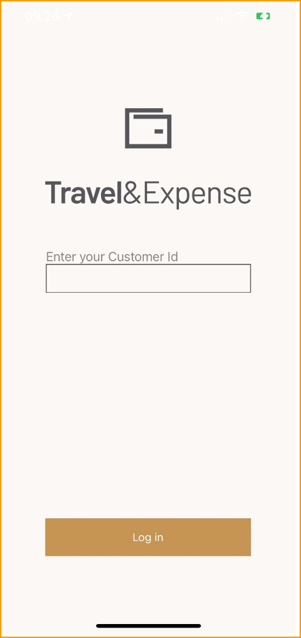

Beim ersten Öffnen der App geben Sie in dieser Reihenfolge eine Kunden-ID und Anmeldedaten ein. Diese Details wurden Ihnen per E-Mail zugesandt, als Ihr Konto eingerichtet wurde. Alternativ wenden Sie sich an Ihren Business Central-Administrator oder die IT-Abteilung. Die App merkt sich Ihre Kunden-ID und Anmeldung für zukünftige Nutzungen, aber es ist wichtig, diese zugänglich zu halten, falls Sie das Telefon wechseln oder auf unvorhergesehene Umstände stoßen.
 

#### App-Oberfläche

Dieser Abschnitt dokumentiert die verschiedenen relevanten Elemente in der ExFlow Travel and Expense App.

##### Startbildschirm auf dem Telefon

Nach dem Herunterladen der App erscheint das Travel and Expense-Symbol auf Ihrem Startbildschirm.

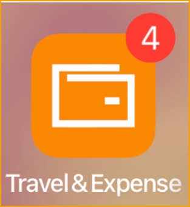

Wenn das Symbol einen Indikator zeigt, bedeutet dies, dass es ungesendete Ausgaben oder Kilometerstände gibt.
 

#### Dashboard

Das Dashboard ist die erste Seite der App.

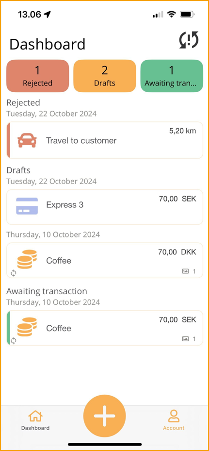

Oben befindet sich ein Aktualisierungssymbol, das anzeigt, ob eine Synchronisierung mit der Cloud erforderlich ist. Dies tritt auf, wenn es eine Weile her ist, seit der letzten Synchronisierung oder wenn es ausstehende Einträge gibt.

Die Synchronisierung der Daten mit der Cloud kann jederzeit durchgeführt werden und kann durch:

-   Tippen auf das Aktualisierungssymbol oben rechts oder

-   Herunterziehen vom oberen Rand des Dashboards erreicht werden.

Der zentrale Bereich des Dashboards zeigt eine Liste verschiedener Zustände. Diese Zustände sind oben im Dashboard gruppiert.

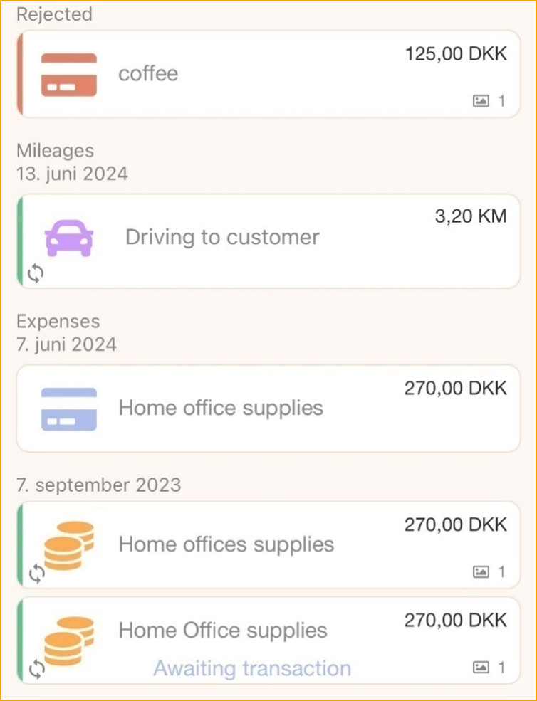

Wenn es abgelehnte Ausgaben oder Kilometerstände gibt, werden diese oben in Rot hervorgehoben.

Ein kleines Synchronisierungssymbol erscheint bei Transaktionen, die noch nicht mit dem Server synchronisiert wurden.

##### Unteres Menü

Am unteren Bildschirmrand können Benutzer eine neue Transaktion erstellen, indem sie auf das PLUS-Symbol klicken. Die verfügbaren Optionen können je nach den Einstellungen des Unternehmens in ExFlow Travel & Expense variieren.

-   **Ausgabe mit Kamera**: Erstellen Sie die Ausgabe, indem Sie ein Foto der Quittung machen.
-   **Kilometerstand**: Für die Meldung von Kilometerständen.
-   **Spesenabrechnung**: Erstellen Sie eine Spesenabrechnung.
-   **Ausgabe**: Erstellen Sie die Ausgabe.
 

##### Konto

Das **Konto**, das sich auf der rechten Seite befindet, bietet dem Benutzer die folgenden Optionen:

-   **Abmelden**: Ermöglicht das Abmelden.
-   **Fahrzeuge**: Zeigt die Fahrzeugliste an. Der Benutzer kann hinzufügen oder bearbeiten.
-   **Verlauf**: Zeigt die historischen Daten an, die eingereicht wurden.
-   **Online-Hilfe**: Link zum Online-Handbuch für Travel & Expense.

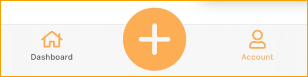

### Einreichen einer Ausgabe

Gehe zu: **PLUS**

Beginnen Sie den Prozess der Einreichung einer Ausgabe auf vier verschiedene Arten:

Gehe zu: **Ausgabe mit Kamera** um eine Ausgabe von Grund auf zu erstellen.

Teilen Sie ein Foto aus der Fotogalerie und wählen Sie das ExFlow Travel & Expense App-Symbol. Wenn Sie mehrere Fotos teilen, haben Sie die Möglichkeit, eine Ausgabe mit allen Fotos zu erstellen oder eine Ausgabe pro Foto zu erstellen.
Nach dem Starten einer Ausgabe, z. B. durch das Aufnehmen eines Fotos, wird die folgende Ansicht angezeigt:

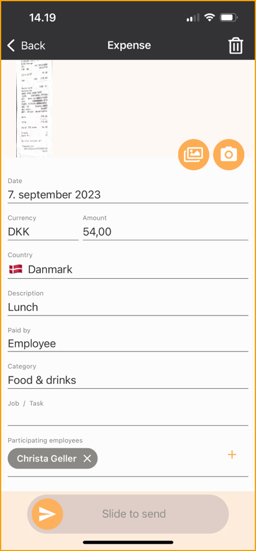

Oben können Sie zum Dashboard zurückkehren. Wenn Informationen oder Fotos hinzugefügt werden, wird die Ausgabe als Entwurf gespeichert.

Wenn Sie eine Ausgabe verwerfen möchten, tippen Sie auf das Bild und **Löschen**.

##### Fotos

Fotos sind in ExFlow Travel and Expense von entscheidender Bedeutung, da sie das sofortige Verwerfen von Quittungen nach dem Erfassen ermöglichen. Nachfolgend einige wichtige Details zu Ausgabenfotos.

**Foto-Vorschau**: Durch Tippen auf ein Foto wird eine Vorschau geöffnet, in der Optionen wie Löschen oder Drehen verfügbar sind. Unten können Sie auswählen, welches Foto in der Vorschau angezeigt werden soll.

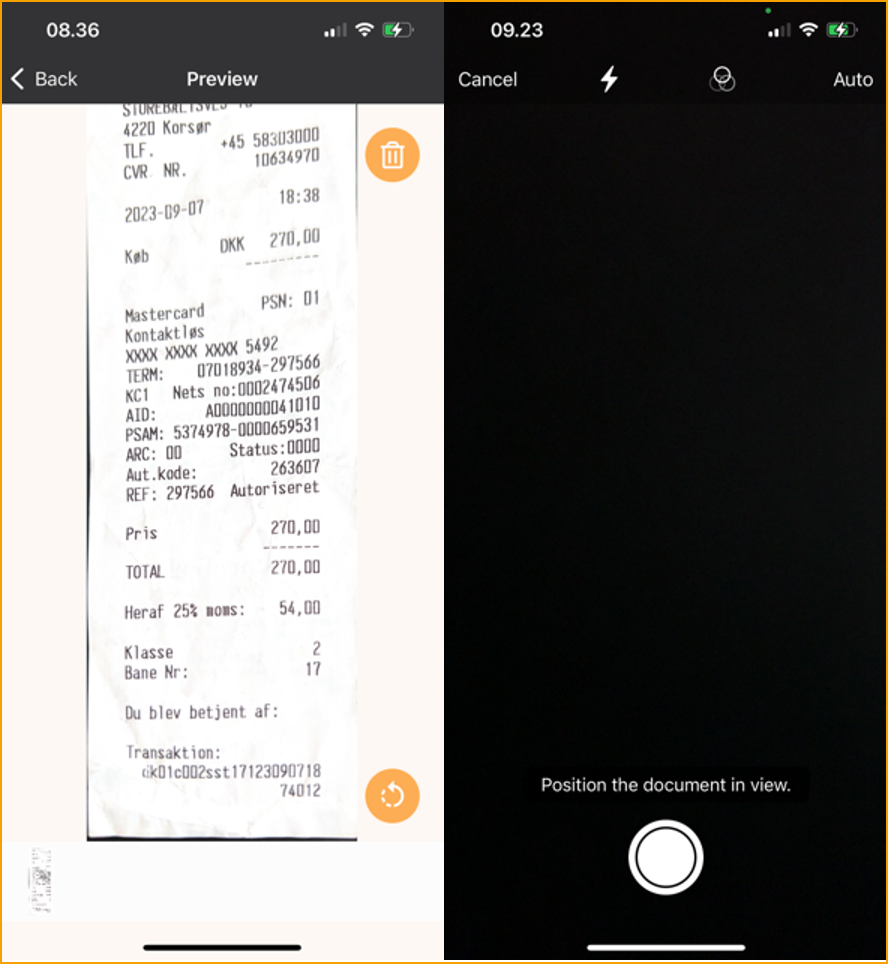

**Weitere Fotos hinzufügen**: Fügen Sie der Ausgabe weitere Fotos hinzu, indem Sie auf das PLUS-Symbol neben dem Bild klicken. Es gibt zwei Optionen:
-   **Quittung scannen**: Bedeutet, dass ein Foto der Quittung gemacht wird.
-   **Foto auswählen**: Fügen Sie ein Foto aus der Fotogalerie auf dem Telefon hinzu.

#### Ausgabendetails

Nachfolgend eine Beschreibung der einzelnen Begriffe in einem Spesenbericht. In der App sind rot hervorgehobene Elemente obligatorisch.

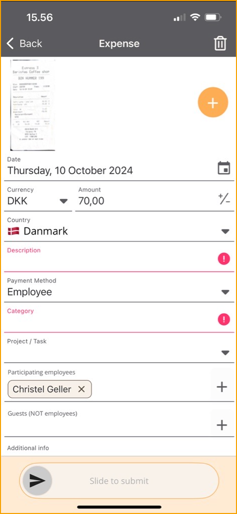

**Datum**: Ändern Sie das Datum der Ausgabe. Wenn ein Foto angehängt ist, wird das Datum standardmäßig auf den Tag gesetzt, an dem das Foto aufgenommen wurde. Wenn Sie die App zum Fotografieren verwenden, wird das heutige Datum angewendet.

**Währung**: Wählen Sie die richtige Währung aus einer Liste. Die anfängliche Währung basiert auf dem GPS-Standort des Geräts.

**Betrag**: Die Kamera interpretiert den Betrag von der Quittung oder geben Sie den Gesamtbetrag der Ausgabe manuell ein.

**Land**: Wählen Sie das Land aus einer Liste. Das anfängliche Land basiert auf dem aktuellen GPS-Standort des Geräts.

**Beschreibung**: Die Beschreibung wird der Titel für die Ausgabe sein.

**Zahlungsmethode**: Wählen Sie zwischen **Mitarbeiter** oder **Firmenkarte**.

**Private Nutzung**: Wenn die Firmenkarte privat genutzt wurde, markieren Sie die Transaktion als private Nutzung.

**Kategorie**: Wählen Sie eine Kategorie aus den von Ihrem Unternehmen bereitgestellten aus.

**Mitarbeiter**: Fügen Sie Mitarbeiter hinzu oder entfernen Sie sie. Ihr Name wird standardmäßig hinzugefügt.

**Projekt/Aufgabe**: Suchen Sie zuerst nach dem Projekt und dann nach der Aufgabe. Sobald sowohl das Projekt als auch die Aufgabe eingegeben sind, werden die **Projektbeschreibung** und die **Aufgabenbeschreibung** angezeigt.

**Gast (NICHT Mitarbeiter)**: Fügen Sie Kunden oder Gäste hinzu.

**Zusätzliche Informationen**: Geben Sie zusätzliche Informationen ein.

**Zum Einreichen schieben**: Verwenden Sie diesen Schieberegler, um die Ausgabe zur Genehmigung einzureichen.

**Diskussion**: Das Sprechblasensymbol in der oberen rechten Ecke zeigt alle Kommentare des Genehmigers an. Dies ist nur relevant, wenn die Ausgabe abgelehnt wurde.
 

### Einreichen von Kreditkartentransaktionen

Kreditkartentransaktionen werden häufig für verschiedene Ausgaben verwendet, einschließlich derjenigen, die im Namen Ihres Unternehmens bezahlt wurden. ExFlow Travel & Expense vereinfacht die Meldung dieser Transaktionen, insbesondere wenn Kreditkartenvereinbarungen eingerichtet sind, um sie automatisch den entsprechenden Spesenberichten zuzuordnen.

#### Melden eines Spesenberichts bei Verwendung der Firmenkreditkarte

Gehe zu: **Folgen Sie den Schritten unter "Einreichen einer Ausgabe"**

Melden Sie Ihre Ausgaben, fügen Sie die Details Ihrer Quittung hinzu und reichen Sie sie ein. Der Spesenbericht wartet dann im Dashboard, bis die Transaktionen in ExFlow Travel & Expense importiert werden.

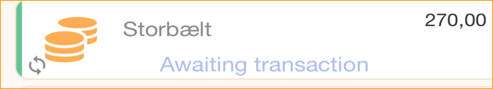

Wenn die Zuordnung erfolgt ist, wird Ihr Spesenbericht zur Genehmigung an Ihren Manager gesendet.

#### Keine Übereinstimmung zwischen Spesenbericht und Kreditkartentransaktion

Wenn die Transaktion und der Spesenbericht nicht automatisch übereinstimmen, wird die Kreditkartentransaktion im Dashboard angezeigt.

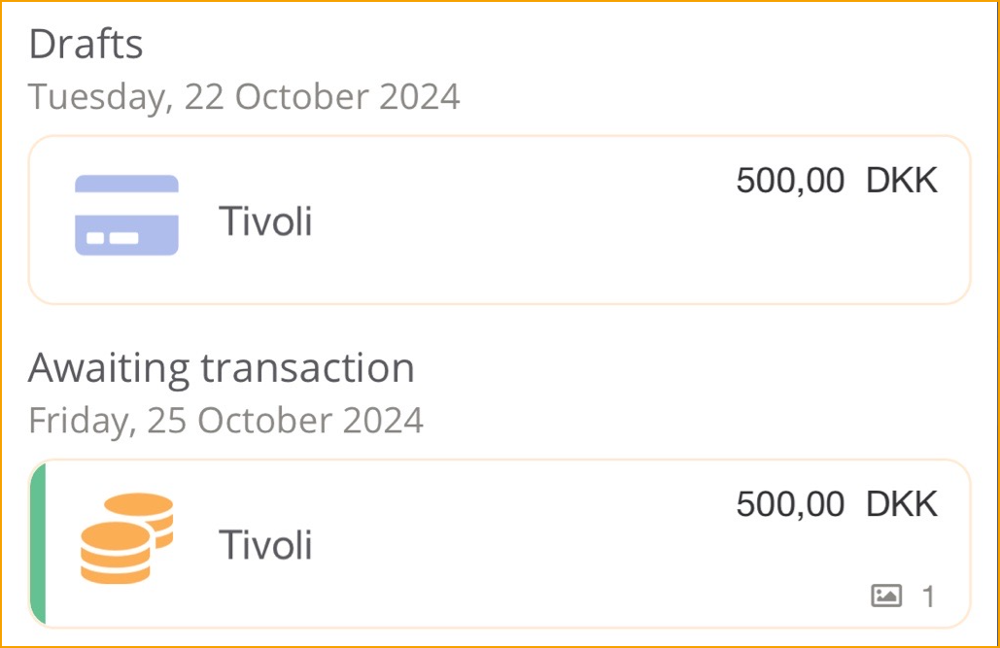

Gehe zu: **Kreditkartentransaktion**

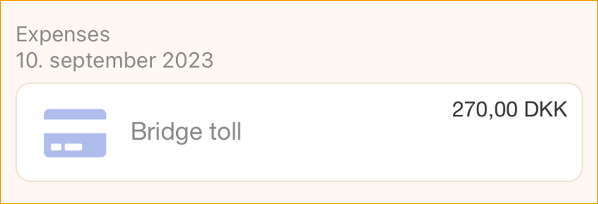

Oben in einer geöffneten Kreditkartentransaktion zeigt die Schaltfläche unten an, wie viele Ausgaben mit dieser Transaktion übereinstimmen. Ob diese Ausgaben als Übereinstimmungen betrachtet werden, hängt von ihrem Datum, ihrer Währung und ihrem Betrag ab.

Die Farbe zeigt an, wie genau die Übereinstimmungen sind:

-   Rot: Keine Übereinstimmung

-   Gelb: Teilweise Übereinstimmung

-   Grün: Gute Übereinstimmung

Durch Tippen auf die Ausgabenschaltfläche kann der Benutzer die Transaktion mit einer Ausgabe zusammenführen, indem er auf die Schaltfläche mit dem Häkchen drückt. Auch hier zeigt die Farbe links von einer Ausgabe die Qualität der Übereinstimmung an.

Eine Warnung wird angezeigt, die den Benutzer darauf hinweist, dass diese Operation die Ausgabe in die Kreditkartentransaktion kopiert und die Ausgabe gelöscht wird, und die Transaktion alle Informationen enthält.

**Klicken Sie auf Weiter**

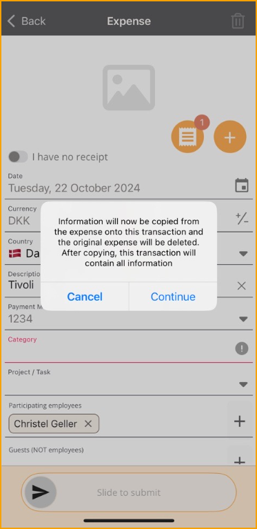

**Zum Einreichen schieben.**

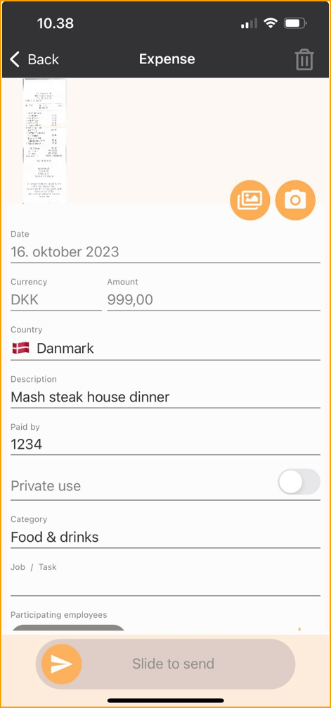

Die Transaktion wird nun zur Genehmigung an den Manager gesendet.

 

### Einreichen von Kilometerständen

Das Einreichen von Kilometerständen ist Teil von ExFlow Travel and Expense und soll dem Benutzer, Ihnen, das Einreichen so einfach wie möglich machen. Der Benutzer hat die Möglichkeit, seine Kilometerstände mit nur wenigen Klicks zur Genehmigung einzureichen.

Gehe zu: **PLUS-Symbol**

Die Karte oben zeigt die aktuelle Position an. Ziehen und zoomen Sie auf der Karte. Sobald eine Route eingegeben ist, wechselt das Tippen auf das Symbol **Alternative Route** zwischen den alternativen Routen.

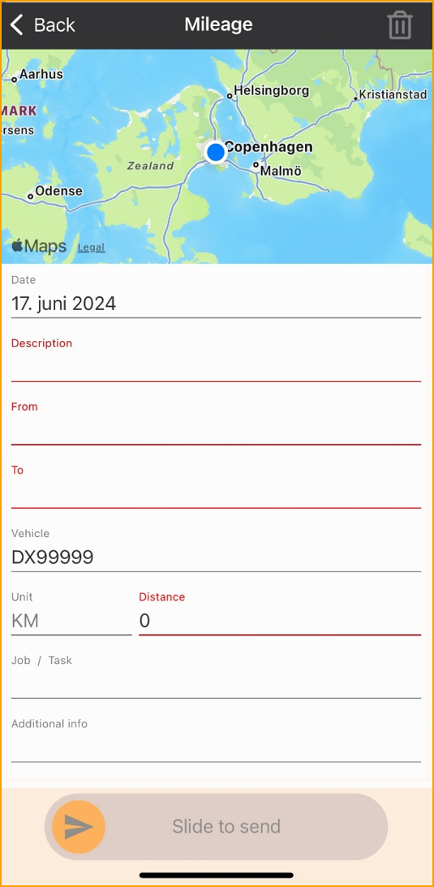

Nachfolgend sind die Felder aufgeführt, die für die Genehmigung des Kilometerstands ausgefüllt werden müssen. Eine rote Linie zeigt an, dass ein Feld obligatorisch ist.

**Datum**: Ändern Sie das Datum des Kilometerstands. Wenn Sie die App verwenden, wird das heutige Datum angewendet.

**Beschreibung:** Geben Sie die Beschreibung der Reise ein.

**Von**: Geben Sie die Adresse ein, an der die Reise begonnen hat.

**Nach**: Geben Sie die Adresse ein, an der die Reise endete.

**Fahrzeug**: Wählen Sie das verwendete Fahrzeug aus.

**Entfernung**: Die Entfernung wird automatisch berechnet. Es ist möglich, die Entfernung in diesem Feld manuell zu ändern.

**Projekt/Aufgabe**: Suchen Sie zuerst nach dem Projekt und dann nach der Aufgabe. Sobald sowohl das Projekt als auch die Aufgabe eingegeben sind, werden die **Projektbeschreibung** und die **Aufgabenbeschreibung** angezeigt.

**Zusätzliche Informationen**: Geben Sie zusätzliche Informationen ein.

**Zum Senden schieben**: Verwenden Sie diesen Schieberegler, um die Ausgabe zur Genehmigung zu senden. Der Benutzer wird gefragt, ob es sich um eine Rückfahrt handelt. Hier sind die drei Optionen:

**Fortsetzen:** Wenn der Benutzer auf einer Reise mit weiteren Zwischenstopps ist, wählen Sie **Reise fortsetzen**.

**Zurück zum Start:** Dies wird die Reise zurück zum Start bringen, sodass die Reise nicht zweimal registriert werden muss.

**Nein:** Dies wird die Reise beenden.

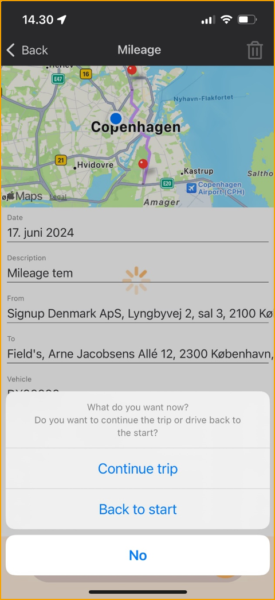

 

### Fahrzeuge

Bevor der Benutzer Kilometerstände in ExFlow Travel & Expense einreichen kann, muss ein Fahrzeug hinzugefügt werden.

Gehe zu: **Konto --> Fahrzeuge --> Hinzufügen**

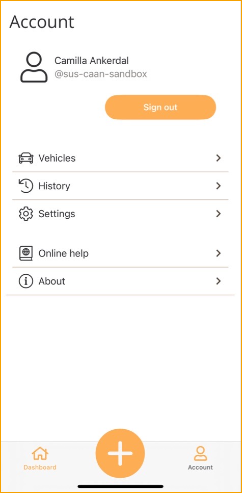

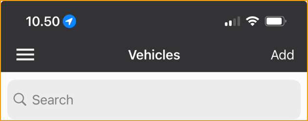

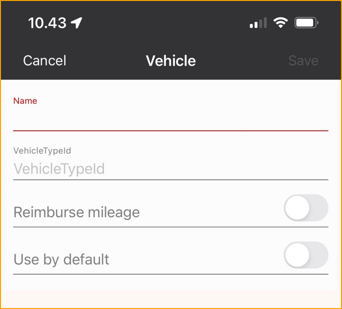

**Name:** Geben Sie einen Namen für das Fahrzeug ein, der es beschreibt, gut ist es, das Kennzeichen hinzuzufügen.

**Kilometervergütung**: Wenn Sie Ihr privates Fahrzeug verwenden, wählen Sie diese Option.

**Standardmäßig verwenden:** Aktivieren Sie es, wenn es das bevorzugte Fahrzeug ist.

**Speichern**

### Einreichen mit einem Spesenbericht

Spesenberichte ermöglichen es Ihnen, Ausgaben, Kilometerstände und Tagegelder zu organisieren, um eine Zusammenfassung der Ausgaben zu erhalten.

Gehe zu: **Plus --> Spesenbericht**

**Beschreibung:** Geben Sie eine Beschreibung für den Spesenbericht ein.

**Zusätzliche Informationen**: Geben Sie zusätzliche Informationen ein.

**Projekt/Aufgabe**: Der Spesenbericht kann einem bestimmten Projekt zugeordnet werden, dies wird das Projekt und die Aufgabe zu allen Transaktionen hinzufügen, die dem Spesenbericht hinzugefügt werden.

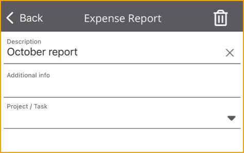

Nach dem Erstellen eines Spesenberichts wird beim Einreichen einer Ausgabe, eines Kilometerstands oder eines Tagegelds ein neues Feld mit der Bezeichnung Spesenbericht angezeigt. Nachfolgend ein Beispiel von der Kilometerstandsseite.

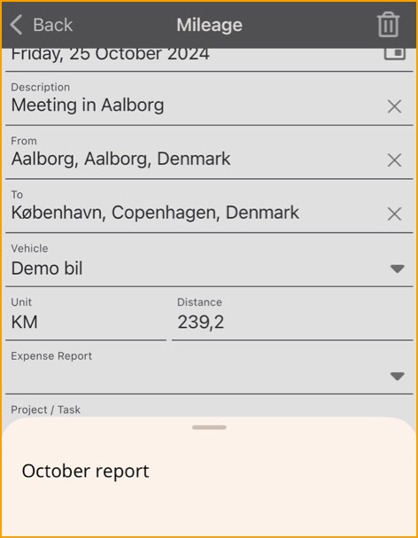
